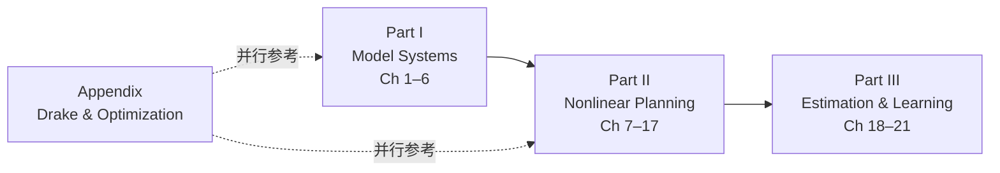

# MIT Underactuated Robotics 学习策展

**一句话：** [Russ Tedrake](https://groups.csail.mit.edu/locomotion/russt.html) 的 [Underactuated Robotics](https://underactuated.mit.edu/index.html) 是 MIT 公开 **在线教材 + 录像 + Drake 示例** 的一体课：从单摆、Cart-Pole、Acrobot 到步行/跑步简化模型、ZMP/WBC、TrajOpt/MPC、Lyapunov/SOS、接触混杂系统，再到系统辨识、KF、策略梯度与 **Behavior Cloning / Diffusion Policy**；Preface 强调 **计算优化 + 结构动力学** 与学习并重，且 **HTML 版为权威主版本**。

## 英文缩写速查

| 缩写 | 英文全称 | 简要说明 |
|------|----------|----------|
| UAR | Underactuated Robotics | 本课程/教材主题 |
| LQR | Linear Quadratic Regulator | 线性二次调节；Ch.8 主干 |
| MPC | Model Predictive Control | 滚动时域控制；Ch.10 |
| ZMP | Zero Moment Point | 零力矩点；Ch.5 足式规划 |
| SOS | Sum of Squares | 平方和优化；Lyapunov/可达性 |
| PFL | Partial Feedback Linearization | 部分反馈线性化；Ch.3 |

## 为什么重要

1. **欠驱动 + 足式/操作的主线教材**：覆盖 walking/running/manipulation 模型系统，与本库 [运动控制路线](../../roadmap/motion-control.md) L3–L4 传统控制段高度对齐。
2. **Drake 官方教学载体**：全书算法与示例在 [Drake](./drake.md) 中实现；读课即练 TrajOpt / 接触优化工具链。
3. **与 CMU 16-745 互补而非替代**：[CMU Optimal Control 2025](./cmu-optimal-control-curriculum.md) 偏 OCP 系统课；Underactuated 偏 **机械结构 + 欠驱动现象 + 优化/学习螺旋**。
4. **仍保留 Physical AI 清单坐标**：natnew **074/384** 条目；本页由索引级升格为 **章节策展**。

## 推荐学习路径

| 阶段 | 章节 | 学完应能做什么 | 本库入口 |
|------|------|----------------|----------|
| 欠驱动直觉 | 1–3 | 区分全/欠驱动；摆、Cart-Pole、PFL、局部 LQR | [Optimal Control](../concepts/optimal-control.md)、[LQR](../formalizations/lqr.md) |
| 足式简化模型 | 4–5 | Rimless Wheel、Compass Gait、SLIP、ZMP/CoP、Centroidal | [Locomotion](../tasks/locomotion.md)、[LIP/ZMP](../concepts/lip-zmp.md)、[WBC](../concepts/whole-body-control.md) |
| 优化控制核心 | 7–10 | DP/HJB、LQR 族、Lyapunov/SOS、TrajOpt/MPC/iLQR | [LQR/iLQR](../methods/lqr-ilqr.md)、[MPC](../methods/model-predictive-control.md)、[TrajOpt](../methods/trajectory-optimization.md) |
| 规划与鲁棒 | 11–17 | Policy search、RRT、鲁棒/随机控制、接触混杂 TO | [RL](../methods/reinforcement-learning.md)、[Manipulation](../tasks/manipulation.md) |
| 估计与学习 | 18–21 | 系统辨识、KF、PG、BC、Diffusion Policy | [KF](../formalizations/kalman-filter.md)、[IL](../methods/imitation-learning.md) |

> **授课顺序注记：** 作者采用 **螺旋式** 教学——按问题（pendulum → cart-pole → walking …）引入技术，**不必按章节号线性阅读**；本表按教材目录组织，便于检索。

## 章节 ↔ 本库节点映射

### Part I — Model Systems（Ch 1–6）

| 章 | 主题 | 独立节点 |
|----|------|----------|
| 1 | Fully- vs underactuated、非完整约束 | [Optimal Control](../concepts/optimal-control.md) |
| 2–3 | 单摆、Acrobot、Cart-Pole、Quadrotor、PFL、swing-up | [LQR](../formalizations/lqr.md)、[LQR/iLQR](../methods/lqr-ilqr.md) |
| 4 | 步行/跑步简化模型、SLIP、杂耍 | [Locomotion](../tasks/locomotion.md) |
| 5 | ZMP、CoP、Centroidal、WBC、footstep | [Humanoid Locomotion](../tasks/humanoid-locomotion.md)、[WBC](../concepts/whole-body-control.md) |
| 6 | 随机性、MDP、Rimless Wheel on rough terrain | [MDP](../formalizations/mdp.md) |

### Part II — Nonlinear Planning and Control（Ch 7–17）

| 章 | 主题 | 独立节点 |
|----|------|----------|
| 7 | Dynamic Programming、HJB | [Bellman 方程](../formalizations/bellman-equation.md) |
| 8 | LQR（有限时域、流形、约束、凸形式） | [LQR](../formalizations/lqr.md) |
| 9 | Lyapunov、Barrier、SOS、收缩度量 | [Control Lyapunov Function](../formalizations/control-lyapunov-function.md) |
| 10 | TrajOpt、MPC、iLQR/DDP、微分平坦、滑翔机案例 | [Trajectory Optimization](../methods/trajectory-optimization.md)、[MPC](../methods/model-predictive-control.md) |
| 11–12 | Policy Search、PRM/RRT | [Reinforcement Learning](../methods/reinforcement-learning.md) |
| 13 | 随机/鲁棒 LQR、H∞、LPV | [Safe RL](../methods/safe-rl.md) |
| 14–15 | 反馈运动规划、LQG、pixels-to-torques | [State Estimation](../concepts/state-estimation.md)、[VLA](../methods/vla.md) |
| 16–17 | 极限环、接触混杂、contact-implicit TO | [TrajOpt](../methods/trajectory-optimization.md) |

### Part III — Estimation and Learning（Ch 18–21）

| 章 | 主题 | 独立节点 |
|----|------|----------|
| 18 | System ID、神经网络动力学 | [System Identification](../concepts/system-identification.md) |
| 19 | KF、Bayes 滤波、平滑 | [Kalman Filter](../formalizations/kalman-filter.md)、[EKF](../formalizations/ekf.md) |
| 20 | Model-free policy search、REINFORCE | [Reinforcement Learning](../methods/reinforcement-learning.md) |
| 21 | Behavior Cloning、Diffusion Policy | [Imitation Learning](../methods/imitation-learning.md)、[Diffusion Policy](../methods/diffusion-policy.md) |

## 工程实践

| 场景 | 建议 |
|------|------|
| **首次入门** | 读 Preface + Ch.1–3，装 Drake Python，跑 pendulum/cart-pole 示例 |
| **足式方向** | Ch.4–5 + Ch.10 MPC + Ch.17 接触；对照 [运动控制路线 L4](../../roadmap/motion-control.md) |
| **估计模块** | Ch.19 + 历史摘录 [`mit_underactuated_kalman_lqr.md`](../../sources/courses/mit_underactuated_kalman_lqr.md) |
| **与 CMU OC 并行** | 优化语法卡住 → [Numerical Optimization Curriculum](./numerical-optimization-curriculum.md)；OCP 系统课 → [CMU OC 2025](./cmu-optimal-control-curriculum.md) |

## 局限与风险

- **HTML 为主、PDF 滞后**：引用公式以在线章节为准；PDF 可能有转换 artifact。
- **作业非全公开**：勿假设全部 MIT 内部作业可复现。
- **域名混用**：历史链接常见 `underactuated.csail.mit.edu`；2024 起 canonical 为 [`underactuated.mit.edu`](https://underactuated.mit.edu/index.html)。
- **勿与 CMU Optimal Control 2025 playlist 混淆**：后者属 **CMU 16-745 / Manchester**（见 [`cmu-optimal-control-curriculum.md`](./cmu-optimal-control-curriculum.md)）。

## 源码运行时序图

**不适用**（课程为开放教材 + Drake 示例库；非单一论文训练仓库。Drake 复现路径见 [Drake](./drake.md)。）

## 关联页面

- [Drake](./drake.md)
- [CMU Optimal Control 2025](./cmu-optimal-control-curriculum.md)
- [LQR/iLQR](../methods/lqr-ilqr.md)
- [Trajectory Optimization](../methods/trajectory-optimization.md)
- [运动控制主路线](../../roadmap/motion-control.md)
- [Physical AI 技术地图](../overview/awesome-physical-ai-technology-map.md)

## 参考来源

- [mit_underactuated_robotics.md](../../sources/courses/mit_underactuated_robotics.md) — 章节归档与映射
- [mit-underactuated-robotics.md](../../sources/sites/mit-underactuated-robotics.md) — 站点与开放状态
- [mit_underactuated_kalman_lqr.md](../../sources/courses/mit_underactuated_kalman_lqr.md) — KF/LQR 模块历史摘录
- [Underactuated Robotics 在线教材](https://underactuated.mit.edu/index.html)

## 推荐继续阅读

- [Drake 文档](https://drake.mit.edu/)
- [CMU 16-745 Optimal Control 2025](./cmu-optimal-control-curriculum.md)
- [Wensing et al., Optimization-based control for dynamic legged robots (TRO 2023)](https://arxiv.org/abs/1708.09342)
