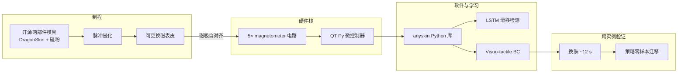
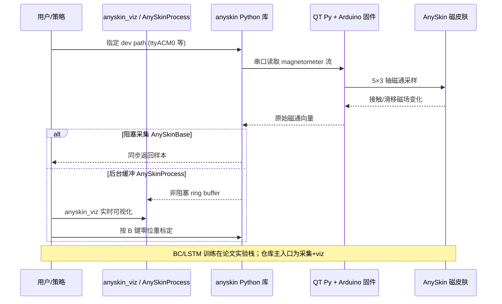

# AnySkin：即插即用磁触觉皮肤（ICRA 2025 · arXiv:2409.08276）

**AnySkin**（*AnySkin: Plug-and-play Skin Sensing for Robotic Touch*，[arXiv:2409.08276](https://arxiv.org/abs/2409.08276)，[ICRA 2025](https://doi.org/10.1109/ICRA55743.2025.11128638)，Raunaq Bhirangi 等 · **NYU / CMU / Columbia / Meta AI**；[项目页](https://any-skin.github.io/)）在 ReSkin 五 magnetometer 电路上 **解耦传感电子与交互表皮**，提供免胶自对齐可更换磁皮肤 + 开源模具/设计工具，使触觉从「一次性标定资产」变为 **可维护、可跨实例复用的硬件层**。

## 一句话定义

**像手机壳一样换磁触觉表皮、像充电线一样接电路——换肤后策略无需重训即可跨实例迁移，滑移检测与 BC 接触丰富任务均可用同一套 5×3 轴磁信号栈。**

## 英文缩写速查

| 缩写 | 英文全称 | 简要说明 |
|------|----------|----------|
| AnySkin | — | 本文可更换磁触觉皮肤系统 |
| ReSkin | Resistive Skin | Meta 磁触觉前作；电路继承、表皮不可换 |
| VBTS | Vision-Based Tactile Sensing | 视觉式触觉；AnySkin 走磁通低维路线对照 |
| BC | Behavior Cloning | 行为克隆；USB 插入等任务策略学习 |
| LSTM | Long Short-Term Memory | 滑移检测时序分类器 |
| ICRA | IEEE International Conference on Robotics and Automation | 发表会议 |

## 核心信息

| 项 | 内容 |
|----|------|
| 机构 | New York University；Carnegie Mellon University；Columbia University；Meta AI Research |
| 通讯作者 | Raunaq Bhirangi（raunaqbhirangi@nyu.edu） |
| 传感原理 | 5× magnetometer → **5×3 轴** 磁通；MQFP-15-7 磁粉 + DragonSkin 10 Slow **1:1:2** |
| 平台 | xArm、Franka、Leap Hand 等；BC + LSTM 滑移（30 类日常物体） |
| 换肤耗时 | 平均 **12 s**；自对齐磁吸安装 |
| 开源（2026-09-23） | **已开源** — [`raunaqbhirangi/anyskin`](https://github.com/raunaqbhirangi/anyskin)（`pip install anyskin`）；CAD/模具 [Google Drive](https://drive.google.com/drive/folders/1JOb_r0cT0t0BLju4XC6zboPppiXv8LDE) |

## 为什么重要

- **触觉硬件的可维护性：** 软表皮磨损是磁触觉落地瓶颈；解耦电路与表皮使 **换肤 ≠ 重标定 ≠ 重训策略**。
- **跨实例策略泛化（首次系统报告）：** 同一 BC 策略换肤后 USB 插入等仍成功；相对 ReSkin 换肤 **~43%** 降幅、DIGIT 同类实验，AnySkin **~13%** 降幅最优。
- **低维磁信号 + 学习栈闭环：** 原始磁通可视化 + LSTM 滑移 **92%** + visuo-tactile BC，证明 **硬件 replaceability 可直接转化为数据/策略复用**。
- **与 VBTS 表征路线互补：** [Sparsh](./paper-sparsh.md) 等主攻图像式触觉 SSL；AnySkin 回答 **磁触觉实例一致性** 这一独立轴（见 [综述](./paper-vision-based-tactile-intelligence.md) 硬件 taxonomy）。

## 核心贡献/方法

| 模块 | 要点 |
|------|------|
| **磁皮肤解耦** | 传感电路与易损软表皮物理分离；脉冲磁化 + 两部件开源模具 CAD 工具 |
| **自对齐安装** | 磁吸对准；类比手机壳 + 充电线；新实例无需重标定 |
| **信号栈** | 5 magnetometer × 3 轴磁通；相对 ReSkin 更均匀磁粉分布、更强场强 |
| **滑移检测** | LSTM 分类器；30 类物体训练；**92%** 准确率 |
| **跨实例 BC** | visuo-tactile 策略完成精密插入；换肤后性能保持 |
| **开源生态** | Python 库 + Arduino 固件 + 指尖/模具设计文件 |

## 流程总览

## 评测与指标

| 评测轴 | 结果 | 备注 |
|--------|------|------|
| 滑移检测 | **92%** | LSTM；30 类日常物体 |
| 换肤后策略降幅 | AnySkin **~13%** | vs ReSkin **~43%**、DIGIT 对照 |
| 换肤耗时 | **12 s** 平均 | 三任务换肤视频 |
| 接触丰富 BC | USB 插入等成功 | visuo-tactile 演示 |
| 跨实例泛化 | 换肤后仍成功 | 论文称首个未标定跨实例磁触觉报告 |

## 与其他工作对比

| 路线 | 触觉形态 | 相对 AnySkin |
|------|----------|--------------|
| [ReSkin](https://arxiv.org/abs/2110.10271) | 磁通；表皮与电路耦合 | 换肤后策略降幅大（~43%） |
| DIGIT / GelSight | VBTS 图像 | 换肤/换传感器需大量重标定；见 [Sparsh](./paper-sparsh.md) 跨传感器 SSL |
| [Tactile-VLA](./paper-sa-2507-09160-tactile-vla-unlocking-vision-language-action-mod.md) | 双 VBTS + VLA | 软件层力控；AnySkin 是硬件可维护性底座 |
| [OmniTacTune](./paper-omnitactune-tactile-residual-adaptation.md) | 跨传感器 RL 残差 | 软件适配 vs 硬件 replaceability |

## 结论

**AnySkin 把磁触觉的瓶颈从「换肤就要重训」改成「换肤像换手机壳」——12 s 换肤、92% 滑移、跨实例 BC 降幅约 13%，说明硬件可维护性与策略泛化可以一起设计。**

1. **先看跨实例表** — ~13% vs ReSkin ~43% 是本文最可操作的选型信号。
2. **滑移 LSTM 92%** — 低维磁通 + 时序模型即可支撑接触状态监控。
3. **开源可落地** — `pip install anyskin` + Drive 模具；非完整 SL 训练栈但采集/可视化够用。
4. **与 VBTS 正交** — 磁触觉实例一致性与 Sparsh 式跨传感器表征是不同问题。
5. **BC 非 VLA** — 策略层较浅；接入 VTLA 需另做 token 化与力控（见同批 [九篇地图](../overview/tactile-intelligence-nine-papers-map.md)）。
6. **旧索引勘误** — 正确 arXiv 为 **2409.08276**，非误引 2401.17695。

## 源码运行时序图

[`raunaqbhirangi/anyskin`](https://github.com/raunaqbhirangi/anyskin) 提供 **采集与可视化** 运行时序（非完整 BC 训练栈）：

## 局限与风险

- 磁触觉空间分辨率低于 VBTS；精细纹理/力场可视化弱于 [Sparsh](./paper-sparsh.md)。
- BC 实验规模与任务族有限；未与 VLA/VTLA 端到端对标。
- 商业套件（WowRobo Enhanced AnySkin）与开源设计文件并存，采购时需分清版本。
- 磁化与 DragonSkin 配比敏感；换材料批次可能影响跨实例一致性。

## 关联页面

- [触觉传感](../concepts/tactile-sensing.md) — 磁触觉 / 可更换表皮设计轴
- [视触觉融合](../concepts/visuo-tactile-fusion.md) — visuo-tactile BC 语境
- [接触丰富操作](../concepts/contact-rich-manipulation.md) — USB 插入等任务
- [Sparsh（VBTS SSL）](./paper-sparsh.md) — 图像式触觉表征对照
- [触觉智能九篇地图](../overview/tactile-intelligence-nine-papers-map.md) — 本批 ingest 总览
- [Awesome Touch 技术地图](../overview/sun-awesome-touch-technology-map.md) — 触觉策展坐标

## 参考来源

- [AnySkin 论文归档（arXiv:2409.08276）](../../sources/papers/anyskin_arxiv_2409_08276.md)
- [AnySkin 项目页归档](../../sources/sites/any-skin-github-io.md)

## 推荐继续阅读

- [项目页](https://any-skin.github.io/) — 换肤视频、磁信号动画、Design Tool
- [GitHub: raunaqbhirangi/anyskin](https://github.com/raunaqbhirangi/anyskin) — 安装与 `anyskin_viz`
- [arXiv:2409.08276](https://arxiv.org/abs/2409.08276) — 跨实例与 ReSkin/DIGIT 对照全文
- [Vision-Based Tactile Intelligence 综述](./paper-vision-based-tactile-intelligence.md) — VBTS 硬件 taxonomy 对照
