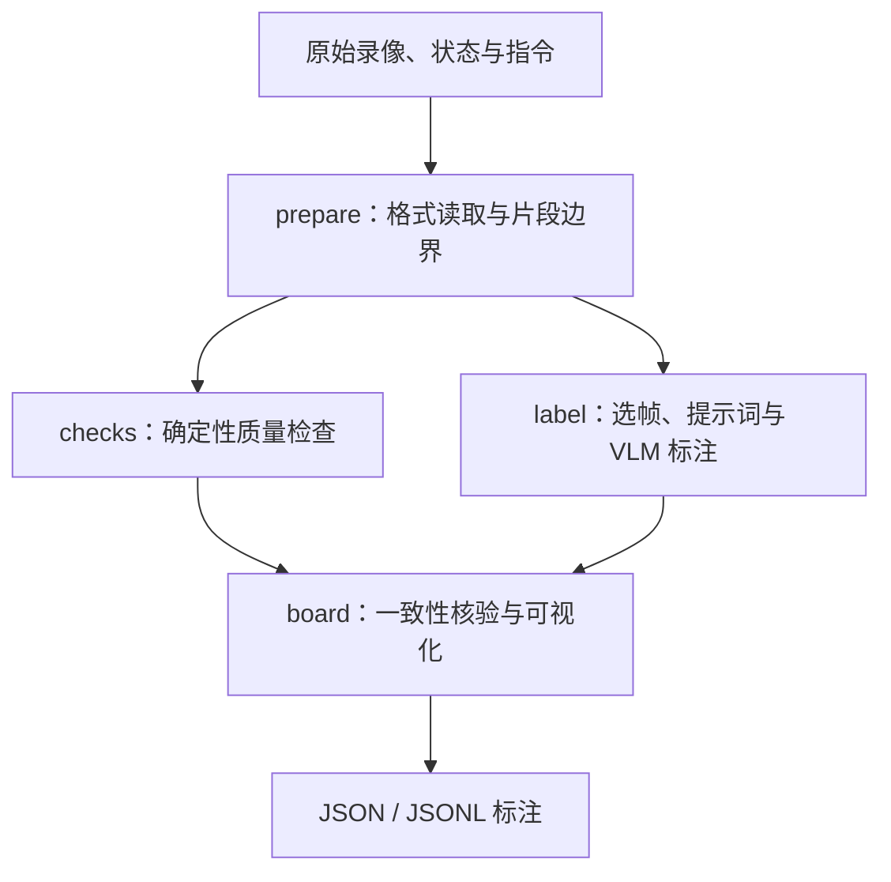

# Argus（Pantheon）：机器人数据标注与质量审计

**Argus** 是 Pantheon 的开源机器人数据审计流水线：联合查看录像、状态/动作及指令，输出时间轴标注、成功区间、操作失误和录制故障，帮助训练前选择或修复数据。

## 英文缩写速查

| 缩写 | 英文全称 | 简要说明 |
|------|----------|----------|
| VLM | Vision-Language Model | 根据视频帧与指令判断动作、目标与问题 |
| UMI | Universal Manipulation Interface | 手持夹爪采集设置，需要核验运动与相机信号 |
| BC | Behavior Cloning | 模仿示范动作，易复刻未清洗的操作失误 |
| PTS | Presentation Timestamp | 解码时用于精确划分帧与 episode 边界 |
| JSONL | JSON Lines | 按行导出可筛选的片段标注 |

## 为什么重要

机器人示范中的“最后成功”不等于全过程适合模仿：抓取失败、物体掉落、任务完成后被破坏，都需要单独识别。另一方面，真实失败可用于学习恢复，而错位相机和错误播放速度会污染动力学。Argus 把这两类问题分开，便于按训练目标处理。

## 核心原理

**输入：** 多相机录像、可用的机器人状态/动作、任务指令和原始标签；支持 LeRobot、MCAP、普通视频及其压缩包。

**机制：** 原格式读取后按整数 PTS 精确解码；根据采集设置选帧，把多相机画面组成网格。VLM 将指令和记录信号视作需要核验的声明，而不是绝对真值；确定性检查单独识别相机配对、位姿跳变、冻结夹爪和采集故障。面板再核验标签内部一致性。

**输出：** 动作阶段 timeline、关键事件、物体状态变化、目标首次完成帧、最终结果、指令匹配程度、失误与恢复及问题严重度；可下载 JSON 或导出 JSONL。

### 流程总览

### 同一个坏片段，如何处理

| 问题 | 行为克隆训练 | 世界模型或恢复学习 |
|------|--------------|--------------------|
| 抓空后重新抓取，最后成功 | 可截取有效示范，避免模仿反复试探 | 保留失败与恢复，标出阶段 |
| 任务完成后又破坏 | 按首次 goal frame 裁剪成功段 | 保留状态变化，并标注成功后破坏 |
| 指令与实际任务不同 | 人工核验后修正文案 | 同样先校正语言条件 |
| 相机互换、错误播放速度 | 修复后再使用，无法修复则过滤 | 也需修复，不能当真实动力学 |

上述是面向下游训练的处理建议；Argus 提供审计证据与时间戳，不能把自动标注直接当作修复完成。

## 工程实践

截至 2026-10-02，官方源码已公开，代码 Apache-2.0；公开标注 CC BY 4.0，原始录像保留原数据集许可。源码与可运行命令见 [仓库归档](../../sources/repos/pantheon_argus.md)。

1. 先在少量自己的 episode 上运行 `python -m review ... --free`，检查字段、相机安装方式和请求内容。
2. 配置 API key，用 `--cap` 做小预算真实标注，避免未经检查就整库推理。
3. 用 `board serve` 同步查看画面和标注；重点抽检抓取失败、目标帧、指令不匹配及中/高严重度问题。
4. 把裁剪、重标指令、过滤的决策另存为可追溯版本；用干净子集与原始子集对比下游成功率。

官方审计覆盖九个数据集的 3,546 个片段、66.5 小时，27% 被标出至少一项中/高严重度问题。应将其理解为该审计样本的结果，不外推为所有机器人数据集缺陷率。

## 局限与风险

- **VLM 会误判：** 指令暗示、移动相机、遮挡和稀疏选帧都可能造成错误；模型间一致率和标注密度不能替代人工核验准确率。
- **模型调用有成本：** 开源的是流水线，模型服务可能收费；记录实际模型、provider、分辨率与请求，成本随配置变化。
- **自动标注不保证逐位复现：** 代码与依赖可以钉住版本，在线模型输出仍可能变化。
- **格式可读取不等于语义映射正确：** 自定义相机名、状态维度和动作字段要抽检，避免误用适配规则。
- **原始数据许可独立：** 可选手部关键点涉及 ACE-Ego-Hand 与 MANO 的非商业使用约束，不能用代码许可覆盖它们。
- 这是数据审计工具，不是机器人控制策略；官方审计统计不能直接证明下游策略增益。

## 关联页面

- [LeRobot](./lerobot.md)：采集、训练与部署框架；Argus 可在采集后增加审计环节。
- [模仿学习](../methods/imitation-learning.md)：为何低质量示范会被策略复刻。
- [HDF5、MCAP 与 LeRobot 格式对比](../comparisons/hdf5-mcap-lerobot-data-formats.md)：区分日志容器和训练数据组织。

## 参考来源

- [Argus 官方技术文章归档](../../sources/sites/pantheon-argus.md)
- [Argus 源码与 README 归档](../../sources/repos/pantheon_argus.md)

## 推荐继续阅读

- [官方技术文章](https://pantheon.inc/research/argus)
- [源码与 Quickstart](https://github.com/Pantheon-Industries-Inc/argus)
- [公开数据审计面板](https://pantheon.inc/data-board)
