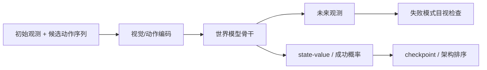
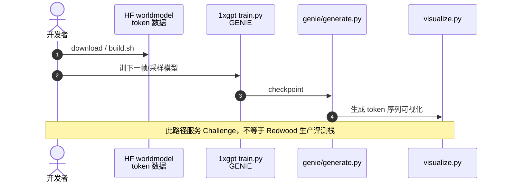

# 1X World Model（1XWM / Redwood 评测引擎）

**1X World Model（1XWM）**（技术报告 *1X World Model: Evaluating Bits, not Atoms*；发现页挂在 [Redwood AI World Model](https://www.1x.tech/discover/redwood-ai-world-model)）由 **1X Technologies** 提出：用动作条件视频世界模型预测 NEO 等全身人形的未来观测，并输出任务级 **state-value**，把「用真机 atoms 穷举评测」换成「用 bits 做同起点反事实比较」。

## 一句话定义

**在相同初始观测下，对多条低层动作序列生成未来画面并打成功价值分——让架构对比、checkpoint 选择和长尾失败回放不必每条都上真机。**

## 英文缩写速查

| 缩写 | 英文全称 | 简要说明 |
|------|----------|----------|
| 1XWM | 1X World Model | 本文世界模型与评测引擎 |
| WM | World Model | 预测未来观测/状态以支撑决策或评测 |
| VLA | Vision-Language-Action | 被评测的上层策略族之一 |
| HF | Hugging Face | Challenge 数据集与权重托管 |
| GENIE | Generative Interactive Environments | 1xgpt Challenge 基线风格 |

## 为什么重要

- **评测吞吐是人形基础模型的隐藏瓶颈：** 一个 checkpoint 往往要成百上千次家庭场景采样；训练又产生大量候选。可靠离线排序能成倍提高实验吞吐。
- **动作可控，而不只是文本续写：** 同起点多条低层轨迹对应抓杯、擦台、后退、空想弹吉他等不同未来，才能比较「不同策略在同一观测下会怎样」。
- **明确停在控制回路外侧：** 在 [五路径图](../overview/wam-motion-control-five-paths.md) 里属 **⑤ 策略评估**——影响选哪个 checkpoint，不直接接管平衡与接触。

## 核心信息

| 项 | 内容 |
|----|------|
| **机构** | 挪威人形机器人公司（1X Technologies） |
| **平台叙事** | NEO 全身人形；家庭场景全身体操作 |
| **报告** | <https://www.1x.tech/1x-world-model.pdf>（12 页补充进展） |
| **开源** | **部分**：Challenge 仓 [1xgpt](https://github.com/1x-technologies/1xgpt) + HF 数据；**完整 Redwood 评测引擎训练代码未在发现页列出单一官方仓** |

## 核心原理

### 结构

| 模块 | 作用 |
|------|------|
| 视觉 / 动作编码器 | 把帧、本体观测与动作轨迹编到 latent |
| 骨干 | 预测未来帧 latent |
| 视频解码 | 生成未来观测（用于可视化与可控性检查） |
| State-value 头 | 对终态任务成败/完成度打分，用于策略排序 |

### 流程总览

### 报告强调的四项能力

1. **动作可控性** — 同观测下比较不同动作决策  
2. **自治 rollout 数据缩放** — 任务相关真机交互数据提升物体动力学保真（如 air fryer 托盘分离）  
3. **与真机评测相关** — 例：proprioception 消融、ViT-L 编码器对照中，WM 排序与真机一致  
4. **跨任务迁移** — 多任务数据相对单任务提升预测准确

## 工程实践

| 用法 | 说明 |
|------|------|
| Checkpoint 选择 | 用 WM 成功价值筛候选，再把最值/最差送真机 |
| 架构消融 | 在相同初始状态集上比较编码器/是否用本体等 |
| 生产长尾集 | 收集失败初始状态，对新策略做反事实回放 |
| 开源可玩部分 | `1xgpt`：token 化 EVE 数据 + GENIE 训练/采样；**勿等同**生产 1XWM |

### 源码运行时序图

**不适用（完整 Redwood 评测引擎）**：发现页与技术报告未提供与报告一一对应的官方训练/评测仓。公开可运行路径仅 Challenge 基线：

## 实验与评测

- 博文/报告展示：多任务（Airfryer / Arcade / Shelf）随数据缩放的生成质量；WM 预测成功率与真机任务分相关；给定真机 15% 差距时，对「更好策略」的判别可显著高于随机。
- **画面像 ≠ 排序准：** 作者明确 imitation loss 与真机表现相关性弱，价值头对齐才是评测用途的关键。

## 结论

**1XWM 把世界模型定位成「评测引擎」而不是「在线控制器」：先证明动作可控的未来与成功价值排序跟真机一致，再谈用它加速实验。**

- 真影响指标是 **策略排序相关** 与 **动作可控反事实**，不是单帧 FID。  
- 自治交互数据对接触/物体动力学保真很关键。  
- 持有物体未见类等 OOD 仍是主要失败模式。  
- 开源侧请走 Challenge；生产栈以报告为准、勿假设可完整复现。  
- 与 [EgoWM](./paper-egowm-egocentric-world-model.md) 对照：后者重动作忠实视频预测，本页重 **value 评测闭环**。

## 局限与风险

- 未见物体交互易幻觉；生产级全任务歧义评测仍未解决。  
- 易把 `1xgpt` Challenge 误当成 Redwood 引擎开源。  
- 高相关仍可能在长尾上翻车——WM 筛完仍要抽样真机确认。

## 与其他工作对比

| 工作 | 相对 1XWM |
|------|-----------|
| [EgoWM](./paper-egowm-egocentric-world-model.md) | 同为动作条件视频 WM；EgoWM 主打跨骨干/跨本体忠实度与 SCS，不主打成功价值评测 |
| [GigaWorld-1](./paper-gigaworld-1-policy-evaluation.md) | 同属「WM 做策略评估」谱系，机构与数据栈不同 |
| [MotionWAM](./paper-motionwam-humanoid-loco-manipulation-wam.md) | 未来特征进 **在线动作**；1XWM 停在 **离线评测** |

## 关联页面

- [WAM×运动控制五路径](../overview/wam-motion-control-five-paths.md)
- [具身评测基准选型闭环（纵深）](../overview/depth-embodied-eval-benchmark.md)
- [Query：具身大模型评测基准选型](../queries/embodied-eval-benchmark-selection-loop.md)
- [1X Technologies](./1x-technologies.md)
- [Generative World Models](../methods/generative-world-models.md)
- [Video-as-Simulation](../concepts/video-as-simulation.md)

## 参考来源

- [1x_world_model_redwood.md](../../sources/papers/1x_world_model_redwood.md)
- [1x-world-model-redwood.md](../../sources/sites/1x-world-model-redwood.md)
- [1xgpt.md](../../sources/repos/1xgpt.md)
- [wechat_embodied_ai_lab_wam_motion_control_five_paths.md](../../sources/blogs/wechat_embodied_ai_lab_wam_motion_control_five_paths.md)

## 推荐继续阅读

- [1X World Model 发现页](https://www.1x.tech/discover/redwood-ai-world-model)
- [技术报告 PDF](https://www.1x.tech/1x-world-model.pdf)
- [1xgpt Challenge](https://github.com/1x-technologies/1xgpt)
