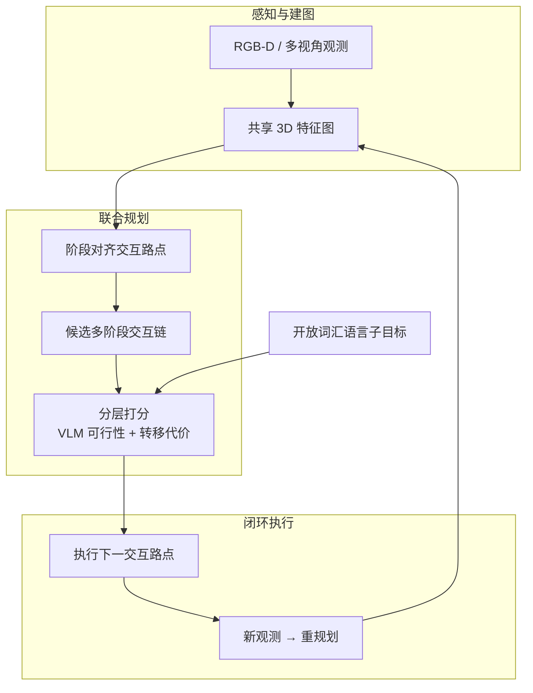

# 3D-IC（3D Interaction Chains · Joint Navigation and Manipulation Planning）

**3D-IC**（*Joint Navigation and Manipulation Planning with 3D Interaction Chains*，Zhang 等，ICML 2026 Poster [#809](https://icml.cc/virtual/2026/poster/61610)，[代码](https://github.com/kekeZ66/3D-IC)）提出 **开放词汇移动操作（OVMM）** 的 **联合规划框架**：不再把导航与操作当作先后独立模块，而在 **共享 3D 特征图** 上为各子阶段生成 **交互路点（interaction waypoints）**，链接为 **多阶段交互链（interaction chains）**，由 **分层策略** 联合 **VLM 可行性推理** 与 **转移代价** 选出 **成功率–路径效率** 折中最优链，并以 **下一路点执行 + 观测驱动重规划** 闭环落地；仿真与 **Hello Robot Stretch 3** 真机均报告一致增益。

| 机构 | 中国科学院计算技术研究所 人工智能安全全国重点实验室；中国科学院大学；中国科学院计算技术研究所 |
|------|--------------------------------------------------------------------------------|
| 作者 | Keming Zhang, Sixian Zhang†, Xinhang Song, Hongyu Wang, Yiyao Wang, Yingjie Wang, Shuqiang Jiang |

## 一句话定义

**把移动操作的长视界任务写成「3D 地图上的多阶段交互路点链」**，用 VLM 在路点级 3D 特征上判可行性、用转移代价判效率，在线选链执行而非先导航到位再临时补救操作姿态。

## 英文缩写速查

| 缩写 | 英文全称 | 简要说明 |
|------|----------|----------|
| OVMM | Open-Vocabulary Mobile Manipulation | 开放词汇条件下的移动底座 + 操作臂长视界任务 |
| 3D-IC | 3D Interaction Chains | 本文框架：多阶段交互路点链式表示与联合规划 |
| VLM | Vision-Language Model | 对路点中心 3D 特征做可行性语言–视觉推理 |
| VLN | Vision-and-Language Navigation | 语言条件导航；OVMM 的子能力之一 |
| VLA | Vision-Language-Action | 端到端视觉–语言–动作策略；可与 3D-IC 分层对照 |

## 为什么重要

- **对准 OVMM 的核心错配：** 分阶段管线里，导航优化的 **区域到达** 与操作需要的 **可达位姿/视角** 常不一致——长链任务中误差累积，表现为「到了但够不着/看不见」或「能操作但绕远」。
- **统一表示而非后验拼接：** **共享 3D feature map** 让导航与操作 **同一几何–语义基底** 上产生 **stage-aligned waypoints**，避免两套地图或两套目标函数打架。
- **语言开放集与规划可解释性：** 用 **VLM 在路点级 3D 特征上推理可行性**，把开放词汇子目标落到 **可检查的离散路点**，相对黑盒端到端 VLA 更易诊断失败阶段。
- **与 VIPL 导航研究线衔接：** 同组 TrajRAG、Multi-Scale Gaussian-Language Map 等走 **几何–语义 3D 地图 + 具身推理**；3D-IC 将这一脉络延伸到 **移动操作联合规划**。
- **真机平台信号：** **Stretch 3** 验证说明方法面向 **轮式移动操作臂** 而非仅仿真离散导航图——与 [REALM](./paper-realm-last-3-meter-vln-grounding.md) 等同平台工作可对照阅读（REALM 强调 VLN **末段实例可见接地**，3D-IC 强调 **全链导航–操作路点联合**）。

## 核心结构

| 模块 | 作用 |
|------|------|
| **共享 3D 特征图** | 融合几何与语义，为导航与操作提供统一场景表征 |
| **交互路点生成** | 为每个子阶段产生 **stage-aligned interaction waypoint**（兼顾可达与操作语义） |
| **交互链构造** | 将多阶段路点 **链接为候选 interaction chains** |
| **分层策略打分** | **可行性：** VLM 对 **waypoint-centric 3D 特征** 推理；**效率：** 阶段间 **transition cost** |
| **链选择与执行** | 在成功率与轨迹效率间取最优折中，执行 **下一路点** |
| **在线重规划** | 新观测到达后更新地图并重选链，适应部分可观测 |

### 流程总览

## 工程实践要点

- **问题设定：** 适用于 **轮式/全向移动底座 + 操作臂** 的 **长视界、多阶段、开放词汇** 家务式任务（取放、开关、多物体序列）。
- **与分阶段基线的差异：** 导航模块不应单独优化 **最短路径到达**，而应在 **共享地图** 上与操作 **联合产生路点**；操作模块也不应假设 **固定基座位姿**。
- **VLM 角色：** 用于 **链级/路点级可行性**（能否完成当前语言子目标），而非替代低层运动控制；低层仍依赖平台自带导航栈与操作控制器。
- **重规划频率：** 摘要强调 **执行下一 waypoint 后随观测 replan**——工程上需平衡 **地图更新延迟** 与 **控制稳定性**。
- **硬件参照：** 论文在 **Stretch 3** 上验证；与 REALM 等 Stretch 工作可共享 **相机标定、底盘控制、仿真–真机 gap** 经验。

## 局限与风险

- **依赖 3D 地图与 VLM 质量：** 遮挡、深度噪声或开放词汇接地错误会沿 **交互链** 传播；VLM 幻觉可能导致 **看似可行实则不可达** 的路点。
- **计算与延迟：** 候选链枚举 + VLM 推理在长视界任务上可能带来 **规划时延**；真机闭环需关注 **replan 频率 vs 执行流畅度**。
- **平台特异性：** 当前证据集中在 **Stretch 3** 与仿真；向 **双足 loco-manipulation** 或 **高动态全身** 迁移时，路点定义与转移代价需重新标定。
- **与端到端 VLA 的边界：** 3D-IC 是 **显式规划 + VLM 推理** 路线，不直接输出连续动作；与 [VLA](../methods/vla.md) **分层组合** 或 **对比** 时需明确各层接口。
- **预印本与代码成熟度：** ICML 2026 公开时 **arXiv 尚未检索到**；[GitHub 仓库](https://github.com/kekeZ66/3D-IC) ingest 时为新建仓，复现前应以官方 README 为准。

## 与其他工作对比

| 路线 | 导航–操作关系 | 场景表示 | 语言接口 | 典型平台 |
|------|---------------|----------|----------|----------|
| **分阶段 OVMM** | 先后独立 | 常分裂 | 各模块分别接地 | 仿真 + 部分真机 |
| **端到端 VLA** | 隐式统一 | 端到端 latent | 语言指令 | 多样 |
| **REALM（VLN 末段）** | 长视界 VLN + **短视界精修** | RGB 序列 | 指令 + 检测 | Stretch |
| **WEM（视频世界模型）** | 混合任务 **rollout 预测** | world/ego 视频 | 多轮指令 | BEHAVIOR-1K |
| **3D-IC** | **联合路点链规划** | **共享 3D 特征图** | **开放词汇 + VLM 路点推理** | **Stretch 3** |

## 关联页面

- [Loco-Manipulation](../tasks/loco-manipulation.md) — 移动操作任务总览与全身协调语境
- [Vision-Language Navigation](../tasks/vision-language-navigation.md) — 语言条件导航子能力与基准
- [Manipulation](../tasks/manipulation.md) — 操作任务与评价维度
- [VLA](../methods/vla.md) — 端到端视觉–语言–动作路线对照
- [REALM（Last-3-Meter VLN）](./paper-realm-last-3-meter-vln-grounding.md) — 同 Stretch 平台的 VLN 末段接地互补
- [WEM（World-Ego Modeling）](./paper-wem-world-ego-modeling.md) — 混合导航–操作长程预测的另一范式

## 参考来源

- [3D-IC 论文摘录（ICML 2026）](../../sources/papers/3d_ic_icml_2026.md)
- [3D-IC 代码仓库归档](../../sources/repos/3d-ic.md)

## 推荐继续阅读

- [ICML 2026 Poster：Joint Navigation and Manipulation Planning with 3D Interaction Chains](https://icml.cc/virtual/2026/poster/61610)
- [3D-IC GitHub 仓库](https://github.com/kekeZ66/3D-IC)
- [VIPL 课题组主页（ICT CAS）](https://vipl.ict.ac.cn/homepage/sqjiang/) — 作者组相关具身导航与多模态智能工作
