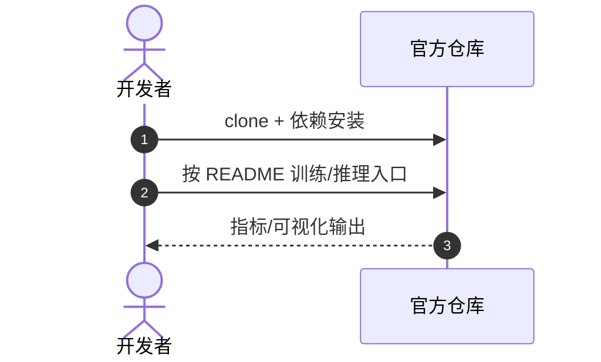

# 3DWay

**3DWay**（*Generalizing Robot Manipulation via 3D Consistent Waypoints*，[arXiv:2609.08224](https://arxiv.org/abs/2609.08224)，[项目/代码](https://github.com/ziqin-h/3DWay)）— 详见 [具身智能小站 10 篇盘点（2026-09-09）](../../sources/blogs/wechat_embodied_station_visual_focus_10_papers_2026-09-09.md)。

## 一句话定义

二维轨迹加深度仍难明确自由空间中的三维路标——3DWay 先多视角一致 2D waypoint 再三角化，给 VLA 更清晰的空间接口。

## 英文缩写速查

| 缩写 | 英文全称 | 简要说明 |
|------|----------|----------|
| 3DWay | 3D Consistent Waypoints | 本文空间中间表示 |
| VLA | Vision-Language-Action | 下游操作策略 |
| WP | Waypoint | 三维空间路标 |
| ECCV | European Conference on Computer Vision | 录用会议 |

## 为什么重要

- 多视角图像 → 一致 2D 路标 → 几何三角化 3D waypoint
- 缓解 2D+depth 的空间歧义

## 核心信息

| 项 | 内容 |
|----|------|
| **arXiv** | [2609.08224](https://arxiv.org/abs/2609.08224) |
| **开源** | **已开源** |
| **项目/代码** | [https://github.com/ziqin-h/3DWay](https://github.com/ziqin-h/3DWay) |

## 核心原理

- 多视角图像 → 一致 2D 路标 → 几何三角化 3D waypoint
- 缓解 2D+depth 的空间歧义
- ECCV 2026；github.com/ziqin-h/3DWay

## 源码运行时序图

官方仓 [https://github.com/ziqin-h/3DWay](https://github.com/ziqin-h/3DWay)（归档见 [3dway.md](../../sources/repos/3dway.md) 若已建）：

- **最短复现：** 以 README 训练/评测脚本为准。

## 实验与评测

- 指标与设置以原文 PDF / 项目页为准；上文 Highlights 来自公众号归纳 + 项目页摘要。
- 横向对照见 [视觉聚焦与数据效率 10 篇技术地图](../overview/visual-focus-data-efficiency-10-papers-technology-map.md)。

## 与其他工作对比

> 下表只做**定位对照**，不做跨设定横比：本页 Highlights 来自公众号归纳 + 项目页摘要（见参考来源），未逐条核对原文实验表，与下列各页不共享同一评测协议。

| 对照 | 差异读法 |
|------|----------|
| **2D 轨迹 + depth**（本文要替代的默认做法） | 同为给策略一个空间中间量，差别在**歧义从哪来**：2D+depth 在自由空间（没有物体表面可打深度的地方）无法确定路标位置，3DWay 靠多视角一致性 + 三角化把这类点也定下来。这是本页最直接的一条主张 |
| [FOCI Policy](./paper-foci-policy.md) | 同批盘点里的另一条「结构化中间表示」路线，但**参考系相反**：3DWay 给的是相机/世界系下的**绝对 3D 路标**，FOCI 给的是任务物体之间的**相对 SE(3)**。前者依赖外参标定准，后者对全局位姿漂移更宽容 |
| [Action Chunking](../methods/action-chunking.md) | 同为「不让策略逐步自回归」的接口设计，但抽象轴不同：action chunking 压的是**时间**（一次出一段动作），3DWay 压的是**空间**（把稠密轨迹换成稀疏路标）；两者正交，可叠加 |
| [策略的视觉表征](../concepts/visual-representation-for-policy.md) | 该页归纳「策略该吃什么视觉表征」；3DWay 是其中「显式几何中间量」一支，与端到端隐式特征一支的取舍是**可解释/可调试 vs 不丢信息** |
| [2D→3D 语义提升 Gap](../concepts/2d-to-3d-semantic-lifting-gap.md) | 该页讲 2D 结果提升到 3D 时误差怎么来；3DWay 的多视角一致性约束正是针对其中的尺度/遮挡歧义 |
| [坐标后处理](../concepts/perception-coordinate-postprocessing.md) | 提醒读法：3D waypoint 的精度上限被外参标定与坐标变换卡住——三角化再准，外参偏了一样抓偏 |

## 结论

**3DWay 的可迁移主张已写入 Highlights；部署前以原文实验设定与开源边界为准。**

1. **真影响：** 见核心原理 bullets。
2. **次要代价：** 预印本/待开源项需独立复现验证。
3. **部署读法：** 已开源 — 先读 README 或项目页再接真机/智能体栈。

## 关联页面

- [视觉聚焦与数据效率 10 篇技术地图](../overview/visual-focus-data-efficiency-10-papers-technology-map.md)
- [模仿学习](../methods/imitation-learning.md)
- [Action Chunking](../methods/action-chunking.md) — 正交的时间维压缩
- [策略的视觉表征](../concepts/visual-representation-for-policy.md) — 显式几何中间量在表征谱系中的位置
- [2D→3D 语义提升 Gap](../concepts/2d-to-3d-semantic-lifting-gap.md) / [坐标后处理](../concepts/perception-coordinate-postprocessing.md) — 精度上限所在

## 参考来源

- [3dway_arxiv_2609_08224.md](../../sources/papers/3dway_arxiv_2609_08224.md)
- [具身智能小站 10 篇盘点（2026-09-09）](../../sources/blogs/wechat_embodied_station_visual_focus_10_papers_2026-09-09.md)
- [arXiv:2609.08224](https://arxiv.org/abs/2609.08224)

## 推荐继续阅读

- [原文 PDF](https://arxiv.org/pdf/2609.08224)
- [项目/代码](https://github.com/ziqin-h/3DWay)
