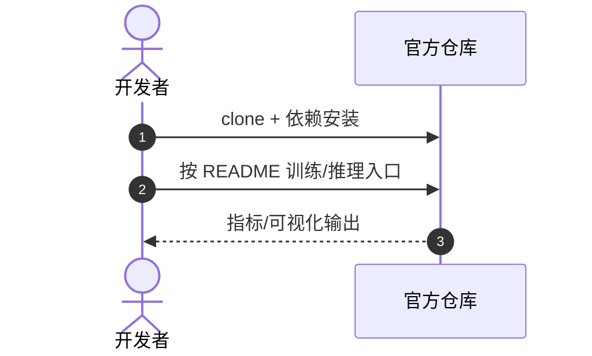

# 3DWay

**3DWay**（*Generalizing Robot Manipulation via 3D Consistent Waypoints*，[arXiv:2609.08224](https://arxiv.org/abs/2609.08224)，[项目/代码](https://github.com/ziqin-h/3DWay)）— 详见 [具身智能小站 10 篇盘点（2026-09-09）](../../sources/blogs/wechat_embodied_station_visual_focus_10_papers_2026-09-09.md)。

## 一句话定义

二维轨迹加深度仍难明确自由空间中的三维路标——3DWay 先多视角一致 2D waypoint 再三角化，给 VLA 更清晰的空间接口。

## 英文缩写速查

| 缩写 | 英文全称 | 简要说明 |
|------|----------|----------|
| 3DWay | 3D Consistent Waypoints | 本文空间中间表示 |
| VLA | Vision-Language-Action | 下游操作策略 |
| WP | Waypoint | 三维空间路标 |
| ECCV | European Conference on Computer Vision | 录用会议 |

## 为什么重要

- 多视角图像 → 一致 2D 路标 → 几何三角化 3D waypoint
- 缓解 2D+depth 的空间歧义

## 核心信息

| 项 | 内容 |
|----|------|
| **arXiv** | [2609.08224](https://arxiv.org/abs/2609.08224) |
| **开源** | **已开源** |
| **项目/代码** | [https://github.com/ziqin-h/3DWay](https://github.com/ziqin-h/3DWay) |

## 核心原理

- 多视角图像 → 一致 2D 路标 → 几何三角化 3D waypoint
- 缓解 2D+depth 的空间歧义
- ECCV 2026；github.com/ziqin-h/3DWay

## 源码运行时序图

官方仓 [https://github.com/ziqin-h/3DWay](https://github.com/ziqin-h/3DWay)（归档见 [3dway.md](../../sources/repos/3dway.md) 若已建）：

- **最短复现：** 以 README 训练/评测脚本为准。

## 实验与评测

- 指标与设置以原文 PDF / 项目页为准；上文 Highlights 来自公众号归纳 + 项目页摘要。
- 横向对照见 [视觉聚焦与数据效率 10 篇技术地图](../overview/visual-focus-data-efficiency-10-papers-technology-map.md)。

## 结论

**3DWay 的可迁移主张已写入 Highlights；部署前以原文实验设定与开源边界为准。**

1. **真影响：** 见核心原理 bullets。
2. **次要代价：** 预印本/待开源项需独立复现验证。
3. **部署读法：** 已开源 — 先读 README 或项目页再接真机/智能体栈。

## 关联页面

- [视觉聚焦与数据效率 10 篇技术地图](../overview/visual-focus-data-efficiency-10-papers-technology-map.md)
- [模仿学习](../methods/imitation-learning.md)

## 参考来源

- [3dway_arxiv_2609_08224.md](../../sources/papers/3dway_arxiv_2609_08224.md)
- [具身智能小站 10 篇盘点（2026-09-09）](../../sources/blogs/wechat_embodied_station_visual_focus_10_papers_2026-09-09.md)
- [arXiv:2609.08224](https://arxiv.org/abs/2609.08224)

## 推荐继续阅读

- [原文 PDF](https://arxiv.org/pdf/2609.08224)
- [项目/代码](https://github.com/ziqin-h/3DWay)
