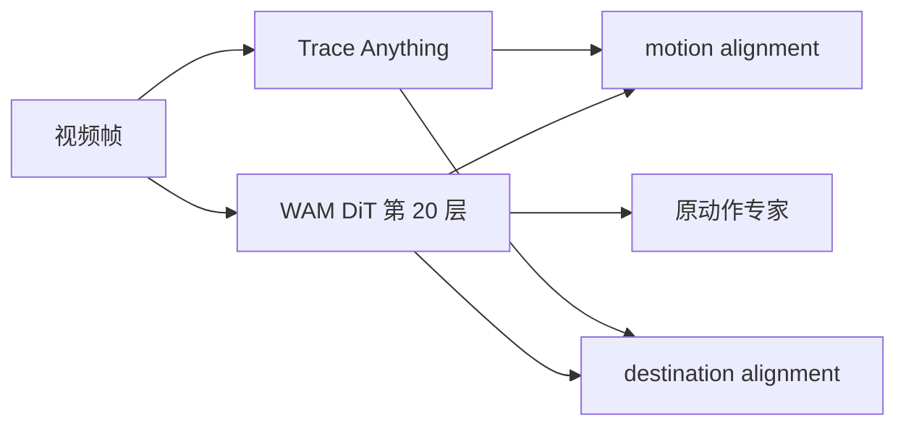
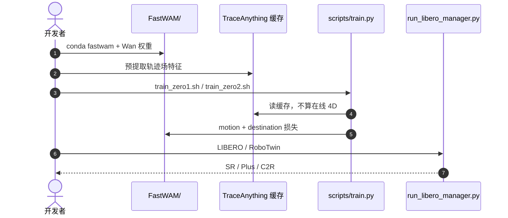

# 4D-WAM：用轨迹场给 WAM 补上局部运动和终点

**4D-WAM**（*Infusing Spatiotemporal Awareness into World Action Models through Trajectory Fields*；[arXiv:2608.08023](https://arxiv.org/abs/2608.08023)，[代码](https://github.com/lishanyqy/4DWAM)）由 **香港科技大学广州校区 / 阿德莱德大学** 等提出：WAM 多在 2D 像素里做视频，和机器人执行所在的 3D 空间有表示鸿沟；逐帧深度又没把 3D 结构的时间演化用起来。

## 一句话定义

**模型无关后训练：把 Trace Anything 的 3D 轨迹场对齐到 WAM 中间层——邻帧差分学局部 4D，源帧到终点学目的地——推理图保持原 WAM。**

## 英文缩写速查

| 缩写 | 英文全称 | 简要说明 |
|------|----------|----------|
| 4D-WAM | Trajectory-field alignment for WAMs | 本文训练配方 |
| WAM | World Action Model | 被注入的视频–动作骨干 |
| C2R | Clean2Rand | RoboTwin 干净训练、随机测试 |
| PSNR | Peak Signal-to-Noise Ratio | 视频预测像素保真 |
| SSIM | Structural Similarity Index | 视频预测结构相似 |

## 为什么重要

- 直接把 WAM 特征对齐 4D 重建特征会失败：Lingbot-VA 与 Trace Anything 绝对值不相关甚至负相关，邻帧差分才同向。
- ID 榜已饱和（LIBERO 98.2→98.6），真正的增量在 LIBERO-Plus（+8.8）和相机扰动（+17.3）。
- 同一套目标能接 FastWAM-Joint 和 Lingbot-VA，说明是配方不是新骨干。

## 核心信息

| 项 | 内容 |
|----|------|
| **机构** | 香港科技大学广州校区（HKUST-GZ）；阿德莱德大学（Adelaide） |
| **骨干** | FastWAM-Joint（主表）；Lingbot-VA（C2R / 真机） |
| **开源** | **已开源**（训练/评测入口可辨识） |

## 核心原理

### 方法栈

Trace Anything 出逐像素 3D 轨迹。两投影 MLP 把 WAM token 与 4D token 映到共享维（\(P_z\) 冻结）。**Motion alignment：** 邻帧差分余弦对齐。**Destination alignment：** 以首帧为源、末帧为终点，最小化注意力式相似分布差距。默认对齐 DiT 第 20 层。轨迹特征可预提取缓存，避免每步跑 4D 模型。

### 流程总览

## 源码运行时序图

官方仓 [lishanyqy/4DWAM](https://github.com/lishanyqy/4DWAM)（归档见 [sources/repos/4dwam.md](../../sources/repos/4dwam.md)）：

- **最短复现：** 按 `FastWAM/README.md` 装环境与 Wan → 缓存轨迹 → `bash scripts/train_zero1.sh`。
- **Lingbot-VA：** 走 `lingbot-va/README.md`（C2R 与真机配方）。

## 工程实践

| 项 | 建议 |
|----|------|
| 对齐层 | 消融：第 20 层 98.6%；16/18 层 <98%；去掉任一目标 → 98.0% |
| 算力 | 缓存 \(C_{\mathrm{traj}}\)；在线提特征会明显拖训练 |
| 读数 | 先看 Plus 与 C2R，不要用 LIBERO +0.4 当卖点 |
| 真机 | ARX LIFT2 四任务总 SR 仍低（文内 5.5%），看子任务进度更有信息 |

## 实验与评测

| 设定 | 基线 | 4D-WAM |
|------|------|--------|
| RoboTwin 2.0 均分（FastWAM-Joint） | 90.58 | **91.34** |
| LIBERO 均分 | 98.2 | **98.6** |
| LIBERO-Plus 均分 | 62.21 | **71.01** |
| C2R Avg（Lingbot-VA） | 57.7 | **61.7**（Clean 81.5 / Rand 41.8） |

探针：冻结第 20 层，终点预测 Top-1 在 LIBERO 从 0.4150→0.4487。视频 PSNR/SSIM 在 Plus 扰动下也升。真机相对 Lingbot-VA 子任务进度平均 +10%+。

## 与其他工作对比

相对 [MECo-WAM](./paper-meco-wam-4d-geometry-cotraining.md)：MECo 用训练期 4D 专家 + 推理拆除；4D-WAM 用轨迹场 alignment，同样不改部署图。相对 [RynnWorld-4D](./paper-rynnworld-4d-rgb-depth-flow.md)：Rynn 直接预测 RGB/深度/光流；本文不新增生成头。相对 [SG-WAM 语义引导](./paper-sg-wam-semantic-guidance.md)：一个补指令语义，一个补 4D 运动/终点。

## 结论

**WAM 缺的不是再一张深度图，而是「局部怎么动」和「最终去哪」的轨迹级监督。**

1. **对齐差分，别对齐绝对值** — 否则和 4D 老师空间冲突。
2. **两目标都要** — 只留 motion 或 destination 都会回到 98.0%。
3. **层深要够** — 浅层是外观，第 20 层才适合轨迹。
4. **OOD 才是主表** — Plus +8.8 比 ID +0.4 说明问题。
5. **配方可迁移** — FastWAM 与 Lingbot-VA 都能接。

## 局限与风险

- 真机长程总成功率仍低，轨迹对齐不是万能纠错。
- 依赖 Trace Anything 与 Wan/FastWAM 权重，复现门槛高。
- 根仓无统一 SPDX；引用时写明子树许可。

## 关联页面

- [World Action Models](../concepts/world-action-models.md)
- [4D 几何分类 03](../overview/wm-action-consequence-category-03-geometry-4d.md)
- [MECo-WAM](./paper-meco-wam-4d-geometry-cotraining.md)
- [SG-WAM（语义引导）](./paper-sg-wam-semantic-guidance.md)
- [RynnWorld-4D](./paper-rynnworld-4d-rgb-depth-flow.md)
- [LIBERO](./libero-benchmark.md)
- [RoboTwin](./robotwin.md)

## 参考来源

- [4D-WAM 论文摘录](../../sources/papers/4d_wam_arxiv_2608_08023.md)
- [代码仓归档](../../sources/repos/4dwam.md)
- [具身智能小站 9 篇盘点（2026-08-17）](../../sources/blogs/wechat_embodied_station_9_papers_2026-08-17.md)
- [arXiv:2608.08023](https://arxiv.org/abs/2608.08023)

## 推荐继续阅读

- [lishanyqy/4DWAM](https://github.com/lishanyqy/4DWAM)
- Trace Anything（文内 4D 老师）
