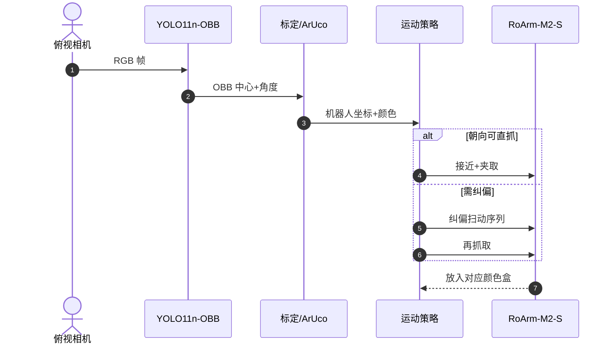

# 4-DoF 视觉引导桌面笔具分拣

**Tabletop Pen Manipulation With a Vision-Guided 4-DoF Arm**（[arXiv:2608.15968](https://arxiv.org/abs/2608.15968)，[代码](https://github.com/Anirudhpro/4DoF_vision_robotic_pen_sorting)）展示：在 **固定俯视相机** 下，约 **200 USD** 的 Waveshare RoArm-M2-S 四自由度臂可通过 **感知 + 纠偏扫动** 完成任意朝向笔具的颜色分拣，无需腕部旋转关节。

## 一句话定义

**在结构化任务里，任务化感知与中间动作有时比增加关节更具性价比。**

## 英文缩写速查

| 缩写 | 英文全称 | 简要说明 |
|------|----------|----------|
| DoF | Degree of Freedom | 机械臂自由度 |
| OBB | Oriented Bounding Box | 带朝向的检测框 |
| YOLO | You Only Look Once | 实时目标检测族 |
| HSV | Hue Saturation Value | 颜色空间，用于分类 |
| ArUco | Augmented Reality University of Cordoba | 方形 fiducial 标定标记 |

## 为什么重要

- 低成本 4-DoF 臂缺少 **腕旋**，理论上难以对齐任意朝向物体。
- 纳入 [九篇盘点](../../sources/blogs/wechat_embodied_station_9_papers_vla_predict_grasp_2026-08-24.md) 的「硬件约束 + 任务工程」主线。

## 核心信息

| 项 | 内容 |
|----|------|
| **平台** | RoArm-M2-S（4-DoF）；Microsoft LifeCam Cinema 俯视 |
| **检测** | YOLO11n-OBB + HSV 颜色分类 |
| **标定** | 相机内参 + ArUco 外参 |
| **开源** | **已开源**（[GitHub](https://github.com/Anirudhpro/4DoF_vision_robotic_pen_sorting)） |

## 核心原理

- **直接抓取** — 朝向接近固定进给方向。
- **纠偏扫动** — 侧向轻推逐步转到可抓姿态（最高 **90°** 错位）。

## 源码运行时序图

关键复现路径：仓库内感知脚本 → 标定配置 → 分拣主循环（见 GitHub README）。

## 工程实践

| 项 | 建议 |
|----|------|
| 何时引用 | 低成本臂 + 结构化桌面分拣 + 缺腕旋 |
| 日志规模 | 326 动作：196 直抓 + 130 纠偏 |
| 局限 | 任务与布局强结构化；非通用 pick-place |

## 实验与评测

- **7 种笔具**；四色收纳盒（蓝/红/绿/灰）。
- **326 次 logged motion**；90° 最大纠偏角。

## 结论

**缺失 DoF 可用「检测朝向 + 环境交互扫动」部分补偿，而非一味堆硬件。**

1. **OBB 朝向** — 直接决定直抓 vs 纠偏分支。
2. **纠偏扫动** — 130/326 动作依赖此中间技能。
3. **极低成本** — ~200 USD 硬件栈可完成多色分拣。
4. **开源全栈** — 感知/标定/规划可复现。
5. **结构化前提** — 俯视固定相机与桌面布局是关键假设。

## 与其他工作对比

| 对照 | 差异读法 |
|------|----------|
| 5-DoF+ 腕旋臂 | 硬件贵；本文用软件补偿 |
| 端到端 VLA | 本文经典 CV + 规则规划，可解释且轻量 |
| [FlatLab](./paper-flatlab.md) | 平面物体策略学习；本文笔具分拣工程实例 |

## 局限与风险

- **任务专用** — 笔具形状与俯视假设强。
- **无力控** — 纠偏扫动依赖摩擦与几何，材质变化需调参。
- **学生项目规模** — 统计来自单平台日志，非大规模 benchmark。

## 关联页面

- [Manipulation](../tasks/manipulation.md)
- [VLA·预测·抓取 9 篇技术地图](../overview/vla-predict-grasp-9-papers-technology-map.md)

## 参考来源

- [4dof_pen_sorting_arxiv_2608_15968](../../sources/papers/4dof_pen_sorting_arxiv_2608_15968.md)
- [4dof-vision-robotic-pen-sorting](../../sources/repos/4dof-vision-robotic-pen-sorting.md)
- [具身智能小站 9 篇盘点（2026-08-24）](../../sources/blogs/wechat_embodied_station_9_papers_vla_predict_grasp_2026-08-24.md)

## 推荐继续阅读

- [arXiv:2608.15968](https://arxiv.org/abs/2608.15968)
- [4DoF_vision_robotic_pen_sorting](https://github.com/Anirudhpro/4DoF_vision_robotic_pen_sorting)
