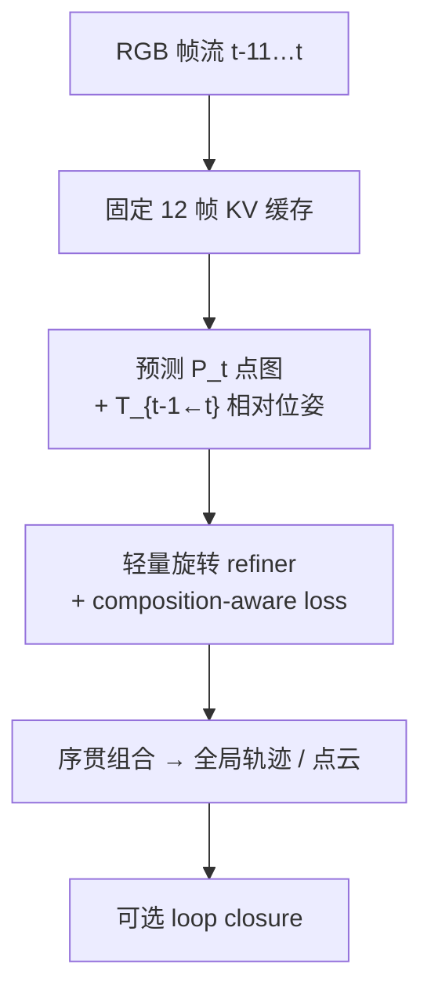
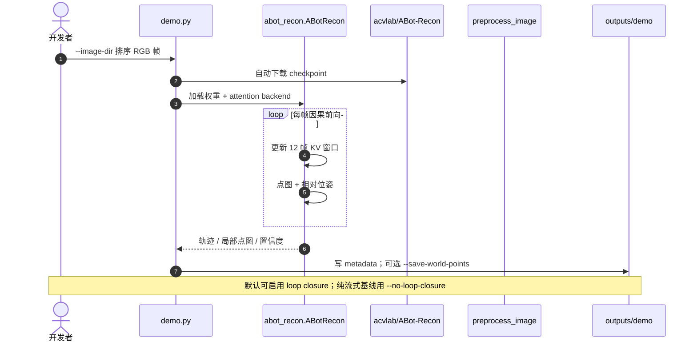

# ABot-Recon：局部上下文长视频流式 3D 重建

**ABot-Recon**（*Revisiting Local Context for Long-Horizon Streaming 3D Reconstruction*，[arXiv:2608.27529](https://arxiv.org/abs/2608.27529)，[代码](https://github.com/amap-cvlab/ABot-Recon)）由 **阿里巴巴 AMap CV Lab** 等提出：在 **单目 RGB** 长视频上 **在线** 估计相机运动与局部几何，**不** 用随序列增长的学习型长程记忆，而固定 **12 帧**（前 11 帧 KV + 当前帧）局部窗口。

## 一句话定义

**每帧只解同一个有界问题——缓存短窗 KV、预测当前相机系点图与相邻相对位姿，再序贯组合成全局轨迹与点云，使内存与算力与视频长度无关。**

## 英文缩写速查

| 缩写 | 英文全称 | 简要说明 |
|------|----------|----------|
| ATE | Absolute Trajectory Error | 全局轨迹绝对误差（m） |
| RPE | Relative Pose Error | 相邻帧相对位姿误差 |
| KV | Key-Value Cache | 注意力 KV 缓存；本方法仅保留前 11 帧 |
| CD | Chamfer Distance | 点云重建距离指标 |
| RGB | Red Green Blue | 单目彩色图像输入；**无需深度** |
| SLAM | Simultaneous Localization and Mapping | 同时定位与建图；本工作偏稠密点图流式重建 |
| HF | Hugging Face | 官方权重与 Space demo 托管 |

## 为什么重要

- **具身 / 车载长序列：** 小时级视频若每帧算力或状态随 t 增长，无法机载流式运行；ABot-Recon 把 **模型状态严格局部化**。
- **单目即可：** 只需排序好的 RGB 帧目录，降低数据采集门槛（相对 RGB-D / 多目）。
- **工程可跑：** Apache-2.0 代码、`demo.py`、Python API、HF **在线 Space** 与 ModelScope demo。

## 核心信息

| 项 | 内容 |
|----|------|
| **机构** | 阿里巴巴（Alibaba）/ AMap CV Lab（`amap-cvlab`） |
| **输入** | 单目 RGB 视频流（字典序帧名） |
| **局部窗** | **12 帧**：缓存前 **11** 帧 KV + 当前帧 |
| **每步输出** | 当前相机系 **点图** \(P_i\) + 相邻 **相对位姿** \(T_{i-1\leftarrow i}\) |
| **全局恢复** | 位姿序贯组合；可选 loop-closure 精化 |
| **开源** | **已开源**：GitHub + [HF 权重](https://huggingface.co/acvlab/ABot-Recon) + [Space](https://huggingface.co/spaces/acvlab/abot-recon-streaming-3d) |

## 核心原理

### 与长记忆路线对照

许多流式 3D 方法叠加持久状态或多级长程融合。ABot-Recon **刻意保持学习态局部**：预测目标对序列长度 **等变**，全局量仅由 **组合** 产生。

### 流程总览



### 抗漂移

- **Temporal refiner：** 用近期视觉与运动上下文修正相对旋转。
- **Composition-aware pose loss：** 直接监督多步位姿组合，抑制长程漂移。

## 源码运行时序图

官方仓 [amap-cvlab/ABot-Recon](https://github.com/amap-cvlab/ABot-Recon)：



- **最短路径：** `pip install -e .` → `python demo.py --image-dir examples/images --no-loop-closure`。
- **加速：** `flashinfer-python` + 编译 `curope`（cuRoPE）。

## 工程实践

```bash
git clone https://github.com/amap-cvlab/ABot-Recon && cd ABot-Recon
conda create -n abot-recon python=3.11 -y && conda activate abot-recon
pip install torch==2.5.1 torchvision==0.20.1 --index-url https://download.pytorch.org/whl/cu121
pip install -e .

python demo.py --image-dir examples/images --output-dir outputs/demo --attention-backend auto
```

| 选项 | 用途 |
|------|------|
| `--no-loop-closure` | 纯因果流式基线（论文核心） |
| `--save-world-points` | 用最终轨迹把局部点图变世界系点云 |
| `--max-frames 22000` | 默认支持超长流（内存有界） |
| HF Space | 无本地 GPU 时在线试跑 |

环境：Linux，PyTorch 2.5.1，CUDA 12.1；论文效率 benchmark 用 H100，发布验证含 A100。

## 实验与评测

| 基准 | 结果 | 设置 |
|------|------|------|
| Oxford Spires 位姿 | ATE **4.35 m**，RPE-R **0.12°** | 流式、无 loop closure；较先前最佳约 **−40%** |
| Oxford Spires 稠密 | CD **1.37 m**，F1 **91.81%**（τ=4 m） | |
| KITTI-02 | **24.45 FPS**，**6.71 GiB** | 504×280，H100 |

论文另报告 KITTI、VBR 位姿与 7Scenes、TUM-Dynamic 等稠密结果。

## 结论

ABot-Recon 证明：**长程流式 3D 不必堆更大记忆**——固定 12 帧局部预测 + 组合监督即可大幅压低 ATE/RPE。

- 选型时把 **「状态是否随序列长度增长」** 作为第一问；本方法答案是否定的。
- 单目 RGB 即可跑通 demo，但动态场景与纯旋转仍需看 benchmark 子集表现。
- **Loop closure** 是可选后处理，报告 SOTA 数字时需分清是否启用。
- 与语义感知结合时，点图/轨迹可作为 [2D→3D 提升](../concepts/2d-to-3d-semantic-lifting-gap.md) 的几何前端，而非替代开放词汇检测。
- 在线 demo（HF Space）适合快速验序列，严肃复现仍应本地跑 `demo.py` 对齐论文设置。

## 局限与风险

- **单目尺度：** 绝对尺度与纹理贫乏区域仍可能漂移；组合误差长期累积需 refiner/loop closure。
- **算力：** 实时 FPS 报告在 H100；边缘设备需自行 profile。
- **与 ABot 系列其它项目区分：** 本页是 **Recon** 流式 3D；[ABot-World](./paper-abot-world-0.md) 等是世界模型/导航另一条线。

## 与其他工作对比

| 对照对象 | 状态与全局量的来源 | 与 ABot-Recon 的差异 |
|----------|-------------------|---------------------|
| **学习型长记忆流式重建（论文对照的先前最佳）** | 持久状态 / 多级长程融合随序列增长 | ABot-Recon 把学习态严格限在 **12 帧窗**，内存与算力与视频长度无关；Oxford Spires ATE 反而降约 **−40%** |
| **[Glob3R](./paper-glob3r.md)** | 滑窗 tracks → 运动平均 + 全局 BA 的**全局 SfM** | Glob3R 用全局优化换精度，属离线/近线；ABot-Recon 是**纯因果流式**，loop closure 仅作可选后处理——两者比较必须先对齐是否启用全局优化 |
| **[Wid3R](./paper-wid3r.md)** | 前馈多视图，相机模型 token + 球谐射线 | Wid3R 解的是**宽 FoV / 鱼眼原生**的相机表示问题，非长时序；与本页在「输入相机类型」而非「序列长度」维度互补 |
| **[SAM 3](./paper-sam3.md)** | 开放词汇 2D 分割前端 | 语义 vs 几何分工：ABot-Recon 出点图与轨迹，SAM 3 出实例掩码；二者串联才构成 [2D→3D 语义提升](../concepts/2d-to-3d-semantic-lifting-gap.md)，谁都不替代谁 |

## 关联页面

- [2D→3D 语义提升 Gap](../concepts/2d-to-3d-semantic-lifting-gap.md)
- [机器人感知栈选型](../queries/robot-perception-stack-selection-loop.md)
- [SAM 3](./paper-sam3.md) — 开放词汇 2D 前端对照
- [国内具身开源全景（76 家 · 424 项）](../overview/china-domestic-embodied-opensource-76-companies-technology-map.md) — 本页为该清单对应条目的 canonical 详情节点
- [424 项覆盖索引](../queries/china-domestic-opensource-424-coverage.md) — 同公司其它开源入口

## 参考来源

- [ABot-Recon 论文摘录（arXiv:2608.27529）](../../sources/papers/abot_recon_arxiv_2608_27529.md)
- [ABot-Recon 代码仓](../../sources/repos/abot-recon.md)
- [ABot-Recon 项目页](../../sources/sites/abot-recon.md)
- [国内具身智能开源全景（微信公众号）](../../sources/blogs/wechat_embodied_station_domestic_opensource_panorama_2026-09-06.md)

## 推荐继续阅读

- 项目页：<https://amap-cvlab.github.io/ABot-Recon-html/>
- 在线 Demo：<https://huggingface.co/spaces/acvlab/abot-recon-streaming-3d>
- 技术报告 PDF（仓库内）
