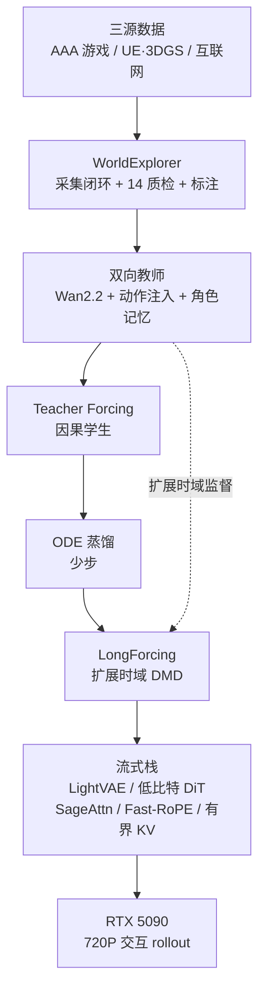
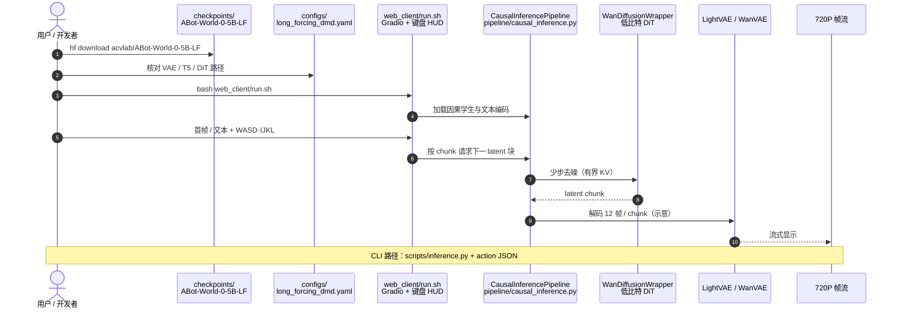

# ABot-World-0（单卡桌面无限交互世界 Rollout）

**ABot-World-0**（*ABot-World-0: Infinite Interactive World Rollout on a Single Desktop GPU*，[arXiv:2607.19191](https://arxiv.org/abs/2607.19191)，2026-07 技术报告）由 **阿里巴巴高德 AMAP CV Lab** 的 **ABot-World Team** 提出：把动作条件视频世界模型做成 **可在单卡 NVIDIA RTX 5090 上实时闭环交互** 的系统——统一键盘控制漫游与第三人称角色、用 **LongForcing** 压长程自回归漂移，并用 LightVAE / 低比特 DiT / 高效注意力等全栈把 **720P** 推到最高约 **16 FPS**（首帧延迟 **1.2 s**，峰值显存约 **19 GiB**）。

> **命名区分：** 本页 **ABot-World** ≠ [智元 Agibot-World](../../sources/sites/agibot-world.md) 操作数据集；亦不同于同机构移动操作 WAM [ABot-M0.5](./paper-abot-m05-mobile-manipulation-wam.md)。

## 一句话定义

**在 Wan2.2 视频先验上注入原始键盘动作与角色记忆，经双向教师→因果少步学生（含 LongForcing）与全栈推理共设计，把交互式世界模型落到单卡桌面实时流式。**

## 英文缩写速查

| 缩写 | 英文全称 | 简要说明 |
|------|----------|----------|
| DiT | Diffusion Transformer | 视频去噪骨干；部署侧做低比特推理 |
| VAE | Variational Autoencoder | 时空压缩编解码；部署用轻量 LightVAE |
| ODE | Ordinary Differential Equation | 因果 Stage-2：逼近概率流 ODE 的干净端点 |
| DMD | Distribution Matching Distillation | LongForcing 最终阶段的分布匹配蒸馏 |
| KV | Key–Value（cache） | 有界局部上下文缓存，避免无限历史显存增长 |
| FPS | Frames Per Second | 流式吞吐指标（论文最高约 16） |
| VRAM | Video RAM | 峰值显存包络（优化后 ≤19.3 GiB） |
| VLM | Vision-Language Model | 数据质检语义评估与场景文本标注 |

## 为什么重要

- **把「交互世界」写成系统问题：** 不只堆视频质量，而是同时打数据、控制接口、长程分布对齐与消费级部署。
- **统一键盘动作空间：** 相对全局相机位姿 / 隐式 latent action，WASD+IJKL 与用户意图天然对齐，且游戏 API 可给真值监督。
- **LongForcing 直击闭环漂移：** 短视域 teacher forcing / ODE 蒸馏不够；在学生自 rollout 上用扩展时域教师做分布匹配。
- **可跑的桌面基线：** 推理代码 + `ABot-World-0-5B-LF` 权重已开源，适合做交互式视频 WM 的本地对照（教师与大数据集仍待发）。

## 核心信息

| 项 | 内容 |
|----|------|
| **机构** | 阿里巴巴（Alibaba）高德 AMAP CV Lab · ABot-World Team |
| **骨干** | 预训练 **Wan2.2**（学生权重标注基座 Wan2.2-TI2V-5B） |
| **控制** | 每帧 8 维 multi-hot 键盘（WASD + IJKL）；第三人称另加 reference-character memory |
| **部署包络** | 1× RTX 5090；1280×704；chunk-wise 流式；≤16 FPS；1.2 s action→首帧；峰值 VRAM ≤19.3 GiB |
| **评测** | WorldRoamBench + 60 s LongForcing 消融 + 小时/日级定性压力测试 |
| **开源** | **部分开源**（见下） |

## 开源状态

核查日：**2026-07-26**（[项目页](https://amap-cvlab.github.io/ABot-World/)、[GitHub](https://github.com/amap-cvlab/ABot-World)、README Roadmap）。

| 产物 | 状态 |
|------|------|
| 推理 / Gradio / 量化栈 | **已开源** · Apache-2.0 · [`amap-cvlab/ABot-World`](https://github.com/amap-cvlab/ABot-World) |
| 因果学生权重 `ABot-World-0-5B-LF` | **已开源** · [HF](https://huggingface.co/acvlab/ABot-World-0-5B-LF) / [ModelScope](https://modelscope.cn/models/amap_cvlab/ABot-World-0-5B-LF) |
| 在线 Studio | <https://abot-world.amap.com> |
| 双向教师权重 | **待发布** |
| ~500 h 动作标注训练数据 | **宣称将开源**（截至入库日无下载入口） |

## 核心原理

### 问题形式

给定视觉历史 \(\mathbf{v}_{0:t-1}\)、未来动作块 \(\mathbf{a}_{t:t+L-1}\) 与多模态条件 \(\mathbf{c}\)（文本 + 参考图），建模下一视频 chunk：

\[
p_{\theta}(\mathbf{v}_{t:t+L-1}\mid \mathbf{v}_{0:t-1},\mathbf{a}_{t:t+L-1},\mathbf{c})
\]

迭代追加 chunk 即长程自回归 rollout。教师阶段则用初始帧 + 全时域动作做 **双向** 全序列生成，作为高质量动力学监督。

### 动作与身份条件

- **动作：** 帧级 8-key multi-hot → 按 VAE 时域 patch（4）打包为 32 维 token → Action Control Adapter（PixelUnshuffle + 卷积）在 **patchify 加性注入** DiT。
- **身份：** 第三人称参考图经同 VAE 成 memory token，固定负时间 RoPE；视频 token 可 attend memory，memory 不回看视频，减轻长程外观漂移。

### 三阶段因果蒸馏

| 阶段 | 作用 |
|------|------|
| **1 Teacher Forcing** | 自双向教师初始化；因果注意力 + GT 历史，适配自回归信息模式 |
| **2 ODE Distillation** | 冻结 Stage-1 因果模型，少步逼近其概率流 ODE 干净端点 |
| **3 LongForcing** | 学生长程自 rollout + 扩展时域教师 **DMD**，校正累积分布偏移 |

### 流程总览

## 源码运行时序图

官方仓 [amap-cvlab/ABot-World](https://github.com/amap-cvlab/ABot-World) 提供 **推理与 Gradio**（非完整训练教师）。归档见 [sources/repos/abot-world.md](../../sources/repos/abot-world.md)：

- **最短交互路径：** 装依赖 → 下载 `ABot-World-0-5B-LF` → `bash web_client/run.sh`。
- **批推理 / 基准：** `scripts/inference.py`（可扫多种量化类型）。
- **源码运行时序图适用范围：** 仅覆盖 **已发布推理栈**；端到端复现训练教师 **不适用**（权重与数据未齐）。

## 工程实践

| 项 | 建议 |
|----|------|
| 硬件预期 | README 以 **RTX 5090 + CUDA 13.3** 验证；更低端卡先看峰值 ~19 GiB 与吞吐是否可接受 |
| 默认精度 | 质量向优先 **FP8**；要更高 FPS 再试 MXFP6 / MXFP4（论文 Table 2） |
| 延迟读法 | **1.2 s** 是 action→**首响应帧**（含整 chunk 解码），不是「单次采样步」 |
| 控制接口 | 保持与训练一致的离散键盘语义；不要把全局 SE(3) 轨迹硬塞进同一 adapter |
| 第三人称 | 准备清晰、多朝向参考图；identity memory 是长程外观的主把手 |
| 与操纵 WM | 本系统是 **开放域交互视频仿真器**，不是关节级机器人策略评估代理；机器人闭环请对照 [Ctrl-World](./paper-ctrl-world.md) / [DriftWorld](./paper-driftworld.md) 等 |

### 部署消融直觉（RTX 5090，1280×704）

| 配置要点 | FPS ↑ | 峰值 VRAM ↓ |
|----------|-------|-------------|
| Base / 仅 SageAttention2 | OOM | OOM |
| + LightVAE | ~9.1 | ~20.5 GiB |
| + FP8 | ~12.4 | ~15.9 GiB |
| + Fast-RoPE（默认质量向附近） | ~13.3 | ~19.3 GiB |
| + MXFP4 | ~15.8 | ~17.1 GiB |

## 实验与评测

### WorldRoamBench（节选）

相对 Genie 3、HappyOyster、LingBot-World（14B）、HY-World 1.5（8.3B），**ABot-World-0（5B）** 在 Strict Acc. **0.5266**（次优，HappyOyster **0.5317**）、Partial Acc. **0.7290**、Traj. Score **0.6752**、Aesthetic **0.5039**、Mechanics **0.5223** 等子维上整体有竞争力；Memory **0.5041** 相对头部仍有差距。读法：**小参数量 + 可部署** 下的可控性，而非全面碾压闭源交互产品。

### LongForcing 与长程定性

- **60 s 消融：** 相对同协议 Causal-Forcing 风格基线，后半程 HPSv3 更高，高饱和 / 模糊 / patch 重复更低。
- **小时 / 日级关键帧：** 仍可辨场景结构与活跃运动，未在抽检时刻塌成静帧或纯纹理噪声。
- **OOD + 物理涌现：** 统一键盘接口泛化到训练外场景–角色；碰撞、水纹、雪迹、墙体阻挡等未符号化标注的响应可出现。
- **HarnessEval-W（2026-08）：** 在开放交互评测上 Overall **66.1**（#14 / 18），但 **Exploratory Transition 第一（83.5）**、Intentional/Physical 明显落后 I2V 族——与「键盘漫游强、指令式干预弱」的产品定位一致。详见 [HarnessEval-W](./paper-harnesseval-w.md)。

## 结论

**一句话总判：ABot-World-0 的真贡献是「键盘可控 + 长程分布对齐 + 单卡流式共设计」三位一体；开源价值主要在推理学生与部署栈，而不是完整可复现训练闭环。**

1. **选型场景** — 要本地可玩的交互式视频世界 / 内容创作沙盒时优先看；要机器人关节级策略评估请换操纵域 WM。
2. **LongForcing** — 比再堆短视域蒸馏更关键：监督必须覆盖学生自 rollout 的后期上下文。
3. **部署指标** — 同时读 FPS、action-to-first-frame、峰值 VRAM；少步采样单独报速度不够。
4. **动作接口** — 离散键盘是产品化选择；换连续相机轨迹需重做条件与数据。
5. **开源边界** — 可跑 demo / 推理；教师与 500 h 数据未齐前，勿承诺「从零复现报告数字」。
6. **同机构对照** — [ABot-M0.5](./paper-abot-m05-mobile-manipulation-wam.md) 是移动操作 WAM；本页是开放域像素世界模拟器。

## 局限与风险

- **硬件门槛高：** 报告包络锚定 RTX 5090；消费级更弱卡可能掉到不可交互延迟。
- **训练不可完全复现：** 教师权重与主训练集未发布。
- **Memory 维非最强：** WorldRoamBench Memory 低于部分对照，长程状态持久仍是短板。
- **物理非显式：** 接触效果来自数据涌现，不能当刚体/接触求解器。
- **与具身评测脱节：** 未报告 LIBERO / RoboCasa 类策略增益；勿与 [OSCAR](./paper-oscar.md) 等虚拟策略评估叙事混读。

## 与其他工作对比

| 维度 | ABot-World-0 | [M⁴World](./paper-m4world.md) | [Open Dreamer](./open-dreamer.md) | [Kairos](./paper-kairos-native-world-model-stack.md) |
|------|--------------|-------------------------------|-----------------------------------|-----------------------------------------------------|
| 域 | 开放交互视频 / 游戏感漫游 | 驾驶环视+LiDAR | Minecraft 游戏 WM | 具身 control-sufficient WM |
| 控制 | 原始键盘 | 自车位姿 / 物体条件 | 游戏动作 | CEDC + 动作 |
| 部署卖点 | 单卡 720P 实时 | 分钟级流式（多卡报告） | 浏览器 Game⟷Dream | 4B 边缘 + 少步 |
| 开源 | 推理+学生 | 未开源 | 训练/推理较齐 | 已迁官方仓 |
| 上游先验 | Wan2.2 | Wan2.1-T2V | Dreamer 4 谱系 | 自研 MoT |

## 关联页面

- [Generative World Models](../methods/generative-world-models.md) — 生成式世界模型方法总览
- [Video-as-Simulation](../concepts/video-as-simulation.md) — 像素仿真范式
- [机器人世界模型训练闭环 taxonomy](../overview/robot-world-models-training-loop-taxonomy.md) — 三线坐标（本页偏线路③）
- [Wan](./paper-wan-video.md) — 上游开源视频基础模型
- [ABot-M0.5](./paper-abot-m05-mobile-manipulation-wam.md) — 同机构移动操作 WAM
- [M⁴World](./paper-m4world.md) — 驾驶多模态可控流式对照
- [Open Dreamer](./open-dreamer.md) — 游戏域可交互 WM 开源基线
- [Kairos](./paper-kairos-native-world-model-stack.md) — 具身侧少步部署对照
- [HarnessEval-W](./paper-harnesseval-w.md) — 开放交互评测：本模型 Exploratory 第一、Overall 中游

## 参考来源

- [ABot-World-0 论文归档](../../sources/papers/abot_world_0_arxiv_2607_19191.md)（[arXiv:2607.19191](https://arxiv.org/abs/2607.19191)）
- [ABot-World 仓库归档](../../sources/repos/abot-world.md)
- [ABot-World 项目页 / Studio 归档](../../sources/sites/abot-world.md)

## 推荐继续阅读

- 官方项目页与案例视频：<https://amap-cvlab.github.io/ABot-World/>
- 在线 Studio：<https://abot-world.amap.com>
- WorldRoamBench（长程交互稳定性基准）：[arXiv:2606.31672](https://arxiv.org/abs/2606.31672)
- 上游 Wan 技术报告：[arXiv:2503.20314](https://arxiv.org/abs/2503.20314)
