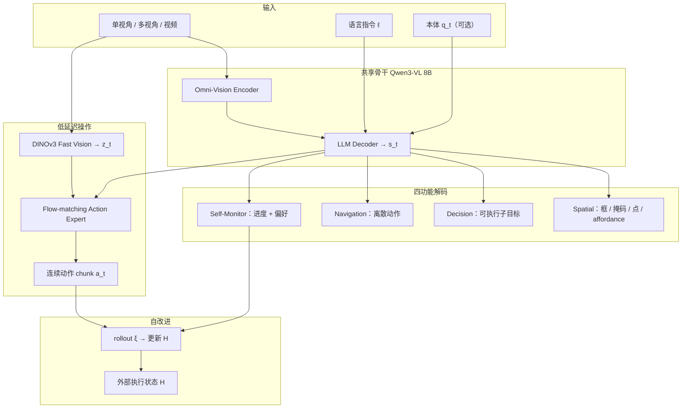
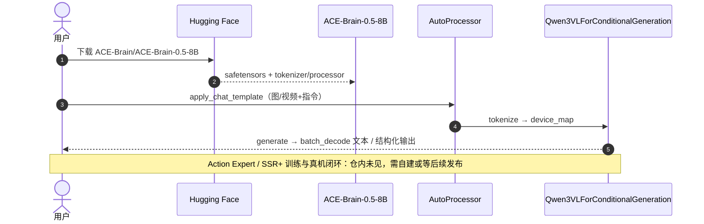

# ACE-Brain-0.5：统一具身基础模型（Physical Agentic AI）

**ACE-Brain-0.5**（*A Unified Embodied Foundational Model for Physical Agentic AI*，[arXiv:2607.04426](https://arxiv.org/abs/2607.04426)，[项目页](https://ace-brain-team.github.io/ACE-Brain-0.5/)，**ACE-Brain Team / 大晓机器人（Ace Robotics）**）在前作 **ACE-Brain-0** 的空间智能脚手架上，把机器人认知收成五耦合功能——**空间感知、决策规划、具身交互、自监控、自改进**——并用单一 **Qwen3-VL 8B** mixture-of-transformer 骨干直接实例化前四者（grounding / 3D·自我中心空间推理 / 子目标分解 / 导航与操作动作 / 进度估计）；训练用 **SSR+**（Scaffold–Specialize–Reconcile + **Reactivate**）缓解异构接口干扰；自改进更新外部执行状态而非每步重训。跨十五余基准：相对 0 代 **18** 项空间榜中 **14** 项提升，导航/操作有竞争力，进度估计 ID/OOD 均强。

## 一句话定义

**在共享空间脚手架上，用一条 8B 骨干跑通「感知–规划–动作–评估」闭环，并用合并后再激活的 SSR+ 把 grounding、导航、操作与进度接口拧进同一模型。**

## 英文缩写速查

| 缩写 | 英文全称 | 简要说明 |
|------|----------|----------|
| ACE-Brain | ACE Embodied Brain | 大晓 ACE 具身脑模型族；本页为 0.5 代 |
| SSR+ | Scaffold–Specialize–Reconcile–Reactivate | 脚手架→专精→任务向量合并→轻量再激活 |
| VLA | Vision-Language-Action | 视觉–语言–动作；本页含 flow Action Expert / VLA 变体 |
| VLN-CE | Vision-and-Language Navigation in Continuous Environments | 连续环境语言导航评测设定 |
| MoT | Mixture of Transformers | 共享骨干 + 任务解码路径的混合 Transformer |
| VOC | Value of Correlation（进度相关） | RoboMeter/RBM 进度估计与真值时序相关指标 |
| RBM | RoboMeter / RBM-EVAL | 进度奖励数据与 ID/OOD（含 refined 反转）评测 |

## 核心信息

| 字段 | 内容 |
|------|------|
| **机构** | 大晓机器人（Ace Robotics）/ ACE-Brain Team |
| **arXiv** | [2607.04426](https://arxiv.org/abs/2607.04426) |
| **骨干** | ACE-Brain-0 ← **Qwen3-VL-8B-Instruct**；DINOv3 Fast Vision + flow-matching Action Expert |
| **统一能力** | 感知 / 规划 / 导航·操作 / 进度估计（+ 外部状态自改进） |
| **开源（截至 2026-07-27）** | **部分开源**：HF **8B** 权重 + transformers 推理；GitHub 仅 README/资产，**未见**训练栈 |

## 为什么重要

- **范式对照可读：** Table 1 把 RynnBrain（强空间、弱动作/监控）、π/QwenVLA（强动作、弱空间规划）、robot-agent（系统编排、无共享脑）与「五功能一体」并排——适合读 [Foundation Policy](../concepts/foundation-policy.md) 时做选型锚点。
- **异构监督的工程解：** SSR+ 的 Reactivate 把「合并后语义还在、格式约定丢了」写成可操作假设：用少量混合 SFT 校准接口，而不是冷启动重训。
- **自监控进同一骨干：** 进度估计不是外挂 critic，而是与 grounding/动作共享 \(s_t\)；RBM refined（反转轨迹）上仍保持高 VOC，直接服务 [过程奖励建模](../concepts/progress-reward-modeling.md) 的保真读法。
- **有可跑权重入口：** 相对纯论文系统，HF `ACE-Brain/ACE-Brain-0.5-8B` 已可做感知/语言侧试跑；闭环操作复现仍受 Action Expert 训练码未公开约束。

## 方法栈（核心结构）

| 模块 | 角色 |
|------|------|
| **Omni-Vision + LLM Decoder** | 单/多视角/视频 + 指令 + 可选本体 → 共享具身状态 \(s_t\) |
| **Spatial / Decision 解码** | 自回归框·掩码·点；自然语言子目标序列 |
| **Navigation 头** | 自我中心观测下离散导航动作 |
| **Fast Vision + Action Expert** | DINOv3 实时特征 \(z_t\) + flow-matching 连续动作 chunk；骨干可冻结 |
| **Self Monitoring** | 帧级进度 \({\hat p}_t\in[0,1]\) + 轨迹对偏好 |
| **Self Improvement** | 更新外部 \(\mathcal{H}\)（图式/空间记忆/失败案例）；导航上用 oracle 纠正构造 \(\mathcal{D}_{\mathrm{evo}}\) |

### 流程总览

### SSR+ 训练阶段

| 阶段 | 作用 | 要点 |
|------|------|------|
| **Scaffold** | 空间脚手架 | ACE-Brain-0 / Qwen3-VL-8B 初始化 \(\theta_0\) |
| **Specialize** | 接口隔离专精 | 独立训 QA·规划 / grounding / 导航 / 进度专家 |
| **Reconcile** | 任务向量合并 | FusionBench 层内最小化专家输出残差 → \(\theta_{\mathrm{merge}}\) |
| **Reactivate** | 格式再校准 | 紧凑混合 SFT \(\mathcal{D}^{\mathrm{mix}}\)，恢复跨接口输出约定 → \(\theta_{0.5}\) |

## 源码运行时序图

官方 GitHub 当前**无可运行训练入口**；可复现路径以 Hugging Face **基础 VLM 推理**为准（截至 2026-07-27）：

## 工程实践

| 项 | 内容 |
|----|------|
| **权重试跑** | `Qwen3VLForConditionalGeneration.from_pretrained("ACE-Brain/ACE-Brain-0.5-8B")`（见 [repos](../../sources/repos/ace-brain-0-5.md)） |
| **操作两条路径** | (1) 冻骨干 + FastVision/Action Expert → LIBERO；(2) ACE-Brain-0.5-VLA 全量微调 VLM+flow 头 → SimplerEnv-Bridge |
| **进度作奖励** | 同一骨干输出进度曲线；部署时可作监控/恢复信号，不必另挂专用 RM |
| **开源边界** | **部分开源**：权重+推理已发；训练码/Action Expert **待发布或自建** |
| **源码运行时序图** | 见上节（HF 推理）；训练闭环 **不适用**（仓内无入口） |

## 实验与评测

> 数字以 [arXiv:2607.04426](https://arxiv.org/abs/2607.04426) 为准。

| 设定 | ACE-Brain-0.5 | 读法 |
|------|---------------|------|
| **空间相对 0 代** | **14 / 18** 项提升 | 脚手架保留 + grounding/affordance 明显加强 |
| **MindCube / RefSpatial / RoboAfford** | **86.3% / 55.6% / 75.1%** | 相对 0 代 +4.2 / +29.6 / +18.6 pt |
| **VLN-CE R2R / RxR（统一）** | SR **57.4%** / **63.8%**；NE **4.8 / 4.3** | RxR 多项领先开源导航专精基线 |
| **LIBERO avg** | **98.2%** | Spatial/Object **100%**；Long **97.0%** |
| **SimplerEnv-Bridge（VLA 变体）** | avg **82.3%** | 报告 SOTA；Eggplant **100%** |
| **RBM VOC Standard ID/OOD** | **0.94 / 0.96** | 优于 Robometer / VLAC 等 |
| **RBM VOC Refined ID/OOD** | **0.80 / 0.88** | 反转负控下仍领先，抗「单调进度捷径」 |

## 结论

**统一脑的真贡献是「共享空间脚手架 + 多接口可切换」，不是某一单项榜的极限；SSR+ 的 Reactivate 与内置进度估计，比再堆一个 specialist 更值得工程复用。**

1. **选型读法** — 若你要「一个 checkpoint 同时做空间 grounding、导航、操作与执行评估」，优先对照本页与 [RynnBrain](./paper-rynnbrain-1-1.md) / [Qwen-VLA](./qwen-vla.md)，而不是只比 LIBERO。
2. **训练读法** — 异构输出先 Specialize 再 merge，再用短 Reactivate 校准格式；直接大混合 SFT 易丢接口约定。
3. **指标读法** — 空间看 RefSpatial/RoboAfford 跃升；导航看 RxR NE/SR；操作看 LIBERO Long；进度看 **refined** VOC，勿只报 standard。
4. **代价** — 驾驶专精榜相对 0 代有回落；统一模型导航略逊 Specialist；Action Expert 训练栈未开源。
5. **部署** — 先 HF 验证感知/规划输出；真机操作需自接 flow 头或等官方 Action Expert 发布。

## 局限与风险

- **误区：** 把 GitHub「Code」徽章当成可复现训练仓——截至入库日仅文档资产；可跑的是 **HF 权重推理**。
- **误区：** 把自改进当成在线梯度更新——主路径是外部执行状态 \(\mathcal{H}\) 的增量更新。
- **局限：** 驾驶子任务非优化目标；长程视频驾驶 QA（如 LingoQA）仍弱。
- **局限：** 操作 SOTA 依赖特定变体与数据设定（Bridge 上未用 0.5 预训练权重等），跨设定迁移需自证。

## 与其他工作对比

| 对照对象 | ACE-Brain-0.5 的差异 |
|----------|----------------------|
| **ACE-Brain-0** | 同脚手架前作；0.5 补齐动作接口 + 进度自监控 + SSR Reactivate |
| **[RynnBrain 1.1](./paper-rynnbrain-1-1.md)** | 同为具身脑；Rynn 强空间/接触点/3D，公开叙事弱端到端动作与进度；0.5 强调闭环四功能一体 |
| **[Qwen-VLA](./qwen-vla.md)** | 同 Qwen3-VL 族；Qwen-VLA 偏通才操作+VLN；0.5 额外内置进度估计与 SSR+ 多接口合并 |
| **π₀ / π₀.₅** | 动作专家同族 flow-matching；0.5 把专家挂在更宽的空间·规划·监控骨干上 |
| **[ABot](./paper-abot-m05-mobile-manipulation-wam.md) / robot-agent** | 系统编排或多模型协作；0.5 坚持单一共享表征而非工具编排 |
| **Robometer 等进度模型** | 专用 RM；0.5 把进度头与感知/动作共骨干，refined 设定更稳 |

## 关联页面

- [Foundation Policy](../concepts/foundation-policy.md) — 具身基础策略与统一脑选型语境
- [VLA](../methods/vla.md) — flow-matching 动作头与通才 VLA 族谱
- [过程奖励建模](../concepts/progress-reward-modeling.md) — 进度估计 / 过程奖励接口读法
- [RynnBrain 1.1](./paper-rynnbrain-1-1.md) — 强空间具身脑对照
- [Qwen-VLA](./qwen-vla.md) — 同骨干族操作–导航通才对照
- [Vision-Language Navigation](../tasks/vision-language-navigation.md) — VLN-CE / R2R·RxR 背景
- [Manipulation](../tasks/manipulation.md) — LIBERO / SimplerEnv 操作语境
- [Kairos](./paper-kairos-native-world-model-stack.md) — 同 Ace Robotics 品牌的世界–动作模型产品线（勿与本页混淆）

## 推荐继续阅读

- 论文 PDF：[arXiv:2607.04426](https://arxiv.org/pdf/2607.04426)
- 项目页：[ace-brain-team.github.io/ACE-Brain-0.5](https://ace-brain-team.github.io/ACE-Brain-0.5/)
- 权重：[Hugging Face ACE-Brain-0.5-8B](https://huggingface.co/ACE-Brain/ACE-Brain-0.5-8B)
- 进度数据与评测语境：[RoboMeter / 过程奖励综述](./paper-progress-reward-modeling-survey.md)

## 参考来源

- [ACE-Brain-0.5 论文摘录](../../sources/papers/ace_brain_0_5_arxiv_2607_04426.md)
- [ACE-Brain-0.5 项目页](../../sources/sites/ace-brain-0-5-github-io.md)
- [ACE-Brain-0.5 仓库归档](../../sources/repos/ace-brain-0-5.md)
