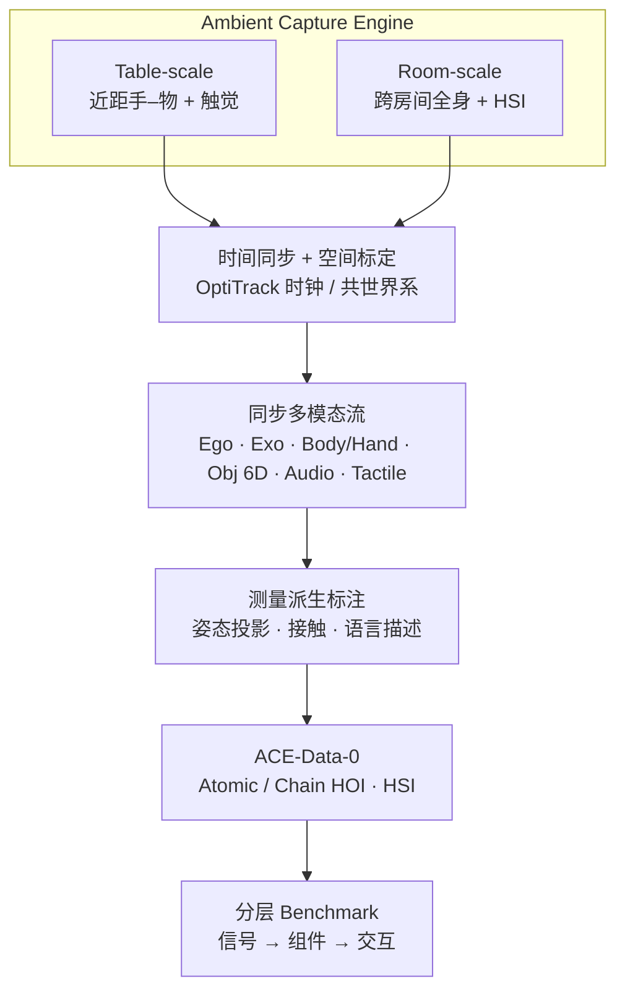

# ACE-Data-0：以人为中心的 Ambient Capture 具身数据引擎

**ACE-Data-0**（*Human-Centric Ambient Capture as Embodied Data Engine*，[arXiv:2607.28625](https://arxiv.org/abs/2607.28625)，[项目页](https://ace-data-engine.github.io/ACE-Data-0/)，**南洋理工大学 S-Lab × 大晓机器人（Ace Robotics）**）提出 **Ambient Capture Engine（ACE）**：把真实家居变成时空校准、多模态同步的录制工作室，并发布同名大规模家居活动数据集与分层感知基准。它瞄准的是现有语料的系统性缺口——视角、模态与空间尺度被拆碎，完整感知–动作闭环从未被同步观测。

## 一句话定义

**用 table-scale + room-scale 两套互补配置，在真实家居里同步记录 ego/exo 视频、全身与手部运动、物体 6-DoF、音频与全掌触觉，并以目标级指令采集自然长程家务，得到可度量对齐的人类演示语料与「信号→场景→交互」诊断基准。**

## 英文缩写速查

| 缩写 | 英文全称 | 简要说明 |
|------|----------|----------|
| ACE | Ambient Capture Engine | 本文提出的双尺度环境化采集系统 |
| HOI | Hand–Object Interaction | 手–物交互；Atomic / Chain of HOI 两类活动 |
| HSI | Human–Scene Interaction | 人–场景交互（坐、导航、家具接触等） |
| Ego / Exo | Egocentric / Exocentric | 第一人称可穿戴视角 / 第三人称固定外视 |
| DoF | Degrees of Freedom | 物体与末端位姿自由度；本集跟踪物体 6-DoF |
| MANO | Hand Model with Articulated and Non-rigid defOrmations | 手部参数化模型；手运动评测表示 |
| SMPL-X | Skinned Multi-Person Linear model eXpressive | 全身姿态表示；人体运动评测常用 |
| MPJPE | Mean Per Joint Position Error | 关节位置误差；PA- / WA- 变体区分对齐方式 |
| VLA | Vision-Language-Action | 视觉–语言–动作模型；本集可作人类演示监督层 |
| IL | Imitation Learning | 模仿学习；同步运动与接触监督的直接消费者 |

## 为什么重要

- **补齐「同步完备」而非只拼规模：** [Ego4D](paper-ego4d.md) / [RekaDaily-10k](rekadaily-10k-dataset.md) / [EgoScale](../methods/egoscale.md) 在小时数上更大，但很少同时给出度量级身体·手·物体状态 + 触觉 + 多外视；本集用 **测量对齐** 换完备监督。
- **真实家居 × 长程目标：** 相对 ARCTIC / GRAB / BEHAVE 等实验室 MoCap，ACE 在家具遮挡、跨房间 locomotion 与分钟级任务链上评测——更接近部署分布。
- **诊断式 benchmark：** 三层任务把失败定位到「接触估计 / 场景状态 / 手轨迹」而不是只报任务成功率，便于选型与改管线。
- **同品牌数据层锚点：** 与 [ACE-Brain-0.5](paper-ace-brain-0-5.md)、[Kairos](paper-kairos-native-world-model-stack.md) 同属 Ace Robotics 生态；本页是 **人类家居活动数据引擎**，勿与具身脑 / WAM 产品线混淆。

## 核心信息

| 项 | 内容 |
|----|------|
| **机构** | 南洋理工大学（NTU）S-Lab；大晓机器人（Ace Robotics） |
| **类型** | 采集系统 + 多模态数据集 + 分层感知 benchmark |
| **arXiv** | [2607.28625](https://arxiv.org/abs/2607.28625) |
| **规模** | **150** h · **17M** 帧 · **75,000** episodes · **200** 任务类 · **50** 人 · **2** 环境 |
| **模态** | Ego（4 鱼眼+IMU）· Exo（≥8 RGB）· 身体/手/物体 60 Hz · 音频 · 全掌触觉 |
| **活动类型** | Atomic HOI · Chain of HOI · HSI |
| **开源（截至 2026-08-10）** | **部分开源**：HF 数据集 **gated** 研究许可已上线；训练/评测代码 **未见** |

## 开源状态

核查日：**2026-08-10**（项目页 / Hugging Face）。

| 产物 | 状态 |
|------|------|
| 数据集 [`ACERobotics/ACE-Data-0`](https://huggingface.co/datasets/ACERobotics/ACE-Data-0) | **已发布（gated）** — 非商业学术研究许可；个人申请不可转让（归档见 [sources/datasets/ace-data-0.md](../../sources/datasets/ace-data-0.md)） |
| 项目页 | **已开放**（归档见 [sources/sites/ace-data-0-github-io.md](../../sources/sites/ace-data-0-github-io.md)） |
| 训练 / 统一 benchmark 代码 | **未见** — 项目页未列 GitHub |
| 模型权重 | **不适用** |

## 数据集速查

| 维度 | 内容 |
|------|------|
| 适配形态 | **人类演示**（非真机遥操作轨迹）；可作 IL / VLA / WAM 的人侧监督或评测 GT |
| 重定向就绪度 | 提供度量身体与手轨迹 + 物体 6-DoF，利于 retarget；画面含动捕服/手套/头显，视觉域有偏移 |
| 许可证 | ACE-Data-0 Research License（非商业学术；禁止再分发与再识别） |
| 与金字塔位置 | [Data Pyramid](paper-data-pyramid-embodied-manipulation.md) **第 ③ 层 Ego/Exo**：物理保真与接触监督强，规模中等 |

## 流程总览

## 核心原理

### 双尺度采集

细粒度接触与房间级运动对传感器密度的要求互相冲突。ACE **不做单套折中**，而用两套配置共享同一表示与管线：table-scale 加密近距观测；room-scale 覆盖带家具公寓。双方都记录 ego + 多外视 + 动捕 + 物体轨迹 + 音频 + 触觉，并注册到同一时空框架。

### 目标级协议与三类活动

参与者收到**家居目标**而非逐步脚本，同一目标可走不同路线、物体选择与恢复策略。活动分成：

1. **Atomic HOI** — 短链日常操作（倒水、擦拭、切菜等）；
2. **Chain of HOI** — 连续例程（开冰箱→清洗→烹饪→收拾），强调中间状态记忆；
3. **HSI** — 全身–场景（坐下、穿行、姿态转换、家具接触）。

### 同步与标注哲学

多模态价值取决于「同一物理瞬间」是否对齐。ACE 以光学动捕时钟为时间基准，并用 marker 桥接把静态外视与可穿戴相机放进同一世界系；触觉手套经 IMU 模板与头显对齐。大量几何/接触标注由测量状态**自动导出**，降低「用待评方法给自己标伪 GT」的循环风险。

## 源码运行时序图

**不适用**——截至入库日（2026-08-10）官方仅发布 **gated 数据集与项目页**，未见可运行训练 / 评测入口或 GitHub 仓；复现入口以 [Hugging Face 申请流程](https://huggingface.co/datasets/ACERobotics/ACE-Data-0) 与论文 §5 评测协议为准。

## 工程实践

| 场景 | 读法 |
|------|------|
| 做人→机 IL / retarget | 优先用 **度量手/身体轨迹 + 物体 6-DoF**；视觉策略需处理动捕装备外观域差 |
| 做 VLA / WAM 人侧预训练 | 本集是 **高保真、中规模** 锚点；小时数不够时与 Ego4D / RekaDaily / EgoScale **分层混用**（完备监督 vs 规模） |
| 做接触 / 视触研究 | 用触觉轨 + ego 遮挡设定；别只信视觉伪接触标签 |
| 做姿态估计选型 | 同时看 PA-MPJPE（局部）与 WA-MPJPE / Traj.err（全局）；家居场景里后者才是痛点 |
| 申请数据 | 走 HF gated 表单；**每人单独申请**；商用另开 Community 线程 |

## 实验与评测（论文报告摘要）

评测 **>30** 个既有方法（预训练权重直接测），暴露接触遮挡、egomotion 与长时漂移缺口。

| 轨道 | 关键数字 / 现象（论文口径） |
|------|---------------------------|
| **触觉 from ego video** | TouchAnything Temp Acc **0.71**、C-IoU **0.16** 为表内最强，仍远未饱和；PressureVision 近乎失效 |
| **人体运动（room-scale）** | 局部 PA-MPJPE 可到约 **55–60 mm** 量级；世界系 WA-MPJPE 常 **180–250+ mm**；ego 方法整体最弱 |
| **手运动 ego** | WildHands 局部最好（PA-MPJPE **11.2 mm**）；世界系方法轨迹误差约 **98–102 mm** |
| **手运动 exo** | WiLoR PA-MPJPE **9.1 mm**；HaPTIC 轨迹误差 **63 mm**（优于 ego 世界系） |
| **跨视角** | 固定外视更利全局轨迹；ego 近距细节互补；联合双视角是明确开放方向 |

## 结论

**一句话总判：ACE-Data-0 的真价值是「真实家居里、度量对齐的完整感知–动作记录」——用中等规模换同步完备，适合当接触/姿态/手轨迹的诊断基准与人侧高保真监督，而不是靠小时数碾压的大规模预训练主粮。**

1. **选型先问「要完备还是要规模」** — 缺接触与度量轨迹时优先本集；缺多样性小时数时叠加 Ego4D / RekaDaily / EgoScale。
2. **评测必看全局指标** — 只报 PA-MPJPE 会掩盖家居部署中的轨迹漂移；WA-MPJPE / Traj.err 才是 room-scale 痛点。
3. **触觉轨是稀缺监督** — 视觉估压仍难；做视触融合或接触感知策略时把本集当硬评测而非只当预训练边角。
4. **目标级协议保留自然变异** — 犹豫、重试、路线差异是资产；清洗时勿按「原子脚本」过度过滤。
5. **许可与外观域要进计划** — gated 非商业许可 + 动捕装备可见；工业配方与视觉闭环部署需另寻授权与域适应。
6. **代码未随数据发布** — 基准对比需自接论文协议与第三方方法权重；勿假设有一键评测仓。

## 局限与风险

- **站点少（2 套家居）** — 布局/光照/物体多样性有限，跨住宅泛化未证明。
- **GT 覆盖边界** — 关节家具、流体、可变形物状态变化未标注；物体需预扫描贴标。
- **采集装备可见** — 服/手套/头显/marker 可能成为捷径特征。
- **非真机动作标签** — 到机器人执行仍需 retarget / 对齐；与 [Humanoid Everyday](humanoid-everyday-dataset.md) 等真机集互补而非替代。
- **访问摩擦** — gated + 个人许可；协作环境每人都要单独申请。

## 与其他工作对比

| 维度 | ACE-Data-0 | [Ego4D](paper-ego4d.md) / [RekaDaily](rekadaily-10k-dataset.md) | 实验室 HOI（ARCTIC 等） | 真机操作集（Everyday / AgiBot） |
|------|------------|----------------------------------------------------------------|------------------------|--------------------------------|
| 主监督 | 度量运动 + 接触 + 多视角视频 | 大规模 ego 视频（少/无度量 HOI GT） | 高精度姿态，环境稀疏 | 可执行机器人动作 |
| 环境 | 真实家具家居 | 野外 / 住宅（弱物理 GT） | MoCap 实验室 | 机器人现场 |
| 时长尺度 | 分钟级目标链（150 h 总量） | 千–万小时级 | 秒–分钟短 clip | 轨迹条数导向 |
| 许可 | 研究 gated | 各异（Ego4D license / Apache 等） | 各异 | 各异 |

## 关联页面

- [具身数据金字塔综述](paper-data-pyramid-embodied-manipulation.md) — 第 ③ 层 Ego/Exo 选型坐标系
- [Ego4D](paper-ego4d.md) — 大规模 egocentric 日常视频对照
- [RekaDaily-10k](rekadaily-10k-dataset.md) — 开放许可家务 ego 视频对照
- [EgoScale](../methods/egoscale.md) — 带手部标签的大规模人视频缩放证据
- [ACE-Brain-0.5](paper-ace-brain-0-5.md) — 同品牌具身脑（不同产品线）
- [Kairos](paper-kairos-native-world-model-stack.md) — 同品牌 WAM 栈
- [VLA](../methods/vla.md) / [Imitation Learning](../methods/imitation-learning.md) — 下游消费者
- [视触融合](../concepts/visuo-tactile-fusion.md) — 触觉轨使用语境
- [Manipulation](../tasks/manipulation.md) — 操作任务域
- [具身大模型评测基准选型闭环](../queries/embodied-eval-benchmark-selection-loop.md) — 本集三层感知诊断基准可归入交互/状态恢复评测层，与策略成功率评测互补

## 参考来源

- [ACE-Data-0 论文归档](../../sources/papers/ace_data_0_arxiv_2607_28625.md)（[arXiv:2607.28625](https://arxiv.org/abs/2607.28625)）
- [ACE-Data-0 项目页归档](../../sources/sites/ace-data-0-github-io.md)
- [ACE-Data-0 数据集归档](../../sources/datasets/ace-data-0.md)

## 推荐继续阅读

- 项目页（Demo 与模态示例）：<https://ace-data-engine.github.io/ACE-Data-0/>
- Hugging Face 数据集（申请入口）：<https://huggingface.co/datasets/ACERobotics/ACE-Data-0>
- 论文 PDF：<https://arxiv.org/pdf/2607.28625>
- 数据金字塔综述（类目级选型）：[arXiv:2607.24744](https://arxiv.org/abs/2607.24744)
