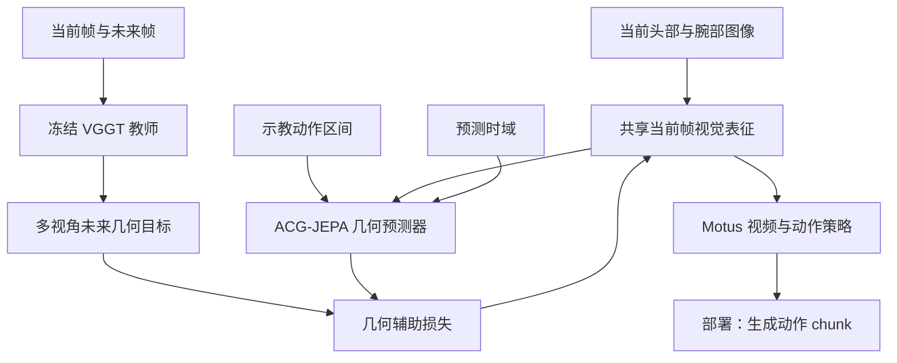
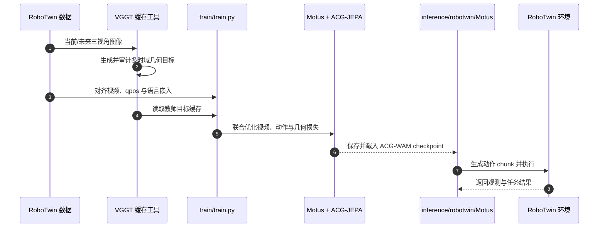

# ACG-WAM：用几何后果监督世界动作模型

**ACG-WAM**（*World-Action Modeling via Action-Conditioned Geometric Latent Prediction*）给世界动作模型增加一个训练期辅助目标：让当前视觉特征和中间动作共同预测未来几何表征，而不是只靠视频像素和动作损失间接学空间变化。

## 一句话定义

把“这段动作会让物体和手的空间关系怎样变化”作为显式训练信号，帮助 WAM 学出更适合操作的视觉特征。

## 英文缩写速查

| 缩写 | 英文全称 | 简要说明 |
|------|----------|----------|
| ACG-WAM | Action-Conditioned Geometric World-Action Model | 动作条件几何监督的世界动作模型 |
| ACG-JEPA | Action-Conditioned Geometric Joint-Embedding Predictive Architecture | 预测动作区间终点几何特征的辅助目标 |
| VGGT | Visual Geometry Grounded Transformer | 生成冻结的几何教师目标 |
| WAM | World-Action Model | 联合建模未来观测与机器人动作 |
| Motus | A Unified Latent Action World Model | ACG-WAM 所基于的策略骨干 |

## 核心信息

| 项目 | 内容 |
|------|------|
| 作者 / 机构 | Jiangtao Liu、Zishang Xiang、Yage He、Lingguo Cui、Baihai Zhang、Runqi Chai、Senchun Chai；北京理工大学自动化学院、逐际动力（LimX Dynamics） |
| 论文 | [arXiv:2610.06965](https://arxiv.org/abs/2610.06965)，2026-10-03 |
| 项目页 | [ACG-WAM](https://RoboOpus.github.io/ACG-WAM/) |
| 代码 | [RoboOpus/ACG-WAM](https://github.com/RoboOpus/ACG-WAM)，Apache-2.0 |
| 模型 | [Hugging Face 权重](https://huggingface.co/RoboOpus/ACG-WAM)，发布的是 RoboTwin 40k policy checkpoint |
| 数据 | 仓库不附 RoboTwin 示教集或 VGGT teacher cache；需按 README 单独准备数据并生成缓存 |

## 方法流程

1. **基线策略照常学习视频与动作。** ACG-WAM 以 Motus 为骨干，继续联合训练视频预测与动作生成。
2. **几何教师构造目标。** 冻结 VGGT 对同一相机的当前帧和未来帧联合编码，取未来位置特征；头部、左腕、右腕三路目标分别提取、池化后合并。
3. **动作与时间跨度共同条件化。** 训练样本把当前视觉特征、对应动作前缀及 horizon 输入 ACG-JEPA predictor，预测未来几何特征。论文使用 horizon {1, 2, 4, 8}。
4. **梯度回到共享视觉层。** 几何损失作用于 temporal mixing 前的当前帧视觉表征，和原有视频、动作损失共同优化共享 patch embedding。
5. **部署剥离辅助分支。** 推理时只保留已训练好的 Motus 策略骨干；VGGT teacher、缓存、adapter 和 predictor 都不进入部署图。

## 流程图

VGGT 仅用于训练期构造监督；学生预测分支不读取未来图像。这样避免辅助预测器从策略已经混合过的未来 token 中“偷看答案”。

## 源码运行时序图

官方仓库包含训练、缓存生成、审计和 RoboTwin policy 入口。论文所述真机实验有演示与指标，但公开部署入口指向 RoboTwin；不把真机视频等同于公开真机驱动代码。

复现关键路径是先按 README 准备对齐的 RoboTwin 数据、生成并审计 VGGT cache，再用发布的 DeepSpeed 配置训练；只做评测可下载 HF checkpoint。完整训练需要额外的 Wan、Qwen、Motus、VGGT 资产，权重下载本身不包含数据或精确恢复所需的优化器状态。

## 实验与评测

- **RoboTwin 2.0：** 50 项双臂任务，Clean 成功率 93.46%，Randomized 92.68%，两者等权均值 93.07%；评估为每任务、每设置 100 个 episode。
- **对 Motus 的差值：** Clean +4.80 个百分点，Randomized +5.66 个百分点；并非所有任务、场景都获益。
- **真机：** TRON2 + WUJI hands 的三项操作任务平均 SR 85.00%、PCS 91.67%；每任务 20 次评估，论文说明该结果使用任务级真机微调。
- **消融：** 论文分别检查目标构造、动作条件化和预测 horizon；多时域且动作条件化的联合目标在所列六任务消融中表现最好。

## 与其他工作对比

| 工作 | 几何信号怎么进入 WAM | 部署期是否保留 | 与 ACG-WAM 的差别 |
|------|----------------------|----------------|-------------------|
| [Motus](./paper-sa-2512-13030-motus-a-unified-latent-action-world-model.md) | 无显式几何目标，只靠视频预测与动作损失 | — | ACG-WAM 的骨干与直接基线；RoboTwin 2.0 上 Clean / Randomized 分别高 4.80 / 5.66 个百分点 |
| [MECo-WAM](./paper-meco-wam-4d-geometry-cotraining.md) | 训练期增设 4D 专家，同样用冻结 VGGT 监督并做动作感知时序几何蒸馏 | 否，推理移除全部 4D 组件 | 两者都是“训练期几何、部署期剥离”；MECo-WAM 加的是一路专家分支，ACG-WAM 只加 JEPA 式预测头，并把动作前缀与 horizon 作为预测条件 |
| [JEPA-WAM](./paper-jepa-wam.md) | 共享预测器在 V-JEPA 潜空间学习视觉变化与连续动作，可接入已有 VLA | 本库页未记录 | 同属潜空间预测思路，但 JEPA-WAM 预测通用 V-JEPA 表征；ACG-WAM 的目标限定为 VGGT 几何特征，且只作为 Motus 的训练期辅助损失 |

对比时要注意：上表数字来自各自论文的设定，RoboTwin 2.0 的 Clean / Randomized 协议、每任务 episode 数和是否做任务级微调需逐篇核对，不能直接横向排名。

## 工程实践与局限

- **数据对齐是复现前置条件。** qpos、三视角视频和语言嵌入必须对应同一 episode；teacher cache 也必须匹配目标协议和 horizon。
- **资源成本不低。** README 给出的主训练配方为 4 GPU、40k optimizer updates；发布的 checkpoint 单权重文件约 16.09 GB。
- **“有 checkpoint”不等于“全数据开放”。** 模型权重和代码公开，但 RoboTwin 数据、VGGT cache、上游模型权重的获取和许可仍需分别处理。
- **部署范围要区分。** README 公开 RoboTwin 部署入口；不能据真机展示推断公开了完整 TRON2 运行栈。

## 结论

**ACG-WAM 的实质是把未来几何变化与动作区间显式对齐，并将辅助监督落在部署策略会复用的当前帧表征上。**

1. 几何监督是训练期辅助项，不增加部署期前向模块。
2. 需要动作前缀和目标 horizon 对齐；只用当前/未来图像对不能复现完整目标。
3. 50-task 随机化收益明显，但应同时报告干净场景结果与任务级真机微调条件。
4. 开源包含代码和权重，不包含整套 RoboTwin 训练数据与 VGGT cache。
5. 实机复现要单独核对 TRON2、WUJI hands 和真机微调脚本是否能从公开仓库获得。

## 关联页面

- [World Action Models](../concepts/world-action-models.md) — WAM 的任务与架构边界
- [Motus](./paper-sa-2512-13030-motus-a-unified-latent-action-world-model.md) — ACG-WAM 的策略骨干
- [VLA](../methods/vla.md) — 视觉、语言与动作策略的共同背景
- [Manipulation](../tasks/manipulation.md) — 操作任务与评测语境

## 参考来源

- [ACG-WAM 论文摘录](../../sources/papers/acg_wam_arxiv_2610_06965.md)
- [ACG-WAM 项目页归档](../../sources/sites/acg-wam-project.md)
- [ACG-WAM 官方代码与权重说明](../../sources/repos/acg-wam.md)

## 推荐继续阅读

- [arXiv:2610.06965](https://arxiv.org/abs/2610.06965)
- [ACG-WAM 项目页](https://RoboOpus.github.io/ACG-WAM/)
