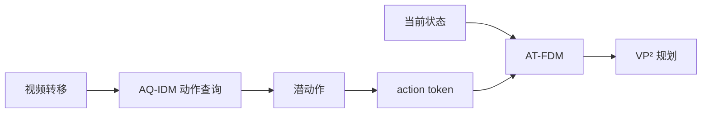
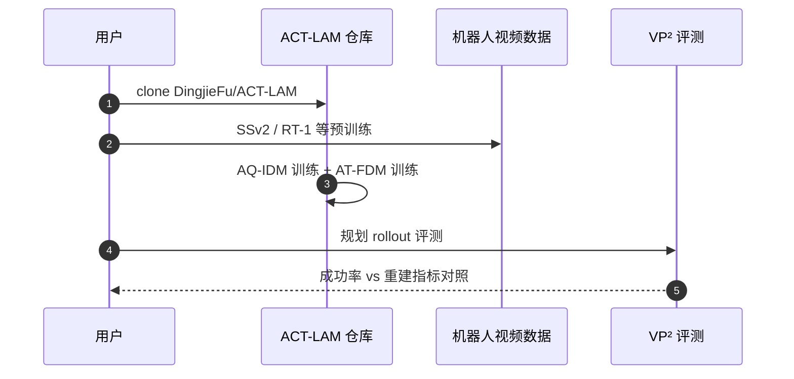

# ACT-LAM：重建得更像不等于动作学得更好

**ACT-LAM**（*Reconstructing Is Not Acting: Action-Centric Latent Dynamics Modeling*，[arXiv:2609.15189](https://arxiv.org/abs/2609.15189)，[代码](https://github.com/DingjieFu/ACT-LAM)）指出视频世界模型常用的未来帧重建指标与 **潜动作质量 / 下游规划** 存在 **重建—动作错配**：画面更像不必然带来更好的潜变量或规划成功率。

## 一句话定义

**潜动作世界模型应分别约束「动作从哪来」与「预测时是否真用上动作」，不能把像素重建当控制代理指标。**

## 英文缩写速查

| 缩写 | 英文全称 | 简要说明 |
|------|----------|----------|
| ACT-LAM | Action-Centric Latent Action Model | 本文框架 |
| LAM | Latent Action Model | 从无标注视频学潜动作 |
| AQ-IDM | Action Query IDM | 可学习动作查询 + 门控聚合 |
| AT-FDM | Action Token FDM | 潜动作投影为 action token 调制演化 |
| VP² | Visual Planning via Prediction | 视觉规划基准 |

## 为什么重要

- 纳入 [2026-09-15 十篇盘点](../../sources/blogs/wechat_embodied_station_9_papers_resources_effvla_2026-09-15.md) 的「潜动作 / 世界模型」支线。
- 直接挑战「重建误差 ↓ ⇒ 规划更好」的默认读法。
- **已开源** `DingjieFu/ACT-LAM`，可复现 VP² 与线性探测数字。

## 核心原理（方法）

论文先命名问题：**reconstruction–action mismatch** — 潜动作模型（LAM）把重建误差压得更低，**不必然** 换来更好的潜动力学或下游表现。归因落在重建式建模的两处欠约束上，方法栈也就按这两处对症下药：

| 欠约束 | 症状 | ACT-LAM 的对策 |
|--------|------|----------------|
| IDM 没被要求区分 **动作相关转移** 与 **无关外观变化** | 潜动作里混进光照/纹理等 nuisance | **AQ-IDM**：可学习 action query + 门控聚合，**不靠强信息瓶颈** 也能选择性抽取动作线索 |
| FDM 可以走 **当前状态的预测捷径** | 潜动作被推断出来却没被真正用上 | **AT-FDM**：潜动作投影成 **action token**，与演化中的状态表示逐步交互，做持续的 state-aware 条件化 |

1. **AQ-IDM**：从视觉转移中抽取动作相关线索（Push-T / Block Pushing 线性探测 MSE **0.007 / 0.031**）。
2. **AT-FDM**：潜动作 → action token，持续参与状态演化，避免 FDM 只靠当前状态走捷径。
3. **规划 vs 重建分离**：VP² 六任务聚合成功率 **49.04%**（较此前最佳 **+7.6%**）；长时 rollout 像素重建仍弱。
4. **特征处理精简**：论文同时压掉冗余特征处理，把模型容量集中在潜动力学建模上——这是「参数更少反而更强」的来源。

## 源码运行时序图

## 实验与评测

| 维度 | 报告结果 | 读法 |
|------|----------|------|
| **VP² 聚合成功率** | **49.04%**，较此前最佳 **+7.6%** | 主结果。VP² 是 **视觉规划** 协议，测的是「潜动力学能否支撑 rollout 选动作」，不是帧质量 |
| **潜动作一致性**（线性探测 MSE） | Push-T **0.007** / Block Pushing **0.031** | 探测头是线性的，所以低 MSE 说明真动作在潜空间里 **线性可分离**，而非被解码器救回来 |
| **前向动力学** | 论文报告在多个机器人数据集上同步改善 | 与上一行配对读：动作 **提取得出来** 且 **被用上了**，才是两个模块各自的验收项 |
| **参数与开销** | 约 **55M** 可训练参数，计算开销低于对照 | 「更少参数 + 更高成功率」是本文最强的一条主张，来自精简特征处理把容量让给潜动力学 |
| **长时像素重建** | 仍弱 | 论文没有回避：它换的就是这个——别把 ACT-LAM 当生成式视频世界模型用 |

**验收提醒：** 复现时把 **规划成功率** 与 **重建/像素指标** 分账记录；再单独查 **action utilization**（FDM 是否真依赖潜动作），否则 mismatch 会以「指标好看但规划不动」的形式复现。

## 与其他工作对比

> 下表只做 **定位对照**：各工作的数据集、潜动作维度与下游协议不同，只有同在 VP² 上、按论文表格口径的数字才可比。

| 对照 | 差异读法 |
|------|----------|
| **重建式 LAM**（Genie 系、本文要挑战的默认做法） | 默认读法是「重建误差 ↓ ⇒ 潜动作更好」；ACT-LAM 的整篇论文就是这条默认读法的反例，并把它拆成 IDM 判别力与 FDM 利用率两个可测子问题 |
| **强信息瓶颈式 IDM**（VQ / 窄瓶颈一支） | 用瓶颈逼 IDM 丢掉外观信息，代价是动作线索也一起被压掉；AQ-IDM 换成 **查询 + 门控** 做选择性抽取，主张「筛选」优于「限流」 |
| [Latent Actions Matter](./paper-latent-actions-matter.md) | 同期的 **实证研究** 而非新方法：统一比较 41 项 LAM 设计、给出 LAPO/ΔDINO 强基线。两页配对读——那页告诉你设计空间长什么样，本页给出其中两个轴（提取、利用）的具体改法 |
| [LIT](./paper-lit-latent-interface-training.md) | 同为潜动作接口，但落点在 **下游策略**：LIT 用终点 SE(3) 监督潜 token 再接视觉，报的是 LIBERO-Plus 提升；ACT-LAM 停在 **潜动力学与视觉规划**（VP²），两者评测协议不同，不可横比 |
| [World Action Models](../concepts/world-action-models.md) | 该页给出 WAM 家族的分类框架；ACT-LAM 属「从无标注视频学动作表示」一支，且明确 **不做** 长时生成——按该页的 Joint / Cascaded 轴归位时要注意这一限制 |
| **生成式视频世界模型** | 优化目标是像素保真与长时一致；ACT-LAM 的长时重建弱正是取舍结果。若任务依赖长 horizon 外观一致性，本文不是替代品 |

## 结论

**ACT-LAM 用可诊断的双模块设计证明：规划增益来自动作一致性与利用率，而非更低的帧重建误差。**

1. **分开报两类指标** — 规划成功率与像素重建不可混读。
2. **动作查询优于纯瓶颈** — AQ-IDM 在探测任务上验证动作线索可分离。
3. **利用检查必要** — action utilization 可发现 FDM 是否真依赖潜动作。
4. **参数轻量** — 约 **55M** 可训练参数仍有 SOTA 级 VP² 聚合表现。
5. **长时视觉仍是短板** — 部署前需确认任务是否依赖长 horizon 外观一致。

## 工程实践

| 项 | 建议 |
|----|------|
| 何时引用 | 无标注视频学潜动作、视觉规划、重建—控制指标分离 |
| 复现入口 | GitHub README → 数据准备 → AQ-IDM/AT-FDM 训练 → VP² |
| 开源 | **已开源**（截至 2026-09-15） |

## 局限与风险

- 结论主要覆盖论文列出的视频集与 VP² 协议。
- 长时像素重建弱意味着不能当 generative video world model 替代品。

## 关联页面

- [World Action Models](../concepts/world-action-models.md)
- [VLA](../methods/vla.md)
- [十篇资源技术地图](../overview/embodied-resources-10-papers-technology-map.md)

## 参考来源

- [ACT-LAM 论文摘录](../../sources/papers/act_lam_arxiv_2609_15189.md)
- [具身智能小站 2026-09-15 盘点](../../sources/blogs/wechat_embodied_station_9_papers_resources_effvla_2026-09-15.md)

## 推荐继续阅读

- 论文 PDF：<https://arxiv.org/pdf/2609.15189>
- 官方代码：<https://github.com/DingjieFu/ACT-LAM>
