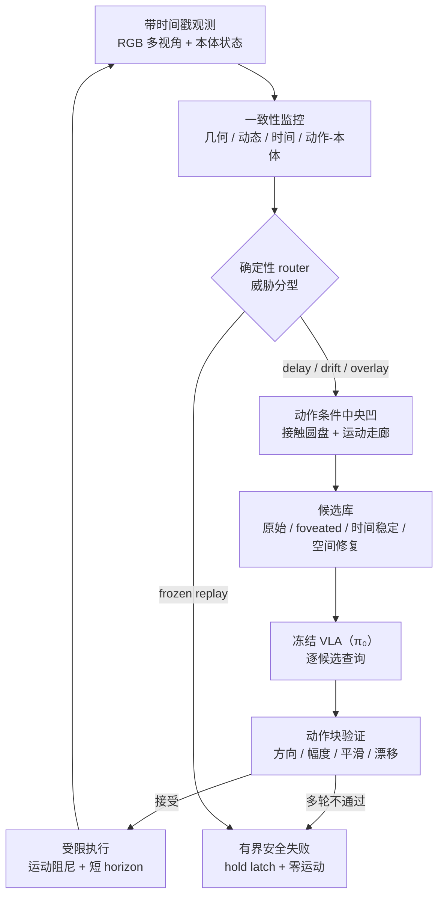
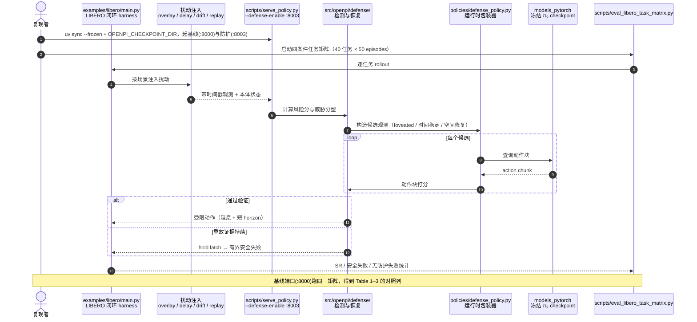

# ActFovea：给 VLA 策略加一层运行时防护

**ActFovea**（论文 *ActFovea: Runtime Safeguarding for VLA Policies via Spatiotemporal Visual-Action Consistency*，[arXiv:2607.29169](https://arxiv.org/abs/2607.29169)，[代码](https://github.com/SunnyYWD/ActFovea)）在**冻结的 VLA 策略**（实验用 π₀）与环境之间插一层**免训练**防护：既不重训也不改权重，只在「观测 → 动作」接口上做检测、恢复与兜底。

## 一句话定义

**把「视觉观测、本体状态、已执行动作」三者的时空一致性当作运行时健康信号：一致就正常放行，能修就修完再验证动作块，修不了就有界安全失败。**

## 英文缩写速查

| 缩写 | 英文全称 | 简要说明 |
|------|----------|----------|
| VLA | Vision-Language-Action | 被防护的策略族；本文实验用冻结 π₀ |
| SR | Success Rate | 任务成功率，主指标 |
| NRR | Normalized Recovery Rate | 相对干净性能回收的差距比例，本文核心恢复指标 |
| LIBERO | LIBERO Benchmark | 评测基准（Spatial / Object / Goal / 10-task 四套件） |
| pp | percentage point | 百分点，绝对差值单位 |
| RGB | Red-Green-Blue | 输入视觉模态 |

## 为什么重要

- **补的是 VLA 部署链上最少被写的一环。** 大量工作在做「怎么训得更强」，ActFovea 处理的是**训好之后在现场坏掉**：相机被遮、图像延迟、动作被扰、传感器锁死。
- **免训练、可挂载。** 不需要拿到 VLA 的梯度或权重，对**闭权重 / 托管 API 形态的策略**同样适用——这与 [CLIFT](./paper-clift-closed-loop-iterative-finetuning.md) 描述的「拿不到内部信号」的部署现实是同一条约束下的两种应对。
- **它区分了「能修」和「不能修」。** 大多数运行时手段只有一个动作（裁剪、平滑、hold）；ActFovea 显式把冻结重放判为**不可恢复**并转入终止性安全失败，而不是无限期悬停。
- **给了一组可读的反例。** 纯时间戳检测在「时间戳新、内容旧」的延迟场景下会把成功率打到 **0%**，固定短 horizon 只帮动作漂移、在视觉侧更差——这些是工程上很容易先想到的方案。

## 核心信息

| 项 | 内容 |
|----|------|
| **作者 / 机构** | Wenda Yu、Tianshi Wang、Fengling Li、Xin Li、Jingjing Li、Lei Zhu；预印本仅标上标编号 1–4，**未写出单位名称** |
| **被防护策略** | 冻结 **π₀**（不重训、不改权重、无新增可学习参数） |
| **评测** | LIBERO Spatial / Object / Goal / 10-task，共 **40 任务 × 50 episodes = 2000 episodes** / 组合 |
| **扰动类型** | 局部视觉叠加、视觉延迟（3 帧）、动作轨迹漂移、观测冻结重放 |
| **开源** | **已开源**（Apache-2.0 + Gemma 条款）：[SunnyYWD/ActFovea](https://github.com/SunnyYWD/ActFovea)，基于 openpi 改造；**权重复用 π₀ 官方 checkpoint**，仓库不发布新权重 |

## 核心原理

### 一致性被什么破坏

论文把四类运行时扰动统一刻画为**时空视觉–动作一致性**的违背，并按可恢复性分流：

| 扰动 | 破坏了什么 | 处置 |
|------|-----------|------|
| 局部视觉叠加（棋盘格，alpha 0.5） | 视觉证据的**空间**有效性 | 空间修复 → 恢复 |
| 视觉延迟（多视角滞后 3 帧） | 视觉与本体的**时间**对齐 | 时间稳定候选 → 恢复 |
| 动作轨迹漂移（执行前平滑扰动） | 指令动作与已执行动作的一致性 | 受限执行 → 恢复 |
| 观测冻结重放（同帧重复至终止） | 观测**新鲜度**彻底失效 | **不可恢复** → 有界安全失败 |

### 四个组件

1. **动作条件中央凹（foveation）** — 保留掩码由两部分并集再膨胀：以投影夹爪接触点为心、半径 \(r_c\) 的圆盘 \(M_c\)，以及沿预测轨迹路点、半径 \(r_\Gamma\) 的**运动走廊** \(M_\Gamma\)：
   \[
   M^v_t=\mathrm{Dilate}(M^v_{c,t}\vee M^v_{\Gamma,t},\,r_m)
   \]
   背景区做**有界**弱化（归一化 / 平滑 / 去饱和，强度 \(\alpha\)），保留区维持原图保真。掩码**跟着预期交互移动**，不是固定在图像坐标里——这是「动作条件」的含义。
2. **一致性监控** — 聚合为风险分
   \[
   R_t=\mathrm{clip}\big(\beta\bar r_t+(1-\beta)r_t+p^{cam}_t+p^{lag}_t+p^{cal}_t,\,0,\,1\big)
   \]
   分量：几何一致性（观测 vs 投影接触中心距离）、动态一致性（预测像移 vs 观测像移的方向与幅度）、时间证据（时间戳健康度、应有却缺失的局部运动、短历史匹配估计滞后、全局重放相似度）、动作–本体一致性；\(p^{cam}/p^{lag}/p^{cal}\) 分别惩罚相机不可用、估计延迟、标定不一致。一个**确定性 router** 按证据模式与持续性把当前观测路由到 delay / drift / replay 三类威胁之一。
3. **候选库 + 动作块验证** — 候选包含原始观测、foveated 观测、时间稳定候选；对已确认的局部叠加另做空间修复（稠密光流中值对齐历史干净帧 → 估计叠加图案与混合系数 → 反解）。**每个候选都喂给冻结的 VLA**，对返回的动作块打分
   \[
   V_k=\mathrm{clip}(w^\top u_k+b_k,\,0,\,1)
   \]
   \(u_k\) 聚合首动作方向、终点方向、运动幅度、平滑度、horizon 与 chunk 漂移；\(b_k\) 是威胁条件加成，用来调接受门槛。
4. **风险自适应执行** — 两级仲裁只缩放**运动维度**、保留夹爪指令：
   \[
   \hat a^{mot}_{t,i}=\lambda^{mon}_t\lambda^{ver}_t\,a^{\star,mot}_{t,i},\quad i<h_t=\min(h^{mon}_t,h^{ver}_t)
   \]
   手段是运动阻尼、短 horizon 执行与 servo recovery。

### 安全失败（不可恢复分支）

重放证据在多轮恢复尝试后仍持续 → **hold latch 闭锁**：停止查询策略、抑制运动；至多前置一个截断的反向动作，其余动作块填零运动 hold。定位是**保守收敛的终止状态**，不是无限期悬停。检测后累计运动范数相对无防护基线降 **99.87%**，检测后动作数 **259.2 → 2.0**。

### 流程总览

## 源码运行时序图

官方代码 [SunnyYWD/ActFovea](https://github.com/SunnyYWD/ActFovea) 是 openpi 的改造分叉，防护逻辑与评测 harness 齐全（归档见 [sources/repos/actfovea.md](../../sources/repos/actfovea.md)）：

- **最短复现路径：** 初始化 submodule（含 LIBERO）→ `uv sync --frozen` → 打 transformers 补丁 → 设 `OPENPI_CHECKPOINT_DIR` → 起**两个**服务端（基线 8000 / 防护 8003）→ `eval_libero_task_matrix.py`。
- **注意：** 仓库**不发布新权重**，π₀ checkpoint 走官方渠道；这正是「training-free」的体现，但也意味着复现要先拿到 π₀。

## 工程实践

| 场景 | 建议 |
|------|------|
| 只想快速加一层保护 | 先接**一致性监控 + 有界安全失败**；这一半就能把「传感器锁死后继续挥臂」变成可控停止 |
| 相机可能被遮 / 反光 | 上完整链路（威胁分型 + 恢复库 + 候选扩展）——消融显示这三件缺一，overlay 增益直接由 **+41 pp 变负** |
| 图像链路有延迟 | **不要只查时间戳**；本文 Timestamp-Only Hold 在 3 帧延迟下成功率 **0%** |
| 担心防护拖累正常任务 | 本文无扰动下 93.8% vs 基线 93.0%，不掉分；但固定裁剪 / 平滑基线会先掉 10.8 pp，别用它 |
| 只有动作侧噪声 | Fixed Short Horizon 在 drift 上有效（89.9%），但视觉侧更差；按扰动类型选，不要一招打全场 |
| 参数从哪来 | \(r_c,r_\Gamma,r_m,\alpha,\beta\) 与各阈值是固定实现常数，论文**未给敏感性分析**，换平台需自行标定 |
| 前置条件 | 需要**带时间戳的观测**、本体测量、运动学模型与相机标定——「免训练」不等于「零配置」 |

## 实验与评测

**恢复能力（LIBERO 四套件，冻结 π₀）：**

| 扰动 | 干净基线 | 受扰基线 | +ActFovea | Gain | NRR |
|------|---------|---------|-----------|------|-----|
| Action drift | 92.7% | 83.1% | 90.1% | +7.0 pp | 73.1% |
| Visual delay | 92.6% | 76.2% | 86.0% | +9.8 pp | 59.8% |
| Visual overlay | 93.0% | 49.3% | **90.3%** | **+41.0 pp** | **93.7%** |

**与其他免训练运行时手段：**

| 方法 | 无扰动 | Drift | Delay | Overlay |
|------|-------|-------|-------|---------|
| Base VLA（π₀） | 93.0% | 83.1% | 76.2% | 49.3% |
| Action Clip / Smoothing | 82.2% | 70.4% | 70.2% | 30.9% |
| Fixed Short Horizon | 91.7% | 89.9% | 70.7% | 32.4% |
| Timestamp-Only Hold | 93.1% | 84.9% | **0.0%** | 48.5% |
| **ActFovea** | **93.8%** | **90.1%** | **86.0%** | **90.3%** |

**冻结重放（2000 episodes）：** Base VLA 96.95% 无防护失败；Timestamp-Only Hold **100%** 无防护失败；ActFovea **100% 及时安全失败、0 无防护失败**。

**消融（相对干净的 Gain）：**

| 去掉的组件 | Drift | Delay | Overlay |
|-----------|-------|-------|---------|
| w/o Threat Typing | +4.4 | +4.3 | **−7.6** |
| w/o Recovery Bank | +4.4 | +7.8 | **−33.3** |
| w/o Candidate Expansion | +7.5 | +9.2 | **−31.7** |
| w/o Action Verification | **−1.2** | +2.3 | +42.8 |
| Full ActFovea | +7.0 | +9.8 | +41.0 |

读法：**空间恢复靠「定位损坏区 + 造候选」**，**时间 / 动作侧恢复靠动作块验证**这道共享保守闸门。overlay 去掉验证后反而更高（+42.8），说明验证是为跨场景一致性而收紧、代价是个别场景的峰值。

## 结论

**VLA 部署失败常常不是策略变笨了，而是它看到的世界和它的身体、它的动作对不上了；把这个「对不上」量化成运行时信号，能在不动模型的前提下拿回大部分损失。**

1. **一致性是可用的健康信号**：几何 + 动态 + 时间 + 动作–本体四类证据聚合的风险分，足以驱动检测与分型。
2. **空间损坏与时间/动作损坏要走不同的恢复路径**：前者靠定位与重建候选，后者靠动作块验证收紧执行；消融里两条路径互相**不能替代**。
3. **不要只信时间戳**：延迟场景下时间戳看着新、内容已旧，纯时间戳方案会把成功率打到 0%。
4. **要有「不可恢复」这个类别**：冻结重放按设计无法恢复，价值在于**及时判死并有界停机**（检测后运动范数 −99.87%）。
5. **防护不应损害干净性能**：完整 ActFovea 无扰动 93.8%（略高于基线），而固定裁剪 / 平滑一上来就掉 10.8 pp。
6. **代价是配置而非训练**：需要运动学、标定、带时间戳观测与一堆固定常数；论文未给敏感性分析，换平台先做标定实验。
7. **不要当成安全性证明**：论文明确说**没有形式化避碰保证**，覆盖范围也止于「观测→动作接口之前」，执行器故障不在内。

## 与其他工作对比

| 对照 | 差异读法 |
|------|----------|
| [安全滤波器（CBF / 安全集）](../concepts/safety-filter.md) | 安全滤波在**控制侧**约束动作进入安全集，有几何/动力学保证；ActFovea 在**感知侧**判一致性，无形式化保证，但不需要动力学模型与安全集刻画 |
| [机器人安全状态机](../concepts/robot-safety-state-machine.md) | 状态机给的是「怎么切换到安全态」的工程骨架；ActFovea 提供的是**触发条件**（风险分与威胁分型）与恢复分支 |
| [WCM](./paper-wcm-world-critic-model.md) | 同样在意「单帧不够、要看时序」，但 WCM 把时序用于**训练期的价值估计**，ActFovea 用于**推理期的健康检查**，两者可叠加 |
| [CLIFT](./paper-clift-closed-loop-iterative-finetuning.md) | 都面对「拿不到模型内部」的现实：CLIFT 绕过它做**改进**，ActFovea 绕过它做**防护** |

## 局限与风险

- **威胁模型止于观测→动作接口之前**：执行器故障、通信丢包后的下游异常不在覆盖范围。
- **无形式化避碰保证**：安全失败是保守运动抑制，不等于几何安全性证明。
- **超参多且未做敏感性分析**：\(r_c,r_\Gamma,r_m,\alpha,\beta\)、分量权重与阈值均为固定常数。
- **依赖前置条件**：带时间戳观测、本体测量、运动学模型、相机标定与任务相关动作包络约束——不是即插即忘。
- **只在 LIBERO 仿真 + 单一策略（π₀）上验证**：无真机结果，也未验证在其他 VLA 主干上的迁移性。
- **扰动是人为注入的合成扰动**：真实现场的遮挡 / 延迟形态更杂，overlay 的 93.7% NRR 不宜直接外推。

## 关联页面

- [LIBERO 基准](./libero-benchmark.md) — 全部闭环评测所在基准
- [π₀.₅ 开放世界 VLA](./paper-pi05-open-world-vla.md) — 同族 π 系列策略（本文防护的是 π₀）
- [安全滤波器](../concepts/safety-filter.md) — 控制侧安全约束的对照路线
- [机器人安全状态机](../concepts/robot-safety-state-machine.md) — 安全态切换的工程骨架
- [VLA 部署指南](../queries/vla-deployment-guide.md) — 部署链路上的其他议题
- [WCM 世界模型 Critic](./paper-wcm-world-critic-model.md) — 时序信息用于训练期价值估计的对照
- [CLIFT 闭环迭代微调](./paper-clift-closed-loop-iterative-finetuning.md) — 同样在「模型不可见」约束下工作

## 参考来源

- [actfovea_arxiv_2607_29169.md](../../sources/papers/actfovea_arxiv_2607_29169.md) — 论文摘录与开源核查
- [actfovea.md](../../sources/repos/actfovea.md) — GitHub 仓库归档
- [arXiv:2607.29169](https://arxiv.org/abs/2607.29169) — 原文（Submitted 2026-07-31）

## 推荐继续阅读

- [ActFovea GitHub](https://github.com/SunnyYWD/ActFovea) — 防护逻辑与四条件评测 harness
- [openpi](https://github.com/Physical-Intelligence/openpi) — 本仓改造自的上游 π 系列推理栈
- [LIBERO 基准官方仓库](https://github.com/Lifelong-Robot-Learning/LIBERO) — 任务套件与数据接口
