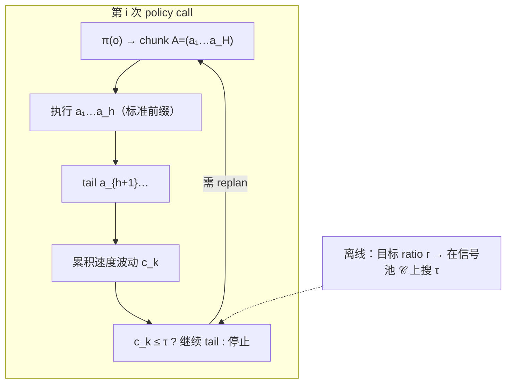
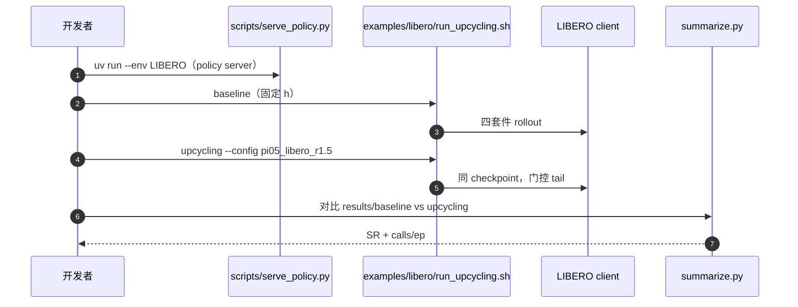

# Action Upcycling（arXiv:2609.34911）

**Action Upcycling**（*Don't Throw Away the Tail: Action Upcycling for Policy Acceleration*，成均馆大学 / KAIST，[arXiv:2609.34911](https://arxiv.org/abs/2609.34911)，[项目页](https://acupcycling.github.io/)）是 **训练-free、模型无关** 的 chunk 部署规则：在标准「只执行前缀 \(h\)、丢弃 tail」协议上，**继续执行 tail 中速度仍平滑的部分**，从而减少 **policy call** 而不改权重、不读 attention、不额外采样。

## 一句话定义

**被丢弃的 tail 在速度平稳时仍可信**——用 chunk 自身的速度波动当仪表，把 execution horizon 从固定时钟改成 **按 motion 自适应**。

## 英文缩写速查

| 缩写 | 英文全称 | 简要说明 |
|------|----------|----------|
| VLA | Vision-Language-Action | 视觉-语言-动作 chunk 策略 |
| WAM | World Action Model | 本文亦在 FastWAM 上验证 tail 复用 |
| RH | Receding Horizon | 滚动执行：前缀执行后 replan |
| LIBERO | Lifelong Benchmark for Robot Learning | 四套件仿真操作基准 |
| AAC | Adaptive Action Chunking | 多样本 disagreement 自适应 horizon（对照） |

## 为什么重要

- **新加速轴：** [VLA](../methods/vla.md) 部署优化多集中在 **单次 forward 更快**（蒸馏步数、FlashVLA 流式解码等）；本文减 **call 次数**，与之 **正交可叠加**（论文组合最高约 6.7×）。
- **相对 AutoHorizon / AAC：** [AutoHorizon](./paper-autohorizon.md) 读 **action self-attention**；AAC 需 **K=20 额外 chunk**，单 call 延迟可涨 6–7× 且 RoboTwin 上 call 反而增多；Upcycling **只读已采样 chunk**，**零额外前向延迟**。
- **跨架构：** π0.5、SmolVLA、GR00T N1.7、**FastWAM** 同一套标量 \(\tau\) 离线标定 — 支持「任何 chunked policy」叙事。
- **真机：** YAM 臂 π0.5 **72/80→77/80**，calls/ep **48.3→34.0**。

## 核心信息

| 项 | 内容 |
|----|------|
| **机构** | 成均馆大学（Sungkyunkwan University）、韩国科学技术院（KAIST） |
| **arXiv** | [2609.34911](https://arxiv.org/abs/2609.34911) |
| **项目页** | <https://acupcycling.github.io/> |
| **代码** | [star-kwon/action-upcycling](https://github.com/star-kwon/action-upcycling)（Apache-2.0） |
| **开源状态** | **已开源**（LIBERO 评测 + OpenPI 集成）；RoboTwin/真机脚本以论文为准 |

## 流程总览

## 核心原理

1. **速度：** 相对位移任务 \(v_k=a_k\)；绝对关节任务 \(v_k=a_k-a_{k-1}\)。
2. **波动：** \(c_k=\sum_{j=h+1}^{k}\|v_j-v_{j-1}\|_2\)（\(k>h\)），单调非降；平稳段小、决策边界附近升。
3. **执行长度：** \(h_{\mathrm{exec}}=\max\{k: c_k\le\tau\}\)；\(\tau=0\) 退化为 baseline，\(\tau=\infty\) 执行整 chunk。
4. **标定 \(\tau\)：** 从历史 chunk 的 tail 信号池选最小 \(\tau\) 使平均 \(\bar h/h\ge r\)；**每模型×基准一个标量**，无 per-task 在线调参。

## 源码运行时序图

节点对齐 [`sources/repos/action-upcycling.md`](../../sources/repos/action-upcycling.md) README。

## 工程实践

| 检查项 | 建议 |
|--------|------|
| 与 FlashVLA | 先减 call（Upcycling）再减 decode（[FlashVLA](./paper-flashvla.md)）— 论文验证可叠加 |
| \(\tau\) 标定 | 用 **同一 checkpoint** 的 rollout 信号池；勿混不同 \(h\) 协议 |
| OpenPI | 仓内为 OpenPI 端口；checkpoint 走 `gs://openpi-assets` 或等价路径 |
| WAM | FastWAM 无需改网络；仅改 **执行环** |
| 对照 baseline | 成功率与 **calls/ep** 同时报；单 call ms 不变时 wall time ∝ calls |

## 实验与评测读法

- **LIBERO：** 11 个 model×benchmark 单元格 **SR ≥ baseline**；π0.5 **96.9→97.9%**，calls **32.4→21.9**。
- **LIBERO-Plus：** π0.5 SR **+2.8 pt**，calls **1.61×** 减少 — OOD 扰动下 tail 仍可用。
- **RoboTwin 2.0：** SmolVLA SR **+12.6 pt**（34.8→47.4）— 固定短 \(h\) 可能过保守。
- **真机：** 长 horizon drawer 任务增益最大；短 pick-place 在已 100% 时 mainly **减 call**。

## 与其他工作对比

| 维度 | Action Upcycling | 对照 |
|------|-------------|------|
| 自适应 horizon 的信号 | 只读已采样 chunk 的 **速度波动** \(c_k\)，不读模型内部 | [AutoHorizon](./paper-autohorizon.md)：读 flow VLA 的 **action self-attention** 估计每 chunk 的 execution horizon |
| 加速轴 | 减 **policy call 次数**（执行更多 tail），单 call 延迟不变 | [FlashVLA](./paper-flashvla.md)：减 **单次解码延迟**（交错噪声缓冲 + chunk 级因果注意力），论文称二者可叠加 |
| 是否改权重 | 训练-free，仅改执行环；离线标定一个标量 \(\tau\) | [FlashVLA](./paper-flashvla.md)：需改动作专家的时间步条件与注意力掩码并做一次多缓冲微调 |
| 额外推理开销 | 零额外前向；AAC 对照需 K=20 额外 chunk（数值摘自论文） | [AutoHorizon](./paper-autohorizon.md)：几乎不增加推理开销，但仍每次 replan 做 full forward |

## 结论

**Action Upcycling 把「丢弃 tail」改成可审计的部署资源，是 chunked VLA/WAM 上低成本、可复现的 policy-call 加速层。**

1. **信号只来自动作 chunk** — 不绑定 π / GR00T / SmolVLA 内部结构，工程接入成本低于 attention 法。
2. **1.2–1.7× 减 call 且 SR 不降** — 11/11 仿真格 + 真机 π0.5 汇总支持「免费午餐」级 claim（在已发布 checkpoint 上）。
3. **与 AutoHorizon 互补** — 后者调 horizon 仍 **每步 full forward**；Upcycling 直接 **跳过 forward**；可讨论串联。
4. **\(\tau\) 离线、无在线适应** — 换任务分布需重新标定 \(r,\tau\)；非 magic constant-free。
5. **开源：** Apache-2.0 LIBERO 管线可复现 π0.5 主对比；扩展 RoboTwin 需自备环境。

## 局限与风险

- **仍依赖 chunk 质量：** tail 与 replan 相关性在 four policies 上高，但 **新 action 参数化 / 极短 H** 需重验证。
- **接触突变：** 速度波动门控在 **硬接触** 段应缩短执行；论文与 AutoHorizon 同轴 — 极端力控任务可能需更小 \(r\)。
- **标量 \(\tau\)：** 一模型一基准一个 \(\tau\)；跨套件迁移未主打。

## 关联页面

- [Action Chunking](../methods/action-chunking.md)
- [VLA](../methods/vla.md)
- [Receding Horizon 执行](../concepts/receding-horizon-policy-execution.md)
- [AutoHorizon](./paper-autohorizon.md)
- [FlashVLA](./paper-flashvla.md)
- [Manipulation](../tasks/manipulation.md)

## 参考来源

- [action_upcycling_arxiv_2609_34911.md](../../sources/papers/action_upcycling_arxiv_2609_34911.md)
- [acupcycling-github-io.md](../../sources/sites/acupcycling-github-io.md)
- [action-upcycling.md](../../sources/repos/action-upcycling.md)
- [arXiv:2609.34911](https://arxiv.org/abs/2609.34911)

## 推荐继续阅读

- [Action Upcycling 项目页](https://acupcycling.github.io/)
- [GitHub: star-kwon/action-upcycling](https://github.com/star-kwon/action-upcycling)
- [AutoHorizon 项目页](https://hatchetproject.github.io/autohorizon/)
