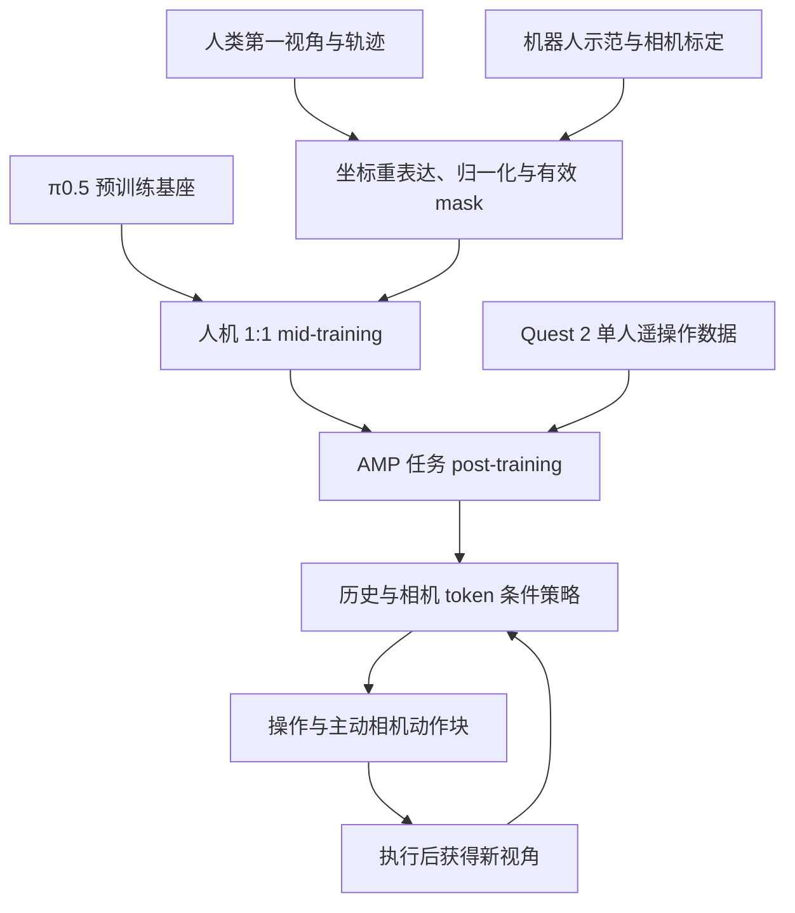
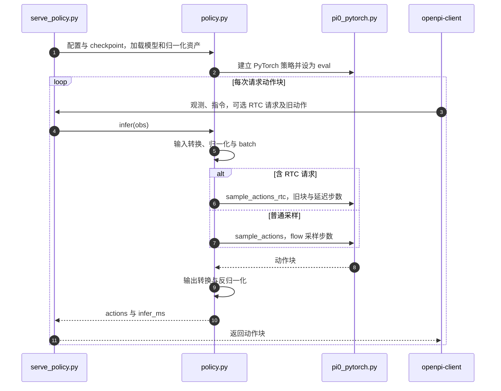

# ActiveScale: Scaling Active Perception for Robots across Model, Data, and Hardware（跨模型、数据与硬件扩展机器人主动感知）

**ActiveScale 让机器人一边操作、一边主动改变相机位置找目标：用历史画面与受相机位姿监督的 token，把“看哪里”纳入 VLA 动作学习。** 它不是给固定相机多装一个检测器，也不是仅凭视频生成未来画面的世界模型。

## 英文缩写速查

| 缩写 | 英文全称 | 简要说明 |
|---|---|---|
| VLA | Vision-Language-Action | 视觉、语言与机器人动作模型 |
| AMP | Active-perception Mobile-manipulation Platform | 本文三臂移动操作平台；不是对抗运动先验 AMP |
| SR | Success Rate | 全部阶段与最终状态均满足的成功率 |
| TP | Task Progress | 按已完成阶段权重计分的平均进度 |
| FOV | Field of View | 相机视场角 |
| RTC | Real-Time Chunking | 重叠执行与推理、衔接动作块 |
| EEF | End Effector | 操作臂末端执行器 |

## 为什么重要

目标藏在包内、抽屉里或桌下时，固定视角没有足够证据。ActiveScale 联合改模型、训练与采集硬件，将相机动作与操作一起学。与 [EXPO-FT](./paper-real-time-expo-ft.md) 正交：一个补观测信息，一个补执行时效。

## 核心信息

| 项目 | 核查结果 |
|---|---|
| 作者 | Shuai Zhou、Kaisheng Pang、Wenxuan Song、Wenjie Zhang、Xinhu Zheng、Haoang Li |
| 机构 | 卡内基梅隆大学机器人研究所；香港科技大学（广州） |
| 论文版本 | 2026-09-16 v1；2026-09-19 v2，本次按 v2 核查 |
| 基座 | [π0.5](./paper-pi05-open-world-vla.md)：VLM 语义上下文 + flow-matching 动作专家 |
| 硬件 | AgileX Cobot-Magic 双臂/底座，再加第三台 6-DoF Piper 臂携带前视 RGB 相机；两操作臂各有腕部 RGB 相机 |
| 官方资源 | [项目页](https://active-scale.github.io/) · [代码](https://github.com/ShuaiZhou302/ActiveScale) · [权重](https://huggingface.co/davidzhou302/ActiveScale) · [任务数据](https://modelscope.cn/datasets/shuai302/ActiveScale) |

## 方法：历史、位姿与动作怎样接起来

### 1）保留过去观测，不偷看未来帧

前视相机取 $t-48,t-32,t-16,t$ 四帧，再加当前腕部图像、语言与状态。每个前视视觉块后接 camera token；block-causal attention 只访问自身与之前的有效历史，后续上下文可访问有效历史块。历史不足时 mask，不拼别的 episode。

camera token 是可学习表示，不等于将实测位姿直接塞入每次推理。训练辅助头预测平移 3D、四元数 4D 与 FOV 2D，形成 9D 几何监督；动作推理不运行该头，但保留相机 token 与历史。

### 2）源码中的 32D，不是 32 个电机

论文的 23D 局部位姿/夹爪表示：左 EEF、右 EEF、主动相机各 xyz + xyzw 四元数（21D），再加两夹爪。底座 $(v,\omega)$ 另行记录。

公开实现统一为 32D 容器：前 23D 对应上述量，其余 9D 是 masked padding，不是额外关节。人类 pack 存头/左/右，loader 重排成模型左/右/头；各来源独立参考系和归一化。动作专家输出 H50 块；不能将相机轨迹或 padding 解释为自主底座导航。

### 3）中训与任务适配分工

论文约 1000 小时人机混合数据、1:1 采样，不是 1000 小时全来自 AMP。v2 列人类 EgoLive/[EgoVerse](./paper-egoverse.md)，机器人 AgiBot World/RoboCOIN/AMP；当前网页还列 EgoSuite，分别记录版本口径。

mid-training 有子任务、FAST、flow 与有效相机目标；post-training 保留 flow 与相机监督。缺失动作维度或几何标签必须 mask，不能监督成零。人类时间窗重锚到最早有效相机，机器人保留各自声明的参考系。

$$
\mathcal L_{\mathrm{cam}}=\mathcal L_{\mathrm{trans}}+\mathcal L_{\mathrm{rot}}+0.5\mathcal L_{\mathrm{fov}},\qquad
\mathcal L_{\mathrm{post}}=\mathcal L_{\mathrm{flow}}+0.2\mathcal L_{\mathrm{cam}}.
$$

三项是平移、四元数及 FOV 分量 L1 误差；后式是任务适配目标。移除辅助头不表示去掉相机动作，更不表示部署仍要提供几何标签。

## 流程总览

这是论文机制，不意味着公开 policy server 自带全部真机驱动；历史缓存、执行与新观测仍需集成。

## 源码运行时序图

按[官方代码快照](../../sources/repos/activescale.md)核查推理链；Client 是协议库，不是已验证的完整自主 AMP 部署器。

训练为 `scripts/train_activescale.sh` → `torchrun scripts/train_pytorch.py`。相机历史、动作坐标、限幅与急停属于客户端集成边界，不能把 WebSocket 返回值直接当电机命令。

## 实验与评测

Bag/Drawer/Table 测遮挡；Pot/Box 测搜索。每类 150 示范、每方法 20 rollouts（五类共 100 次）。SR 要求全阶段及最终条件成立，TP 保留阶段进度。

| 配置 | 平均 SR | 平均 TP | 比较范围 |
|---|---:|---:|---|
| π0.5 直接任务 post-training | 30.0% | 41.6% | 相同下游示范与评测协议 |
| 只加历史，post-training only | 37.0% | 项目页文字未给汇总值 | 部分任务不收益 |
| 历史 + pose token，post-training only | 62.0% | 67.7% | 固定架构下比较中训 |
| 完整 ActiveScale | 70.0% | 78.4% | 增加人机 mid-training |

30%→70% 是整套方案 +40 个百分点；62%→70% 才是同架构中训 +8 个百分点。不能将总提升归因于单一相机动作，也不支持任意平台均有相同收益。

RTX 4090、RTC、50 动作块的 264.5 Hz 是动作生成吞吐，执行为 **30 Hz**，不是每秒 264.5 次完整策略调用，更非伺服频率。采集 30 Hz 时，16 帧间隔约 0.53 秒，最早历史约 1.6 秒。

移动底座联动视频为单操作员遥操作；移动主动感知策略评测列作未来工作，不能冒充五任务自主 rollout 或自主导航证明。

## 结论

**增量是让历史与相机动作获得可学习几何约束，并提供数据、硬件与代码入口；复现仍需任务适配与严谨 IO。**

1. 固定视角因遮挡失败时，先诊断信息缺失再选主动相机链。
2. 分开对比 history、camera token 与 mid-training，避免单因果解释。
3. 接真机前验证动作布局、四元数、参考系、mask 与归一化资产。
4. 分别记录吞吐与执行频率，实测本机延迟与动作块衔接。
5. 本次仅核查源码及文件目录，未训练、下载大权重或真机实验。

## 工程实践与开放边界

2026-10-10 GitHub 实际有训练、推理、数据检查、RTC、Quest 2 遥操作与安装板 STEP；代码 Apache-2.0，Gemma 派生权重受 Gemma 条款约束，不能统一写成 Apache-2.0。

Hugging Face 六组 safetensors：midtraining/bag/drawer/pot/box/under（后者对应 Table/桌下）。五任务目录有 norm stats；公开目录未见 midtraining 配套 assets，服务此 checkpoint 前需按配置准备归一化资产，不保证只有权重就能启动。

ModelScope 公共 API 列出 backpack/drawer/pot/box/under_table 五任务目录；未核验完整 1000 小时语料、样本总数、全部下载与数据许可。外部数据仍按各自条款取得。旧 2026-09-17 待发布结论保留为历史说明，当前导航已更新。

先 `validate_activescale_data.py` schema 检查，再真实 loader smoke；schema 不能代替图像解码、形状和运动学检查。Quest 遥操作有离合、stale-input freeze、ramp-home/base-stop，但仍需物理急停、断电标定及低速试机。

## 与其他工作对比

| 对象 | 差异与选型 |
|---|---|
| [π0.5](./paper-pi05-open-world-vla.md) | 继承基座与动作专家；新增历史及受监督相机 token，不是完全独立基座 |
| [INSPECT](./paper-inspect-view-selection.md) | 问答/证据监督选视角；ActiveScale 用人机示范联合学相机与操作，不仅机器人自身数据 |
| [EgoVerse](./paper-egoverse.md) | 上游人类数据；不自动解决坐标/动作 mask/域对齐 |
| [EXPO-FT](./paper-real-time-expo-ft.md) | 时效与遮挡问题互补，不同协议不能横比 SR |
| 固定多相机 | ActiveScale 仍有三路相机；贡献是前视可独立运动及历史，并非只用一台相机 |

## 关联页面

- [VLA](../methods/vla.md)、[机器人操作](../tasks/manipulation.md) — 输入输出与任务。
- [π0.5](./paper-pi05-open-world-vla.md)、[INSPECT](./paper-inspect-view-selection.md)、[EXPO-FT](./paper-real-time-expo-ft.md) — 基座、选视角与执行。
- [EgoVerse](./paper-egoverse.md)、[感知栈选型](../queries/robot-perception-stack-selection-loop.md)、[9 篇技术地图](../overview/perception-action-transfer-9-papers-technology-map.md) — 数据与导航。

## 参考来源

- [论文 v2 核查](../../sources/papers/activescale_arxiv_2609_18514.md) — 机制与评测。
- [官方项目/数据/权重入口](../../sources/sites/activescale.md) — 当前资源与消融。
- [官方源码核查](../../sources/repos/activescale.md) — 调用链与集成边界。
- [初次收录公众号](../../sources/blogs/wechat_embodied_station_9_papers_perception_action_transfer_2026-09-17.md) — 历史溯源，非当前开源依据。

## 推荐继续阅读

- [论文 HTML v2](https://arxiv.org/html/2609.18514v2)
- [官方源码](https://github.com/ShuaiZhou302/ActiveScale) · [数据格式](https://github.com/ShuaiZhou302/ActiveScale/blob/main/docs/DATA_FORMAT.md)
