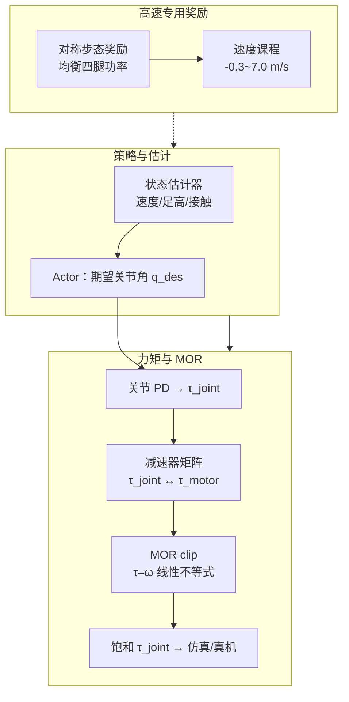

# 执行器约束 RL 高速四足奔跑（MOR）

**Actuator-Constrained Reinforcement Learning for High-Speed Quadrupedal Locomotion**（Shin / Song / Ji / Park，KAIST，arXiv [2312.17507](https://arxiv.org/abs/2312.17507)，2023）提出在强化学习训练阶段显式嵌入 **电机工作区（Motor Operating Region, MOR）** 约束：策略经 PD 得到关节力矩后，经 **减速器矩阵** 映射到电机空间，再按规格书 **τ–ω 线性不等式 clip**，避免仿真学到真机不可实现的力矩指令；并设计 **对称步态奖励** 与 **局部球面轻量化足端**，在 **KAIST Hound**（45 kg）跑步机上实现 **6.5 m/s** 持续奔跑。

## 一句话定义

**把电机扭矩–转速包络当作训练期硬约束写进仿真闭环，让策略在高速段主动留在可执行工作区内，而不是事后靠域随机化或 ActuatorNet 去补仿真「超功率」轨迹。**

## 英文缩写速查

| 缩写 | 英文全称 | 简要说明 |
|------|----------|----------|
| MOR | Motor Operating Region | 电机扭矩–角速度可行工作区（规格书梯形包络） |
| RL | Reinforcement Learning | 本文用 PPO 类框架训高速奔跑策略 |
| Sim2Real | Simulation to Real | 约束使高速段仿真–现实 reward gap 不再单调恶化 |
| PD | Proportional–Derivative | 策略输出期望关节角，底层 PD 转为关节力矩 |
| CoT | Cost of Transport | 运输成本；6.5 m/s 时约 0.29 |
| HFE | Hip Flexion/Extension | 髋屈伸关节；与 KFE 并联传动 |
| KFE | Knee Flexion/Extension | 膝屈伸关节 |
| BLDC | Brushless DC | 无刷直流电机；MOR 建模对象 |
| DR | Domain Randomization | 本文仍用质量/惯量/CoM 等 DR，但执行器约束是核心增量 |

## 为什么重要

- **「约束即 sim2real 层」的早期四足实证：** 与 [MUJICA](./paper-mujica-wheel-legged-multi-skill.md)（轮足 P3O 包络约束）同族，但在 **纯电驱四足高速奔跑** 上给出完整消融：无 MOR 训练的策略仿真可达 6.5 m/s，**5 m/s 实机摔倒**。
- **执行器建模不止 ActuatorNet：** 相对 [Actuator Network](../methods/actuator-network.md) 的数据驱动拟合，本文用 **规格书 + 减速器运动学** 即可显著缩小高速 gap——适合已有电机 datasheet 的自研平台。
- **并联腿传动细节：** HOUND 并行 HFE/KFE 的 **gearbox 矩阵** 说明 URDF 矩形力矩限与电机 MOR 不可混用；与 [并联关节解算](../concepts/humanoid-parallel-joint-kinematics.md) 同一类问题。
- **同平台技术谱系：** 同团队后续 [APT-RL](./paper-apt-rl-agile-perceptive-quadruped-locomotion.md) 在 HOUND 上扩展感知多技能；本篇是 **高速平地 / 跑步机** 阶段的执行器对齐基石。

## 流程总览

## 核心机制（提炼）

| 模块 | 作用 | 备注 |
|------|------|------|
| **MOR 建模** | DC 电机准静态 $V_{\text{bus}}$ 界 + **τ_peak** 磁饱和 | 含再生制动象限更宽包络 |
| **Gearbox 矩阵** | 并联 HFE/KFE 叠加原理（式 3、10） | 关节空间矩形限 ≠ 电机 MOR |
| **训练期饱和** | 违规 $\tau_{motor}$ clip 后再映回关节 | 减少不可行状态转移 |
| **i–τ 补偿** | 铁芯电机高扭矩二次拟合 | 仿真力矩 ↔ 真机电流 |
| **步态奖励** | 对角支撑模式（RR+FL 或 RL+FR） | 无此项最高 **6.0 m/s** |
| **轻量化足端** | 圆柱 → 局部球面 | 小腿质量约 **38%**、俯仰惯量约 **37.4%** |
| **并发训练栈** | 基于 Ji et al. RA-L 2022 估计器+Actor | RaiSim；400 env；~6 h |

## 实验与评测

- **仿真：** 无 MOR 训练 + MOR 评估时，**>4 m/s** 起平均 reward 下降；与去掉接触相关项的指标趋势一致。
- **跑步机消融（Table II）：** 完整方法 **6.5 m/s**；无步态奖 **6.0**、无定制足 **5.5**、无 MOR **4.5**；**7 m/s** 失败（被跑步机推落）。
- **Sim2real gap：** 有 MOR 训练的策略，**>3.5 m/s** 后 $\Delta reward_{sim-to-real}$ 不再恶化；无 MOR 策略持续恶化并于 **5 m/s 摔倒**。
- **户外：** 塑胶跑道 **100 m / 19.87 s**；9 次全程无摔（略低于跑步机峰值，作者归因跑道柔软度）。

## 与相邻工作对比

| 维度 | 本文（MOR 约束 RL） | ActuatorNet (Hwangbo 2019) | MUJICA (2026) | APT-RL (2026) |
|------|---------------------|----------------------------|---------------|---------------|
| 约束来源 | 规格书 τ–ω + 减速器 | 真机数据 MLP | DC 包络进 P3O | TO+TVAE 力矩先验 |
| 平台 | KAIST Hound | ANYmal | Unitree Go2-W | KAIST HOUND |
| 任务 | **高速平地跑** | 敏捷动态技能 | 轮足攀爬 | 感知野外多技能 |
| 峰值速度 | **6.5 m/s** | — | — | **6 m/s**（楼梯段） |
| 开源 | **无** | 有参考实现 | 待查 | Zenodo 数据 only |

## 局限与风险

- **代码与项目页：** 截至入库日 **arXiv 未列 GitHub 或项目页**；完整 RaiSim + 并发估计器栈 **不可直接复现**。
- **平台专用：** 减速器矩阵与 HOUND 并联腿绑定；迁移至 Unitree/ANYmal 需重推运动学映射与 MOR 参数。
- **任务窄：** 侧重 **高速直线/跑步机**；无感知地形、无多步态切换（同团队 APT-RL 补足）。
- **MOR 简化：** 准静态 DC 模型忽略电感动态；温升与 **τ_peak** 为推荐值而非硬物理极限。
- **仿真器：** 基于 **RaiSim** 硬接触；与 Isaac Gym 栈团队需重做接触与 PD 接口。

## 工程实践

- **可借鉴：** 在现有 legged RL 栈中，于 **PD 输出后、写入仿真前** 插入「关节→电机→MOR clip→关节」三环；用电机 datasheet 即可，无需先采 ActuatorNet。
- **高速 checklist：** 并联腿先校验 **gearbox 矩阵**；加 **对称步态/功率均衡** 奖励防单电机饱和；评估足端惯量是否值得为全球形足买单。
- **与 DR 关系：** 质量/惯量/CoM DR 仍需要；MOR 解决的是 **高速段执行器饱和** 这一独立 gap 分量。

## 参考来源

- [执行器约束 RL 论文归档](../../sources/papers/actuator_constrained_rl_high_speed_quadruped_arxiv_2312_17507.md)
- Shin et al., *Actuator-Constrained Reinforcement Learning for High-Speed Quadrupedal Locomotion*, [arXiv:2312.17507](https://arxiv.org/abs/2312.17507)

## 关联页面

- [Sim2Real](../concepts/sim2real.md)
- [Locomotion 任务页](../tasks/locomotion.md)
- [APT-RL（同 HOUND 平台后续）](./paper-apt-rl-agile-perceptive-quadruped-locomotion.md)
- [四足机器人](./quadruped-robot.md)
- [Implicit / Explicit 执行器建模](../concepts/implicit-explicit-actuator-modeling.md)
- [Sim2Real Gap 缩减实战](../queries/sim2real-gap-reduction.md)
- [Actuator Network](../methods/actuator-network.md)
- [执行器驱动链选型闭环知识链](../queries/actuator-drive-chain-selection-loop.md) — 执行器约束 RL 把③层执行器能力边界直接写进策略训练

## 推荐继续阅读

- [arXiv HTML 全文](https://arxiv.org/html/2312.17507v1)
- [KAIST HOUND 机体设计（ICRA 2022）](https://ieeexplore.ieee.org/document/9811755) — 齿轮箱 MINLP 与平台背景
- [APT-RL 项目页](https://skillquadsr.github.io/) — 同平台感知多技能延伸
