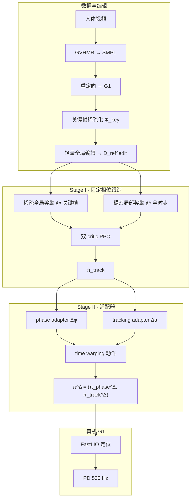
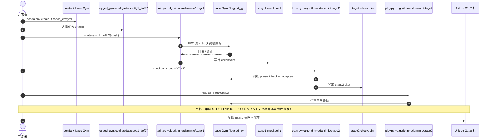

# AdaMimic：单条参考运动上的自适应全身跟踪

**AdaMimic**（*Towards Adaptable Humanoid Control via Adaptive Motion Tracking*，[arXiv:2510.14454](https://arxiv.org/abs/2510.14454)，[项目页](https://taohuang13.github.io/adamimic.github.io/)，[代码](https://github.com/InternRobotics/AdaMimic)）由 **上海人工智能实验室** 与 **上海交通大学** 提出：从 **单条** 人体参考运动出发，用关键帧稀疏化与轻量全局编辑构造适应集，再以 **两阶段强化学习**（固定相位双 critic 跟踪 → phase/tracking 双适配器 time warping）在 **Unitree G1** 上同时获得 **模仿精度** 与 **测试时适应** 能力。

## 一句话定义

**把单 clip 变成「稀疏关键帧 + 可编辑全局位移」的增强参考集，先学固定相位跟踪，再用相位与动作双适配器做 time warping——无需额外目标轨迹即可在跳远/击球等任务上适应距离、高度与落点变化。**

## 英文缩写速查

| 缩写 | 英文全称 | 简要说明 |
|------|----------|----------|
| AdaMimic | Adaptive Motion Tracking | 本文框架：关键帧编辑 + 两阶段自适应跟踪 |
| RL | Reinforcement Learning | Isaac Gym 中 PPO 训练跟踪与适配器 |
| PPO | Proximal Policy Optimization | 策略优化算法（rsl_rl） |
| GVHMR | Gravity-View Human Motion Recovery | 从单目视频恢复 SMPL 运动 |
| WBC | Whole-Body Control | 全身协调控制语境 |
| G1 | Unitree G1 Humanoid | 29 DoF 真机平台；部署时锁定腰 roll/pitch |
| Sim2Real | Simulation to Real | 仿真训练后 FastLIO 定位直部署真机 |

## 为什么重要

- **折中 motion prior 与 motion tracking：** AMP 类方法适应广但模仿糙；DeepMimic 类精度高但需多 clip 或测试时完整参考。AdaMimic 用 **单 clip + 关键帧编辑** 覆盖 easy/hard 适应区间。
- **Time warping 可解释：** Stage II 的 phase adapter 调节 \(\Delta\phi\)，tracking adapter 补偿低层动作；相对规则轨迹插值（DeepMimic-Adapt）在 hard 适应与真机稳定性上更稳。
- **工程可复现：** [InternRobotics/AdaMimic](https://github.com/InternRobotics/AdaMimic) 提供 stage1/stage2 训练与 play 脚本及多任务 `g1_dof27` 配置；[AdaPT](./paper-adapt.md) 等后续工作将发球残差跟踪建立在 AdaMimic 式速度自适应之上。

## 核心信息

| 项 | 内容 |
|----|------|
| **机构** | 上海人工智能实验室（Shanghai AI Lab）；上海交通大学（SJTU） |
| **会议** | IEEE **ICRA 2026**（**Oral**） |
| **平台** | Unitree G1，**29 DoF**；真机 **锁定腰部 roll/pitch** |
| **控制频率** | 策略 50 Hz；底层 PD 500 Hz；FastLIO 里程计 10 Hz |
| **仿真** | Isaac Gym，4096 并行环境，PPO，3 层 MLP |
| **开源** | **已开源**（CC BY-NC-SA 4.0，**禁止商业使用**）— [InternRobotics/AdaMimic](https://github.com/InternRobotics/AdaMimic) |

## 核心原理

### 方法栈

| 模块 | 角色 |
|------|------|
| **Motion processing** | 视频 → GVHMR → 重定向；抽语义关键帧 \(\Phi^{\mathrm{key}}\)；子集 \(\Phi^{\mathrm{edit}}\) 轻量编辑全局位姿（局部关节路径不变） |
| **Stage I \(\pi_{\mathrm{track}}\)** | 固定 \(\Delta\phi\)；**稀疏全局**奖励（仅关键帧相位）+ **稠密局部**奖励；**双 critic** \(V^{\mathrm{sparse}}, V^{\mathrm{dense}}\) |
| **Stage II adapters** | \(\pi_{\mathrm{phase}}^{\Delta}\) 输出 \(\Delta\phi^{\Delta}\)；\(\pi_{\mathrm{track}}^{\Delta}\) 残差补偿动作；冻结 Stage I 权重 |
| **部署** | 5 步观测历史；LiDAR 里程计全局定位；PD 配置参考 BeyondMimic 思路提升真机平滑与安全 |

### 流程总览

## 源码运行时序图

官方仓库 [InternRobotics/AdaMimic](https://github.com/InternRobotics/AdaMimic)（归档见 [sources/repos/adamimic.md](../../sources/repos/adamimic.md)）：

- **最短复现路径：** 安装 Isaac Gym → `conda activate adamimic` → stage1 `train.py` → stage2 `train.py checkpoint_path=...` → `play.py resume_path=...`。
- **基线对照：** 同入口 `+algorithm=${baseline}`（DeepMimic、AMP 等配置在 `configs/algorithm/`）。

## 实验与评测

### 任务与适应区间（Table I 摘要）

| 任务 | 原始示范 | 仿真 hard 适应示例 | 真机 hard 测试示例 |
|------|----------|-------------------|-------------------|
| 远跳 | 1.1 m | 0.2–0.7 m 与 1.6+ m 区间 | 1.2 m / 0.4 m |
| 跳高 | 0.2 m | 0.05–0.1 m 与 0.35–0.6 m | 0.3 m / 0.4 m |
| 三级跳 | 2.4 m | 1.2–1.65 m 与 3.15–4.2 m | 1.5 m / 3.3 m |
| 网球击球 | 1.0 m 位移 | 1.2–1.7 m | 1.4 m / 1.6 m |
| 羽毛球击球 | 1.3 m | 1.9–2.5 m | 1.9 m / 2.2 m |

### 仿真主结果（Table III，overall）

| 方法 | Success ↑ | 局部误差 \(E_{\mathrm{l-bpe}}^{\mathrm{dense}}\) ↓ | 全局稀疏误差 \(E_{\mathrm{g-bpe}}^{\mathrm{sparse}}\) ↓ |
|------|-----------|---------------------------------------------------|----------------------------------------------------------|
| AMP-Style | 82.7% | 44.5 mm | 229.8 mm |
| DeepMimic-Adapt | 85.1% | 33.3 mm | 133.5 mm |
| AdaMimic-Stage1 | 85.7% | 43.4 mm | 200.4 mm |
| **AdaMimic** | **86.8%** | **30.3 mm** | **94.8 mm** |

### 真机要点（Table IV）

- **Hard 适应：** 跳高 AdaMimic **5/6** vs DeepMimic-Adapt **0/6**；远跳 **5/6** vs **3/6**；网球/羽毛球 hard **6/6**。
- **读法：** Stage1 在 easy 场景已强，但 hard 适应与落地稳定性依赖 Stage II adapters；规则编辑轨迹在真机易出现物理不可信中间帧（Fig. 7）。

## 工程实践

| 项 | 建议 |
|----|------|
| 环境 | `conda env create -f conda_env.yml`；**手动安装 Isaac Gym**（非 pip 一键） |
| 训练顺序 | **必须先 stage1 再 stage2**；stage2 需 `checkpoint_path` 指向 stage1 |
| 任务选择 | `legged_gym/legged_gym/configs/dataset/g1_dof27/` 列表中选 `${task}` |
| 许可 | **CC BY-NC-SA 4.0** — 商业场景需另行授权 |
| 真机 | 锁腰 roll/pitch；5 步历史；FastLIO 全局定位；PD 增益参考论文硬件配置 |
| 扩展 | 关键帧 \(\Phi^{\mathrm{key}}\) 与编辑函数 \(f_{\mathrm{edit}}\) 目前 **任务相关**，新技能需自定义语义关键帧 |

## 与其他工作对比

| 对照 | 差异读法 |
|------|----------|
| [AMP reward](../methods/amp-reward.md) / AMP-Style | 运动作风格先验 + 稀疏关键帧任务奖励；模仿精度与平滑度仍弱于 AdaMimic |
| DeepMimic-Adapt | 规则轨迹编辑中间帧；hard 适应真机易失败（尤其跳高） |
| [BeyondMimic](../methods/beyondmimic.md) | 高动态跟踪 + 扩散蒸馏；AdaMimic 侧重 **单 clip 适应** 与 time warping |
| [AdaPT](./paper-adapt.md) | 网球规划–跟踪；发球支路采用 AdaMimic 式残差跟踪 |
| [YAHMP](./paper-yahmp.md) | 大规模 GMT 设计消融试验台；AdaMimic 是 **单动作适应** 范式 |
| UniTracker 等大数据跟踪 | 需大规模库与测试时目标；AdaMimic 单 clip 即可 specialization |

## 局限与风险

- **任务定制关键帧：** \(\Phi^{\mathrm{key}}\) 与 \(f_{\mathrm{edit}}\) 需按跳远/击球等手工定义，泛化到新任务非自动。
- **许可限制：** CC BY-NC-SA 禁止商业使用。
- **依赖 Isaac Gym：** 栈较旧（legged_gym 系），迁移到 Isaac Lab / mjlab 需自行适配。
- **全局定位：** 真机依赖 FastLIO；无准确里程计时论文仅报成功率、局部误差与平滑度。
- **与大数据跟踪分工：** 若目标是任意 MoCap 库上的 generalist GMT，应看 SONIC / BeyondMimic / YAHMP；AdaMimic 适合 **「一条示范 → 多条件适应」** 的 agile skill。

## 结论

**单条参考运动 + 关键帧编辑 + 两阶段 time warping，是在模仿精度与测试时适应之间更可落地的折中——尤其 hard 适应真机场景。**

1. **单 clip 可行** — 稀疏关键帧 + RL 中间帧比纯规则编辑更物理可信，避免 DeepMimic-Adapt 式 hard 失败。
2. **Stage II 适配器是 hard 适应关键** — 固定相位 Stage1 在 hard 全局误差大；phase + tracking adapters 将仿真全局稀疏误差降至约 **95 mm**（vs Stage1 **200 mm**）。
3. **双 critic 稀疏/稠密分离** — 全局只在关键帧对齐，局部全时步保风格；优于 AMP 类弱约束。
4. **真机可直部署** — G1 上多任务 hard 适应成功率优于基线；跳高等极端 hard 场景优势最明显。
5. **开源可跑** — stage1/stage2 train + play 齐全；注意 NC 许可与 Isaac Gym 依赖。
6. **后续谱系** — [AdaPT](./paper-adapt.md) 将类似速度/残差思想用于网球发球跟踪。

## 关联页面

- [BeyondMimic](../methods/beyondmimic.md) — 高动态跟踪与真机 PD 参考
- [AMP reward](../methods/amp-reward.md) — 运动先验对照
- [AdaPT](./paper-adapt.md) — 网球自适应规划–跟踪（引用 AdaMimic 发球跟踪）
- [YAHMP](./paper-yahmp.md) — G1 GMT 消融试验台
- [Extreme-RGMT](./paper-extreme-rgmt.md) — 高动态 generalist 持续学习对照
- [Unitree G1](./unitree-g1.md) — 硬件平台
- [人形 RL 身体系统栈](../overview/humanoid-rl-motion-control-body-system-stack.md)
- [Paper Notebooks · Loco-Manipulation and WBC](../overview/paper-notebook-category-04-loco-manipulation-and-wbc.md)
- [paper-notebook-adamimic](./paper-notebook-adamimic.md) — Paper Notebooks 短名索引
- [paper-notebook-towards-adaptable-humanoid-control-via-adaptive](./paper-notebook-towards-adaptable-humanoid-control-via-adaptive.md) — 题名级重复索引

## 参考来源

- [adamimic_arxiv_2510_14454.md](../../sources/papers/adamimic_arxiv_2510_14454.md) — 论文摘录与开源核查
- [adamimic-github-io.md](../../sources/sites/adamimic-github-io.md) — 项目页归档
- [adamimic.md](../../sources/repos/adamimic.md) — GitHub 仓库归档
- [humanoid_pnb_adamimic.md](../../sources/papers/humanoid_pnb_adamimic.md) — Paper Notebooks 进度锚点
- [arXiv:2510.14454](https://arxiv.org/abs/2510.14454) — 原文

## 推荐继续阅读

- [AdaMimic 项目页（视频与 BibTeX）](https://taohuang13.github.io/adamimic.github.io/)
- [InternRobotics/AdaMimic](https://github.com/InternRobotics/AdaMimic)
- [YouTube 演示](https://www.youtube.com/watch?v=OGDoPvs7GS0)
- [AdaPT 项目页](https://humanoidtennis.github.io/AdaPT/) — 后续网球自适应工作
