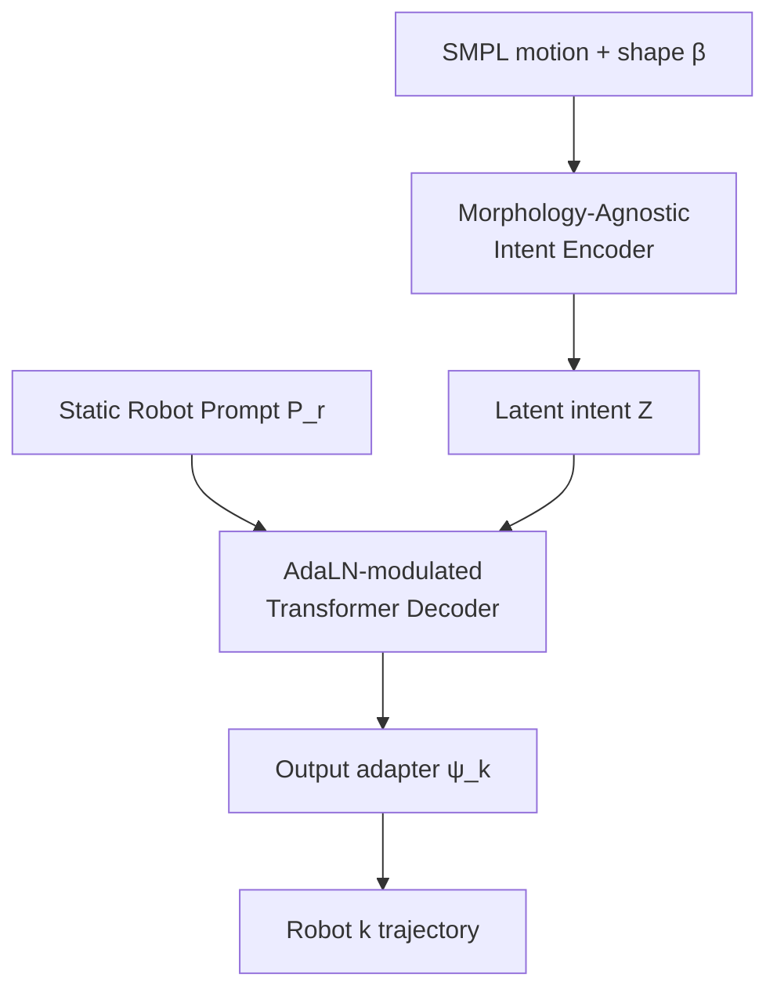

# AdaMorph

**AdaMorph**（*AdaMorph: Unified Motion Retargeting via Embodiment-Aware Adaptive Transformers*，arXiv:[2601.07284](https://arxiv.org/abs/2601.07284)）提出 **统一神经重定向大模型**：把重定向视为 **条件生成**——人类 motion 先进入 **形态无关 intent latent**，再经 **Learnable Robot Prompt + AdaLN** 调制解码器，输出目标机器人的 base-frame 速度与关节轨迹；12 种人形联合训练，对未见复杂动作仍具零样本能力。

> **同名消歧：** 本页是 **AdaMorph（2601.07284，Transformer 统一重定向）**。勿与 [UMR](./paper-umr-unified-motion-retargeting.md)（表面点云稠密对应）或 PALUM（2601.07272）混页。

## 一句话定义

**单一 Transformer 将人类 SMPL 动作解码为任意目标人形的 physically-grounded 关节轨迹，通过 intent 空间与 AdaLN 形态调制解耦「动作语义」与「embodiment 执行」。**

## 英文缩写速查

| 缩写 | 英文全称 | 简要说明 |
|------|----------|----------|
| AdaLN | Adaptive Layer Normalization | 用 robot prompt 全局调制 decoder 归一化 |
| SMPL | Skinned Multi-Person Linear Model | 人类 motion / shape 源 |
| SO(3) | Special Orthogonal Group 3 | 旋转流形；积分后 Gram-Schmidt 投影 |
| IK | Inverse Kinematics | 传统 per-robot 优化对照 |
| GMR | General Motion Retargeting | 工程 IK 基线（YanjieZe/GMR，非 Disney GMR） |

## 为什么重要

- **统一模型 vs per-embodiment 训练：** 深蓝长文将其列为「统一大模型」前沿；相对为每种机器人单独训 net，更易 exploit 共享 motion semantics。
- **零样本到新动作风格：** 论文展示未见 ethnic dance 仍保留节奏与 dynamic essence——对 data flywheel 中「少示范、多机种」有选型意义。
- **物理表征：** base-frame velocity + 可微积分损失，缓解 neural retarget 常见 global drift。

## 核心原理

| 模块 | 要点 |
|------|------|
| Canonical features | root v, ω, projected gravity, 6D joint rotations |
| Dynamic Human Prompt | MLP(β) → soft tokens 前缀 encoder |
| Static Robot Prompt | 每 embodiment 16 learnable tokens；t-SNE 按拓扑聚类 |
| AdaLN | γ, b 由 prompt MLP 产生；零初始化保证训练初期共享 decoder |
| Output adapter | 轻量 MLP 映射到 9+N_k 维 |

## 工程实践

| 项 | 说明 |
|----|------|
| 数据 | 12 humanoid robots；30 Hz；窗口 W=60 |
| 损失 | 重建 + orientation/trajectory consistency（课程） |
| 下游 | 输出 reference → RL tracking（与 [BeyondMimic](../methods/beyondmimic.md) / [DeepMimic](../methods/deepmimic.md) 管线衔接） |
| 部署前 | 仍需 sim 碰撞/足地校验；与 [OmniRetarget](./paper-hrl-stack-03-omniretarget.md) 的 interaction mesh 互补 |

## 局限与风险

- **代码未开源（2026-09-07）：** arXiv 无 project/code 链；复现门槛高。
- **训练算力：** 12 机种联合 Transformer 成本高于单 IK 工具链 [GMR](../methods/motion-retargeting-gmr.md)。
- **交互场景：** 原生不显式建模人-物-地形 interaction mesh；loco-manipulation 需后端 refinement。
- **与 UMR 勿混：** 点云对应 UMR 走 dense correspondence；AdaMorph 走 latent generative conditioning。

## 源码运行时序图

**不适用**（截至 2026-09-07 无可运行官方仓库）。

## 结论

**AdaMorph 用 intent–execution 解耦 + AdaLN 把「一个模型服务多拓扑人形」从口号落到 12 机种联合训练与零样本舞蹈泛化，是深度学习统一重定向路线的 2026 代表之一。**

1. **条件生成范式** — 先抽 morphology-agnostic intent，再按 robot prompt 解码，避免简单 concat embodiment ID。
2. **AdaLN 而非 concat** — 全局调制 generative dynamics，比输入拼接更适配 kinematic disparity。
3. **物理友好表征** — base-frame velocity + 积分一致性，减轻 absolute position drift。
4. **零样本到 unseen motion** — stylized dance 实验支持「语义泛化」而非 memorization。
5. **工程缺口** — 无官方 code；复杂交互任务仍需 OmniRetarget / DynaRetarget 类后端。

## 参考来源

- [AdaMorph arXiv 摘录](../../sources/papers/adamorph_arxiv_2601_07284.md)
- [深蓝运动重定向三路综述（公众号）](../../sources/blogs/wechat_shenlan_motion_retargeting_three_routes_2026-09-07.md)

## 关联页面

- [MoReFlow](./paper-moreflow-motion-retargeting-flow.md)
- [UMR（消歧对照）](./paper-umr-unified-motion-retargeting.md)
- [Motion Retargeting](../concepts/motion-retargeting.md)
- [三路技术地图 Query](../queries/motion-retargeting-three-routes-landscape.md)

## 推荐继续阅读

- <https://arxiv.org/abs/2601.07284>
