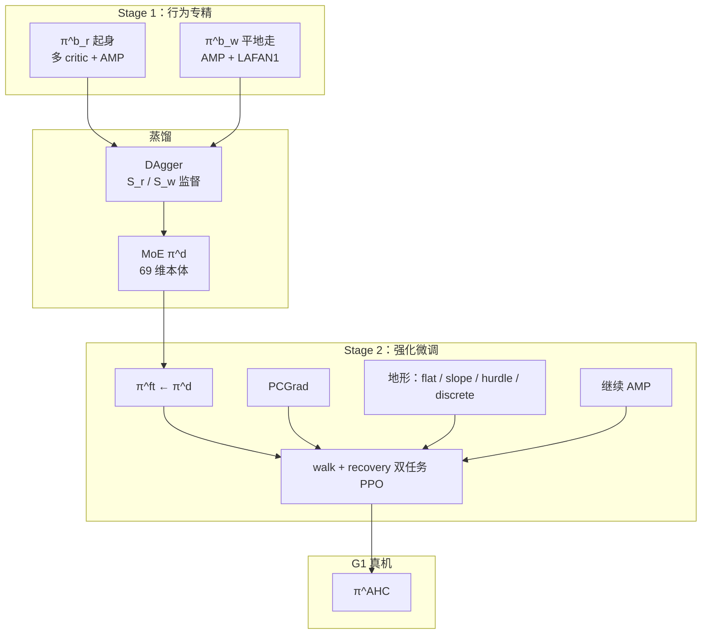

# AHC：多行为蒸馏与强化微调的自适应人形控制

**AHC**（*Towards Adaptive Humanoid Control via Multi-Behavior Distillation and Reinforced Fine-Tuning*，arXiv:2511.06371，**AAAI 2026 Oral**）在 [42 篇 RL 身体系统栈](https://mp.weixin.qq.com/s/hz9JXtJeUPRfUGzfD-pZuA) 为 **21/42**（02 参考跟踪 · 通用控制），在 [AMP 专题](https://mp.weixin.qq.com/s/YZsm3855iP3TNTTt1aou7w) 为 **11/19**（**03 多技能与自适应**）。核心：**先把走/起身专精策略（均含 AMP）压进统一身体，再强化微调适应地形**。

## 一句话定义

**两阶段管线：行为专精策略 π^b_r（起身）与 π^b_w（平地走）各含 AMP → DAgger + MoE 蒸馏为统一 π^d → 多任务 PPO 微调（双 critic + PCGrad + 地形课程）得地形自适应 π^AHC，在 G1 真机验证跌倒后续走与复杂地形。**

## 英文缩写速查

| 缩写 | 英文全称 | 简要说明 |
|------|----------|----------|
| AHC | Adaptive Humanoid Control | 多行为蒸馏与强化微调框架 |
| AMP | Adversarial Motion Prior | 各行为专精阶段的风格正则 |
| MoE | Mixture-of-Experts | 蒸馏阶段专家混合结构 |
| PCGrad | Projecting Conflicting Gradients | 多任务梯度冲突消解 |
| DAgger | Dataset Aggregation | 蒸馏模仿专家策略 |
| G1 | Unitree G1 Humanoid | 50 Hz 策略 / 500 Hz PD 真机平台 |

## 为什么重要

- **多行为必先「压进一个身体」：** 策展强调 AMP 是 **各专精阶段** 的风格项，而非事后给单技能打补丁；与 [SD-AMP #10](./paper-amp-survey-10-unified_walking_running_and_recovery.md)（训练期门控单策略）、[HAML #12](./paper-amp-survey-12-haml.md)（条件 AMP teacher）并列多技能路线。
- **蒸馏不够、还需 RL 微调：** $\pi^d$ 在 hurdle/discrete 仅 **0.756 / 0.702** 成功率；$\pi^{\mathrm{AHC}}$ 达 **0.922 / 0.969**——说明 **地形自适应** 需第二阶段强化而非纯 BC。
- **PCGrad 实用价值：** walk / recovery **共享 actor、分行为 critic** 并行 PPO 时，PCGrad 缓解梯度冲突。
- **真机：** 跌倒起身续走、楼梯/坡地/障碍；相对 [HoST](./paper-host-humanoid-standingup.md) 关节加速度更平滑（AMP 引导自然起身）。

## 流程总览

## 核心机制（归纳）

### 1）Stage 1 — 行为专精

- **π^b_r：** 俯卧/仰卧起身；多 critic + AMP（起身 MoCap）；~10k iter。
- **π^b_w：** 速度跟踪平地走 + AMP（[LAFAN1](./lafan1-dataset.md)）；~10k iter。

### 2）蒸馏 — π^d

- **MoE** 结构；输入仅 **69 维本体**（无特权）。
- 按状态空间 $\mathcal{S}_r/\mathcal{S}_w$ 监督专家动作；~4k iter。
- 蒸馏后已能 **近跌倒恢复 + 更自然站立过渡**。

### 3）Stage 2 — 强化微调

- 初始化 $\pi^{ft}\leftarrow\pi^d$；walk / recovery **双 GPU** 并行 PPO。
- **共享 actor、分行为 critic**；**PCGrad**；地形课程 + **继续 AMP**。

## 常见误区

1. **蒸馏一次即终点：** Table 1 显示 $\pi^d$ 在 hurdle/discrete **显著弱于** $\pi^{\mathrm{AHC}}$——第二阶段不可省。
2. **AMP 只在 Stage 1：** Stage 2 **继续 AMP** 保人形性；不是「微调时扔掉先验」。
3. **与 SD-AMP 重复：** SD-AMP **单策略端到端** 门控双判别器；AHC **专精→蒸馏→微调** 三阶段，覆盖 **坡地/障碍** 等地形自适应。
4. **独立走策略够强：** $\pi^b_w$ 在坡地成功率 **0.000**——专精策略 **不具地形泛化**，需 AHC 微调。

## 实验与评测

| 设置 | AHC | π^d | π^b_w（坡地） |
|------|-----|-----|----------------|
| hurdle 成功率 | **0.922** | 0.756 | — |
| discrete 成功率 | **0.969** | 0.702 | — |
| 坡地 | 通过 | 弱 | **0.000** |
| recovery discrete | **0.969** | — | HoST **0.843** |

- **真机：** 跌倒后续走、复杂地形；平滑度 vs HoST。

## 与其他页面的关系

- 多技能姊妹：[SD-AMP #10](./paper-amp-survey-10-unified_walking_running_and_recovery.md)、[HAML #12](./paper-amp-survey-12-haml.md)、[MoRE #08](./paper-amp-survey-08-more.md)
- 起身对照：[HoST](./paper-host-humanoid-standingup.md)
- 任务：[balance-recovery.md](../tasks/balance-recovery.md)、[locomotion.md](../tasks/locomotion.md)
- AMP 专题：[humanoid-amp-motion-prior-survey.md](../overview/humanoid-amp-motion-prior-survey.md)（#11/19）

## 参考来源

- [AHC（arXiv:2511.06371）](../../sources/papers/adaptive_humanoid_control_ahc_arxiv_2511_06371.md)
- [humanoid_rl_stack_21_towards_adaptive_humanoid_control_via_multi_beha.md](../../sources/papers/humanoid_rl_stack_21_towards_adaptive_humanoid_control_via_multi_beha.md)
- [humanoid_amp_survey_11_towards_adaptive_humanoid_control_via_multi_beha.md](../../sources/papers/humanoid_amp_survey_11_towards_adaptive_humanoid_control_via_multi_beha.md)
- [humanoid_amp_survey_19_catalog.md](../../sources/papers/humanoid_amp_survey_19_catalog.md)
- [wechat_embodied_ai_lab_humanoid_rl_motion_survey.md](../../sources/blogs/wechat_embodied_ai_lab_humanoid_rl_motion_survey.md)
- [wechat_embodied_ai_lab_humanoid_amp_motion_prior_survey.md](../../sources/blogs/wechat_embodied_ai_lab_humanoid_amp_motion_prior_survey.md)

## 推荐继续阅读

- [AHC 项目页](https://ahc-humanoid.github.io) — 视频与 BibTeX
- [arXiv:2511.06371](https://arxiv.org/abs/2511.06371) — AAAI 2026 Oral 正文
- [AMP 专题长文（微信公众号）](https://mp.weixin.qq.com/s/YZsm3855iP3TNTTt1aou7w)
- [SD-AMP 深读页](./paper-unified-walk-run-recovery-sdamp.md) — 另一路统一走跑起身
