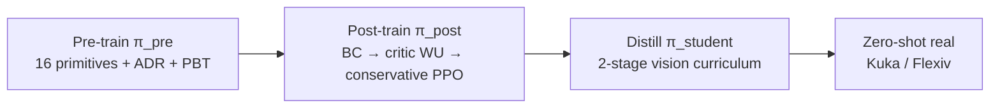

# ADEPT：灵巧操作 RL 预训练与后训练

**ADEPT**（*Accelerating Dexterity via Pre-Training and Post-Training using Reinforcement Learning*；[arXiv:2608.19182](https://arxiv.org/abs/2608.19182)，[项目页](https://adept-dexterity.github.io/)）由 **NVIDIA / 密歇根大学** 提出：先在仿真中对 **16 种 primitive** 做 generic **object reposing** RL 预训练，再用 **BC distillation + critic warm-up + conservative PPO** 稳定 post-train 成 FMB peg insertion / dish-rack 等下游专家，最后 distill 为 RGB 或 **visuo-tactile** student，在 **Kuka–Allegro（23 DoF）** 与 **Flexiv–Sharpa（29 DoF）** 上 **zero-shot** 真机部署；全程由 full **Cspace geometric fabric** 衔接 sim 与硬件。

## 一句话定义

**在仿真里用一次 reposing 预训练买下 reach/grasp/lift/reorient，再用保守 post-training 把同一 prior 雕成插 peg / 摆盘等长视界任务，而不让 naive fine-tune 把预训练行为冲垮。**

## 英文缩写速查

| 缩写 | 英文全称 | 简要说明 |
|------|----------|----------|
| ADEPT | Accelerating DExterity via Pre-Training | 本文框架：pre-train + post-train + distill |
| ADR | Automatic Domain Randomization | 在线课程：成功率达标则升难度 |
| PBT | Population-Based Training | 预训练期 PPO 超参搜索 |
| PPO | Proximal Policy Optimization | 预训练与 post-training 主算法 |
| FMB | Functional Manipulation Benchmark | peg insertion 等 contact-rich 基准 |
| BC | Behavior Cloning | Post-train 第一步：teacher→下游 actor 蒸馏 |
| TacMap | Tactile Map | Flexiv 指尖 penetration-depth 触觉表示 |

## 为什么重要

- **摊销预训练成本：** 预训练 ~8B env steps 一次；每个新下游任务 post-train ~3B，而 from-scratch 单任务 ~9B 且多数 seed 失败。
- **Post-train 配方可复用：** 直接 PPO fine-tune 在 ADR 20 处 success **迅速归零**（Fig. 3 inset）；ADEPT 三步骤把 collapse 拆开解决（观测扩展、价值 mis-calibration、policy drift）。
- **真机长视界 dexterity：** 首次展示 **无 demo、无 pose tracker** 的 sim-to-real **pick–reorient–insert**（arm–hand + 原始 RGB/触觉）；5–10 s/trial vs FMB parallel-jaw pipeline 20–70 s。
- **触觉 decisive：** 同任务 Flexiv–Sharpa visuo-tactile **8/10** vs vision-only **3/10** — 失败主因是 grasp confidence 而非 grasp 执行。

## 核心信息

| 项 | 内容 |
|----|------|
| **机构** | 英伟达（NVIDIA）；密歇根大学 Robotics（Ankur Handa 等） |
| **平台** | Kuka iiwa7 + Allegro（23 DoF）；Flexiv Rizon + Sharpa（29 DoF）+ 五指 TacMap |
| **预训练** | 16 primitive shapes；ADR + PBT；reaching→grasp→lift→reorient→transport→repose |
| **下游** | FMB star / square-round peg insertion；dish-rack placement |
| **低层** | Joint-space **Geometric Fabric**（全 Cspace，非 PCA  grasp 子空间） |
| **开源** | **待发布**（截至 **2026-08-22** [项目页 Code → Coming soon](https://adept-dexterity.github.io/)） |

## 核心原理

### 四阶段管线

### Post-training 三步骤（§3.3）

1. **BC actor distillation** — 把 \(\pi_{pre}\) 投影到下游观测空间，监督 40k iter  
2. **Critic warm-up** — 冻结 actor，用下游 reward 训 fresh \(V_{post}\) ~20 PPO iter  
3. **Conservative PPO** — actor LR **1e-5**（从 1e-3 线性 decay），clip **0.05**（项目页交互图亦展示 0.20→0.05 decay），critic LR 5e-5  

消融：**LR 1e-3 必 collapse**（即使加 BC+WU）；BC 将近 halve adaptation time；critic warm-up +17.6% SR。

### Geometric Fabric（§3.5）

Policy 输出 \(\mathbf{a}_t\in[-1,1]^{n_q}\) 作为 per-joint relative delta → fabric \(\mathbf{f}_\pi\) 驱动全关节二阶动力学；内置 collision / joint-limit repulsion。**同一 fabric 实例**跑 sim 与真机。

### Student 两阶段（§3.4）

1. **Vision pretrain** — reposing teacher 的 perception-heavy surrogate → 学 peg 检测 + 8-keypoint aux  
2. **Downstream distillation** — 对 post-trained insertion teacher 继续 BC + aux  

Flexiv Student 额外融合五指 TacMap depth + binary contact + SaTA-style FiLM 锚定。

### Pre-training 16 primitives（项目页画廊）

6 cuboid + 2 sphere + 6 capsule + 2 cone，尺度 50 mm 球～250 mm 杆；完整尺寸表见 [项目页归档](../../sources/sites/adept-dexterity-github-io.md)。

## 源码运行时序图

**不适用** — 截至入库日（2026-08-21）项目页 **Code Coming soon**，无官方 GitHub。若开源，预期路径：`pre_train`（primitives + fabric + PBT）→ `post_train`（FMB/dish task）→ DAgger distill → 真机 fabric 接口部署。

## 工程实践

| 项 | 建议 |
|----|------|
| 预训练覆盖 | 16 primitives 足够买 reposing；**大 flat plate**（dish）需 post-train 学新 grasp，非 zero-shot |
| Post-train 起点 | FMB 从 **ADR 20** 起步（reposing zero-shot 仍 >50%）；insertion 目标 ADR 50 |
| 学习率 | actor **1e-5** 是防 collapse 必要条件；KL 正则 **救不了** 1e-3 |
| Clip | 消融显示 clip 0.20 亦可；论文部署仍用 0.05 |
| 触觉 | contact-rich insert 优先 visuo-tactile；vision-only 易 grasp/regrasp 循环 |
| 速度对标 | 与 FMB parallel-jaw **fixture 多阶段** pipeline 比时，应报 **wall-clock per trial**（5–10 s） |
| 复现 | 等待官方 sim + fabric + student 配置发布 |

## 实验与评测

**Pre-train 泛化（Table 1，Kuka–Allegro）：** Primitive SR 0.73；未见 FMB peg **0.76**；VisDex **0.77**。

**Zero-shot reposing on FMB ADR path：** ADR 20 → **71.9%**；ADR 50（insertion contact）→ **0%** — post-training 必要性清晰。

**Post-train vs scratch（Fig. 3）：** ADEPT 3B post + 8B pre = 11B total；scratch ~9B 且 seed-sensitive。

**真机 episodic success（10 trials，Table 4 节选）：**

| Robot | Modality | Task | Insert SR |
|-------|----------|------|-----------|
| Kuka–Allegro | Vision | FMB Star | 5/10 |
| Kuka–Allegro | Vision | FMB Square/Round | 3/10 |
| Flexiv–Sharpa | Vision | FMB Square/Round | 3/10 |
| Flexiv–Sharpa | Visuo-tactile | FMB Square/Round | **8/10** |
| Kuka–Allegro | Vision | Dish rack | 6/10 |

**真机 per-stage 累积成功率（项目页 `method-figure.js`，10 trials）：**

| 条件 | Reach | Grasp | Lift | Reorient | Align | Insert |
|------|-------|-------|------|----------|-------|--------|
| Kuka FMB star | 10/10 | 9/10 | 8/10 | 8/10 | 7/10 | **5/10** |
| Kuka FMB sq/rd | 10/10 | 8/10 | 6/10 | 4/10 | 3/10 | **3/10** |
| Flexiv visuo-tactile | 10/10 | 10/10 | 10/10 | 9/10 | 8/10 | **8/10** |
| Flexiv vision-only | 10/10 | 7/10 | 5/10 | 3/10 | 3/10 | **3/10** |
| Kuka dish | 10/10 | 10/10 | 8/10 | 7/10 | 6/10 | **6/10** |

读法：vision-only Flexiv 在 **Reorienting** 后从 5/10 跌至 3/10 并维持——与「grasp confidence 不足导致 regrasp 循环」的失败叙事一致；visuo-tactile 在 Align 前仍保持 ≥9/10。

**Teacher sim SR（1024 ep @ ADR 50）：** Kuka aggregated peg **85.0%**；Flexiv square/round **89.2%**。

## 结论

**高 DoF 灵巧 RL 的可行路径是「一次 reposing 预训练 + 保守 post-training + 分阶段 perception distill」，而不是每个任务 from-scratch 或 naive fine-tune。**

1. **预训练** — 16 primitives + ADR/PBT 即可 zero-shot 下游 reposing 段（至 ADR ~35）。
2. **Post-train 配方** — BC + critic warm-up + **低 LR PPO**；缺任一项都可能 stall 或 collapse。
3. **Natural grasps** — reposing pre-train 初始化在「自然抓型」区域；post-train ** refine** 而非 from-scratch 发现 contortion。
4. **Beyond pretrain coverage** — dish 任务说明 post-train 可学 **qualitatively new** grasp（flip-regrasp），不只 refine 已有模式。
5. **Fabric** — full Cspace 暴露完整 kinematic dexterity，sim-real 共享低层。
6. **触觉** — Flexiv 上 **8/10 vs 3/10**；部署 contact-rich 任务应默认 visuo-tactile。
7. **开源** — 截至 2026-08-22 **Coming soon**；工程复现需等 NVIDIA 发布 sim 栈。

## 与其他工作对比

| 对照 | 差异读法 |
|------|----------|
| From-scratch 单任务 RL | 单任务 ~9B env steps 且多数 seed 失败；ADEPT 一次 8B 预训练摊销到每个下游任务 ~3B post-train |
| Naive PPO fine-tune | 直接 fine-tune 在 ADR 20 处 success **迅速归零**；ADEPT 把 collapse 拆成观测扩展 / 价值 mis-calibration / policy drift 三步分别解决 |
| KL 正则救 collapse | 消融显示 actor LR **1e-3 必 collapse，加 KL 正则也救不了**；真正的必要条件是 **LR 1e-5** |
| DemoStart 等 demo-based 灵巧路线 | 依赖人类 demonstration 起步；ADEPT **无 demo、无 pose tracker**，互补而非替代 |
| FMB parallel-jaw fixture 流水线 | 多阶段夹具 pipeline 20–70 s/trial；ADEPT arm–hand 端到端 5–10 s/trial——对标时应报 wall-clock per trial |
| PCA grasp 子空间低层 | 只暴露降维抓型；ADEPT 用 **full Cspace geometric fabric**，同一 fabric 实例跑 sim 与真机，暴露完整 kinematic dexterity |
| Vision-only student | 同任务 Flexiv–Sharpa **3/10**；加 TacMap 触觉后 **8/10**——失败主因是 grasp confidence 而非 grasp 执行 |

## 局限与风险

- **感知瓶颈：** 真机失败常因 asymmetric peg 遮挡下 orientation 估计错误；腕部相机 + 更多平台触觉仍 open。
- **Pre-train 对象域：** 16 primitives 不含大 flat plate；下游几何远离 pre-train 时需更多 post-train 或扩 pre-train。
- **单任务 post-train：** 每个下游任务独立 post-trained teacher；尚未展示单一 checkpoint 多任务。
- **未开源：** 大规模并行 sim、fabric 与 student 训练细节依赖未来 code release。
- **与 demo-based 路线对比：** 无人类 demonstration；与 DemoStart 等互补而非替代。

## 关联页面

- [Manipulation 任务](../tasks/manipulation.md) — FMB / contact-rich 长视界上下文
- [Sim2Real](../concepts/sim2real.md) — fabric + DR + distill 闭环
- [Ego2Robot](./paper-ego2robot.md) — 人类视频→机器人数据（不同模态，可组合）
- [Cross-embodiment 枢纽](../overview/hub-cross-embodiment.md)
- [In-hand Reorientation](../methods/in-hand-reorientation.md) — pre-train 覆盖 lift / in-hand reorient 段；post-train 对齐下游 insert/place

## 参考来源

- [ADEPT 论文归档](../../sources/papers/adept_arxiv_2608_19182.md)
- [adept-dexterity 项目页](../../sources/sites/adept-dexterity-github-io.md)
- [具身智能小站 8 篇综述](../../sources/blogs/wechat_embodied_station_8_papers_world_model_memory_2026-08-21.md)

## 推荐继续阅读

- [arXiv:2608.19182 全文 PDF](https://arxiv.org/pdf/2608.19182) — post-training 消融 Table 3 与 fabric 附录
- [ADEPT 项目页](https://adept-dexterity.github.io/) — primitive 画廊、真机 per-stage 表与 rollout 视频
