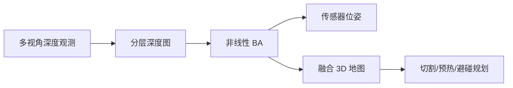
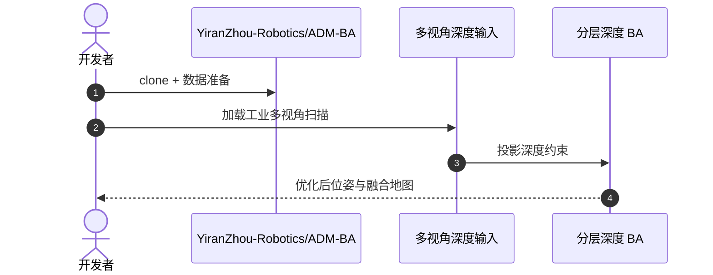

# ADM-BA：无对应点的多视角点云配准

**ADM-BA**（*Adaptive Depth-Map-Guided Bundle Adjustment for Correspondence-Free Multi-View Point Cloud Registration*，[arXiv:2609.01089](https://arxiv.org/abs/2609.01089)，[代码](https://github.com/YiranZhou-Robotics/ADM-BA)）由 **悉尼科技大学（UTS）** 与 **爱丁堡大学（University of Edinburgh）** 合作提出：用 **全局 2.5-D 分层深度图** 表示场景，绕开光滑金属表面的错误特征对应，直接以深度观测约束联合优化位姿与深度图。

## 一句话定义

**工业点云配准的关键，有时是少信任特征对应、多利用深度约束与束调整。**

## 英文缩写速查

| 缩写 | 英文全称 | 简要说明 |
|------|----------|----------|
| BA | Bundle Adjustment | 联合优化传感器位姿与地图参数 |
| ADM | Adaptive Depth Map | 自适应分层深度图表示 |
| 2.5-D | 2.5-Dimensional Grid | 每格可维护多深度假设的网格 |
| ICP | Iterative Closest Point | 经典点云配准（本文对比基线族） |

## 为什么重要

- 纳入 [2026-09-02 七篇盘点](../../sources/blogs/wechat_embodied_station_7_papers_contact_manipulation_2026-09-02.md) 的「工业几何感知」支线。
- 废钢处理等场景：光滑表面、重复结构、遮挡与局部重叠使 **特征对应** 极易失败。
- 重建误差直接传播到尺寸估计、切割区域与火炬避碰路径。
- **已开源** 实现代码。

## 核心信息

| 项 | 内容 |
|----|------|
| **机构** | 悉尼科技大学（UTS）；爱丁堡大学（University of Edinburgh） |
| **场景** | 不规则废钢机器人处理工位 |
| **表示** | 全局 2.5-D 网格 + softmax 层分配处理冲突深度 |
| **开源** | **已开源** [YiranZhou-Robotics/ADM-BA](https://github.com/YiranZhou-Robotics/ADM-BA) |

### 流程总览

## 评测

- 自采工业数据上保持竞争性精度、鲁棒性与低计算成本（相对特征对应管线）。
- 数据出处：[ingest 摘录](../../sources/papers/adm_ba_arxiv_2609_01089.md)。

## 结论

**对应点不可靠时，应把配准问题改写成深度图上的联合优化。**

- 分层深度图容纳多假设，适合金属反光与重复纹理
- 深度观测直接投影为约束，减少错误数据关联
- softmax 层分配处理同格冲突深度
- BA 同时优化位姿与地图，误差可传播分析
- 工业废钢场景验证几何感知对下游规划的价值
- 开源代码可复现无对应点配准管线

## 源码运行时序图

## 局限与风险

- **场景特化：** 方法针对废钢工位几何与传感布局优化，迁移需重新标定。
- **深度质量：** 依赖多视角深度传感器精度，极端反光仍可能污染假设层。
- **实时性：** BA 迭代成本需与在线规划周期对齐。

## 关联页面

- [Manipulation](../tasks/manipulation.md)
- [单目深度综述](./paper-monocular-depth-estimation-survey.md)
- [接触丰富操作 7 篇地图](../overview/contact-rich-manipulation-7-papers-technology-map.md)

## 推荐继续阅读

- [arXiv:2609.01089](https://arxiv.org/abs/2609.01089)
- [YiranZhou-Robotics/ADM-BA](https://github.com/YiranZhou-Robotics/ADM-BA)

## 参考来源

- [adm_ba_arxiv_2609_01089](../../sources/papers/adm_ba_arxiv_2609_01089.md)
- [具身智能小站 2026-09-02 七篇盘点](../../sources/blogs/wechat_embodied_station_7_papers_contact_manipulation_2026-09-02.md)
- [yiranzhou-robotics-adm-ba](../../sources/repos/yiranzhou-robotics-adm-ba.md)
