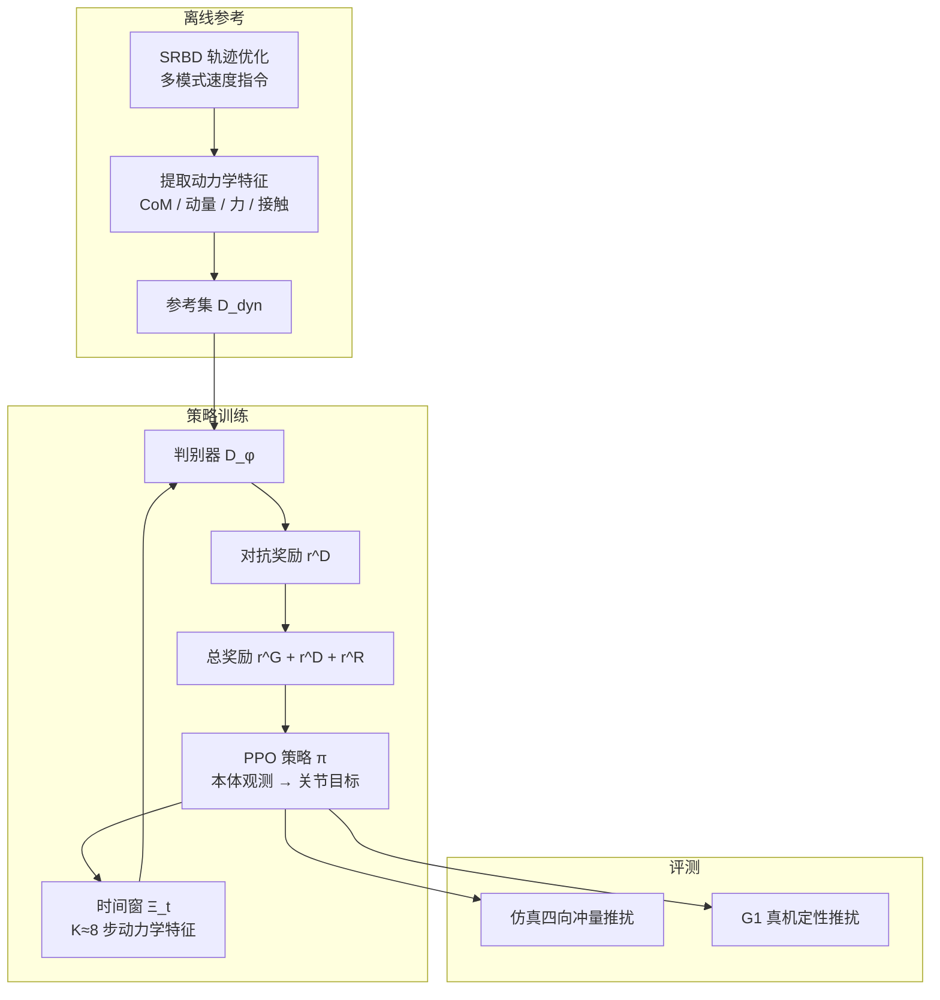

# ADP：对抗动力学先验的人形抗扰 locomotion

**ADP**（*Adversarial Dynamics Priors for Physically Grounded Humanoid Locomotion*，arXiv:[2607.03454](https://arxiv.org/abs/2607.03454)，[项目页](https://seokju-lee.github.io/adp)）由 **KAIST MSC Lab** 联合 **三星电子 Future Robotics AI Group、汉阳大学、KIMM** 提出：把 AMP 式对抗先验的目标从 **运动学风格** 换成 **SRBD-TO 导出的动力学特征时间窗**，在无显式姿态跟踪的前提下提升推扰恢复。

## 一句话定义

**用轨迹优化生成物理一致的动力学参考分布，再以对抗奖励把策略 rollout 的 CoM/动量/接触时间窗拉回该分布——一种面向抗扰动的「动力学 AMP」。**

## 英文缩写速查

| 缩写 | 英文全称 | 简要说明 |
|------|----------|----------|
| ADP | Adversarial Dynamics Priors | 本文方法：动力学特征上的对抗先验 |
| AMP | Adversarial Motion Prior | 运动学风格对抗先验；本文主对照 |
| SRBD | Single Rigid-Body Dynamics | 单刚体/质心层 TO 模型 |
| CoM | Center of Mass | 质心；特征与 TO 状态核心 |
| PPO | Proximal Policy Optimization | 策略训练算法 |
| TO | Trajectory Optimization | 离线生成 \(\mathcal{D}_{\mathrm{dyn}}\) |
| \(J_{80}\) | 80%-success impulse threshold | 方向平均成功率仍 ≥80% 的最大冲量 |
| G1 | Unitree G1 Humanoid | 仿真与定性真机平台（文中 29-DoF） |

## 核心信息

| 字段 | 内容 |
|------|------|
| **机构** | 韩国科学技术院（KAIST）；三星电子（Samsung Electronics）；汉阳大学（Hanyang University）；韩国机械材料研究院（KIMM） |
| **arXiv** | [2607.03454](https://arxiv.org/abs/2607.03454)（约 2026-07-03 首发；页内 v2 ≈ 2026-07-16） |
| **先验对象** | CoM 速度、质心角动量、接触力、二值接触指示（航向系 + 指令条件） |
| **参考来源** | SRBD 轨迹优化（走/跑/后退/侧步/转弯），非 mocap 全身跟踪目标 |
| **主指标 vs AMP** | 成功率 91.4% vs 73.4%；\(J_{80}\) +16.7%；恢复 −47.9%；速度误差 −35.4% |
| **开源（截至 2026-07-22）** | **宣称将开源 / 待发布**：项目页 Code *coming soon*；[`seokju-lee/adp`](https://github.com/seokju-lee/adp) 仅为站点仓 |

## 为什么重要

- **补 AMP 盲区：** 运动学风格先验对「推扰后动量与接触瞬态」不敏感；动力学窗在推后约 20 ms 即可放大偏差（相对运动学约 160 ms）。
- **物理接地、无关节跟踪：** 参考在 SRBD 层物理一致，却不强迫全身关节模仿 TO/IK 姿态——适合「任务 locomotion + 抗扰」而非风格表演。
- **公平对照设计清晰：** AMP 与 ADP 共用同一 TO 轨迹源，差异锁在 **先验特征空间**（运动学 vs 动力学），便于选型解读。
- **与 SD-AMP 正交：** [SD-AMP](./paper-unified-walk-run-recovery-sdamp.md) 解决走跑/起身 **regime 门控**；ADP 解决 **先验表示层**（动力学 vs 运动学）。可组合思考，非互斥替代。

## 流程总览

## 核心原理

### 1）奖励分解

\[
r_t = w_G r_t^G + w_D r_t^D + w_R r_t^R
\]

- \(r^G\)：任务（速度跟踪等）
- \(r^D\)：ADP 对抗动力学先验
- \(r^R\)：正则

Actor 不含基座线速度；critic 训练期可享特权速度。

### 2）特征与时间窗

- 逐步 \(z_t\)：航向系 CoM 速度、质心角动量、平面角动量率、归一化左右脚力、二值接触。
- 条件化 \(\xi_t=[z_t, v_t^{\mathrm{cmd}}, e_t]\)：指令与跟踪误差作 **判别条件**，不作跟踪奖励。
- 窗 \(\Xi_t\)：\(K\) 步堆叠；过短丢接触切换/动量恢复时序，过长抬高判别维度并放大 SRBD 参考与反馈关节 rollout 的时序错位。

### 3）对抗目标

判别器最小二乘对抗 + 梯度惩罚；策略侧 \(r_t^D\) 在窗口被判为接近参考时升高。**判别损失不经仿真反传到 actor**，仅经奖励塑形。

### 4）为何优于点式动力学匹配

Dynamics Reward 基线用同一特征与参考做 **点式高斯式匹配**，无对抗；相对 Vanilla 略好，但远不及 AMP/ADP——说明需要 **分布级** 窗先验，而非逐步特征 MSE 式贴合。

## 评测要点

| 指标（四向推扰，相对 AMP） | ADP | AMP |
|---------------------------|-----|-----|
| 成功率 | **91.4%** | 73.4% |
| \(J_{80}\)（N·s） | **115.5**（+16.7%） | 99.0 |
| 恢复时间（s） | **2.48**（−47.9%） | 4.76 |
| 速度跟踪误差（m/s） | **0.84**（−35.4%） | 1.30 |

- 统一 \(\Delta v=3.0\) m/s（约 99 N·s）报方向平均成功率/恢复/速度误差；\(J_{80}\) 由冲量扫描得到。
- 表征敏感性：动力学偏差峰值约 **6.0× / 20 ms** vs 运动学 **4.3× / 160 ms**。
- 消融：去掉接触指示跌幅最大（→30.5%）；\(K=8\) 时间窗最佳折中。
- 真机 G1：冲量/持续推相对 AMP 的 **定性** 对照，非严格定量。

## 与其他工作对比

| 路线 | 先验对象 | 解决什么 | 与 ADP 关系 |
|------|----------|----------|-------------|
| [AMP](../methods/amp-reward.md) | 运动学风格 | 自然步态 | 主对照；同源 TO 下 ADP 更抗扰 |
| [SD-AMP](./paper-unified-walk-run-recovery-sdamp.md) | 运动学 + regime 门控 | 走跑/起身统一 | **正交**（门控 vs 特征空间） |
| Dynamics Reward（本文基线） | 同动力学特征、点式匹配 | 无对抗贴合 | 证明需分布级窗先验 |
| [Heracles](./paper-heracles-humanoid-diffusion.md) | 扩散参考中间层 | 恢复轨迹生成 | 不同抽象层；可串联 |

## 工程实践

| 项 | 内容 |
|----|------|
| **仿真对照** | Vanilla RL / Dynamics Reward / AMP / ADP；同 PPO、观测、动作、DR、扰动课程 |
| **推扰协议** | 四向浮基速度冲量；扫 \(\Delta v\) 得 \(J_{80}\)；统一 \(\Delta v=3.0\) m/s（约 99 N·s）报成功率/恢复/速度误差 |
| **失败判据** | 躯干接触、基座高度 &lt;0.30 m、投影重力横向分量 &gt;0.8（约 ±53°） |
| **消融要点** | 接触指示最关键；动量次之；\(K=8\) 为文中最佳折中 |
| **真机** | G1 冲量/持续推相对 AMP 的定性视频；**非** 严格定量 |
| **源码运行时序图** | **不适用**（截至 2026-07-22 无可运行官方训练/推理仓） |

## 局限与风险

- **开源未落地：** 无法本地复现训练配置与超参；仅能据论文/项目页选型。
- **自然度未显式约束：** 结论承认未来需组合运动学先验；纯 ADP 可能「稳但不够像人」。
- **AMP 基线同源 TO：** 公平隔离特征空间，但 **不等于** 对高质量 mocap AMP 的全面碾压；选型时勿外推过头。
- **真机证据弱：** 硬件为定性；定量优势主要在仿真。
- **SRBD 参考上限：** 参考本身是低维 TO，复杂全身动量重分配仍依赖策略侧完整连杆动量计算（式 (5)）。

## 关联页面

- [AMP 对抗运动先验](../methods/amp-reward.md) — 运动学风格判别器主线；ADP 的直接对照
- [AMP / ADD / SMP 变体对比](../comparisons/amp-add-smp-motion-prior-variants.md) — 先验家族选型
- [SD-AMP](./paper-unified-walk-run-recovery-sdamp.md) — 状态门控双判别器（走跑/起身）；与 ADP「特征层」正交
- [Locomotion](../tasks/locomotion.md)、[人形 Locomotion](../tasks/humanoid-locomotion.md)、[Balance Recovery](../tasks/balance-recovery.md)
- [Centroidal Dynamics](../concepts/centroidal-dynamics.md) — SRBD/质心层建模背景
- [Unitree G1](./unitree-g1.md)、[Sim2Real](../concepts/sim2real.md)

## 参考来源

- [ADP 论文归档（arXiv:2607.03454）](../../sources/papers/adp_arxiv_2607_03454.md)
- [ADP 项目页归档](../../sources/sites/seokju-lee-adp-github-io.md)

## 推荐继续阅读

- [ADP 项目页](https://seokju-lee.github.io/adp) — 视频、指标卡与 BibTeX
- [arXiv:2607.03454](https://arxiv.org/abs/2607.03454) — 全文方法与消融表
- Peng et al., *AMP: Adversarial Motion Priors* — 运动学对抗先验原典
