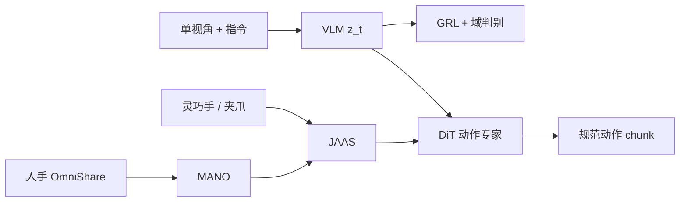

# AdvDex：人手与灵巧手统一动作空间

**AdvDex**（*Learning Dexterous Manipulation from Human Demonstrations via Joint-Aligned Actions and Adversarial Learning*，[arXiv:2608.14028](https://arxiv.org/abs/2608.14028)）由 **浙江大学（ZJU）** / **复旦大学（Fudan）** / **上海创智学院（Shanghai Innovation Institute）** / **上海交通大学（SJTU）** / **帕西尼（Paxini Tech）** 提出：用大规模人手数据集 **OmniShare**、规范动作空间 **JAAS** 和域对抗视觉，把人手、多指手与平行夹爪接到同一 VLA。

## 一句话定义

**先把异构手的动作对齐到「腕 SE(3) + 15 指关节」，再用对抗学习把视觉里的本体外观拧掉——这样人手演示才能直接当机器人动作监督。**

## 英文缩写速查

| 缩写 | 英文全称 | 简要说明 |
|------|----------|----------|
| JAAS | Joint-Aligned Action Space | 共享腕位姿 + 15 指关节的规范动作空间 |
| GRL | Gradient Reversal Layer | 让视觉编码器对抗域判别器、抑制本体捷径 |
| MANO | hand Model with Articulated and Non-rigid defOrmations | 人手中间表示，再映入 JAAS |
| DiT | Diffusion Transformer | 在 JAAS 上扩散预测动作 chunk |
| MPJPE | Mean Per-Joint Position Error | 手动作预测的关节位置误差 |

## 为什么重要

- **灵巧数据贵、手型碎：** 换一只手就重采一库；人手数据多，但关节与外观对不上。
- **只对齐动作不够：** 共享视觉仍会靠「看见哪只手」走捷径；对抗支路专门打这条捷径。
- **与球面统一动作对照：** [UHAS](../methods/uhas-unified-hand-action-space.md) 统一的是 **形变控制接口**；JAAS 统一的是 **VLA 可回归的关节语义槽**。

## 核心信息

| 项 | 内容 |
|----|------|
| **机构** | 浙江大学；复旦大学；上海创智学院；上海交通大学；帕西尼 |
| **数据** | OmniShare：论文表 1 为 168k traj / 14 视角 / 721 物体；正文亦写 >100k / 500+ 任务 |
| **真机** | Paxini Tora + 19-DoF DexH13；1,000 条遥操作后训练 |
| **开源** | **确认未开源**（无项目页、无代码/数据链，论文未承诺发布） |

## 核心原理

### 方法栈

| 模块 | 机制 |
|------|------|
| OmniShare | 微秒同步手套（29 磁编 + 霍尔触觉）→ MANO + 触觉衰减 |
| JAAS | \(\mathrm{SE}(3)\) 腕 + 每指 3-DoF × 5；夹爪 1-DoF 映到两指槽；空槽 mask |
| 策略 | VLM cognition token + 状态 → DiT 去噪 JAAS chunk |
| 对抗 | 判别器看 \([z_t,s_t]\) 判 human / dexterous / gripper；GRL 反传 |

### 流程总览

预训练配比 OmniShare : VITRA-1M : OXE = **5:4:1**，再在目标手上少量后训练。

## 源码运行时序图

**不适用（确认未开源）。** 无官方训练 / 推理入口；OmniShare 亦未发布。

## 工程实践

| 项 | 建议 / 论文设定 |
|----|----------------|
| 何时用 | 要用人手数据预训灵巧 VLA，且目标手能映射到 15 槽功能对应 |
| 后训练 | 1,000 条真机演示适配 DexH13 与物理 |
| 零样本人→机 | 人/机任务互斥共训：人侧教任务，机侧教控制 |
| 复现现状 | **无法复现**；只读指标与消融做选型 |

## 实验与评测

| 设定 | AdvDex | 读点 |
|------|--------|------|
| OmniShare-Unseen \(d_{\mathrm{h-o}}\) / MPJPE / MWTE | **3.2 / 2.8 / 2.5 mm** | VITRA 20.1 / 16.2 / 14.8 |
| HOI4D 同三项 | **10.5 / 7.2 / 6.1 mm** | 跨采集域仍优于去对抗 / 去 OmniShare |
| 真机 seen 五任务 | 单抓 80%、多抓 70%、倒水 55%、推方 90%、叠瓶 70% | 全面 ≥ \(\pi_{0.5}\) / VITRA |
| 未见物体 / 环境 | **50% / 60%** | 去对抗掉到 15% / 30% |
| 人→机零样本 | 60 / 70 / 45 / 30% | 工具使用仍低 |
| 少样本抓取 | 0-shot 非零；5 条即明显抬升 | 对抗比 OmniShare 更关键 |

t-SNE：有 GRL 时各本体特征重叠，无 GRL 则按手型分簇。

## 结论

**AdvDex 的可迁移主张是「动作对齐 + 视觉去本体」必须一起做：JAAS 让人手标签能当机器人监督，对抗学习防止编码器靠外观作弊。**

1. **真影响：功能槽对齐，而不是解剖一一对应** — 空槽 mask，夹爪也能进同一专家。
2. **真影响：对抗对少样本/未见域更关键** — 消融里去 GRL 往往比去 OmniShare 掉得更狠。
3. **真影响：人→机零样本要任务互斥共训** — 不是「看人手视频就会做」。
4. **次要代价：只评 DexH13** — 跨更多灵巧手仍是开放问题。
5. **部署读法：未开源** — 适合与 UHAS / 原生动作 MoE 对照概念，不能当可跑基线。
6. **工程读法：JAAS 不建模接触动力学** — 精细插拔仍可能要 RL 或在线适应。

## 与其他工作对比

| 对照 | 差异读法 |
|------|----------|
| [UHAS](../methods/uhas-unified-hand-action-space.md) | 球面形变 + CIK，服务 **RL 跨手控制**；本文是 **VLA 关节槽 + 人手数据** |
| [DyPES-VLA](./paper-dypes-vla.md) | 拒绝统一动作、改 MoE 原生空间；本文坚持统一 JAAS |
| H-RDT / 人视频预训 VLA | 常学视觉先验或 latent；本文给 **可执行关节监督** |
| \(\pi_{0.5}\) / VITRA | 同后训练对照；未见域与人→机上差距最大 |

## 局限与风险

- **确认未开源：** 代码、权重、OmniShare 均不可得。
- **单平台真机：** 硬件差仍限制精细技能迁移。
- **规模口径：** 摘要/正文「>100k」与表 1「168k」并存，引用时写明来源表。
- **无项目页：** 后续若出现站点，需按步骤 2.5 重核。

## 关联页面

- [UHAS](../methods/uhas-unified-hand-action-space.md) — 另一条统一手部动作空间
- [VLA](../methods/vla.md) — 方法母页
- [跨具身策略迁移选型](../queries/cross-embodiment-transfer-strategy.md) — 灵巧手层对照
- [Manipulation](../tasks/manipulation.md) — 操作任务
- [Motion Retargeting](../concepts/motion-retargeting.md) — 人手→中间表示
- [DyPES-VLA](./paper-dypes-vla.md) — 「不统一动作」的对照
- [H-RDT](./paper-notebook-h-rdt-human-manipulation-enhanced-bimanual-robot.md) — 人手数据增强双臂

## 参考来源

- [advdex_arxiv_2608_14028.md](../../sources/papers/advdex_arxiv_2608_14028.md) — 论文摘录与开源核查
- [arXiv:2608.14028](https://arxiv.org/abs/2608.14028) — 原文

## 推荐继续阅读

- [AdvDex PDF](https://arxiv.org/pdf/2608.14028)
- [UHAS 项目页](https://irvlutd.github.io/UHAS/) — 球面统一动作对照
- [MANO](https://mano.is.tue.mpg.de/) — 人手中间模型
