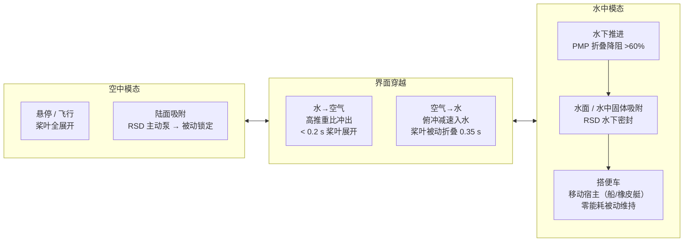

# 空中-水中两栖搭便车机器人：仿印鱼吸盘+被动变形桨

**Aerial-aquatic robots capable of crossing the air-water boundary and hitchhiking on surfaces**（Dongkai Li† / Chuanbeibei Shi†、Jiangbei Wang、Wen Li‡，北京航空航天大学，**Science Robotics 2022**，[DOI:10.1126/scirobotics.abm6695](https://doi.org/10.1126/scirobotics.abm6695)）提出一种同时具备飞行、入水、水下推进与表面吸附四种运动模态的两栖多旋翼机器人：采用**仿印鱼多层冗余密封吸盘（RSD）** 实现水面、水下及陆面多宿主搭便车；**被动变形桨叶（PMP）** 入水自动折叠降低水阻 > 60%、出水自动展开恢复推力；完整**空-水界面穿越仅需 0.35 s**，并在野外溪流与海洋环境完成实地测试。

## 一句话定义

**受印鱼（Remora）启发设计多层冗余密封吸盘、并以被动铰接桨叶在水中折叠/空气中展开实现形态自适应的多旋翼机器人，能够在 0.35 s 内完成空-水界面穿越，并在任意宿主表面（岩石、船壳、移动橡皮艇、水中固体）无能耗被动吸附搭便车。**

## 英文缩写速查

| 缩写 | 英文全称 | 简要说明 |
|------|----------|----------|
| RSD | Remora-inspired Suction Disc | 仿印鱼的多层冗余密封主动-被动锁定吸盘 |
| PMP | Passive Morphing Propeller | 被动铰接桨叶，随介质切换自动折叠/展开 |
| SUAV | Semi-submersible Unmanned Aerial Vehicle | 两栖无人飞行器（学术常用名） |
| CFD | Computational Fluid Dynamics | 论文用 CFD 验证 PMP 折叠状态水阻降低 >60% |
| MAV | Micro Aerial Vehicle | 小型无人机通用分类，本机体量属于中小型 MAV |
| DOF | Degrees of Freedom | 机体 6 自由度飞行 + 吸盘 1 自由度泵控 |
| TWR | Thrust-to-Weight Ratio | 推重比；出水冲破表面张力需要 TWR > 1 |

## 为什么重要

- **穿越界面的系统性解法：** 空-水界面是机器人运动学中最复杂的跨介质过渡之一，需同时解决**表面张力突破、水阻桨叶保护、防水密封、空中飞行重建**四个互相制约的工程问题；0.35 s 穿越时间大幅优于当时同类工作（>1 s）。
- **被动形态适配的示范价值：** PMP 不依赖主动驱动机构，仅利用环境介质的力学差异实现自动变形，代表了"**被动智能（passive intelligence）**"设计哲学在机器人跨介质中的典型实现，与[软体机器人变形适应](./paper-miniature-deep-sea-morphable-robot.md)形成方法论对照。
- **仿生层次深：** 印鱼吸盘的多层密封不是装饰性仿生，而是精确映射印鱼背鳍冗余密封结构以实现高曲率/粗糙/湿滑多表面通用性，与[章鱼臂仿生](./paper-octopus-inspired-esoam-soft-arm.md)构成北航文力组仿生机器人研究系列。
- **野外可靠性：** 在真实溪流与海洋（非泳池）完成测试，将"仿生概念验证"推向"环境鲁棒性工程验证"，对[多模态运动](../tasks/locomotion.md)研究具有强数据价值。

## 系统架构与运动模态

## 核心机制（提炼）

| 模块 | 原理 | 关键数据 |
|------|------|----------|
| **RSD 外层密封唇（×3–4）** | 多层嵌套硅胶唇，各层独立密封 | 最外层破损后内层自动接管；总冗余深度 3 层 |
| **RSD 主动泵 + 被动止回阀** | 微型气泵抽真空建压，止回阀锁定 | 断电后维持负压；最大吸附力 > 4× 机重 |
| **PMP 铰接扭簧** | 水阻力矩 vs 弹簧预载 | 水中折叠 ±15°；空气展开至工作攻角 |
| **PMP 阻力降低** | CFD + 实验验证折叠降阻 | 阻力系数降低约 **62%** |
| **界面穿越策略** | 冲出：全推力；冲入：俯冲几何吸能 | 最短 **0.35 s** 完成空→水界面 |
| **防水密封** | 电子舱 O 型圈 + 硅胶灌封 | 重复穿越 **>20 次** 无失效 |

## 与相邻工作对比

| 维度 | 本文（北航 2022） | Li et al. (2016, MIT) | SUWAVE（NUS） | 深海可变形（北航 2025）|
|------|------------------|----------------------|---------------|------------------------|
| 穿越方向 | **双向（↕）** | 单向（水→空） | 双向 | 不跨界面，深海潜行 |
| 界面时间 | **0.35 s** | > 2 s | ~1 s | N/A |
| 吸附能力 | **多表面 RSD** | 无 | 无 | 软体贴附 |
| 野外测试 | **溪流 + 海洋** | 实验室水池 | 水池 | 马里亚纳海沟现场 |
| 桨叶形态 | **被动变形 PMP** | 固定桨 | 可收放桨 | 无（软鳍推进）|

## 实验与评测

- **界面穿越速度：** 空↔水双向穿越，最短 **0.35 s** 完成空→水界面（当时同类工作 >1 s）。
- **PMP 降阻：** CFD + 实验验证水下桨叶折叠降阻约 **62%**。
- **RSD 吸附：** 最大吸附力 **>4× 机重**；多层嵌套密封唇冗余，外层破损后内层自动接管。
- **可靠性与野外性：** 重复穿越 **>20 次** 无密封失效；在真实溪流与海洋（非泳池）完成野外测试，将验证从「概念验证」推向「环境鲁棒性工程验证」。

## 局限与风险

- **水下推进效率低：** PMP 折叠后推力大幅下降，水下移动速度与专业 AUV 不可比；深度和续航受限。
- **吸盘对极光滑表面受限：** 油漆钢板（极低表面粗糙度）在长时动态载荷下吸附持续时间下降；镜面材质需加橡胶增摩垫。
- **完整系统代码未开源：** 截至 2026-07-20，**无官方代码或 CAD 文件公开**；论文 Supplementary 仅含结构参数与材料说明，不可直接复现。
- **控制复杂度：** 四种运动模态切换需要精确的状态估计与模式切换逻辑；入水时有较大冲击，IMU/飞控需专门鲁棒化设计。
- **载荷有限：** 多旋翼机体需承载防水舱 + 吸盘泵 + 电池，任务载荷（传感器）空间受限。

## 工程实践

- **界面穿越关键参数：** 出水需 TWR > 1.3（留余量克服水膜黏附）；入水俯冲角建议 ≥ 60°（减小水平冲击分量）；电机防水等级建议 IP68。
- **PMP 设计要点：** 扭簧预载力矩需仔细标定，以确保折叠/展开阈值分别落在水中/空气推力范围内；铰接轴线应平行桨叶展弦，防止展开后俯仰角偏差。
- **RSD 吸附性能调试：** 密封唇硬度建议 Shore A 20–30（过软漏气，过硬不贴合曲面）；泵功率约 3–5 W（与飞行功耗相比可忽略）。
- **参考对照平台：** 室内轻型多旋翼参见 [Crazyswarm2](./crazyswarm2.md)；跨介质任务规划可借鉴 UAV 文献中的 air-water energy budget 模型。

## 参考来源

- [深蓝AI：近五年 Science Robotics 中国顶尖高校盘点](../../sources/blogs/wechat_shenlan_scirobotics_china_top3_2026-07-02.md)
- [两栖印鱼搭便车机器人论文归档（Science Robotics 2022）](../../sources/papers/aerial_aquatic_remora_scirobotics_2022.md)
- Li et al., *Aerial-aquatic robots capable of crossing the air-water boundary and hitchhiking on surfaces*, [Science Robotics 2022](https://doi.org/10.1126/scirobotics.abm6695)
- 印鱼吸盘仿生背景：Wainwright et al. (2019), *Journal of Experimental Biology*；Beckert et al. (2016), *Bioinspiration & Biomimetics*
- 被动变形机翼/桨参考：Lentink et al. (2007), *Nature*（折叠翼仿生）

## 关联页面

- [运动任务（Locomotion）](../tasks/locomotion.md) — 多模态（空/水面/水下/吸附）运动能力节点
- [Crazyswarm2（多旋翼平台）](./crazyswarm2.md) — 小型室内多旋翼平台参照对比
- [章鱼臂仿生软体操作（北航文力组系列）](./paper-octopus-inspired-esoam-soft-arm.md)
- [深海可变形机器人（北航文力组系列）](./paper-miniature-deep-sea-morphable-robot.md)

## 推荐继续阅读

- [Science Robotics 原文](https://doi.org/10.1126/scirobotics.abm6695)
- Liang et al. (2024) 综述: *Cross-medium vehicles*, Annual Review of Fluid Mechanics — 跨介质飞行器系统综述
- [北航文力组深海可变形机器人（Science Robotics 2025）](./paper-miniature-deep-sea-morphable-robot.md)
