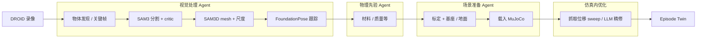

# Agentic Real2Sim（VLM Agent 编排的物理 Real2Sim）

**Agentic Real2Sim**（*Physics-based World Modeling with Vision-Language Agents*，[arXiv:2607.19190](https://arxiv.org/abs/2607.19190)，2026；[项目页](https://agentic-real2sim.github.io/)）把「真机机器人–物体交互录像」写成 **可仿真的 episode twin**：在共享产物合约下，用 **VLM agent 做有界决策**、用 **确定性感知/仿真工具做几何与物理**，把 DROID 类 episode 装进 **MuJoCo**，并演示同一框架向 **可变形（PhysTwin 风格）** 与 **人形运动（BFM-Zero 风格）** 扩展。

## 一句话定义

**用可替换 VLM 后端编排「视觉→物性→场景→仿真内修复」流水线，把真实交互 episode 自动转成可回放、可查询的物理数字孪生。**

## 英文缩写速查

| 缩写 | 英文全称 | 简要说明 |
|------|----------|----------|
| Real2Sim | Real to Simulation | 从真机观测构造可对齐仿真资产/场景 |
| VLM | Vision-Language Model | 本框架中的 agentic 决策后端 |
| DROID | Distributed Robot Interaction Dataset | 主评测刚性操作 episode 源 |
| SAM | Segment Anything Model | 开放词表分割（文中 SAM 3） |
| EMPM | （PhysTwin 系）可变形仿真设定 | 可变形适配器对照设定之一 |
| BFM | Behavioral Foundation Model | 人形适配器运动上下文（BFM-Zero） |
| USD | Universal Scene Description | 项目页浏览器孪生预览格式 |

## 为什么重要

- **单位是 episode，不是孤立物体扫描：** 相对只重建资产或只生成空场景，这里保留 **执行器、轨迹、接触与任务语义**，直接服务「回放 / 策略评测 / 学策略」叙事。
- **Agent 与工具解耦：** VLM 只做物体发现、关键帧、掩码/跟踪 critic、地面参考等 **schema 约束问题**；几何与抓取 sweep 仍走确定性工具——因此开源 31B 与 GPT-5.4 成功率接近，成本差一个数量级。
- **跨域合约：** 刚性 / 可变形 / 人形共用文件夹与回放修复接口，是「一个 Real2Sim 系统覆盖多物理域」的早期样本。

## 核心信息

| 字段 | 内容 |
|------|------|
| 机构 | 英属哥伦比亚大学（UBC）；约翰霍普金斯大学（Johns Hopkins）；埃尔朗根-纽伦堡大学 / NHR@FAU（FAU）；哥伦比亚大学（Columbia）；加州大学洛杉矶分校（UCLA）；新加坡国立大学（NUS）；凌迪科技（Style3D） |
| arXiv | [2607.19190](https://arxiv.org/abs/2607.19190) |
| 项目页 | <https://agentic-real2sim.github.io/> |
| 仿真后端（刚性） | MuJoCo |
| 开源（截至 2026-07-23） | **宣称将开源 / 待发布**：项目页 **Code (coming soon)**，无可运行官方仓 |
| 主指标 | DROID-100 回放成功（三 VLM 裁判，≥8/10）；Gemma 4 31B：**48/100**，账单 **$2.62** |

## 核心原理

### Episode twin

\[
\mathcal{T}=(\mathcal{O},\mathcal{A},\mathcal{G},\mathcal{S}_{1:T},\Theta,\mathcal{B},\mathcal{M})
\]

分别对应真实观测、执行器、几何外观、时序仿真状态、物性/对齐参数、仿真后端与成功判定痕迹。

### 四阶段流水线（刚性）

| 阶段 | 工具（示例） | Agent 技能（示例） |
|------|--------------|-------------------|
| 物体发现 | — | object_discovery / relevance / pickup_object |
| 分割 / 几何 | SAM 3、SAM 3D、FoundationStereo | keyframe + mask/scale critic |
| 姿态 | FoundationPose | tracking_critic |
| 物性 | — | material_classify |
| 场景 / 抓取 | calibration、grasp sweep | camera_select、ground_ref |

### 多 VLM 与成本

同一管线换后端：Gemma 4 31B / Qwen 3.6 35B / GPT-5.4 / Claude Haiku 4.5 的回放成功约 **37–48/100**；相对 Gemma，GPT-5.4 约 **31.4×** 模型成本。作者把剩余失败主因归于上游感知与仿真组件，而非「换更大闭源 VLM」。

## 源码运行时序图

**不适用。** 截至 **2026-07-23**，[项目页](https://agentic-real2sim.github.io/) 仅标注 **Code (coming soon)**，未列可辨识的训练/转换仓库；无法对齐 `sources/repos/` 入口绘制可复现运行时序。开放后应补 `sources/repos/` 并补本图。

## 工程实践

| 项 | 建议 |
|----|------|
| 选型定位 | 需要 **episode 级物理回放** 与 **可换 VLM 编排** 时对照；若只需操作场景 + cousins + 策略相关评测，优先看 [SimFoundry](./paper-simfoundry-real2sim-scene-generation.md) |
| 复现边界 | 当前 **不可本地跑转换**；可先读论文 Tab.1 工具表与项目页 USD 预览理解产物形态 |
| 评测阅读 | 「回放成功」≠「策略成功率相关」；与 SimFoundry Pearson / MMRV 口径不同 |

## 局限与风险

- **绝对成功率仍低（<50%）：** 分割/跟踪失败会直接拖垮下游。
- **主定量实验偏刚性 DROID；** 可变形与人形以定性为主。
- **代码未开放：** 工程复现与策略学习闭环尚不能在社区端验证。
- **勿与像素视频世界模型混谈：** 本工作产物是 **物理引擎 episode**，不是 [Video-as-Simulation](../concepts/video-as-simulation.md) 式像素 rollout。

## 关联页面

- [Sim2Real](../concepts/sim2real.md) — Real2Sim 资产与迁移总图
- [CRISP](../methods/crisp-real2sim.md) — 单目人–场景 Real2Sim（平面原语 + RL）
- [SimFoundry](./paper-simfoundry-real2sim-scene-generation.md) — 真机视频 → sim-ready 孪生 + cousins + 策略评测
- [Articraft](./articraft.md) — agentic VLM 铰接资产生成
- [BFM-Zero](./paper-bfm-zero.md) — 人形适配器运动上下文
- [Manipulation](../tasks/manipulation.md) — 操作任务入口

## 参考来源

- [Agentic Real2Sim 论文摘录](../../sources/papers/agentic_real2sim_arxiv_2607_19190.md)
- [Agentic Real2Sim 项目页归档](../../sources/sites/agentic-real2sim-github-io.md)

## 推荐继续阅读

- [项目页](https://agentic-real2sim.github.io/) — 对照视频与浏览器孪生
- [arXiv:2607.19190](https://arxiv.org/abs/2607.19190) — 完整方法与 DROID-100 实验
