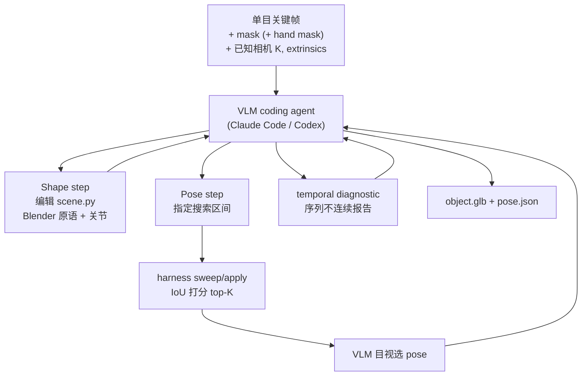
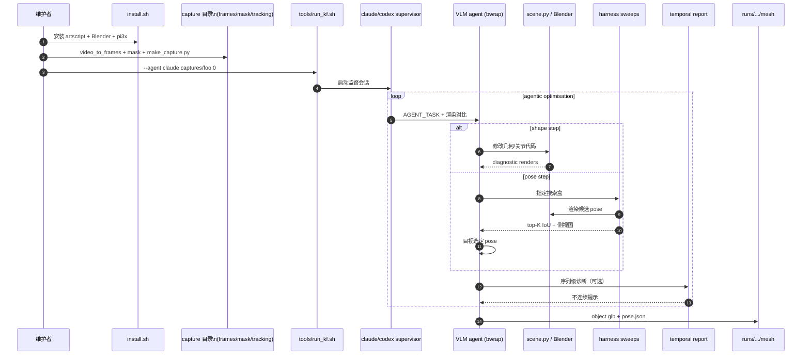

# AgentSTAR（单目视频 Agentic 形状跟踪与重建）

**AgentSTAR**（*Agentic Shape Tracking and Reconstruction from Monocular Videos*，[arXiv:2609.24487](https://arxiv.org/abs/2609.24487)，2026；[项目页](https://agenticstar.github.io/)，[代码](https://github.com/makezur/agenticSTAR)）提出 **自上而下 analysis-by-synthesis**：从 casual **单目视频**（+ 已知相机、物体 mask）用 **VLM 驱动的 coding agent** 维护共享的 **程序化 3D 模型**（Blender 原语 + 关节结构），并在时间上估计 **generalised pose**（6-DoF 基座 + 关节角）。数值 harness 提供 **silhouette IoU 打分**、**有界 pose sweep** 与 **序列 temporal 诊断**，使 agent 在大运动、铰接、遮挡与透明物体等 **点跟踪易失败** 场景仍保持 **结构化、可仿真** 的输出（GLB + `pose.json`）。

## 一句话定义

**用 VLM agent 在 render-and-compare 环中同时「写代码建模」与「指定 pose 搜索区并目视选优」，把单目视频变成带关节的 3D mesh 与时序广义位姿。**

## 英文缩写速查

| 缩写 | 英文全称 | 简要说明 |
|------|----------|----------|
| VLM | Vision-Language Model | 视觉-语言模型，本文作 coarse 推理与 pose 候选选择 |
| IoU | Intersection over Union | 渲染 silhouette 与物体 mask 的重叠率，主数值打分 |
| SE(3) | Special Euclidean group | 刚体位姿群；基座位姿 \(T_i=(R_i,t_i)\) |
| EPE | End-Point Error | 3D 点跟踪终点误差（ARCTIC 对比基线） |
| SLAM | Simultaneous Localization and Mapping | 提供已知相机轨迹的外部模块（如 Pi3X） |
| CAD | Computer-Aided Design | 计算机辅助设计；本文用代码原语而非 B-rep |
| GLB | GL Transmission Format Binary | 输出网格容器（命名部件） |

## 为什么重要

- **机器人可读结构：** 相对 3D 点轨迹或 unstructured 点云，**mesh + 关节 + 位姿序列** 可直接接入仿真、抓取与 Real2Sim 管线，而不必事后再猜 articulation。
- **机制约束跟踪：** 铰接物体在 **严重遮挡** 时像素对应断裂，但 **关节限位** 仍强约束可行运动；同一 agent 既推断结构又跟踪状态，与「先跟踪再拟合」的 bottom-up 路线形成对照。
- **Agent + 数值互补：** VLM 擅长 **粗粒度** 一致性与 **逃离 IoU 局部最优**；有界数值搜索负责 **连续 pose 精修**——消融显示缺 harness 或缺 VLM pose 引导都会显著恶化。

## 核心信息

| 字段 | 内容 |
|------|------|
| 机构 | 亚马逊 FAR（Amazon FAR, Frontier AI and Robotics）；加州大学伯克利分校（UC Berkeley） |
| arXiv | [2609.24487](https://arxiv.org/abs/2609.24487) |
| 项目页 | <https://agenticstar.github.io/> |
| 代码 | [makezur/agenticSTAR](https://github.com/makezur/agenticSTAR)（MIT，**已开源**） |
| 默认 agent 后端（论文） | Codex harness + GPT-5.6-Sol（medium reasoning）；亦报 Claude Fable 5 |
| 开源（截至 2026-09-28） | **已开源** harness、示例 garden shears；需 GPU + LLM API；单次 run 数小时级 |

## 流程总览

输入相机通常由 **Pi3X** 等前馈重建提供（仓库 `tools/make_capture.py`）；物体 mask 可由 SAM3 等分割器产生。

## 核心原理

### 表示

- **Canonical 模型 \(\mathcal{O}\)：** 全序列共享的 Python/Blender 代码；几何自由，关节与 pose 字段按 **conventions** 命名以便与 shape 解耦更新。
- **Generalised pose \(\mathcal{T}_i\)：** 基座 SE(3) + 各关节标量状态；支持 **camera-centric / object-centric** 旋转更新以便 VLM 理解对称翻转等大变换。
- **打分：** \(\mathcal{S}=\mathrm{IoU}(\mathcal{R}_s(\mathcal{O},\mathcal{T})\setminus H_i;\; M_i\setminus H_i)\)；默认 **不用** 稠密像素匹配或 depth（可选 depth 混合变体）。

### Agent 调度

每轮迭代 **只改 shape 或只改 pose**（由 agent 决定）。Pose 步中 agent **不直接回归连续 pose**，而是声明 interpretable 区间（如 yaw ±15°、铰链 24°–64°），数值优化返回候选，**VLM 可选非 IoU 最高但视觉正确者**。

## 源码运行时序图

**复现路径：** 最短 smoke 为仓库自带 `examples/garden_shears/capture:0` + `tools/run_kf.sh`；论文数字需 `--enable mechanism` 与对应模型分支（见 README）。

## 评测与结果

### ARCTIC（铰接，对比 3D point tracking）

| 方法 | 3D EPE (cm) ↓ | Chamfer (cm) ↓ |
|------|---------------|----------------|
| SpatialTrackerV2 | 10.79 | — |
| OpenD4RT | 8.77 | — |
| V-DPM | 7.65 | 4.72 |
| **AgentSTAR** | **5.59** | **3.36** |

（s1 ego，24 序列；每 10 帧 keyframe；深度对齐 global scale。）

### HOT3D（刚性 6-DoF，model-free）

| 方法 | Trans. mean / median (cm) | Rot. mean / median (°) |
|------|---------------------------|-------------------------|
| FoundationPose* + VGGT-Ω | 7.56 / 5.57 | 54.6 / 49.1 |
| SAM3D-Tracker | 6.41 / 5.30 | 51.6 / 43.0 |
| **AgentSTAR** | **3.04 / 2.42** | **37.6 / 26.3** |

93 序列、15 keyframes/seq；评估 **时序一致** 轨迹（逐帧独立对称等价不算正确）。

### iTACO（仿真 RGB-D，铰接几何+运动学）

相对 Articulate-Anything、Robot See Robot Do、iTACO：**几何 CD 竞争**，**revolute/prismatic 轴、位置与状态** 全面领先（如 revolute axis **0.08±0.11 rad** vs iTACO **0.32±0.56**）。

### Harness 消融（ARCTIC EPE）

| 变体 | EPE (cm) |
|------|----------|
| No Harness | 11.26 |
| IoU only（无 VLM 结构） | 151.46 |
| GT mesh + 无 VLM pose 引导 | 14.60 |
| No temporal | 6.15 |
| Ours (GPT-5.6-Sol) | 5.59 |
| Ours (Fable 5) | 4.95 |

## 工程实践

| 项 | 建议 |
|----|------|
| 选型 | 需要 **单目视频 → 铰接/刚性 mesh + 关节轨迹** 且可接受 **agent 成本** 时优先；若只需静态 sim-ready 资产生成，对照 [Articraft](./articraft.md) |
| 复现 | `install.sh` → 准备 capture schema → `tools/run_kf.sh`；预算 **数小时 + 大量 token**；设 `--timeout-hours` |
| 论文对齐 | 开 **`--enable mechanism`**；GPT-5.6-Sol 论文用 **critic 分支**；新模型可 mechanism off |
| 上游 | 相机质量依赖 Pi3X/SLAM；mask 质量影响 IoU 盆地；手部 mask 强烈建议提供 |
| 输出用法 | GLB 部件命名 + `pose.json` → 仿真导入 / Real2Sim 物体层；与 [Agentic Real2Sim](./paper-agentic-real2sim.md) 的 episode twin **互补**（单物体 track vs 全场景 MuJoCo） |

## 与其他工作对比

| 维度 | AgentSTAR | 3D point tracking（V-DPM 等） | FoundationPose* + 单目 SLAM | [Articraft](./articraft.md) | [Agentic Real2Sim](./paper-agentic-real2sim.md) |
|------|-----------|------------------------------|-----------------------------|-----------------------------|--------------------------------------------------|
| 输出 | mesh + 关节 + 时序广义 pose | 无结构 3D 轨迹 | 已知 CAD 的 6-DoF | 静态可关节资产 | MuJoCo **episode twin** |
| 铰接 | ✅ 显式关节状态 | ❌ 事后拟合 | ❌ 刚性 | ✅ 生成时定义 | 视物体而定 |
| 决策 | VLM agent + IoU/pose 工具 | 学习式前馈/跟踪 | 学习式 pose | LLM 写生成代码 | VLM 编排感知工具链 |
| 典型瓶颈 | API 成本、mask/相机 | 遮挡、对应噪声 | 需 mesh 或生成模型 | 非视频 track | 代码待发布（截至 2026-07） |

## 局限与风险

- **成本与延迟：** 非前馈网络；每序列 agent 迭代 **小时级** 与 API 费用，难实时。
- **相机与 mask 前提：** 需已知内外参与可靠物体（及 preferably 手）mask；无 metric depth 时尺度靠对齐协议。
- **IoU 投机：** 无 VLM 结构约束时 agent 可刷 flat silhouette（消融 **151 cm** EPE）。
- **旋转误差仍高：** HOT3D 相邻 keyframe 可达 **180°** 变化，median rot **26.3°** 仍反映难度。
- **模型漂移：** README 指出新模型与论文 harness 默认（mechanism/critic）不一致，复现需读版本说明。

## 结论

**AgentSTAR 的价值在于用 agentic analysis-by-synthesis 输出「可关节 mesh + 时序广义位姿」，在 ARCTIC/HOT3D 上显著优于点跟踪与多种刚性跟踪基线，但复现成本与上游相机/mask 质量是硬门槛。**

1. **主指标读数** — ARCTIC 3D EPE **5.59 cm**、Chamfer **3.36 cm**；HOT3D 平移 median **2.42 cm**。
2. **Harness 不可省略** — 无工具链 EPE **11.26 cm**；纯 IoU 工具 **151.46 cm**；说明必须 VLM + 数值 + temporal 协同。
3. **VLM 负责「找盆地」** — GT mesh 仍要 VLM pose 引导（**14.60 vs 5.59 cm**）。
4. **结构化输出** — GLB + 关节状态，适合 Sim2Real 物体层而非仅轨迹可视化。
5. **已开源** — [makezur/agenticSTAR](https://github.com/makezur/agenticSTAR) 可跑示例；论文设置需额外 flags。
6. **与 Articraft 分工** — 同用代码化关节几何；AgentSTAR 强调 **视频跟踪**，Articraft 强调 **静态资产生成**。
7. **勿与手部轨迹混淆** — HOT3D 上对比的是 **物体 6-DoF**，不是 [Macrodata](../methods/macrodata-egocentric-hand-action.md) 的 Action MPJPE。

## 关联页面

- [Sim2Real](../concepts/sim2real.md) — 重建/track 资产如何进入仿真迁移主线
- [Articraft](./articraft.md) — agent + 代码化可关节 3D 资产
- [Agentic Real2Sim](./paper-agentic-real2sim.md) — VLM agent 编排的 MuJoCo episode twin
- [CRISP](../methods/crisp-real2sim.md) — 单目 Real2Sim 另一路线（接触平面原语）
- [MINT](./paper-mint-ego-world-space-camera-hand-motion.md) — 同 ecosystem 的 ego 几何（手+相机 vs 本文物体）

## 推荐继续阅读

- 项目页 Agentic optimisation timelapse：<https://agenticstar.github.io/>
- Pi3X 相机重建：<https://github.com/yyfz/Pi3>
- HOT3D 数据集：<https://huggingface.co/datasets/projectaria/hot3d>

## 参考来源

- [AgentSTAR 论文归档（arXiv:2609.24487）](../../sources/papers/agenticstar_arxiv_2609_24487.md)
- [AgentSTAR 项目页归档](../../sources/sites/agenticstar-github-io.md)
- [makezur/agenticSTAR 仓库归档](../../sources/repos/makezur-agenticstar.md)
