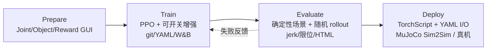
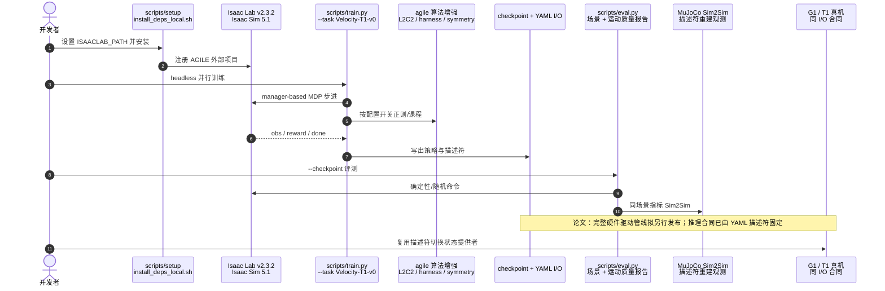

# AGILE：人形 Loco-Manipulation 学习工作流

**AGILE**（*A Generic Isaac-Lab based Engine*；论文 *AGILE: A Comprehensive Workflow for Humanoid Loco-Manipulation Learning*，[arXiv:2603.20147](https://arxiv.org/abs/2603.20147)，[代码](https://github.com/nvidia-isaac/WBC-AGILE)，[文档](https://nvidia-isaac.github.io/WBC-AGILE/)）由 **英伟达（NVIDIA）** 提出：在 [Isaac Lab](./isaac-lab.md) + RSL-RL 之上补齐 **环境核验 → 可复现训练 → 统一评测 → 描述符驱动部署** 的工程闭环，缓解人形 RL 从脚本到真机时常见的配置错误与 I/O 错位，并在 **Unitree G1** 与 **Booster T1** 上覆盖 locomotion、recovery、motion imitation 与 loco-manipulation。

## 一句话定义

**把人形 RL 从「碎片脚本」收成可回归测试的工程生命周期：先交互式验 MDP，再训可开关增强，用确定性场景+运动质量指标评测，最后用 YAML I/O 描述符把同一策略接到 MuJoCo / 真机。**

## 英文缩写速查

| 缩写 | 英文全称 | 简要说明 |
|------|----------|----------|
| AGILE | A Generic Isaac-Lab based Engine | 本文开源工作流与代码框架 |
| RL | Reinforcement Learning | 策略学习主范式（PPO / RSL-RL） |
| MDP | Markov Decision Process | 任务以配置文件描述的场景/观测/奖励/终止 |
| L2C2 | Local Lipschitz Continuity Constraint | 平滑观测→动作映射的正则，抑高频作动 |
| VLA | Vision-Language-Action | 解耦 WBC 上身路径上的 GR00T 微调示例 |
| SDG | Synthetic Data Generation | 用冻结下肢 + 上身专家采集示范供 VLA |

## 为什么重要

- **瓶颈诊断正确：** 论文主张当前主瓶颈是 **工作流与迁移合同**，不是仿真吞吐或单点新算法——与大量「训了才发现关节反向」的工程经验一致。
- **可工程复用：** 相对 Holosoma / HumanoidVerse / ProtoMotions 等偏训练扩展或跨仿真抽象的框架，AGILE 突出 **调试 GUI、确定性评测、描述符导出**（论文 Table 1）。
- **双机验证：** 同一 MDP 模板在 G1/T1 上跑通；五类技能含真机演示，loco-manipulation 另经 VLA 闭环仿真。
- **已开源：** [nvidia-isaac/WBC-AGILE](https://github.com/nvidia-isaac/WBC-AGILE) + [文档站](https://nvidia-isaac.github.io/WBC-AGILE/)；依赖 Isaac Lab **v2.3.2** / Isaac Sim **5.1**。

## 核心信息

| 项 | 内容 |
|----|------|
| **机构** | 英伟达（NVIDIA） |
| **作者** | Huihua Zhao\*、Rafael Cathomen\*、Lionel Gulich、Wei Liu、Efe Arda Ongan、Michael Lin、Shalin Jain、Soha Pouya、Yan Chang |
| **平台** | Unitree G1、Booster T1 |
| **栈** | Isaac Lab（manager-based）+ RSL-RL；评测/Sim2Sim 含 MuJoCo |
| **训练量级** | 单卡 L40 约 **6–25 h**/任务（论文 Table 2；4096 envs 量级） |
| **开源** | **已开源**（Apache-2.0；`rsl_rl` 子集 BSD 3-Clause） |

## 流程总览

## 核心原理

### 1. 四阶段生命周期

1. **Prepare：** 关节滑条（含对称镜像）、物体 6-DoF、奖励项叠加可视化——在烧 GPU 前抓模型与 MDP 错配。
2. **Train：** 配置驱动的扁平任务文件；记录 git snapshot + YAML；scaled-dict 做结构化超参扫描；算法工具箱可独立开关。
3. **Evaluate：** 脚本化命令序列（速度扫、高度斜坡等）与随机命令并行；**Isaac Lab 与 MuJoCo 共用**运动质量诊断，降低「只看平均回报」的假安全。
4. **Deploy：** 导出 TorchScript 与自包含 YAML（关节名、观测顺序、历史缓冲、动作缩放）；推理侧按描述符装配观测，状态提供者可换仿真或硬件。

### 2. 训练增强工具箱（非新算法，可组合）

| 模块 | 作用 |
|------|------|
| L2C2 | 惩罚插值观测下的策略/价值跳变 → 降 jerk 与高频能量 |
| Online reward normalization | 课程中奖励量级漂移时保持训练稳定 |
| Value-bootstrapped terminations | 终止价值中性 + 固定 σ 偏移，减少「自杀」与手调惩罚 |
| Virtual harness | 早期根部 PD 支撑，课程衰减后撤掉 |
| Symmetry augmentation | 配置驱动左右镜像，扩数据并促对称步态 |
| Velocity profiles | 上身目标用 EMA/梯形/线性插值，避免突变拖垮下肢 |
| Teacher–Student | 特权教师 → 可部署学生（含历史 MLP / RNN） |

### 3. 解耦全身控制与 VLA 数据

高度可控 locomotion 只训 **腿**，腰/上身训练期做梯形随机化，部署时交给 IK 或 VLA。Pick-and-place：上身 RL 专家在并行渲染下采成功轨迹 → 微调 **GR00T N1.5**；论文报告闭环仿真 **90% / 100** 次随机初态。

## 源码运行时序图

官方仓库 [nvidia-isaac/WBC-AGILE](https://github.com/nvidia-isaac/WBC-AGILE)（归档见 [sources/repos/wbc_agile.md](../../sources/repos/wbc_agile.md)）以 `scripts/train.py` / `scripts/eval.py` 为入口；文档站列出任务 ID：

- **最短复现路径：** 装好 Isaac Lab 2.3.2 → `install_deps_local.sh` → `scripts/train.py --task Velocity-T1-v0` → `scripts/eval.py --checkpoint …`。
- **选型注意：** 先用 `Debug-G1-v0` / `Debug-T1-v0` 做 Prepare；跨机优先复制同模板 MDP 再改机器人描述。

## 工程实践

| 项 | 建议 |
|----|------|
| 训练前 | 平坦地面重力沉降 + 关节限位扫；零动作应能站稳；用 Reward Visualizer 确认项激活 |
| 奖励结构 | 任务 / 风格 / 正则三分组；先任务+基础正则，再加风格 |
| 终止 | 难调惩罚时优先 value-bootstrapped terminations（论文默认 σ=5）；不可恢复状态仍应立刻 terminate |
| 平滑与迁移 | action norm/rate/acc + L2C2；配合动力学/质量/接触/延迟域随机化 |
| 评测门禁 | 关节限位持续违例往往预示 Sim2Sim 失败——先按运动质量指标微调再上硬件 |
| 解耦 WBC | 下肢策略冻结作 API；上身 IK/VLA/RL 专家独立迭代（对照 [HOMIE](./paper-loco-manip-161-040-homie.md) 分层思路） |
| 监控 | 回报升但任务指标不动 → 奖励 hacking；value loss 宜显著低于 1；≥5 seeds 再下结论 |

## 实验与评测

- **任务覆盖：** 速度跟踪（G1/T1）、高度可控 locomotion（G1）、stand-up（G1/T1）、舞蹈式运动模仿（G1）、pick&place + VLA（G1）。
- **Sim2Sim（G1 velocity+height，Table 3）：** 确定性 50 s 扫参给出低方差跟踪误差；随机命令需更长 horizon 方差才收敛；蒸馏学生（RNN / history）可对齐教师量级。
- **消融：** L2C2 在观测噪声升高时持续压低加速度/jerk/限位/高频能量；virtual harness 与 bootstrapped terminations 改善早期收敛与种子稳健性。
- **真机：** 五类技能以稳定执行、无控制器发散、完成指定任务为成功判据；**无外部动捕**，定量跟踪走 MuJoCo；VLA loco-manip 以仿真闭环为主。

## 结论

**AGILE 的主贡献是把人形 RL 做成可核验、可回归、可导出合同的工程工作流，而不是再堆一个孤立算法；双机五技能真机演示证明这套闭环能显著降低配置与迁移类失败。**

1. **先 Prepare 再 Train** — 关节符号、碰撞、奖励项错误用 GUI 分钟级发现，比调超参更省 GPU。
2. **评测要看运动质量** — jerk、限位、高频能量与确定性场景，比单看随机回报更接近硬件风险。
3. **描述符是迁移合同** — 关节顺序/历史缓冲/动作缩放写进 YAML，才能统一 MuJoCo Sim2Sim 与真机推理。
4. **增强模块按任务开关** — L2C2（平滑）、奖励归一化（量级）、harness（早期站立）、对称增强（步态）各有消融支持，无万能开关。
5. **解耦下肢 API** — 高度可控腿策略 + 独立上身专家，是 SDG / VLA 微调的实用路径（仿真 90% pick&place）。
6. **开源可用但绑 Isaac Lab 版本** — 跟文档钉死 2.3.2 / Sim 5.1；完整硬件驱动以仓库与后续 release 为准。
7. **局限要预留** — 目前两平台、本体感知为主；跑步/爬楼与强感知操作仍属未来扩展。

## 与其他工作对比

| 对照 | 差异读法 |
|------|----------|
| [Isaac Lab](./isaac-lab.md) | AGILE 是 Lab **之上的工作流层**，不是替代仿真底座 |
| Holosoma / HumanoidVerse / ProtoMotions | 偏大规模训练或跨仿真抽象；AGILE 偏 **调试–评测–导出合同** |
| [BeyondMimic](../methods/beyondmimic.md) | 模仿任务直接对照；AGILE 用 BeyondMimic 式设定展示工作流泛化，并强调额外 DR+L2C2 才真机 |
| [HOMIE](./paper-loco-manip-161-040-homie.md) | 同构外骨骼采集 + 分层；AGILE 用解耦 WBC + 仿真 SDG 服务 VLA |
| [YAHMP](./paper-yahmp.md) | mjlab 上的 GMT **设计消融试验台**；AGILE 是 Isaac Lab 上的 **全生命周期基础设施** |

## 局限与风险

- **平台覆盖窄：** 仅 G1 / T1；换机体仍需重做模型与对称映射核验。
- **上游依赖：** 紧绑 Isaac Lab API 演进；升级 Lab 可能破坏外部项目。
- **任务形态：** 以本体感知为主；强视觉操作与高动态 locomotion未作为主线验证。
- **真机定量：** 无动捕下的跟踪误差；硬件成功偏定性；完整 sim-to-real 驱动管线论文称将另行发布。
- **勿误读为「新 SOTA 算法」：** 价值在可组合工程闭环与回归评测，算法模块多来自既有技术的统一实现。

## 关联页面

- [Isaac Lab](./isaac-lab.md) — 仿真与 MDP 底座
- [Loco-Manipulation](../tasks/loco-manipulation.md) — 任务坐标系
- [Sim2Real](../concepts/sim2real.md) — 迁移与域随机化总览
- [Unitree G1](./unitree-g1.md) — 主要验证平台之一
- [BeyondMimic](../methods/beyondmimic.md) — 运动模仿对照与依赖谱系
- [PPO](../methods/ppo.md) / [Privileged Training](../concepts/privileged-training.md) — 训练与蒸馏读法
- [VLA](../methods/vla.md) / [GR00T N1](./paper-hrl-stack-34-gr00t_n1.md) — 上身专家微调路径
- [HOMIE](./paper-loco-manip-161-040-homie.md) — 分层 loco-manip 对照

## 参考来源

- [agile_arxiv_2603_20147.md](../../sources/papers/agile_arxiv_2603_20147.md) — 论文摘录与开源核查
- [wbc_agile.md](../../sources/repos/wbc_agile.md) — GitHub 仓库归档
- [wbc-agile-docs.md](../../sources/sites/wbc-agile-docs.md) — 官方文档站归档
- [arXiv:2603.20147](https://arxiv.org/abs/2603.20147) — 原文（Submitted 2026-03-20）

## 推荐继续阅读

- [AGILE 文档站](https://nvidia-isaac.github.io/WBC-AGILE/) — 安装、任务 ID、训练与部署指南
- [nvidia-isaac/WBC-AGILE](https://github.com/nvidia-isaac/WBC-AGILE) — 代码与 Office Hour FAQ
- [Isaac Lab 文档](https://isaac-sim.github.io/IsaacLab/) — 上游 manager-based 环境约定
