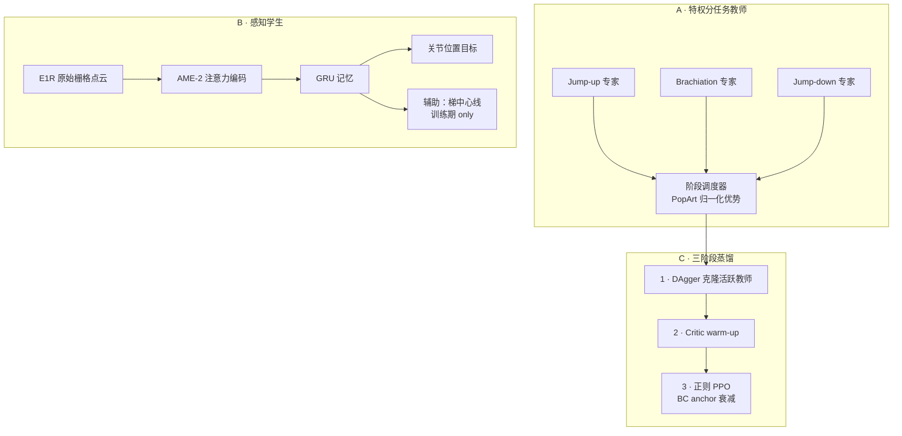

# Agile Perceptive Traversal：人形稀疏 3D 结构敏捷感知穿越

**Agile Perceptive Traversal**（*Learning Agile Perceptive Traversal of Sparse 3D Structures for Humanoids*，[arXiv:2608.29769](https://arxiv.org/abs/2608.29769)，[项目页](https://nemantor.github.io/sparse-3d-traversal-website/)）由 **苏黎世联邦理工（ETH Zürich）Robotic Systems Lab**（Marco Hutter 组）与 **ETH AI Center**、**CVG** 提出：在 **ENGINEAI PM-01** 人形上，用头部 **RoboSense E1R** 固态 LiDAR 的 **原始稀疏回波** 直接驱动 RL 策略，经 **AME-2 注意力编码 + GRU 记忆** 与 **分阶段多教师蒸馏**，完成 **跳上猴架→荡杆→跳下** 全序列及 **2 cm 横截面矮身通过**——据作者称系首个 onboard 感知并完成该全序列的人形演示。

## 一句话定义

**不用高程图或体素，把固态 LiDAR 上几根横杆的零星回波用注意力「点选」出来，再靠分阶段特权教师蒸馏成可部署的单策略，在真机爆发式全身接触序列里仍能对准厘米级稀疏结构。**

## 英文缩写速查

| 缩写 | 英文全称 | 简要说明 |
|------|----------|----------|
| AME-2 | Attention-based Map Encoding (2nd gen) | 本文感知骨干：栅格化 LiDAR 上的注意力编码 |
| GRU | Gated Recurrent Unit | 融合多帧稀疏感知与本体 |
| LiDAR | Light Detection and Ranging | 头部 RoboSense E1R 固态扫描 |
| RL | Reinforcement Learning | PPO + 蒸馏后正则化微调 |
| PPO | Proximal Policy Optimization | 教师训练与蒸馏后 RL 精炼 |
| DAgger | Dataset Aggregation | 多教师→感知学生的第一阶段克隆 |
| Sim2Real | Simulation to Real | 电池压降、热限、E1R 噪声建模 |
| BC | Behavior Cloning | 蒸馏阶段的模仿损失 |

## 为什么重要

- **感知表征边界：** 2.5D 高程图丢悬空细杆；体素全 3D 但算存随分辨率暴涨；本文证明 **原始 LiDAR + 注意力** 足以对准 **1–3 cm 半径** 稀疏结构。
- **任务难度轴：** 猴架同时压 **细感知、硬探索、爆发全身控制** 三轴，比稠密地形 parkour 更极端。
- **工程闭环：** 被动钩末端 + 腕 yaw 脱钩 + 执行器热/电池模型 + E1R 射线发散噪声，支撑 **14/15** 真机全序列成功率。
- **可迁移感知栈：** 同一 AME-2+GRU 骨干 **不改架构** 另训矮身策略，10/10 通过 2×2 cm 杆。

## 核心信息

| 项 | 内容 |
|----|------|
| **机构** | 苏黎世联邦理工（ETH Zürich）RSL；ETH AI Center；CVG |
| **平台** | ENGINEAI PM-01 + 被动钩式手 + 头部 E1R（192×144→策略用 36×35×4） |
| **训练** | Isaac Lab + RSL-RL；分任务特权教师 + 阶段调度器 |
| **真机定位** | SE(3) LiDAR-惯性里程计；策略 onboard 运行 |
| **开源** | **确认未开源**（截至 **2026-09-02** [项目页无代码链](https://nemantor.github.io/sparse-3d-traversal-website/)） |

## 流程总览

## 核心原理

### 1. 分阶段多教师 + 感知学生

- **三专家：** 跳上、荡杆、跳下各自在 **特权信息**（真值横杆端点等）下 PPO 训练。
- **阶段调度：** 单 episode 内按任务阶段切换活跃教师；优势按阶段 **PopArt** 归一化，缓解奖励尺度异质。
- **学生：** 仅 **本体 + 命令 + E1R**；AME-2 在 **2D 扫描栅格** 上做注意力（非无序点集）；GRU 积分间歇稀疏回波。

### 2. 硬件与 sim2real

- **被动钩：** 60 mm 开口容忍落点误差；对称结构支持双向荡杆；腕 yaw 转出平面即可脱钩，减抬身热负荷。
- **执行器：** 电池压降与热限代理，贴近爆发动作下的力矩/速度饱和。
- **E1R 噪声：** 射线发散边缘 bleed、虚假回波、深度间断 dropout——在 MuJoCo 中做 sim-to-sim 再硬件验证。

### 3. 矮身扩展

- 独立策略，**复用同一 AME-2+GRU 架构**；教师用高程图特权，学生在 **仅 E1R** 下蒸馏；验证感知栈不限于猴架。

## 源码运行时序图

**不适用** — 截至入库日（2026-09-02）项目页 **无官方 GitHub**。若未来开源，预期路径：Isaac Lab 训分任务教师 → 阶段调度 DAgger 蒸馏 → E1R 噪声 MuJoCo 验证 → PM-01 onboard 部署（SE(3)-LIO 定位 + 策略推理）。

## 工程实践

| 项 | 建议 |
|----|------|
| 感知编码器 | AME-2（13.8k 参数）蒸馏 BC loss 优于 CNN/MLP 一个数量级；**盲学生不可行** |
| 辅助监督 | 梯中心线辅助损失降低各阶段 BC loss；部署时移除辅助头 |
| 横杆几何 | 真机三梯：h=1.69–1.75 m，间距 0.26–0.33 m；弱支撑结构亦在 14/15 内 |
| 速度 | 荡杆 **0.5 m/s**，与人类荡杆文献量级相当 |
| 定位 | 冲击下普通 VIO 易失效；作者选用 **SE(3)-LIO** 最稳 |
| 复现 | 等待官方 sim + 噪声模型 + 钩具 CAD 发布 |

## 实验与评测

**编码器消融（Table IV，BC loss ×10⁻²）：** AME-2+aux **2.35** total；盲学生 **2.90** — 确认外感知必要。

**MuJoCo sim-to-sim（Table V）：** h=1.65–1.90 m、s=0.35 m 时完整序列成功率 **70–90%**。

**真机猴架（15 trials）：**

| 梯 | h [m] | s [m] | trials | 完整序列 |
|----|-------|-------|--------|---------|
| A | 1.69 | 0.26 | 9 | 9/9 |
| B | 1.72 | 0.31 | 2 | 2/2 |
| C | 1.75 | 0.33 | 4 | 3/4 |
| **合计** | — | — | **15** | **14/15 (93%)** |

唯一失败：跳上成功后钩未前进到下一根杆。矮身：2×2 cm 随机朝向木条 **10/10**。

## 结论

**稀疏悬空结构的 onboard 敏捷穿越，可以用「原始 LiDAR + 注意力 + 分阶段蒸馏」在通用人形上落地，但必须把传感器与执行器非理想性写进训练环。**

1. **表征** — 跳过中间地图，AME-2 在 **极少回波** 上仍可选中任务相关点。
2. **探索** — 分任务特权教师 + 阶段调度，比单策略盲探索更易收敛爆发接触序列。
3. **蒸馏** — DAgger → critic warm-up → 正则 PPO 三阶段；辅助几何监督帮助 GRU 骨干。
4. **硬件** — 被动钩 + 热/电池模型 + E1R 噪声是 **14/15** 真机成功的关键，而非仅增大仿真随机化。
5. **泛化** — 同一感知骨干可迁到 **矮身**；多几何长时记忆仍 open。
6. **对照** — 相对 [LadderMan](./paper-ladderman-humanoid-perceptive-ladder-climbing.md)（深度+VFM）与 [AME-2](./paper-notebook-ame-2-agile-and-generalized-legged-locomotion-vi.md)（稠密地形），本文专攻 **厘米级稀疏 LiDAR 接触**。
7. **开源** — 截至 2026-09-02 **无代码**；复现需等 ETH 发布。

## 与其他工作对比

| 对照 | 差异读法 |
|------|----------|
| [AME-2](./paper-notebook-ame-2-agile-and-generalized-legged-locomotion-vi.md) | 稠密地形高程/注意力；本文把 **同一编码器** 迁到 **原始 E1R 稀疏点云** |
| [LadderMan](./paper-ladderman-humanoid-perceptive-ladder-climbing.md) | 深度+VFM 梯子攀爬；本文 **LiDAR 直接感知** + **荡杆/跳跃** 全序列 |
| [Humanoid parkour](./paper-hrl-stack-22-perceptive_humanoid_parkour.md) | 稠密障碍跑酷；本文专攻 **厘米级悬空细杆** |
| 体素 / 高程图路线 | 丢悬空结构或算存随分辨率暴涨；本文 **map-free raw LiDAR** |

## 局限与风险

- **任务策略分离：** 猴架与矮身为 **独立训练策略**，非单一通用控制器。
- **几何多样性：** 仅验证少数梯距/高度与 2 cm 杆；更长时距、更复杂 3D 结构未覆盖。
- **平台专用：** PM-01 + 钩具 + E1R 安装位形；换平台需重训与重标定噪声模型。
- **定位依赖：** 全序列需可靠 onboard 里程计；冲击场景对 VIO 仍是单点故障。
- **未开源：** sim、奖励与噪声参数未公开。

## 关联页面

- [AME-2](./paper-notebook-ame-2-agile-and-generalized-legged-locomotion-vi.md) — 本文感知编码器直接前作
- [LadderMan](./paper-ladderman-humanoid-perceptive-ladder-climbing.md) — 人形梯子攀爬（深度路线对照）
- [Perceptive humanoid parkour](./paper-hrl-stack-22-perceptive_humanoid_parkour.md) — 稠密地形端到端感知运动
- [Stair / obstacle perceptive locomotion](../tasks/stair-obstacle-perceptive-locomotion.md) — 感知 loco 任务语境
- [Privileged training](../concepts/privileged-training.md) — 教师–学生范式
- [Sim2Real](../concepts/sim2real.md) — 执行器与传感器建模

## 参考来源

- [Agile Perceptive Traversal 论文归档](../../sources/papers/agile_perceptive_traversal_arxiv_2608_29769.md)
- [sparse-3d-traversal 项目页](../../sources/sites/sparse-3d-traversal-github-io.md)

## 推荐继续阅读

- [arXiv:2608.29769 PDF](https://arxiv.org/pdf/2608.29769) — Table IV–V 与 E1R 噪声建模附录
- [项目页](https://nemantor.github.io/sparse-3d-traversal-website/) — 真机视频与 LiDAR 注意力可视化
