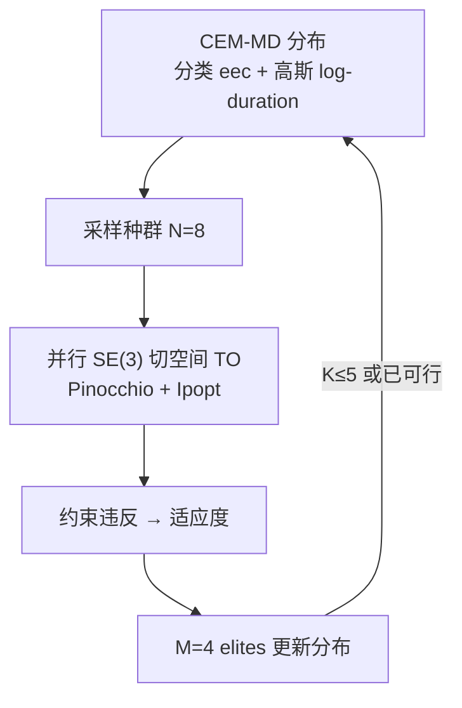

# AHMP：接触序列发现 + SE(3) 切空间全身规划

**AHMP**（*Agile Humanoid Motion Planning with Contact Sequence Discovery*，Humanoids 2025，[DOI](https://doi.org/10.1109/Humanoids65713.2025.11203211)，[代码](https://github.com/hucebot/ahmp)）由 **Inria / Université de Lorraine / CNRS** 与 **帕特雷大学 LAR / Archimedes** 提出：外层用混合分布交叉熵（CEM-MD）并行采样接触构型，内层用 [SE(3) 切空间轨迹优化](./paper-se3-tangent-to.md) 评估全身动力学可行性，从而在复杂环境里自动生成动态多接触计划，而不必手写步态。

## 一句话定义

**把「哪只手脚何时撑多久」交给黑盒采样，把「全身是否动力学可行」交给能跑现成 Ipopt 的 SE(3) 切空间 TO——分钟级找出敏捷多接触轨迹。**

## 英文缩写速查

| 缩写 | 英文全称 | 简要说明 |
|------|----------|----------|
| AHMP | Agile Humanoid Motion Planning | 本文双层多接触规划框架 |
| CEM-MD | Mixed-Distribution Cross-Entropy Method | 同时采样离散末端组合与连续接触时长 |
| TO | Trajectory Optimization | 内层全身动力学直接转录 NLP |
| SE(3) | Special Euclidean Group in 3D | 浮动基位姿流形；优化变量取其切空间坐标 |
| NLP | Nonlinear Program | Ipopt 求解的有限维优化问题 |

## 为什么重要

- **接触不必手编：** 相对 stance-before-motion 图搜索或 MIP，AHMP 用可并行的黑盒外层探索 \(2^K\) 末端组合与相位时长。
- **内层可复用现成求解器：** 切空间转录让全身 TO 跑在欧式 Ipopt 上，不必等成熟的流形 DDP（对照 [Crocoddyl](./crocoddyl.md) / ProxDDP）。
- **工程时间尺度可读：** 平均任务中位约 **200 s** 量级（16 核工作站），扶手场景 20 次全成功——适合离线参考生成，不是毫秒 MPC。

## 核心信息

| 项 | 内容 |
|----|------|
| **机构** | 法国国家信息与自动化研究所（INRIA）；帕特雷大学（University of Patras）LAR；雅典娜研究中心（Athena RC）/ Archimedes |
| **平台** | PAL Robotics Talos，32 DoF，1.75 m / 95 kg |
| **栈** | Python + Pinocchio 动力学/导数 + Ipopt（论文用 HSL MA97） |
| **外层** | \(N=8\) 种群、\(M=4\) elites、最多 \(K=5\) 代；发现可行即停 |
| **开源** | **已开源**（BSD-2-Clause）：[hucebot/ahmp](https://github.com/hucebot/ahmp)；内层最新 TO 见 [upatras-lar/se3_trajopt](https://github.com/upatras-lar/se3_trajopt) |

## 核心原理

每个 CEM 个体是一串接触构型 \(C=(eec,d)\)：\(eec\) 为末端接触的二进制掩码，\(d\) 在对数空间编码相位时长（避免高斯采样出负时间）。内层把时域切成这些相位，接触/无接触分别施加摩擦锥、贴地、零滑移或离地约束，用切空间坐标 \(\xi_k\) 做精确 retraction 积分。适应度不是最优代价，而是 **有限 Ipopt 迭代后的约束违反**——外层在「尽快找到可行计划」。

### 流程总览



## 源码运行时序图

官方仓 [hucebot/ahmp](https://github.com/hucebot/ahmp)（归档见 [sources/repos/ahmp.md](../../sources/repos/ahmp.md)）：

```mermaid
sequenceDiagram
    autonumber
    actor Dev as 开发者
    participant Dock as ci/ Docker<br/>run_docker.sh
    participant Shell as cem_exps/run_exps.sh
    participant Par as trajopt_parallel.py
    participant CEM as src/cem
    participant TO as src/nltrajopt
    participant Pin as Pinocchio + Ipopt
    Dev->>Dock: docker build -t ahmp；可选放入 HSL
    Dev->>Shell: 或直接调用并行脚本
    Shell->>Par: --exp handrails/chimney --robot talos --dz
    loop CEM 迭代
      Par->>CEM: SamplePop 接触掩码与时长
      Par->>TO: 并行 SolveTrajopt
      TO->>Pin: 全身逆动力学与切空间雅可比
      Pin-->>TO: 约束违反 / 轨迹
      TO-->>CEM: 适应度，更新分布
    end
```

- **最短复现路径：** Docker → `python src/examples/cem_exps/trajopt_parallel.py --exp chimney --robot talos --dz 1.0`。
- **内层升级：** README 指向 [se3_trajopt](https://github.com/upatras-lar/se3_trajopt)，不要只盯 AHMP 仓内嵌的 TO 副本。

## 工程实践

| 项 | 建议 |
|----|------|
| 场景约束 | 扶手实验把「手只能碰栏、脚只能碰地」写死，避免脚踩扶手的无聊解 |
| 终态 | 走廊实验人工固定终点接触为稳定双支撑 |
| 烟囱初值 | 论文承认贴墙初态靠代码里手工加 stance；不是从站立自动贴墙 |
| elites | 烟囱 3 m 消融：**约 50%** 种群作 elite 优于 30%（过早收缩）或 80%（收敛慢） |
| 线性求解器 | 论文 HSL MA97；无许可时改 IPOPT 选项，或改用扩展仓的 MUMPS 栈 |
| 下游跟踪 | 本仓库只出开环计划；真机需另接 WBC / RL 跟踪 |

## 实验与评测

- **Handrails：** 前移 3 m；**20/20 成功**，平均墙钟 **<200 s**（项目页 10-run 中位约 100 s，口径不同）。
- **Chimney \(\Delta z=1\,\mathrm{m}\)：** 约 **85%** 在 5 代内可行；动作更左右摆、借力上爬。
- **Chimney \(\Delta z=3\,\mathrm{m}\)：** 约 **50%**；轨迹更「刻意爬升」。作者保持两高度超参相同以展示差异，而不是把高目标调到最高成功率。
- **对照：** 相对准静态多接触规划（论文引 [4]），AHMP 强调**动态**全身过渡；墙钟同为数百秒量级，但技能不可直接比。

## 结论

**AHMP 的价值是「分钟级自动发现动态接触序列」，不是在线 MPC，也不是接触隐式一条 NLP 打天下。**

1. **外层只搜接触，内层只判可行** — 适应度用约束违反，不要指望它给出最优能耗步态。
2. **切空间内层是能跑起来的关键** — 与 [SE(3) 切空间 TO](./paper-se3-tangent-to.md) 共用；四元数积分会变慢、空翻更脆。
3. **扶手简单、烟囱难** — 3 m 烟囱 50% 说明接触组合更复杂时要加相位数或调参，而不是同一组 \(N,K\) 包打。
4. **elite 比例是短时性能旋钮** — 太少会跟坏种子走，太多会稀释。
5. **无自碰撞、无真机** — 计划可穿模；落地必须再过碰撞与跟踪层。

## 与其他工作对比

| 对照 | 差异读法 |
|------|----------|
| [SE(3) 切空间 TO](./paper-se3-tangent-to.md) | **内层相同、接触日程给定**；AHMP 在外层自动发现接触 |
| [FARO](./paper-faro-feasibility-aware-robot-motion-optimization.md) | 接触序列来自树/LLM/人，用 IK→KSO→TO **剪枝**；AHMP 用 CEM **采样**，无嵌套运动学过滤器 |
| [DSMS](../methods/dsms-contact-implicit-multiple-shooting.md) | **接触隐式**（仿真器内解析，无时刻表）；AHMP **接触显式**且由 CEM 提出时刻表 |
| [Crocoddyl](./crocoddyl.md) | shooting/DDP 工具链；AHMP 是配点 + Ipopt + 切空间坐标 |

## 局限与风险

- **仿真规划 only：** 无真机、无跟踪控制器。
- **不检查自碰撞。**
- **烟囱初始化有工程捷径**（手工 stance）。
- **HSL 许可**可能挡住开箱复现；先确认线性求解器。
- 项目页成功率（约 10 次）与论文 20 次种子数字不要混用。

## 关联页面

- [SE(3) 切空间浮动基 TO](./paper-se3-tangent-to.md) — 内层表示法对比与 Go2 空翻开源
- [Trajectory Optimization](../methods/trajectory-optimization.md) — 直接配点与接触显式/隐式
- [FARO](./paper-faro-feasibility-aware-robot-motion-optimization.md) — 接触序列上的嵌套可行性剪枝
- [DSMS](../methods/dsms-contact-implicit-multiple-shooting.md) — 接触隐式多重打靶对照
- [SE(3) Representation](../formalizations/se3-representation.md)
- [Pinocchio](./pinocchio.md) / [Crocoddyl](./crocoddyl.md)

## 参考来源

- [ahmp_humanoids_2025.md](../../sources/papers/ahmp_humanoids_2025.md)
- [ahmp.md](../../sources/repos/ahmp.md)
- [ibrics-lar-upatras.md](../../sources/sites/ibrics-lar-upatras.md)
- [HAL 全文](https://hal.science/hal-05072261)

## 推荐继续阅读

- [hucebot/ahmp](https://github.com/hucebot/ahmp)
- [AHMP 视频](https://www.youtube.com/watch?v=yIyk8GPU9YE)
- [IBRICS 项目页](https://lar.upatras.gr/projects/ibrics.html)
- [se3_trajopt](https://github.com/upatras-lar/se3_trajopt)
