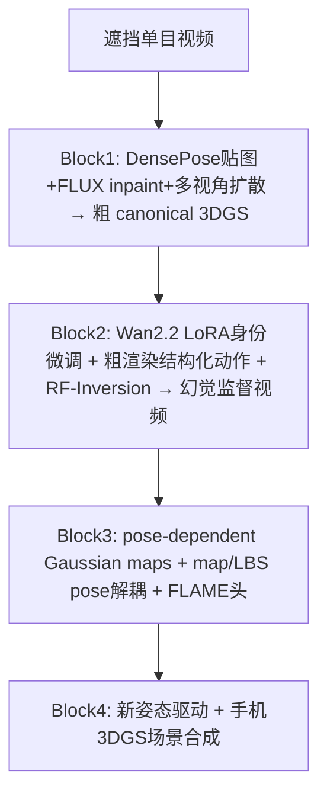

# AHOY：遮挡 YouTube 视频也能重建可动画 3D 数字人

**AHOY**（*Animatable Humans under Occlusion from YouTube Videos with Gaussian Splatting and Video Diffusion Priors*，[arXiv:2603.17975](https://arxiv.org/abs/2603.17975)，[项目页](https://miraymen.github.io/ahoy/)）由 **图宾根 AI 中心 / 图宾根大学** Aymen Mir、**帝国理工** Riza Alp Guler、**KAUST** Xiangjun Tang 与 Peter Wonka、**马克斯·普朗克信息学研究所 / 图宾根** Gerard Pons-Moll 提出（ECCV 2026）。现有可动画 3D 人方法大多假设主体 **基本无遮挡**；真实 YouTube 访谈、vlog、综艺里人体常被桌椅、他人或画幅裁切挡住。AHOY 用 **视频扩散先验把粗渲染「幻觉」成密集监督**，再从稀疏可见纹理 bootstrap 出完整 pose-dependent 3D Gaussian avatar。

## 一句话定义

**给定重度遮挡的单目野外视频，用 DensePose 贴图 + 多视角/视频扩散幻觉监督，重建可新姿态驱动并合成进手机 3DGS 场景的完整 3D Gaussian 数字人。**

## 英文缩写速查

| 缩写 | 英文全称 | 简要说明 |
|------|----------|----------|
| AHOY | Animatable Humans under Occlusion from YouTube Videos | 本文框架 |
| 3DGS | 3D Gaussian Splatting | 显式高斯原语的可微人体/场景表示 |
| LBS | Linear Blend Skinning | 将 canonical 高斯变形到姿态空间 |
| RF-Inversion | Rectified Flow Inversion | 把粗渲染嵌入身份微调扩散潜空间并解码精炼 |
| FLAME | Faces Learned with an Articulated Model and Expressions | 头部参数化模型；本文单独监督保面部身份 |
| LOSO | Leave-One-Subject-Out | BEHAVE 等评测中的被试留一协议（对比用） |

## 为什么重要

- **把「遮挡」从噪声变成可学习信号：** 大量互联网人视频天然遮挡；若能重建完整 avatar，等于解锁 **YouTube 级外观多样性** 而无需多相机棚。
- **幻觉监督范式可迁移：** 身份微调 Wan 2.2 + RF-Inversion 把「从未见过的后背/内臂」变成训练标签——对其它稀疏视角人体重建、数字孪生都有参考价值。
- **map pose / LBS pose 解耦：** 扩散生成视频 **跨视角几何不一致** 是硬坑；共享 map pose、逐帧优化 LBS pose 是工程上可复述的吸收策略。
- **对人形研究的边界：** 输出是 **可渲染 splat**，不是机器人关节指令。若要做跟踪/重定向，仍走 [SMPL-X](../concepts/smpl-x.md) → [GVHMR](./gvhmr.md) → [GMR](../methods/motion-retargeting-gmr.md)；AHOY 属于 [训练数据管线](../queries/humanoid-training-data-pipeline.md) 的 **外观/数字人层** 对照，不是新的重定向前端。

## 核心信息

| 项 | 内容 |
|----|------|
| **机构** | 图宾根大学（University of Tübingen）/ 图宾根 AI 中心；马克斯·普朗克研究所（Max Planck）信息学所；帝国理工学院（Imperial College London）；阿卜杜拉国王科技大学（KAUST） |
| **会议** | ECCV 2026 |
| **输入** | 单目野外视频（YouTube 或 BEHAVE 前视），允许重度遮挡 |
| **输出** | 可动画 3DGS avatar；可合成进手机拍摄的 3DGS 场景 |
| **开源** | **截至 2026-09-06 项目页无代码/权重链接** |

## 方法

### 四阶段管线

### 核心机制（四条贡献）

1. **幻觉即监督（hallucination-as-supervision）** — 粗 avatar 渲染经身份微调扩散逆映射，为 **从未观测的身体区域** 生成密集、身份一致的多视角视频标签。
2. **Canonical → pose-dependent 两阶段** — 单目遮挡下先学 **canonical Gaussian maps**（无 pose-dependent offset），再用结构化转身/坐姿序列提供的「伪多视角」升级到高保真 pose-dependent maps（借鉴 Animatable Gaussians 的 2D map 设计）。
3. **Map pose / LBS pose 解耦** — StyleUNet 输入的 map pose 在相似姿态帧间共享；LBS 变形 pose 逐帧优化，吸收扩散样本的几何不一致。
4. **头身分路** — 身体用 Wan 幻觉视频；头部用专用多视角人脸扩散，避免视频扩散 **面部身份漂移**。

### 关键依赖组件

| 模块 | 作用 |
|------|------|
| NLF + SAM 3 | 逐帧 SMPL 与可见性 mask |
| DensePose + FLUX | 部分 canonical 纹理 → inpaint 完整正面图 |
| SyncHuman 类多视角扩散 | 4 canonical views 监督粗 3DGS |
| Wan 2.2 + Dynamic Concepts 式 LoRA | 主体身份先验 |
| RF-Inversion | 粗渲染 → 身份一致幻觉视频 |
| FLAME 头路 | 面部身份保持 |

## 源码运行时序图

**不适用** — 截至 2026-09-06，[项目页](https://miraymen.github.io/ahoy/) 未提供官方 GitHub、权重或可辨识 `train.py` / `eval.py` 入口。管线含多轮优化与扩散推理，复现需等待代码发布或自行实现四 Block。

## 工程实践

| 项 | 建议 |
|----|------|
| 复现入口 | **暂无**；盯项目页是否上线仓库 |
| 计算 | 论文在 NVIDIA RTX ADA A6000 上跑实验；含多阶段优化 + 扩散，**显著慢于** LHM/IDOL 等前馈法 |
| 数据 | 自采 50 段遮挡 YouTube + BEHAVE 8 序列（4 Kinect，自然遮挡） |
| 基线口径 | LHM/IDOL 为 **单图** 方法；公平对比时作者亦提供 **canonical 无遮挡图** 作为其输入上界 |
| 误用 | 不要把 BEHAVE PSNR 当成机器人策略指标；不要把 splat 动画直接当 [重定向](../concepts/motion-retargeting.md) 输入 |

## 实验与评测

### YouTube 静态重建（遮挡输入，Table 1 左）

| 方法 | PSNR ↑ | SSIM ↑ | LPIPS ↓ |
|------|--------|--------|---------|
| LHM | 19.12 | 0.803 | 0.207 |
| IDOL | 17.31 | 0.771 | 0.241 |
| SyncHuman | 19.82 | 0.819 | 0.189 |
| **AHOY** | **22.01** | **0.881** | **0.109** |

### YouTube 动画（遮挡输入，Table 2）

| 方法 | PSNR ↑ | SSIM ↑ | LPIPS ↓ |
|------|--------|--------|---------|
| LHM | 19.03 | 0.821 | 0.181 |
| IDOL | 16.52 | 0.769 | 0.231 |
| **AHOY** | **22.81** | **0.887** | **0.107** |

### BEHAVE（novel view / novel pose，Table 1 右）

| 设定 | AHOY PSNR | LHM |
|------|-----------|-----|
| Novel view | **24.12** | 18.21 |
| Novel pose | **22.81** | 16.93 |

消融（BEHAVE novel view）：完整 **24.12** → 仅粗 avatar **16.10**；去 RF-Inversion **21.10**；去 map/LBS 解耦 **22.60**；去头身分路 **23.60**。

## 与其他工作对比

| 对照 | 差异读法 |
|------|----------|
| **LHM / IDOL** | 前馈单图 animatable avatar；遮挡输入时质量崩塌，即使给 canonical 图仍低于 AHOY |
| **[LUNA](./paper-luna-universal-3d-human-animation.md)** | LBS-free 前馈 2D→3D 动画；假设相对完整驱动图，不解决 **从未见过的身体区域** |
| **[4DAnyone](./paper-4danyone.md)** | 单目视频 → 生成多视角再 4DGS；仍偏 **可见主体** 设定 |
| **Vid2Avatar / GauHuman** | 优化式单目 avatar；遮挡严重时缺乏补全机制 |
| **AHA!** | 同团队前作：已重建 avatar 在 3DGS 场景中动画；AHOY 解决 **从遮挡视频得到 avatar** 的前端缺口 |

## 结论

**AHOY 的核心不是又一个 3DGS 拟合器，而是证明：重度遮挡的单目 YouTube 视频可以通过「身份扩散幻觉」变成可动画数字人——但代价是多阶段优化、扩散依赖与未开源的工程摩擦。**

1. **遮挡是问题设定，不是后处理：** 幻觉监督专门为 **大段从未观测的身体** 设计；去掉 Block 2–3 后 BEHAVE PSNR 从 24.12 跌到 16.10。
2. **RF-Inversion 不是锦上添花：** 去掉后 novel view 掉到 21.10，未观测区残留粗渲染伪影。
3. **map/LBS 解耦是吃扩散数据的必要条件：** 否则多视角不一致导致模糊（22.60 vs 24.12）。
4. **头必须单独管：** Wan 视频监督全身会丢身份；FLAME 分路是保脸的关键一环。
5. **对人形只值外观层对照：** 要关节/策略仍走 HMR → 重定向；AHOY 产 splat，不能替代参考运动库。
6. **现阶段不可复现：** 无公开代码；管线慢于前馈 avatar 方法；扩散可能 **幻觉出合理但错误** 的未见部位。

## 局限与风险

- **未开源：** 项目页无仓库；多模块（NLF、SAM3、Wan、FLUX 等）拼装，自行复现成本高。
- **扩散上界：** 从未观测区域的质量受身份微调视频模型束缚；可能生成 plausible 但错误的细节。
- **速度与规模：** 多阶段优化 + 扩散推理，难对标 LHM/IDOL 秒级前馈。
- **伦理与深度伪造：** YouTube 级身份重建需关注同意与滥用风险（论文未展开产品化合规）。
- **机器人误读：** splat 动画 ≠ 可部署人形控制策略。

## 关联页面

- [SMPL-X](../concepts/smpl-x.md) — 人体中间表征与 LBS 语境
- [GVHMR](./gvhmr.md) — 单目 → 世界对齐骨架（机器人链常用）
- [LUNA](./paper-luna-universal-3d-human-animation.md) — 另一路 LBS-free 3D 人动画
- [4DAnyone](./paper-4danyone.md) — 单目视频 4DGS 数字人
- [人形训练数据管线](../queries/humanoid-training-data-pipeline.md) — 外观层 vs 参考运动层
- [Generative World Models](../methods/generative-world-models.md) — 视频扩散先验语境

## 参考来源

- [AHOY 论文摘录（arXiv:2603.17975）](../../sources/papers/ahoy_arxiv_2603_17975.md)
- [AHOY 项目页归档](../../sources/sites/ahoy-miraymen-github-io.md)

## 推荐继续阅读

- [AHOY 项目页](https://miraymen.github.io/ahoy/)
- [arXiv 全文](https://arxiv.org/abs/2603.17975)
- LHM（Qiu et al., ICCV 2025）— 主要 animatable 基线之一
- Animatable Gaussians（Li et al., CVPR 2024）— pose-dependent Gaussian maps 设计来源
