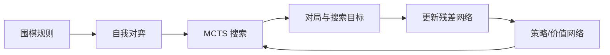

# AlphaGo Zero：从规则开始的纯自我对弈

**一句话定义：** AlphaGo Zero 以围棋规则为唯一先验，通过自我对弈训练策略/价值网络，并让 MCTS 在搜索时使用它们的输出。

## 英文缩写速查

| 缩写 | 英文全称 | 简要说明 |
|------|----------|----------|
| RL | Reinforcement Learning | 根据对局结果学习策略 |
| MCTS | Monte Carlo Tree Search | 用策略先验和价值估计进行树搜索 |
| CNN | Convolutional Neural Network | 处理棋盘空间结构的神经网络 |
| PUCT | Predictor + Upper Confidence bound applied to Trees | 把策略先验加入树搜索探索项 |

## 为什么重要

与 AlphaGo 相比，AlphaGo Zero 去掉了人类棋谱监督和分离的 rollout 价值链路，把训练闭环收敛为“当前网络指导搜索—搜索结果产生自博弈数据—网络更新”。它让算法是否能从环境规则与奖励中自举成为可检验问题。

## 方法：自博弈闭环

当前网络给出每个位置的着法分布与胜负价值。MCTS 用网络输出指导候选着法搜索；搜索后的着法用于生成对局，终局胜负成为价值监督。训练期间迭代更新网络并从历史版本采样对弈。

## 实验与评测

论文报告 AlphaGo Zero 在三天训练后以 100:0 击败先前 AlphaGo。重点是该工作减少了人类知识输入，而不是“训练无需计算”：自我对弈样本、分布式训练、搜索预算与加速硬件仍是系统的重要条件。

## 与 AlphaGo 和 AlphaZero 的对比

| 系统 | 人类棋谱 | 任务范围 | 主要变化 |
|------|----------|----------|----------|
| AlphaGo（2016） | 使用 | 围棋 | 监督策略 + 自我对弈 RL + 策略/价值网络与 MCTS |
| AlphaGo Zero（2017） | 不使用 | 围棋 | 从规则起步，策略/价值共享网络与纯自我对弈 |
| AlphaZero（2017/2018） | 不使用 | 围棋、国际象棋、将棋 | 将 Zero 风格的闭环推广到多个棋类 |

## 结论

**总判：AlphaGo Zero 的关键推进是移除人类棋谱依赖，并以单网络—搜索—自博弈闭环展示规则驱动的强化学习。**

1. “无棋谱”不等于“无先验”：棋规、合法着法、奖励和搜索结构仍被提供。
2. 训练数据由搜索与自我对弈在线生成，系统成本远高于单纯监督训练。
3. 100:0 是论文中的特定对手与计算设置，不能脱离训练预算作绝对排名。
4. 这是完美信息离散博弈，不代表连续控制或真实机器人能直接复用。

## 工程实践与开源状态

Nature 论文、补充信息与棋谱公开可读；截至 2026-10-10，未找到官方可运行训练代码或官方模型权重。本页不绘制源码运行时序图，因为 DeepMind 未提供官方可运行实现。可以将论文作为实现规格，复现时需自行搭建棋规环境、并行自博弈与 MCTS。

## 局限与风险

- 方法依赖规则完备、结果可验证的环境；奖励定义直接由胜负给出。
- 训练过程高度依赖算力、搜索和自博弈数据吞吐。
- 只在围棋领域训练，不能把它直接视为一个已验证的通用多任务 agent。
- 社区复现可用于学习原理，但不应冒充官方 checkpoint 或原始系统。

## 关联页面

- [强化学习 Runner 与自博弈](../concepts/rl-runner.md)
- [深度强化学习游戏里程碑](../concepts/deep-rl-game-milestones.md)
- [MuZero：潜在动态模型与规划](./paper-muzero-planning-latent-dynamics.md)

## 参考来源

- [Nature 论文归档](../../sources/papers/alphago-zero-nature-2017.md)
- [DeepMind 官方研究资料归档](../../sources/sites/alphago-zero-deepmind.md)

## 推荐继续阅读

- [AlphaGo Zero Nature 论文](https://doi.org/10.1038/nature24270)
- [AlphaZero Science 论文预印本](https://arxiv.org/abs/1712.01815)
- [AlphaZero 与 MuZero 官方研究入口](https://deepmind.google/research/alphazero-and-muzero/)
