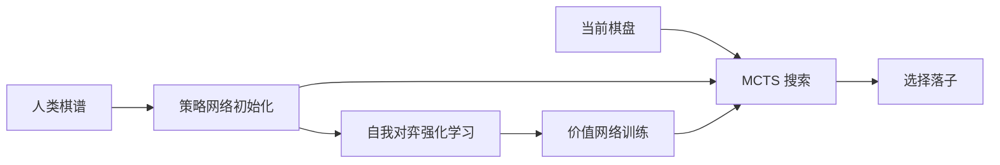

# AlphaGo：深度策略/价值网络与树搜索

**一句话定义：** AlphaGo 是一个围棋系统，用策略网络缩小搜索范围、用价值网络估计局面，再以蒙特卡洛树搜索（MCTS）挑选落子。

## 英文缩写速查

| 缩写 | 英文全称 | 简要说明 |
|------|----------|----------|
| RL | Reinforcement Learning | 通过对局奖励改进策略 |
| MCTS | Monte Carlo Tree Search | 在博弈树中分配模拟预算的搜索方法 |
| CNN | Convolutional Neural Network | 从棋盘局面提取空间特征的网络 |
| SL | Supervised Learning | 用人类棋谱监督初始化策略 |

## 为什么重要

AlphaGo 的核心不是“神经网络取代搜索”，而是把学习到的先验、局面评估与显式搜索分工组合。这个组合证明了深度学习可以在巨大的离散决策空间中为规划提供有效引导，也成为后续 AlphaGo Zero、AlphaZero 与 MuZero 的历史起点。

对机器人研究的启发是：学习策略可以帮助搜索聚焦，但围棋的确定规则、离散动作和可重复模拟，与机器人连续控制、传感不确定性及真实硬件安全约束不同。

## 方法：学习网络如何配合搜索

系统使用策略网络为每个候选着法提供先验概率，并用价值网络评估局面终局价值。训练先从人类棋谱学习着法分布，再通过自我对弈强化学习优化策略；价值网络学习预测自我对弈结果。在线下棋时，MCTS 结合策略先验与价值估计，对候选变化进行有限预算搜索。

## 实验与评测

论文报告 AlphaGo 对当时其他围棋程序的胜率为 99.8%，并在正式比赛中以 5:0 击败欧洲冠军 Fan Hui。该结论应限定在论文使用的程序、计算资源和比赛协议内，不能直接当作所有硬件预算下的通用胜率。

## 与后续工作的对比

| 系统 | 训练信号 | 核心进展 |
|------|----------|----------|
| AlphaGo（2016） | 人类棋谱 + 自我对弈 | 学习策略/价值网络并由 MCTS 搜索 |
| AlphaGo Zero（2017） | 仅规则 + 自我对弈 | 移除人类棋谱先验，统一策略与价值网络 |
| AlphaZero（2017/2018） | 仅规则 + 自我对弈 | 将方法推广到围棋、国际象棋和将棋 |
| MuZero（2019/2020） | 奖励/价值/策略目标 | 学习规划所需的潜在动态，不要求重建真实状态 |

## 结论

**总判：AlphaGo 展示了“学出来的策略与价值 + 显式搜索”如何互补，真正的贡献是系统组合，而非单独一个网络。**

1. 策略网络提供搜索先验，价值网络减少大量随机 rollout 的依赖。
2. 人类棋谱提供启动信号，自我对弈再把策略推到人类数据之外。
3. MCTS 是执行时决策的一部分；只复现网络并不等于复现完整 AlphaGo。
4. 结果来自可模拟、规则明确的棋类，迁移到机器人时还要补连续动作、真实动力学与安全约束。

## 工程实践与开源状态

论文和 Nature 补充棋谱可公开访问；截至 2026-10-10，未找到官方训练/推理源码或官方模型权重。因此不能把 Leela Zero、KataGo 等社区项目称为 DeepMind AlphaGo 官方代码。本页不绘制源码运行时序图，因为官方可运行实现未公开。

## 局限与风险

- 训练和评测依赖规则明确、状态可完整表示的围棋环境。
- 主要方法与评测建立在大量加速自我对弈和并行搜索上，算力预算是结果的重要组成部分。
- 该系统不是通用规划器，也不直接覆盖部分可观测、连续控制或物理接触任务。
- 公开论文不是完整训练工件；复现者仍需自行实现网络、搜索和训练分布式系统。

## 关联页面

- [深度强化学习游戏里程碑](../concepts/deep-rl-game-milestones.md)
- [强化学习](../methods/reinforcement-learning.md)
- [MuZero：潜在动态模型与规划](./paper-muzero-planning-latent-dynamics.md)

## 参考来源

- [Nature 论文归档](../../sources/papers/alphago-nature-2016.md)
- [Google DeepMind 官方资料归档](../../sources/sites/alphago-deepmind.md)

## 推荐继续阅读

- [AlphaGo Zero：从零开始](https://deepmind.google/blog/alphago-zero-starting-from-scratch/)
- [AlphaGo Zero 论文](https://doi.org/10.1038/nature24270)
- [AlphaZero 与 MuZero 官方研究入口](https://deepmind.google/research/alphazero-and-muzero/)
