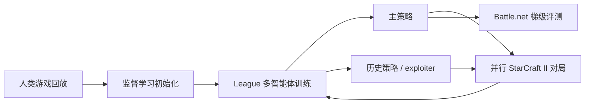
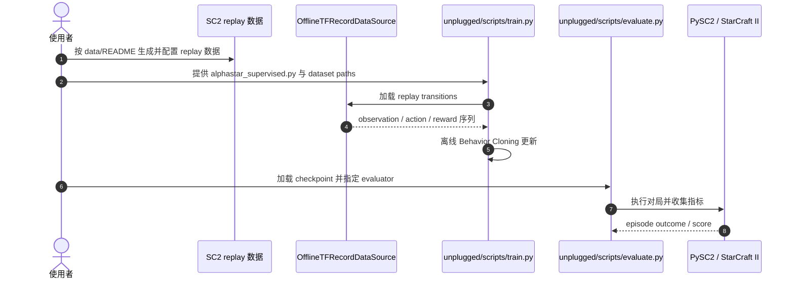

# AlphaStar：联赛式多智能体强化学习

**一句话定义：** AlphaStar 是一个以人类回放作行为先验、再通过 League 中多种对手训练的 StarCraft II 智能体。

## 英文缩写速查

| 缩写 | 英文全称 | 简要说明 |
|------|----------|----------|
| MARL | Multi-Agent Reinforcement Learning | 多个策略在共享环境中共同进化 |
| BC | Behavior Cloning | 用专家回放监督学习动作 |
| PBT | Population-Based Training | 多个候选 agent 并行训练和选择 |
| RTS | Real-Time Strategy | 需要实时宏观决策与微操的即时战略游戏 |
| SC2LE | StarCraft II Learning Environment | Blizzard 与 DeepMind 发布的 StarCraft II 研究环境 |

## 为什么重要

围棋里对手策略空间相对受限，而 StarCraft II 包含部分可观测、长时程战略和实时低层操作。AlphaStar 的关键思路是先从人类 replay 学会可行行为，再在 League 中训练主策略与 exploiters，让策略不只对付单一对手。它把自博弈从“当前策略和自己打”拓展为“面对持续变化的策略分布”。

## 方法：从 replay 到 League

早期行为由人类对局 replay 监督学习初始化。后续多智能体 RL 通过主 agent 与不同类型对手并行对局；主 agent 学习稳健的总体策略，league exploiters 则尝试针对主策略或历史策略寻找反制。模型依据游戏观察产生动作，利用分布式 actor-learner 架构扩大采样吞吐。

## 实验与评测

Nature 2019 报告 AlphaStar 在完整游戏在线对战中对 Protoss、Terran、Zerg 三个种族均达到 Grandmaster，并位列官方排名玩家前 0.2%。这是完整系统训练后在特定版本和 Battle.net 条件下的结果，不是 AlphaStar 开源仓库默认能一键复现的 benchmark 数字。

## 与 AlphaGo / AlphaZero 和开源版本的对比

| 工作 | 环境特征 | 训练范式 |
|------|----------|----------|
| AlphaGo / AlphaZero | 棋盘离散动作、规则明确、完整信息 | 网络引导 MCTS + 自我对弈 |
| AlphaStar（Nature 2019） | RTS、部分可观测、实时组合动作 | replay 模仿学习 + League 式多智能体 RL |
| AlphaStar Unplugged（NeurIPS 2021） | 固定人类回放数据集上的离线决策 | BC 与离线 RL 基线/评测 |
| 开源 `google-deepmind/alphastar` 包 | 通用架构与离线工具 | 提供 offline BC 训练/评测；未提供 online RL training code |

AlphaStar Unplugged 报告：使用行为价值估计和单步策略改进的部分 offline RL 变体，在该论文 benchmark 协议中对先前 AlphaStar BC agents 的胜率超过 90%。不要与 Nature 2019 的 Grandmaster 线上评测混为一谈。

## 结论

**总判：AlphaStar 将强对手分布纳入训练闭环是其重要贡献；公开仓库能复现部分架构/离线实验，但不能复现原始 Grandmaster League 系统。**

1. replay BC 提供可学习的初始策略，League 训练负责拓展并检验对手覆盖。
2. League 的要点是维持策略多样性、降低循环利用单一对手造成的 exploitability。
3. Grandmaster 与“前 0.2%”来自完整系统在线比赛，不是公开仓库的离线训练结果。
4. 官方代码目前只覆盖部分研究资产：架构、BC/离线训练工具、PySC2 接口；Nature 版 online League 训练代码未发布。
5. 在机器人里借鉴对手池/策略池之前，要先解决模拟器并行、对手分布设计和 sim-to-real，不应直接照搬对战游戏的自博弈指标。

## 源码运行时序图

仓库的公开可执行路径是离线训练/评估，而不是 Nature 论文的 online League。README 的可复现入口依赖 StarCraft II replay 数据转换和路径配置；dummy quickstart 只用于验证管线。

## 工程实践与开源状态

| 资源 | 公开范围 |
|------|----------|
| Nature 论文与官方博客 | 方法、在线对战协议与结果 |
| [PySC2](https://github.com/google-deepmind/pysc2) | StarCraft II 研究环境与数据转换接口 |
| [AlphaStar package](https://github.com/google-deepmind/alphastar) | 通用架构、离线数据读取、BC 训练和评估工具 |
| 原始 online League 训练与 Grandmaster 权重 | 该仓库 README 未提供；不能据现有仓库声称复现原始系统 |

代码仓 README 建议 Linux + Python 3.9；可使用 `pip install -e .` 或 Bazel。完整数据训练前需要先运行仓库数据准备说明并配置 TFRecord 路径。资源详情见[官方仓库归档](../../sources/repos/alphastar-google-deepmind.md)。

## 局限与风险

- 复现实验必须控制 StarCraft II 版本、地图、种族、动作频率和数据切分。
- AlphaStar Unplugged 的数据来自人类 replay；BC/离线 RL 能力受数据覆盖与行为策略分布约束。
- 开源代码的 README 声明未提供在线 RL 训练，公开架构不能等同完整 AlphaStar 最终系统。
- “对付多种对手”是游戏设定下的稳健性目标，不等于对真实环境分布 shift 的保证。

## 关联页面

- [强化学习](../methods/reinforcement-learning.md)
- [强化学习 Runner 与自我对弈](../concepts/rl-runner.md)
- [物理自博弈：从游戏 League 到机器人](./skild-physical-self-play.md)
- [MuZero：潜在动态模型与规划](./paper-muzero-planning-latent-dynamics.md)

## 参考来源

- [Nature 论文与 DeepMind 项目资料](../../sources/papers/alphastar-nature-2019.md)
- [官方研究页归档](../../sources/sites/alphastar-deepmind.md)
- [官方代码仓归档](../../sources/repos/alphastar-google-deepmind.md)

## 推荐继续阅读

- [AlphaStar Nature 原文](https://doi.org/10.1038/s41586-019-1724-z)
- [StarCraft II Unplugged：NeurIPS 2021 论文](https://openreview.net/pdf?id=Np8Pumfoty)
- [google-deepmind/alphastar 源码](https://github.com/google-deepmind/alphastar)
