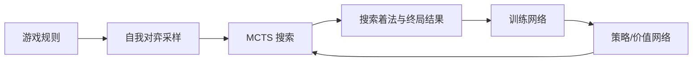

# AlphaZero：跨棋类的自我对弈强化学习

**一句话定义：** AlphaZero 是用同一套策略/价值网络与 MCTS、自我对弈闭环，在多种棋类中从规则而非人类棋谱学习的系统。

## 英文缩写速查

| 缩写 | 英文全称 | 简要说明 |
|------|----------|----------|
| RL | Reinforcement Learning | 由对局终局结果更新策略 |
| MCTS | Monte Carlo Tree Search | 将算力分配给候选着法的树搜索 |
| PUCT | Predictor + Upper Confidence bound applied to Trees | 使用网络着法先验引导探索 |
| TPU | Tensor Processing Unit | DeepMind 实验使用的张量处理加速器 |

## 为什么重要

AlphaZero 把围棋中的方法从单任务特例推进为跨游戏算法框架：不用复用每个游戏的人类棋谱和专家启发式，而让规则定义合法行动、自我对弈产生训练数据。它是“规则提供环境结构，搜索提供规划，网络提供学习泛化”这类系统设计的标志性实例。

## 方法：一套搜索/学习闭环，多种游戏规则

网络在局面上预测策略先验和胜负价值，MCTS 用这两个量搜索并产生改进后的着法分布。新对局由搜索策略生成，终局结果回传为价值标签，神经网络随后更新。棋类间变化主要由规则、状态编码和合法动作集合承载。

## 实验与评测

论文报告 AlphaZero 在规定比赛条件下击败了 Stockfish 8、Elmo 与 AlphaGo Zero。DeepMind 官方记录的国际象棋 1,000 盘结果为 155 胜、6 负、839 和棋；将棋结果为 91.2% 胜率；围棋对 AlphaGo Zero 为 61% 胜率。它们是特定版本和计算预算下的比较，不应外推为今天所有棋类引擎的排名。

## 与 AlphaGo Zero、AlphaStar 和 MuZero 的对比

| 系统 | 环境 | 学习/搜索关键点 |
|------|------|----------------|
| AlphaGo Zero | 围棋 | 规则起步、单任务纯自博弈 |
| AlphaZero | 围棋/国际象棋/将棋 | 多棋类共用自我对弈与 MCTS 算法 |
| AlphaStar | StarCraft II | 部分可观测 RTS、模仿学习、联赛式多智能体 RL |
| MuZero | 棋类与 Atari | 学习规划需要的潜在动态，而不显式获得完整规则模型 |

## 结论

**总判：AlphaZero 证明了同一算法骨架可跨多个规则明确的棋类训练，但“通用”仍受限于离散动作、可模拟环境和游戏专用接口。**

1. 核心环节是 MCTS 产生的策略改进目标与自我对弈终局价值。
2. 不使用人类棋谱不代表没有结构先验：游戏规则、合法着法和状态接口依然明确给定。
3. 棋类间迁移的是算法框架，不是一个训练好的策略直接迁移到所有棋类。
4. 结果必须连同基线版本、硬件和推理时间预算一起阅读。
5. 对机器人而言可借鉴的是“策略—规划—数据生成”闭环，不是直接搬用棋类网络或胜率结论。

## 工程实践与开源状态

Science 论文和 arXiv 预印本可公开阅读；DeepMind 发布部分棋谱，但截至 2026-10-10 未找到官方训练/推理代码或权重。本页不包含源码运行时序图，因为官方可运行实现没有公开。若做学习型复现，应分别实现规则环境、搜索节点缓存、并行自博弈、模型训练与对局评测。

## 局限与风险

- 方法假设规则已知、状态完全可观察、动作离散、仿真足够快。
- 搜索成本与网络推理预算直接影响结果。
- 论文比较是当年受控实验，不应等同于如今 Stockfish 等开源引擎的性能。
- 不能据此推断在真实机器人中可通过 self-play 获得同等样本效率或安全性。

## 关联页面

- [强化学习历史](../concepts/reinforcement-learning-history.md)
- [强化学习](../methods/reinforcement-learning.md)
- [强化学习 Runner 与自我对弈](../concepts/rl-runner.md)
- [MuZero：潜在动态模型与规划](./paper-muzero-planning-latent-dynamics.md)

## 参考来源

- [Science / arXiv 论文归档](../../sources/papers/alphazero-science-2018.md)
- [DeepMind 官方资料归档](../../sources/sites/alphazero-deepmind.md)

## 推荐继续阅读

- [AlphaZero arXiv 论文](https://arxiv.org/abs/1712.01815)
- [AlphaZero 与 MuZero 官方研究入口](https://deepmind.google/research/alphazero-and-muzero/)
