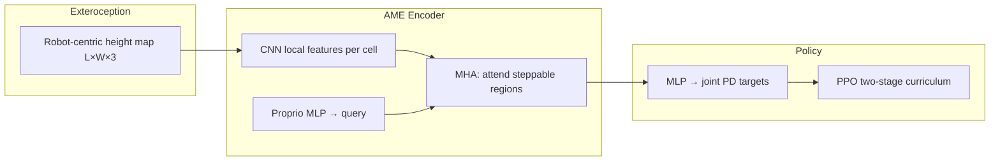

# AME — Attention-Based Map Encoding

**一句话定义**：用 **CNN 提取机器人中心高程图逐点局部特征**，再以 **本体与速度指令条件化的 multi-head attention** 聚焦 **下一落脚可行区域**，与 proprioception 一起 **端到端 PPO** 输出关节目标——在 **ANYmal-D** 与 **Fourier GR-1** 上同时获得 **稀疏垫脚石/梁/沟** 的 **泛化、鲁棒与可解释地形感知**（后续扩展见 [AME-2](./paper-notebook-ame-2-agile-and-generalized-legged-locomotion-vi.md)）。

## 英文缩写速查

| 缩写 | 英文全称 | 简要说明 |
|------|----------|----------|
| AME | Attention-based Map Encoding | 本文核心：高程图 + 注意力编码 |
| MHA | Multi-Head Attention | 以 proprio 为 query 对地图逐点加权 |
| CNN | Convolutional Neural Network | 保分辨率提取每格局部地形特征 |
| RL | Reinforcement Learning | PPO 训练端到端 loco 策略 |
| PPO | Proximal Policy Optimization | 并行仿真策略优化 |
| DRL | Deep Reinforcement Learning | 与 model-based / hybrid 对照的 learning 路线 |
| DTC | Deep Tracking Control | ETH 混合 MPC+RL 基线（本文 benchmark） |
| Sim2Real | Simulation to Real | 两阶段 DR + 感知噪声后零样本实机 |
| ANYmal | ANYbotics Quadruped | 12-DoF 四足实验平台 ANYmal-D |
| GR-1 | Fourier GR-1 | 23-DoF 人形实验平台 |

## 为什么重要

- **稀疏地形上的端到端 RL 泛化**：此前 **跑酷类** 端到端策略多 **过拟合训练分布**；**model-based / DTC** 可泛化但 **MPC 在退化高程图下给出不可行 foothold**、训练/部署 **算力重**（DTC 约 **14 天** 收敛）。AME 用 **注意力 map encoding** 在 **同一框架** 内兼顾 **精确落脚 + 不确定性鲁棒 + 跨地形泛化**。
- **可解释性**：MHA 权重 **可视化对齐未来 foothold**，无需 foothold 监督——对 **perceptive loco 调试与 sim2real** 有工程价值。
- **跨 embodiment**：**同一架构** 覆盖 **四足 + 人形**，实机 **零样本** 未见垫脚石布局；为 [AME-2](./paper-notebook-ame-2-agile-and-generalized-legged-locomotion-vi.md) 的 **全局特征 + 神经映射 + teacher–student** 奠定编码器基础（论文中称 **AME-1**）。

## 核心信息

| 字段 | 内容 |
|------|------|
| 机构 | 苏黎世联邦理工（ETH Zürich）RSL；迪士尼研究院苏黎世（Disney Research Zurich） |
| 平台 | ANYmal-D；Fourier GR-1 |
| 感知 | 机器人中心 **2.5D 高程扫描**（elevation mapping） |
| 训练 | 自定义 PPO；**4096** 并行 env；**两阶段**（理想感知基地形 → 难地形+噪声） |
| arXiv | <https://arxiv.org/abs/2506.09588> |

## 系统结构

**与 model-based 的抽象对应（论文 Discussion）**：map encoding ≈ **隐式 contact planner**（注意力选 foothold）；后续 MLP ≈ **whole-body tracker**——但 **端到端联合训练** 缓解 **模型失配、滑移、可变形地面** 与 **分模块调参** 成本。

## 训练要点

| 阶段 | 地形 | 感知 |
|------|------|------|
| **Stage 1** | Grid stones、pallets、beams、gaps/pits 等 **基地形** | **Privileged GT** 高程 |
| **Stage 2** | Pentagon stones、single-column stones、narrow pallets、consecutive gaps 等 | **噪声、漂移、推力**；载荷/摩擦 DR |

- **10 级地形课程**：走出边界升级，否则降级（Rudin et al. 式）。
- **Ablation**：无 Stage 1 初始化时，稀疏地形 **几乎不收敛**；全地形从头+理想感知（C2）或基地形+噪声从头（C3）均显著差于 **Ours**。

## 实验与评测

### ANYmal-D 仿真 benchmark

| 对照 | 相对本文 |
|------|----------|
| **DTC**（MPC+RL 跟踪） | 组合训练地形成功率 **低 26.5%**；12–20 cm grid stones、15 cm 窄梁 **<20%**（MPC 最小可踏面阈值） |
| **baseline-rl**（MLP 垫脚石 specialist） | 成功率 **低 77.3%**；过拟合 grid stones |
| **Velocity tracking** | 大速度指令下 DTC **常数步频** → 远 foothold 难跟踪；AME **自适应步频** |

- **Obstacle parkour**（Grandia et al.，训练未见）：GR-1 与 ANYmal-D **100%** 穿越。

### 实机亮点

- **零样本** 侧向/随机垫脚石、19 cm 梁、高度差踏石。
- **涌现行为**：ANYmal **膝撑攀爬/滑移恢复**；GR-1 **臂摆随地形变化**、**空中换脚** 达下一石、平衡木 **滑移快速跨步**。

### 网络 ablation

点级 **MHA + 保分辨率 CNN** 优于 **Transformer encoder**、**额外下采样 CNN**、**ViT**——尤其在 **未见地形** 成功率上。

## 与其他工作对比

| 路线 | 代表 | 稀疏地形泛化 | 可解释 | 本文 |
|------|------|--------------|--------|------|
| 端到端跑酷 | [Extreme Parkour](./extreme-parkour.md) | 弱 | 低 | **注意力 foothold** |
| 混合 MPC+RL | DTC | 中（MPC 敏感） | 中 | **纯 RL 更鲁棒** |
| 足底最小感知 | [离散地形 ToF](./paper-discrete-terrain-minimal-proximity-sensing.md) | 强（局部） | 中 | **机载高程 + 全身** |
| 后继 | [AME-2](./paper-notebook-ame-2-agile-and-generalized-legged-locomotion-vi.md) | **+敏捷+在线映射** | 保留 | 编码器 v2 |

## 常见误区与局限

- **不是「无地图」**：依赖 **elevation mapping** 栈产 2.5D 扫描；与 **raw depth 端到端** 不同。
- **2.5D 边界**： confined / 强 3D 接触（vault 等）不在 AME-1 主战场；**AME-2** 补 **敏捷 parkour + 学习映射**。
- **训练成本**：数天 GPU；调参仍贵。

## 参考来源

- [ame_arxiv_2506_09588.md](../../sources/papers/ame_arxiv_2506_09588.md)
- He et al., *Attention-Based Map Encoding for Learning Generalized Legged Locomotion*, [arXiv:2506.09588](https://arxiv.org/abs/2506.09588)

## 关联页面

- [AME-2](./paper-notebook-ame-2-agile-and-generalized-legged-locomotion-vi.md) — 全局特征、神经映射与 teacher–student
- [ANYmal](./anymal.md)
- [楼梯与障碍 Locomotion](../tasks/stair-obstacle-perceptive-locomotion.md)
- [Terrain Adaptation](../concepts/terrain-adaptation.md)

## 推荐继续阅读

- [AME-2 项目页](https://sites.google.com/leggedrobotics.com/ame-2)
- [Learning Locomotion on Discrete Terrain via Minimal Proximity Sensing](./paper-discrete-terrain-minimal-proximity-sensing.md) — 同 ETH RSL 稀疏地形对照轴
