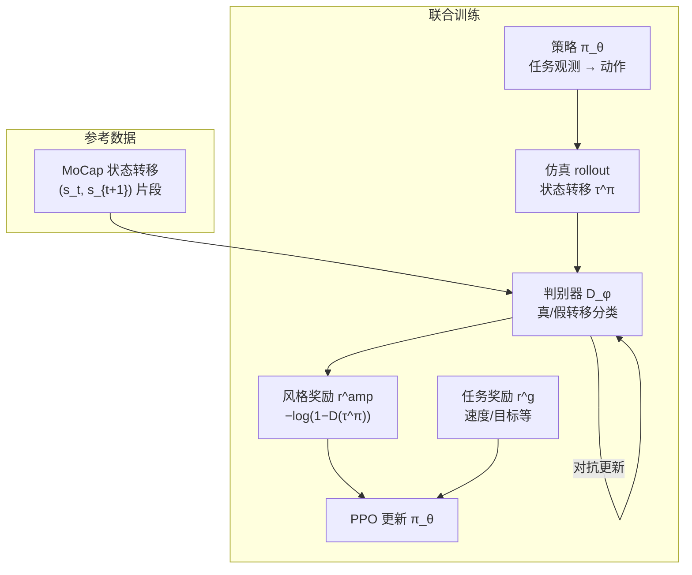

# AMP：对抗运动先验与风格化物理角色控制

**AMP**（*Adversarial Motion Priors for Stylized Physics-Based Character Control*，SIGGRAPH 2021）由 Xue Bin Peng 等提出，收录于 [具身智能研究室 · AMP 运动先验专题](https://mp.weixin.qq.com/s/YZsm3855iP3TNTTt1aou7w) **第 01/19** 篇（**01 分布约束与先验组件化**）。它把 GAIL 式对抗模仿从「复现某条 clip」推进到「匹配**状态转移分布**」，成为后续人形 [AMP](../methods/amp-reward.md)、[ADD](../methods/add.md)、[SMP](../methods/smp.md) 与 SD-AMP 等路线的共同源流。

## 一句话定义

**用判别器区分策略 rollout 与 MoCap 中的短状态转移片段，把「像参考数据」变成可插拔的风格奖励，与任务 RL 联合优化，而非逐帧跟踪单条参考动作。**

## 英文缩写速查

| 缩写 | 英文全称 | 简要说明 |
|------|----------|----------|
| AMP | Adversarial Motion Prior | 用对抗判别约束状态转移接近专家运动分布的先验 |
| GAIL | Generative Adversarial Imitation Learning | 用判别器替代手工模仿奖励的 IL 范式 |
| RL | Reinforcement Learning | 通过与环境交互最大化长期回报来学习策略的范式 |
| MoCap | Motion Capture | 动作捕捉，参考动作与演示数据的主要来源 |
| PPO | Proximal Policy Optimization | 人形/足式 locomotion 中最常用的 on-policy 策略梯度算法 |

## 为什么重要

- **范式转折：** 相对 DeepMimic 类逐帧跟踪，AMP 允许策略在完成**新任务**（速度命令、转向、障碍）时仍保持「像人」——判别的是**动力学片段**而非绝对姿态序列。
- **AMP 19 篇专题起点：** 后续 [ADD #02](../methods/add.md)（差分判别）、[SMP #03](../methods/smp.md)（冻结扩散先验）、人形走跑与多技能扩展均在此框架上讨论「先验如何**组件化**」。
- **运动小脑地图（12/64）：** 在 [运动小脑 64 篇技术地图](../overview/humanoid-motion-cerebellum-technology-map.md) 中归类为 **B 动作模仿源流**。
- **工程可复现：** MimicKit / ProtoMotions 等栈将 AMP 奖励模块标准化，直接服务 [Unitree G1](../entities/unitree-g1.md) 等人形部署。

## 流程总览

## 核心机制（归纳）

### 1）状态转移判别，而非逐帧姿态

- **判别输入：** 短窗口状态转移（如相邻帧关节位姿、速度等），而非整条 clip 的全局时间对齐。
- **策略目标：** 最大化任务回报的同时骗过判别器——生成的转移应落在 MoCap 支持的**自然流形**附近。
- **与跟踪对比：** 不强制 $s_t \approx s_t^{\mathrm{ref}}$，故可在偏离参考轨迹时仍获风格奖励（只要转移「像人」）。

### 2）任务 + 风格复合奖励

- 典型形式 $r = w_g r^g + w_{\mathrm{amp}} r^{\mathrm{amp}}$；$r^g$ 为速度跟踪、存活等任务项，$r^{\mathrm{amp}}$ 来自判别器。
- **好处：** 减少对手工平滑项、关节速度惩罚的依赖；判别器隐式编码步态协调与时序特征。

### 3）训练与数据

| 项目 | 内容 |
|------|------|
| 仿真 | 物理角色控制（Isaac Gym 等） |
| 算法 | PPO + 判别器交替/联合更新 |
| 参考 | 无任务标签的 MoCap 库（走、跑、跳等多风格） |
| 输出 | 单一策略覆盖任务空间 + 自然风格 |

## 常见误区

1. **AMP = 动作克隆：** 核心是**分布匹配**，不是 replay 某条参考；同一策略可完成参考库中未出现的任务（如 dodge、新速度）。
2. **判别器可永久冻结：** 经典 AMP 中判别器与策略**共训**；与 [SMP #03](../methods/smp.md)「预训练冻结先验」是不同工程路线。
3. **任何任务都该加满 AMP：** [Selective AMP](../methods/amp-reward.md) 与 [SD-AMP #10](./paper-unified-walk-run-recovery-sdamp.md) 表明高动态 recovery 与稳态 walk 可能需要**不同先验或门控**，而非单一全局判别器硬套全身。
4. **只做人形才需要读 AMP：** 原文为 **physics-based character**；人形只是 AMP 专题把该范式推到机器人平台的策展主线。

## 实验与评测

- **仿真角色：** 多任务（locomotion、技能组合）上相对纯任务奖励与 DeepMimic 类基线，运动质量与任务成功率更均衡；风格可随参考库切换（走/跑/武术等）而无需重设计 $r^g$。
- **消融：** 去掉 AMP 风格项通常导致高频抖动、滑步或不自然姿态；判别器结构（状态维度、窗口长度）影响稳定性。
- **后人形复现：** [AMP_mjlab](../entities/amp-mjlab.md)、[SD-AMP](./paper-unified-walk-run-recovery-sdamp.md) 等在 G1 上验证 AMP 模块仍为人形 loco+recovery 的常用正则。

## 与其他页面的关系

- 方法归纳（主阅读）：[amp-reward.md](../methods/amp-reward.md)
- 作者线演进：[ADD #02](../methods/add.md)、[SMP #03](../methods/smp.md)
- AMP 专题总览：[humanoid-amp-motion-prior-survey.md](../overview/humanoid-amp-motion-prior-survey.md)（#01/19）
- 身体系统栈：[humanoid-rl-motion-control-body-system-stack.md](../overview/humanoid-rl-motion-control-body-system-stack.md)

## 参考来源

- [AMP（SIGGRAPH 2021）](../../sources/papers/amp.md)
- [humanoid_amp_survey_01_amp_adversarial_motion_priors_for_stylized_physi.md](../../sources/papers/humanoid_amp_survey_01_amp_adversarial_motion_priors_for_stylized_physi.md) — AMP 19 篇策展索引
- [humanoid_amp_survey_19_catalog.md](../../sources/papers/humanoid_amp_survey_19_catalog.md)
- [wechat_embodied_ai_lab_humanoid_amp_motion_prior_survey.md](../../sources/blogs/wechat_embodied_ai_lab_humanoid_amp_motion_prior_survey.md)
- 原始抓取：[wechat_humanoid_amp_19_survey_2026-05-26.md](../../sources/raw/wechat_humanoid_amp_19_survey_2026-05-26.md)

## 推荐继续阅读

- [AMP 项目页](https://xbpeng.com/projects/AMP/index.html) — 论文、视频与 BibTeX
- [机器人论文阅读笔记：AMP](https://imchong.github.io/Humanoid_Robot_Learning_Paper_Notebooks/papers/01_Foundational_RL/AMP_Adversarial_Motion_Priors_for_Stylized_Physics-Based_Character_Control/AMP_Adversarial_Motion_Priors_for_Stylized_Physics-Based_Character_Control.html)
- [AMP 专题长文（微信公众号）](https://mp.weixin.qq.com/s/YZsm3855iP3TNTTt1aou7w)
- [AMP 方法页](../methods/amp-reward.md) — 判别器架构、Selective AMP 与 SD-AMP 延伸
