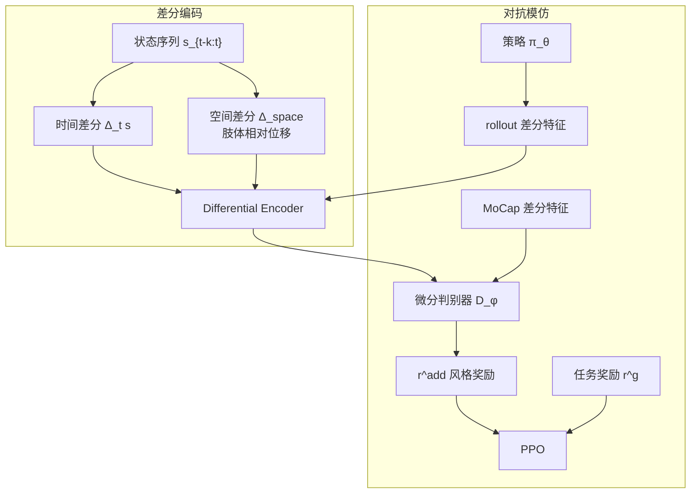

# ADD：对抗微分判别器与物理运动模仿

**ADD**（*Physics-Based Motion Imitation with Adversarial Differential Discriminators* / *Adversarial Differential Discriminator*，SIGGRAPH 2024）收录于 [AMP 运动先验专题](https://mp.weixin.qq.com/s/YZsm3855iP3TNTTt1aou7w) **第 02/19** 篇（**01 分布约束与先验组件化**）。在 [AMP #01](./paper-amp-survey-01-amp.md) 的状态转移判别框架上，ADD 把判别器输入从**绝对姿态**改为**时空差分**，专门压制滑步、脚漂与关节不协调等 AMP 常见伪影。

## 一句话定义

**用状态的时序差分与肢体相对差分作为判别器输入，在对抗模仿中强制策略的速度/加速度与肢体协调对齐参考分布，而非仅匹配静态姿态。**

## 英文缩写速查

| 缩写 | 英文全称 | 简要说明 |
|------|----------|----------|
| ADD | Adversarial Differential Discriminator | 差分判别、减少碎片化 reward 的 AMP 演进 |
| AMP | Adversarial Motion Prior | 用对抗判别约束状态转移接近专家运动分布的先验 |
| RL | Reinforcement Learning | 通过与环境交互最大化长期回报来学习策略的范式 |
| GAN | Generative Adversarial Network | 对抗训练范式来源 |
| MoCap | Motion Capture | 动作捕捉，参考动作与演示数据的主要来源 |

## 为什么重要

- **AMP 作者线的「reward 追问」：** 策展导读称 ADD 是对 [AMP](./paper-amp-survey-01-amp.md) **判别器输入与奖励形状**的继续工程化，而非推翻对抗先验范式。
- **伪影根因：** 绝对状态判别器对「站位正确但脚在滑」过于宽松；差分特征把**动态一致性**显式纳入对抗目标。
- **与 SMP 对照：** [SMP #03](./paper-amp-survey-03-smp.md) 用冻结扩散 + SDS 绕开对抗训练不稳定；ADD 仍留在 **GAN 框架内**修补判别信号——代表先验组件化的两条分支。
- **实现落地：** 集成于 [MimicKit](../entities/mimickit.md) / [ProtoMotions](../entities/protomotions.md)，与 [amp-reward](../methods/amp-reward.md) 并列可选。

## 流程总览

## 核心机制（归纳）

### 1）微分判别输入

- **时间差分：** 捕捉关节角速度、加速度层面对齐，抑制「pose 对但动态假」的滑步。
- **空间差分：** 编码肢体间相对运动，强化全身协调而非单关节凑姿态。
- **对比 AMP：** AMP 判别 $(s_t, s_{t+1})$ 或短窗口绝对状态；ADD 强调**变化率与相对结构**。

### 2）训练稳定性

- 配合 **gradient penalty** 等 GAN 稳定技巧，避免判别器过强导致策略梯度消失。
- 任务奖励 $r^g$ 与 $r^{\mathrm{add}}$ 加权组合，权重需与差分特征尺度一并调节。

### 3）适用场景

| 场景 | ADD 相对 AMP 的收益 |
|------|---------------------|
| 足式/contact-rich locomotion | 减少脚滑、蹭地 |
| 高动态技能 | 更严的速度层约束 |
| 长 horizon 风格 | 差分窗口缓解绝对位姿漂移奖励 |

## 常见误区

1. **ADD 取代 AMP 理论：** 仍是**对抗运动先验**一族，改动在特征空间而非「不用判别器」。
2. **差分 = 不需要 MoCap：** 参考数据仍来自 MoCap；只是判别器看的是**导数/相对量**。
3. **与 SMP 二选一就够：** ADD 解决对抗**伪影**；SMP 解决**模块化与复用**——问题维度不同，可对照 [amp-add-smp 选型](../comparisons/amp-add-smp-motion-prior-variants.md)。
4. **只影响仿真角色：** 后人形栈复用 ADD 模块时，同样意在改善真机步态**动态可信度**。

## 实验与评测

- **相对 AMP：** 论文报告在多种 physics-based 技能上滑步、脚漂与视觉不自然度显著下降，任务成功率与 AMP 相当或更优。
- **消融：** 去掉空间或时间差分之一，伪影抑制减弱；纯绝对状态判别退化为 AMP 类行为。
- **工程：** MimicKit 文档提供 ADD 奖励开关与超参，便于与 AMP 基线 A/B。

## 与其他页面的关系

- 方法归纳（主阅读）：[add.md](../methods/add.md)
- 基础框架：[amp-reward.md](../methods/amp-reward.md)、[AMP #01](./paper-amp-survey-01-amp.md)
- 非对抗替代：[SMP #03](./paper-amp-survey-03-smp.md)
- AMP 专题：[humanoid-amp-motion-prior-survey.md](../overview/humanoid-amp-motion-prior-survey.md)（#02/19）

## 参考来源

- [ADD（SIGGRAPH 2024）](../../sources/papers/add.md)
- [humanoid_amp_survey_02_physics_based_motion_imitation_with_adversarial.md](../../sources/papers/humanoid_amp_survey_02_physics_based_motion_imitation_with_adversarial.md)
- [humanoid_amp_survey_19_catalog.md](../../sources/papers/humanoid_amp_survey_19_catalog.md)
- [wechat_embodied_ai_lab_humanoid_amp_motion_prior_survey.md](../../sources/blogs/wechat_embodied_ai_lab_humanoid_amp_motion_prior_survey.md)
- 原始抓取：[wechat_humanoid_amp_19_survey_2026-05-26.md](../../sources/raw/wechat_humanoid_amp_19_survey_2026-05-26.md)

## 推荐继续阅读

- [ADD 方法页](../methods/add.md) — 微分编码与关联页面
- [机器人论文阅读笔记：ADD](https://imchong.github.io/Humanoid_Robot_Learning_Paper_Notebooks/papers/01_Foundational_RL/ADD_Adversarial_Differential_Discriminators/ADD_Adversarial_Differential_Discriminators.html)
- [AMP 专题长文（微信公众号）](https://mp.weixin.qq.com/s/YZsm3855iP3TNTTt1aou7w)
- [MimicKit](../entities/mimickit.md) — ADD 官方实现入口
