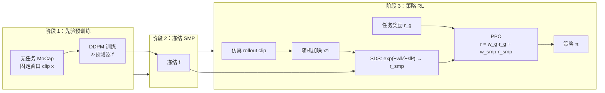

# SMP：可复用 Score-Matching 运动先验

**SMP**（*Reusable Score-Matching Motion Priors for Physics-Based Character Control*，arXiv:2512.03028）收录于 [AMP 运动先验专题](https://mp.weixin.qq.com/s/YZsm3855iP3TNTTt1aou7w) **第 03/19** 篇（**01 分布约束与先验组件化**）。策展导读称 SMP「非常值得放进这篇文章」：它在 [AMP #01](./paper-amp-survey-01-amp.md) / [ADD #02](./paper-amp-survey-02-physics_based_motion_imitation_with.md) 的对抗路线之外，用**冻结扩散 + Score Distillation Sampling（SDS）**实现 **Modular + Reusable** 的运动先验模块。

## 一句话定义

**先在无任务 MoCap 上训练运动扩散并冻结，再将策略 rollout 片段的 ε-预测误差经 SDS 映射为 SMP 风格奖励，与任务 PPO 联合优化——下游训练可完全丢弃原始数据集与在线判别器。**

## 英文缩写速查

| 缩写 | 英文全称 | 简要说明 |
|------|----------|----------|
| SMP | Score-Matching Motion Prior | 可复用的 score-matching 运动先验模块 |
| SDS | Score Distillation Sampling | 用冻结扩散 score 监督生成样本的蒸馏采样 |
| DDPM | Denoising Diffusion Probabilistic Model | 去噪扩散概率模型，SMP 先验骨干 |
| AMP | Adversarial Motion Prior | 对抗判别约束状态转移的先验对照 |
| ESM | Ensemble Score-Matching | 多噪声级聚合 SDS，降奖励方差 |
| GSI | Generative State Initialization | 用先验采样初态，替代 RSI |
| RL | Reinforcement Learning | 通过与环境交互最大化长期回报来学习策略的范式 |

## 为什么重要

- **先验组件化终点之一：** 理想先验应 **独立训练、冻结复用**；SMP 使 RL 阶段既不更新先验、也不必保留 expert 数据管道——相对 AMP 每策略共训判别器是工程范式跃迁。
- **运动小脑（13/64）：** [64 篇地图](../overview/humanoid-motion-cerebellum-technology-map.md) 中归为 **B 动作模仿源流**（score-matching 线）。
- **百风格组合：** 单一通用扩散经 style label / guidance **派生**风格专用先验，并可 **组合**出数据集中不存在的新风格（策展强调「先验应像可编排模块」）。
- **人形落地：** 附录含 **Unitree G1** 部署；课程复现见 [SMP on G1（mjlab）](./smp-g1-mjlab.md)。

## 流程总览

## 核心机制（归纳）

### 1）SMP 奖励（Eq. 7）

对策略 clip 加噪得 $\mathbf{x}^i$，冻结网络预测 $\hat{\epsilon}=f(\mathbf{x}^i)$：

\[
r^{\mathrm{smp}} = \exp\left(- w_s \|\hat{\epsilon} - \epsilon\|_2^2 \right)
\]

- 与 AMP 同属**分布匹配**，但无对抗 min-max；用 **exp** 压到 RL 友好区间。

### 2）ESM 与 GSI

- **ESM：** 在固定噪声级集合 $\mathbb{K}=\{22,15,8\}$ 上聚合 SDS，降低单 timestep 采样导致的奖励方差。
- **GSI：** 用冻结先验**采样** motion window 作仿真初态，替代依赖数据集的 RSI；探索更贴近自然流形。

### 3）风格复用与组合

- **100 风格**条件扩散 → 通用 SMP；**Repurpose** 为风格专用奖励无需重训权重。
- **Composition：** 混合不同风格先验（如 locomotion + 手臂姿态）探索新行为。

### 4）与 AMP 算力对照（作者报告）

| 项目 | SMP | AMP |
|------|-----|-----|
| 同采样量 wall-clock | ~11.5 h（含大先验） | ~6.2 h |
| RL 阶段数据依赖 | **可无 MoCap** | 常需 expert 缓冲 |
| 先验更新 | **冻结** | 与策略共训 |

## 常见误区

1. **SMP = 扩散当 planner：** SMP 是**奖励模块**，不是「生成轨迹 + 跟踪器」分层；与扩散规划路线问题设定不同。
2. **一定比 AMP 快：** 两阶段总成本常更高；优势在**复用**与**模块化**，非单次任务 wall-clock。
3. **ESM 噪声级可任意省略：** 单 timestep SDS 方差大，训练易不稳；$\mathbb{K}$ 选择影响 OOD 纠正 vs 细节刻画权衡。
4. **与 ADD 竞争关系：** ADD 修对抗伪影；SMP **换掉对抗**——见 [方法页](../methods/smp.md) 与 [选型对比](../comparisons/amp-add-smp-motion-prior-variants.md)。

## 实验与评测

- **多任务仿真：** 速度跟踪、转向、落点、足球、搬运、起身等；SMP+任务奖励相对纯 $r^g$ 显著更自然，**normalized return** 与 AMP 相当（§8）。
- **无任务模仿 benchmark：** $w^g=0$ 时与 AMP / ASE 等对比单 clip 模仿质量。
- **G1 真机：** 论文 Robotic Deployment 与 [smp-g1-mjlab](./smp-g1-mjlab.md) 课程复现。
- **消融：** ESM / GSI / $w^{\mathrm{smp}}$ 见附录；去掉 SMP 项运动质量下降最明显。

## 与其他页面的关系

- 方法归纳（主阅读）：[smp.md](../methods/smp.md)
- 对抗源流对照：[AMP #01](./paper-amp-survey-01-amp.md)、[ADD #02](./paper-amp-survey-02-physics_based_motion_imitation_with.md)
- 实现：[mimickit.md](../entities/mimickit.md)、[smp-g1-mjlab.md](./smp-g1-mjlab.md)
- AMP 专题：[humanoid-amp-motion-prior-survey.md](../overview/humanoid-amp-motion-prior-survey.md)（#03/19）

## 参考来源

- [SMP（arXiv:2512.03028）](../../sources/papers/smp.md) — 完整摘录与公式
- [humanoid_amp_survey_03_smp_reusable_score_matching_motion_priors_for_ph.md](../../sources/papers/humanoid_amp_survey_03_smp_reusable_score_matching_motion_priors_for_ph.md)
- [humanoid_amp_survey_19_catalog.md](../../sources/papers/humanoid_amp_survey_19_catalog.md)
- [wechat_embodied_ai_lab_humanoid_amp_motion_prior_survey.md](../../sources/blogs/wechat_embodied_ai_lab_humanoid_amp_motion_prior_survey.md)
- 原始抓取：[wechat_humanoid_amp_19_survey_2026-05-26.md](../../sources/raw/wechat_humanoid_amp_19_survey_2026-05-26.md)

## 推荐继续阅读

- [arXiv:2512.03028](https://arxiv.org/abs/2512.03028) — 论文正文与 100 风格实验
- [SMP 项目页](https://yxmu.foo/smp-page/) — 视频与 MimicKit 入口
- [SMP 方法页](../methods/smp.md) — ESM/GSI 与组合先验细节
- [AMP 专题长文（微信公众号）](https://mp.weixin.qq.com/s/YZsm3855iP3TNTTt1aou7w)
