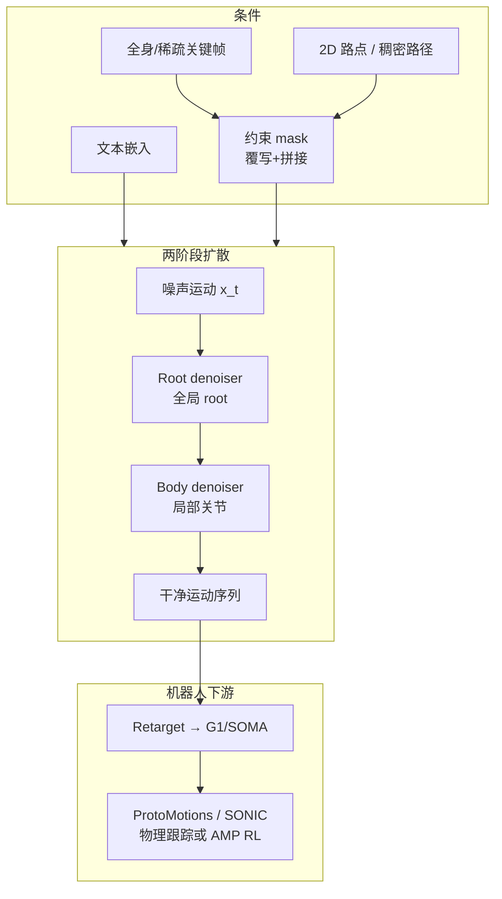

# Kimodo：可扩展可控人体运动生成（AMP 专题 #04）

**Kimodo**（*Scaling Controllable Human Motion Generation*，arXiv:2603.15546）收录于 [AMP 运动先验专题](https://mp.weixin.qq.com/s/YZsm3855iP3TNTTt1aou7w) **第 04/19** 篇（**01 分布约束与先验组件化**）。策展导读直言：**不是机器人控制论文，但应该放在这里**——它代表「先验」在 **运动学生成层** 的 scaling 路线，为 [AMP](./paper-amp-survey-01-amp.md) / [MotionBricks #05](./paper-amp-survey-05-motionbricks.md) 等 **下游物理策略** 提供高质量参考轨迹上游。

> **技术细节主阅读入口：** [Kimodo 实体页](./kimodo.md)（架构、Benchmark、G1/ProtoMotions 下游）。本页保留 AMP 专题策展定位与和对抗先验的对照关系。

## 一句话定义

**在约 700 小时光学动捕上训练运动学扩散模型，用两阶段 root/body 去噪器与 mask 条件化，按文本、关键帧、末端与 2D 路径等约束生成 SOMA/G1/SMPL-X 骨架运动，并系统研究数据与模型规模对质量的影响。**

## 英文缩写速查

| 缩写 | 英文全称 | 简要说明 |
|------|----------|----------|
| G1 | Unitree G1 Humanoid | 宇树入门级教育科研人形平台 |
| SMPL-X | SMPL eXpressive | 带手脸的人体参数化模型 |
| TMR | Text-Motion Retrieval | 文本–运动对齐评测嵌入（如 TMR-SOMA-RP-v1） |
| FID | Fréchet Inception Distance | 生成分布与参考分布距离指标 |
| MoCap | Motion Capture | 动作捕捉，训练数据主要来源 |
| RL | Reinforcement Learning | 生成轨迹常作为物理策略训练的参考上游 |

## 为什么重要

- **先验组件化的「生成侧」：** AMP 专题不只有 onboard 判别器——Kimodo 回答「**参考从哪来**」：大规模、可约束的 **kinematic prior**，再经 retarget + 跟踪/AMP 进真机。
- **Scaling 证据：** 公开 mocap 偏小限制文生运动质量；700h [Bones Rigplay](https://bones.studio/datasets#rp01) + 模型规模实验为「堆数据/堆模型是否有效」提供基准。
- **机器人演示数据：** G1 变体可 **快于遥操作** 生成演示；导出 [ProtoMotions](./protomotions.md) / MuJoCo 格式训练物理策略；[GEAR-SONIC](https://nvlabs.github.io/GEAR-SONIC/demo.html) 在线 Demo 集成 Kimodo→跟踪闭环。
- **与 MotionBricks 姊妹：** [#05 MotionBricks](./paper-amp-survey-05-motionbricks.md) 更靠近 **实时机器人 WBC API**；Kimodo 偏 **离线高质量扩散 + 导演式编辑**。

## 流程总览

## 核心机制（归纳）

### 1）运动表示与约束条件化

- **平滑 root** + 全局关节旋转/位置：利于 2D 路径跟随且减 **floating / foot skating**。
- 约束与噪声运动 **同表示**；对受约束维度 **覆写** 并拼 **mask**，与文本一并输入 Transformer 去噪器。

### 2）两阶段去噪

1. **Root denoiser** 预测全局 root；
2. **Body denoiser** 在局部表示下预测身体；
3. 拼接为完整「干净」运动——分解 root/body 以稳定长序列采样。

### 3）评测与变体

- [Kimodo Motion Generation Benchmark](https://huggingface.co/datasets/nvidia/Kimodo-Motion-Gen-Benchmark)（BONES-SEED）；嵌入 **TMR-SOMA-RP-v1** 用于 R-precision、FID 等。
- 代码：[nv-tlabs/kimodo](https://github.com/nv-tlabs/kimodo)。

## 常见误区

1. **Kimodo = AMP 替代品：** 产出是 **运动学轨迹**；真机仍需物理策略、接触与 sim2real——与 [AMP #01](./paper-amp-survey-01-amp.md) 的 **RL 风格奖励** 互补而非替代。
2. **与 MotionBricks 重复：** MotionBricks 强调 **15k FPS / 2ms 延迟** 的实时潜空间 API；Kimodo 强调 **scaling + 多约束编辑**（见 [方法页](../methods/motionbricks.md)）。
3. **只服务动画：** G1 演示数据与 GEAR-SONIC 集成表明其已是 **人形数据管线** 一环。
4. **本页即全部技术细节：** 架构表、模型变体与 Mermaid 详图见 **[kimodo.md](./kimodo.md)**。

## 实验与评测

- **Benchmark：** 文本对齐、约束跟随、运动质量多指标；数据/模型 scaling 曲线见技术报告。
- **下游：** G1 生成轨迹 → 物理策略；与仅 SEED 训练方法公平对比（SEED 变体）。
- **开源：** 项目页、Benchmark 文档与 HuggingFace 数据集。

## 与其他页面的关系

- 主实体页：[kimodo.md](./kimodo.md)
- 同段姊妹：[MotionBricks #05](./paper-amp-survey-05-motionbricks.md)、[扩散生成方法](../methods/diffusion-motion-generation.md)
- 下游跟踪：[sonic-motion-tracking.md](../methods/sonic-motion-tracking.md)、[protomotions.md](./protomotions.md)
- AMP 专题：[humanoid-amp-motion-prior-survey.md](../overview/humanoid-amp-motion-prior-survey.md)（#04/19）

## 参考来源

- [Kimodo（arXiv:2603.15546）](../../sources/papers/kimodo_arxiv_2603_15546.md)
- [humanoid_amp_survey_04_kimodo_scaling_controllable_human_motion_generat.md](../../sources/papers/humanoid_amp_survey_04_kimodo_scaling_controllable_human_motion_generat.md)
- [humanoid_amp_survey_19_catalog.md](../../sources/papers/humanoid_amp_survey_19_catalog.md)
- [wechat_embodied_ai_lab_humanoid_amp_motion_prior_survey.md](../../sources/blogs/wechat_embodied_ai_lab_humanoid_amp_motion_prior_survey.md)
- 原始抓取：[wechat_humanoid_amp_19_survey_2026-05-26.md](../../sources/raw/wechat_humanoid_amp_19_survey_2026-05-26.md)

## 推荐继续阅读

- [arXiv:2603.15546](https://arxiv.org/abs/2603.15546) — 论文与 scaling 分析
- [Kimodo 项目页](https://research.nvidia.com/labs/sil/projects/kimodo/) — Demo、技术报告 PDF
- [Kimodo 实体页](./kimodo.md) — 知识库完整归纳
- [AMP 专题长文（微信公众号）](https://mp.weixin.qq.com/s/YZsm3855iP3TNTTt1aou7w)
