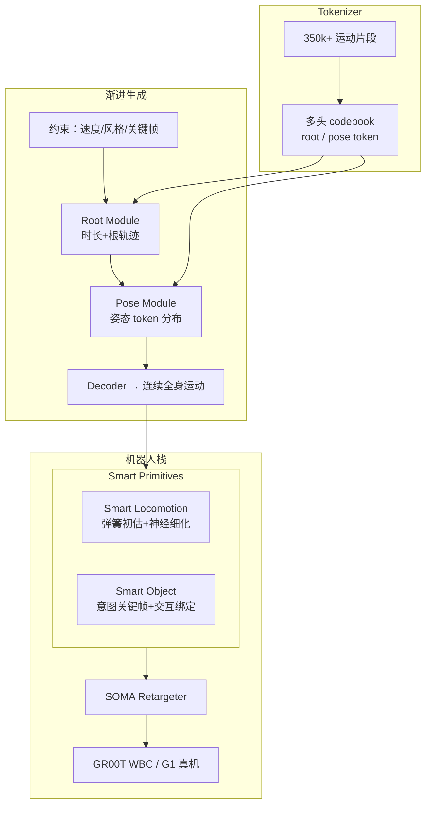

# MotionBricks：模块化实时运动生成（AMP 专题 #05）

**MotionBricks**（*Scalable Real-Time Motions with Modular Latent Generative Model and Smart Primitives*，arXiv:2604.24833）收录于 [AMP 运动先验专题](https://mp.weixin.qq.com/s/YZsm3855iP3TNTTt1aou7w) **第 05/19** 篇（**01 分布约束与先验组件化**）。策展导读：**比 [Kimodo #04](./paper-amp-survey-04-kimodo.md) 更靠近机器人**——它是 [GR00T Whole-Body Control](../entities/gr00t-wholebodycontrol.md) 的运动生成层，用 **Smart Primitives + 模块化潜空间** 替代脆弱的手工动画图。

> **技术细节主阅读入口：** [MotionBricks 方法页](../methods/motionbricks.md)。本页归纳 AMP 专题语境下的定位、管线与和对抗先验的分工。

## 一句话定义

**用结构化多头 tokenizer 将运动解耦为 root/pose 潜 token，经渐进式 root→pose 生成与 Smart Primitives 行为系统，在单模型内对 35 万+ 片段实现约 15k FPS、2ms 延迟的实时全身运动合成，并已在 Unitree G1 部署验证。**

## 英文缩写速查

| 缩写 | 英文全称 | 简要说明 |
|------|----------|----------|
| WBC | Whole-Body Control | 全身协调控制，GR00T 栈目标层 |
| VQ-VAE | Vector Quantized VAE | 运动离散 token 化常用架构 |
| FSQ | Finite Scalar Quantization | 另一种离散潜空间量化方案 |
| G1 | Unitree G1 Humanoid | 宇树入门级教育科研人形平台 |
| API | Application Programming Interface | 本文强调可编程实时运动接口 |
| RL | Reinforcement Learning | 生成轨迹下游常接物理策略或跟踪 |

## 为什么重要

- **先验组件化的「实时侧」：** 与 [Kimodo](./kimodo.md) 的离线扩散 scaling 对照，MotionBricks 服务 **onboard / 闭环** 场景：低延迟、多模态控制（速度、风格、空间关键帧）。
- **GR00T 生态锚点：** 代码位于 [GR00T-WholeBodyControl/motionbricks](https://github.com/NVlabs/GR00T-WholeBodyControl/tree/main/motionbricks)；与 [GEAR-SONIC](https://nvlabs.github.io/GEAR-SONIC/demo.html)、Isaac Lab 构成「生成→仿真→真机」链。
- **相对 AMP 的分工：** MotionBricks **生成参考/意图**；[AMP](../methods/amp-reward.md) **在 RL 内正则风格**——专题把二者都归入「运动先验」是因为真机系统常 **串联** 使用。
- **规模证明：** 35 万+ BONES-SEED 片段单模型；In-betweening 基准优于 6 个主流基线。

## 流程总览

## 核心机制（归纳）

### 1）结构化多头 Tokenizer

- 多 codebook 解耦 **root 轨迹** 与 **姿态意图**（VQ-VAE / FSQ）。
- 支持大规模技能库扩展而不牺牲推理速度。

### 2）渐进式生成架构

- **Root Module：** 预测帧数与初始根轨迹；
- **Pose Module：** 在根与关键帧条件下建模姿态 token；
- **Decoder：** 连续全身运动 + 脚印等根部细化。

### 3）Smart Primitives

- **Smart Locomotion：** 临界阻尼弹簧初估 + 神经细化，处理风格与「控制死区」。
- **Smart Object：** 意图关键帧 + 交互绑定，支持攀爬、坐下、翻越等零样本物体交互意图。

### 4）性能与部署

| 指标 | 报告值 |
|------|--------|
| 吞吐量 | ~15,000 FPS |
| 延迟 | ~2 ms |
| 真机 | Unitree G1 |
| 训练数据 | BONES-SEED 35 万+ 片段 |

## 常见误区

1. **MotionBricks = onboard AMP：** 它是 **生成模型 API**，不替代仿真内判别器风格奖励；常与跟踪/RL 层叠。
2. **与 Kimodo 二选一：** Kimodo 偏 **高质量扩散编辑**；MotionBricks 偏 **实时 WBC 集成**——同一 NVIDIA 生态上下游关系。
3. **只服务动画管线：** G1 真机与 GR00T 仓库表明其为人形 **产品级运动层**。
4. **技术细节在本页重复：** Smart Primitives 公式级说明见 **[motionbricks.md](../methods/motionbricks.md)**。

## 实验与评测

- **In-betweening 基准：** 优于 6 个主流基线（论文报告）。
- **规模：** 单模型覆盖 35 万+ 片段；实时指标见项目页。
- **机器人：** G1 部署与 GR00T WBC 栈集成视频。

## 与其他页面的关系

- 方法归纳（主阅读）：[motionbricks.md](../methods/motionbricks.md)
- 姊妹生成先验：[Kimodo #04](./paper-amp-survey-04-kimodo.md)
- 平台：[gr00t-wholebodycontrol.md](../entities/gr00t-wholebodycontrol.md)、[unitree-g1.md](../entities/unitree-g1.md)
- AMP 专题：[humanoid-amp-motion-prior-survey.md](../overview/humanoid-amp-motion-prior-survey.md)（#05/19）

## 参考来源

- [MotionBricks（arXiv:2604.24833）](../../sources/papers/motionbricks.md)
- [humanoid_amp_survey_05_motionbricks_scalable_real_time_motions_with_mod.md](../../sources/papers/humanoid_amp_survey_05_motionbricks_scalable_real_time_motions_with_mod.md)
- [humanoid_amp_survey_19_catalog.md](../../sources/papers/humanoid_amp_survey_19_catalog.md)
- [wechat_embodied_ai_lab_humanoid_amp_motion_prior_survey.md](../../sources/blogs/wechat_embodied_ai_lab_humanoid_amp_motion_prior_survey.md)
- 原始抓取：[wechat_humanoid_amp_19_survey_2026-05-26.md](../../sources/raw/wechat_humanoid_amp_19_survey_2026-05-26.md)

## 推荐继续阅读

- [arXiv:2604.24833](https://arxiv.org/abs/2604.24833) — 论文与基准
- [MotionBricks 项目页](https://nvlabs.github.io/motionbricks/)
- [MotionBricks 方法页](../methods/motionbricks.md) — Smart Primitives 与 GR00T 集成
- [AMP 专题长文（微信公众号）](https://mp.weixin.qq.com/s/YZsm3855iP3TNTTt1aou7w)
