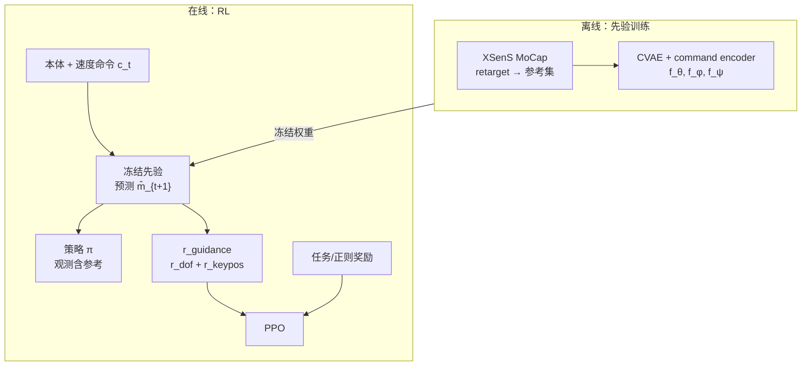

# GMP：生成式运动先验与自然人形走跑

**GMP**（*Natural Humanoid Robot Locomotion with Generative Motion Prior*，arXiv:2503.09015）收录于 [AMP 运动先验专题](https://mp.weixin.qq.com/s/YZsm3855iP3TNTTt1aou7w) **第 06/19** 篇（**02 人形走跑**）。策展导读：**严格来说不是传统 AMP**，但是极佳对照——它用 **冻结 CVAE** 生成参考轨迹 + **稠密 motion guidance**，回答「若不用对抗判别器，先验如何仍服务自然 locomotion」。

## 一句话定义

**离线训练 CVAE 生成式运动先验并冻结，RL 阶段按本体与速度命令自回归预测未来参考轨迹，用关节角与关键点位置的稠密 guidance reward 指导 PPO，在 NAVIAI 全尺寸人形上实现自然走跑。**

## 英文缩写速查

| 缩写 | 英文全称 | 简要说明 |
|------|----------|----------|
| GMP | Generative Motion Prior | 生成式细轨迹指导人形走跑的运动先验 |
| CVAE | Conditional Variational Autoencoder | 条件变分自编码器，GMP 先验骨干 |
| AMP | Adversarial Motion Prior | 标量对抗风格奖励的对照路线 |
| JFID | Joint Fréchet Inception Distance | 关节分布相似度指标 |
| PPO | Proximal Policy Optimization | 策略优化算法 |
| MoCap | Motion Capture | XSenS 全身参考数据来源 |

## 为什么重要

- **监督粒度对照：** [AMP #01](./paper-amp-survey-01-amp.md) 给「像不像」的**标量**；GMP 给「该往哪靠近」的**轨迹级**关节/关键点目标——策展称「不只告诉你不像，还告诉你该往哪靠近」。
- **训练稳定性：** 先验 **离线训练、RL 阶段冻结**，避免策略–判别器共训不稳定；与 [SMP #03](./paper-amp-survey-03-smp.md) 同属「模块化先验」但机制为 **生成式参考** 而非 SDS。
- **人形走跑段锚点：** 与 [ALMI #07](./paper-amp-survey-07-adversarial_locomotion_and_motion_im.md)（分部位对抗）、[MoRE #08](./paper-amp-survey-08-more.md)（多判别器+地形）构成「自然性从哪来」的多路线对照。
- **量化优势：** JFID **0.931** vs PBRS+AMP **2.088** 等（论文 Table）；MELV、JDTW/KDTW 全面优于 SaW、PBRS、HumanMimic 及 +AMP 基线。

## 流程总览

## 核心机制（归纳）

### 1）CVAE 生成先验

- 编码器 $f_\theta(\bm{m}_{t+1},\bm{m}_t)$ → 潜变量；解码器 $f_\phi(\bm{z}_{t+1},\bm{m}_t)$ 重建下一帧。
- **Command encoder** $f_\psi(\bm{c}_t,\bm{m}_t)$ 使生成服从速度命令；**scheduled sampling** 支持长序列自回归。

### 2）Motion guidance reward

- $r_{\mathrm{guidance}} = r_{\mathrm{dof}} + r_{\mathrm{keypos}}$：关节角与关键点位置 **逐帧** 对齐预测参考 $\hat{\bm{m}}_{t+1}$。
- 策略观测 **显式包含** 参考运动，形成「生成先验 → 跟踪型 shaping」闭环。

### 3）训练与平台

| 项目 | 内容 |
|------|------|
| 硬件 | NAVIAI（1.65 m / 60 kg，21 DoF 控制） |
| 仿真 | Isaac Gym + PPO，RTX 4090 ~12 h |
| 数据 | 37 序列 / 47.7k 帧 @ 50 Hz，镜像增广 |
| 命令 | $v_x \in [0, 1.5]$ m/s 等 |

## 常见误区

1. **GMP = AMP 换名：** **无对抗判别器**；先验输出是 **显式参考轨迹** + 稠密 reward，机制完全不同。
2. **生成先验一定更易训：** CVAE 离线质量上限锁死自然性；分布外命令仍可能参考漂移，需 command conditioning 与 scheduled sampling。
3. **与 DeepMimic 相同：** GMP 参考是 **在线生成** 而非固定 clip 索引；可随命令变化而无需换参考文件。
4. **只适用 NAVIAI：** 方法为 **平台无关管线**；跨形态需重训 CVAE 与 retarget。

## 实验与评测

- **分布指标：** JFID/KFID、JDTW/KDTW、MELV 相对 SaW、PBRS、HumanMimic、+AMP 全面更优。
- **消融：** 去掉 guidance 或先验退化明显；与 AMP 标量项组合未必优于纯 GMP guidance（论文讨论）。
- **真机：** 项目页展示自然走跑 sim2real。

## 与其他页面的关系

- 对抗对照：[AMP #01](./paper-amp-survey-01-amp.md)、[amp-reward.md](../methods/amp-reward.md)
- 同段姊妹：[ALMI #07](./paper-amp-survey-07-adversarial_locomotion_and_motion_im.md)、[MoRE #08](./paper-amp-survey-08-more.md)、[SD-AMP #10](./paper-unified-walk-run-recovery-sdamp.md)
- 任务：[locomotion.md](../tasks/locomotion.md)
- AMP 专题：[humanoid-amp-motion-prior-survey.md](../overview/humanoid-amp-motion-prior-survey.md)（#06/19）

## 参考来源

- [GMP（arXiv:2503.09015）](../../sources/papers/gmp_generative_motion_prior_arxiv_2503_09015.md)
- [humanoid_amp_survey_06_natural_humanoid_robot_locomotion_with_generativ.md](../../sources/papers/humanoid_amp_survey_06_natural_humanoid_robot_locomotion_with_generativ.md)
- [humanoid_amp_survey_19_catalog.md](../../sources/papers/humanoid_amp_survey_19_catalog.md)
- [wechat_embodied_ai_lab_humanoid_amp_motion_prior_survey.md](../../sources/blogs/wechat_embodied_ai_lab_humanoid_amp_motion_prior_survey.md)
- 原始抓取：[wechat_humanoid_amp_19_survey_2026-05-26.md](../../sources/raw/wechat_humanoid_amp_19_survey_2026-05-26.md)

## 推荐继续阅读

- [arXiv:2503.09015](https://arxiv.org/abs/2503.09015) — 方法与指标表
- [GMP 项目页](https://sites.google.com/view/humanoid-gmp)
- [AMP 专题长文（微信公众号）](https://mp.weixin.qq.com/s/YZsm3855iP3TNTTt1aou7w)
- [42 篇 RL 身体系统栈姊妹篇](https://mp.weixin.qq.com/s/hz9JXtJeUPRfUGzfD-pZuA)
