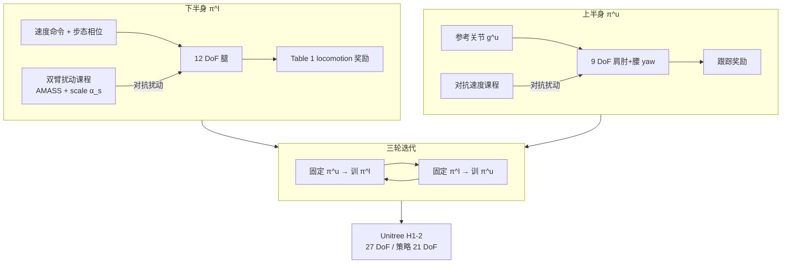

# ALMI：对抗 locomotion 与运动模仿的人形策略学习

**ALMI**（*Adversarial Locomotion and Motion Imitation for Humanoid Policy Learning*，arXiv:2504.14305，NeurIPS 2025）收录于 [AMP 运动先验专题](https://mp.weixin.qq.com/s/YZsm3855iP3TNTTt1aou7w) **第 07/19** 篇（**02 人形走跑**）。策展切入点：**人形上半身与下半身在控制里不是同一种角色**——ALMI 用 **上下半身互相对抗的迭代 RL** 而非单一全身 AMP 判别器笼统约束。

## 一句话定义

**将人形控制分解为下半身 locomotion 策略 π^l 与上半身 motion imitation 策略 π^u，通过固定一方、采样对抗命令/动作的双方迭代优化，在 H1-2 上同时达到稳健走跑与精确上肢跟踪，并发布语言标注 ALMI-X 数据集。**

## 英文缩写速查

| 缩写 | 英文全称 | 简要说明 |
|------|----------|----------|
| ALMI | Adversarial Locomotion and Motion Imitation | 上下半身对抗共训的人形全身框架 |
| RL | Reinforcement Learning | 通过与环境交互最大化长期回报来学习策略的范式 |
| AMASS | Archive of Motion Capture as Surface Shapes | 上半身课程动作来源之一 |
| JPE | Joint Position Error | 上肢跟踪误差指标 |
| PPO | Proximal Policy Optimization | 两策略均用 PPO 训练 |
| HOI | Human–Object Interaction | 全身能力向 loco-manipulation 扩展语境 |

## 为什么重要

- **身体结构感知的「先验」：** 非典型 AMP 论文，但体现专题核心——**下半身**需要速度/平衡 prior，**上半身**需要姿态 mimic prior；硬塞单一判别器易牺牲平衡（策展与 [MoRE #08](./paper-amp-survey-08-more.md) 多判别器路线呼应）。
- **对抗 = 扰动课程：** 学 $\pi^l$ 时上半身按 AMASS 难度扰动；学 $\pi^u$ 时下半身速度命令对抗加大——比手工权重调参更系统。
- **数据资产：** **ALMI-X** >80k 轨迹，语言模板「${movement mode} ${direction} ${velocity level} and ${motion}」；初步 Transformer 全身 foundation model。
- **强基线：** CMU MoCap Hard 存活率 **0.9723** vs Exbody **0.8778**；上肢 JPE **0.2116 m** vs 全身一体 ALMI **0.7022 m**；G1 泛化优于 OmniH2O / Exbody2。

## 流程总览

## 核心机制（归纳）

### 1）分体策略与 DoF

- **π^l：** 12 DoF 腿；速度命令 + 步态相位；丰富 locomotion 奖励（Table 1）。
- **π^u：** 9 DoF 上肢 + 腰 yaw；跟踪 $\bm{g}^u$。
- **平台：** H1-2 共 27 DoF，策略控 21 DoF（腕除外）；Isaac Gym 4096 并行。

### 2）对抗迭代与课程

- **理论：** max-min 交替达 $\epsilon$-近似纳什均衡；实践 **固定一方** 降算力。
- **双臂课程：** 按存活时长排序 AMASS 难度 + motion scale $\alpha_s$ 渐进。
- **速度对抗课程：** 跟踪误差大时加大下半身速度扰动。

### 3）ALMI-X 与基础模型

- MuJoCo 采集 >80k 轨迹；语言标注模板化描述。
- 初步 **Transformer** 全身 foundation model 探索。

## 常见误区

1. **ALMI = 两个独立真机策略硬切换：** 训练期分体 + 对抗；部署为 **协调全身**，不是 FSM 换 checkpoint（细节见项目页）。
2. **全身 AMP 加权重就行：** 论文显示 **ALMI(whole)** 上肢 JPE **0.7022 m** 远差于分体 **0.2116 m**——结构分解非简单调参。
3. **与 MoRE 重复：** MoRE 是 **单策略 + 多判别器 + 深度地形**；ALMI 是 **双策略 + 上下半身对抗**，无多步态 gait command。
4. **只适用 H1-2：** 主实验 H1-2；G1 泛化有报告，跨形态需重训与 retarget。

## 实验与评测

- **CMU MoCap Hard：** 存活率、上肢 JPE vs Exbody / Exbody2 / OmniH2O / 全身一体 ALMI。
- **G1 迁移：** 相对 OmniH2O、Exbody2 更稳（论文 §实验）。
- **三轮迭代 ~17 h**（单卡量级，见论文）；消融对抗课程与分体结构。

## 与其他页面的关系

- 同段姊妹：[GMP #06](./paper-amp-survey-06-natural_humanoid_robot_locomotion_wi.md)、[MoRE #08](./paper-amp-survey-08-more.md)、[Hiking #09](./paper-hiking-in-the-wild.md)
- 任务：[locomotion.md](../tasks/locomotion.md)、[loco-manipulation.md](../tasks/loco-manipulation.md)
- AMP 专题：[humanoid-amp-motion-prior-survey.md](../overview/humanoid-amp-motion-prior-survey.md)（#07/19）

## 参考来源

- [ALMI（arXiv:2504.14305）](../../sources/papers/almi_adversarial_locomotion_motion_imitation_arxiv_2504_14305.md)
- [humanoid_amp_survey_07_adversarial_locomotion_and_motion_imitation_for.md](../../sources/papers/humanoid_amp_survey_07_adversarial_locomotion_and_motion_imitation_for.md)
- [humanoid_amp_survey_19_catalog.md](../../sources/papers/humanoid_amp_survey_19_catalog.md)
- [wechat_embodied_ai_lab_humanoid_amp_motion_prior_survey.md](../../sources/blogs/wechat_embodied_ai_lab_humanoid_amp_motion_prior_survey.md)
- 原始抓取：[wechat_humanoid_amp_19_survey_2026-05-26.md](../../sources/raw/wechat_humanoid_amp_19_survey_2026-05-26.md)

## 推荐继续阅读

- [ALMI 项目页](https://almi-humanoid.github.io) — 视频与 ALMI-X
- [arXiv:2504.14305](https://arxiv.org/abs/2504.14305) — NeurIPS 2025 正文
- [AMP 专题长文（微信公众号）](https://mp.weixin.qq.com/s/YZsm3855iP3TNTTt1aou7w)
- [MoRE #08](./paper-amp-survey-08-more.md) — 多判别器 + 复杂地形对照
