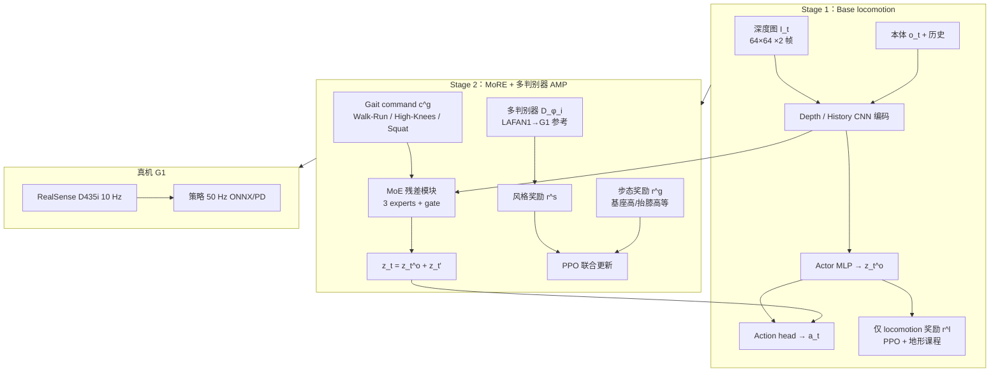
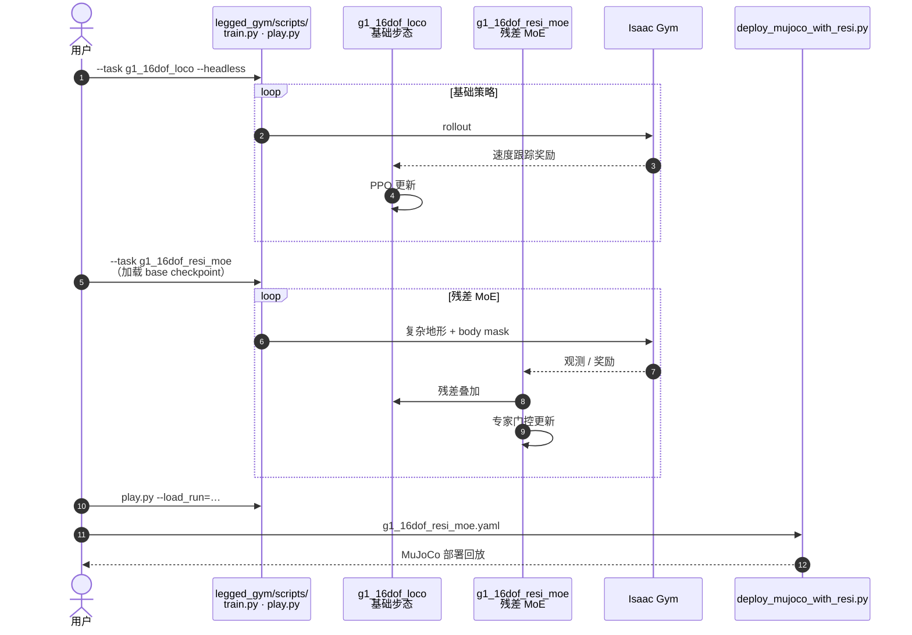

---

type: entity
tags: [paper, humanoid, amp, motion-prior, adversarial-imitation, locomotion, mixture-of-experts, terrain-adaptation, unitree-g1, sim2real, teleai, heu, shanghaitech, ustc]
status: complete
updated: 2026-07-24
arxiv: "2506.08840"
venue: arXiv
code: https://github.com/TeleHuman/MoRE
summary: "MoRE（arXiv:2506.08840）两阶段训练：深度相机 base locomotion + latent residual MoE 与多判别器 AMP，在 gait command 下于复杂地形切换 Walk-Run / High-Knees / Squat，G1 真机部署。"
related:
  - ../overview/humanoid-amp-motion-prior-survey.md
  - ../overview/humanoid-rl-motion-control-body-system-stack.md
  - ../methods/amp-reward.md
  - ../tasks/locomotion.md
  - ../concepts/terrain-adaptation.md
  - ./unitree-g1.md
  - ./lafan1-dataset.md
  - ./paper-hiking-in-the-wild.md
  - ./paper-amp-survey-07-adversarial_locomotion_and_motion_im.md
  - ./paper-unified-walk-run-recovery-sdamp.md
  - ./paper-explicit-stair-geometry-humanoid-locomotion.md
sources:
  - ../../sources/repos/more.md
  - ../../sources/papers/more_mixture_residual_experts_arxiv_2506_08840.md
  - ../../sources/papers/humanoid_amp_survey_08_more_mixture_of_residual_experts_for_humanoid_li.md
  - ../../sources/papers/humanoid_amp_survey_19_catalog.md
  - ../../sources/blogs/wechat_embodied_ai_lab_humanoid_amp_motion_prior_survey.md
---

# MoRE：复杂地形上的人形多步态残差专家混合

**MoRE（Mixture of latent Residual Experts）** 收录于 [具身智能研究室 · AMP 运动先验专题](https://mp.weixin.qq.com/s/YZsm3855iP3TNTTt1aou7w) **第 08/19** 篇（**02 人形走跑**），对应 arXiv:2506.08840。核心命题：人形 [AMP](../methods/amp-reward.md) 不能只服务「平地上一种好看步态」——在台阶、沟壑与高台上，**自然性本身应是可切换、可命令的多模式运动**；本文用 **深度外感知 + 两阶段训练 + latent residual MoE + 多判别器先验** 在 **Unitree G1** 上实现。

## 一句话定义

**先在无 motion prior 下用深度相机学会复杂地形穿越，再以 gait command 门控的多判别器 AMP 与 MoE 残差模块，在同一策略内切换 Walk-Run、High-Knees、Squat 等人形步态。**

## 英文缩写速查

| 缩写 | 英文全称 | 简要说明 |
|------|----------|----------|
| AMP | Adversarial Motion Prior | 用对抗判别约束状态转移接近专家运动分布的先验 |
| MoRE | Mixture of latent Residual Experts | 本文：latent 空间残差专家混合，调制 base locomotion 隐特征 |
| MoE | Mixture-of-Experts | 门控网络加权组合多个专家子网络输出 |
| RL | Reinforcement Learning | 通过与环境交互最大化长期回报来学习策略的范式 |
| PPO | Proximal Policy Optimization | 人形/足式 locomotion 中最常用的 on-policy 策略梯度算法 |
| G1 | Unitree G1 Humanoid | 宇树入门级教育科研人形平台 |
| MoCap | Motion Capture | 动作捕捉，LAFAN1 等参考动作来源 |

## 为什么重要

- **AMP × 复杂地形 × 多步态：** 相对平地单参考 AMP，MoRE 把「像人」从单一风格扩展为 **gait command 下的多种运动模式**，并与 **深度感知** 闭环，对应 AMP 专题「人形走跑」段中 **#07 ALMI 分部位**、**#09 Hiking 感知落脚** 之后的 **步态切换** 议题。
- **两阶段降复杂度：** Stage 1 专注 **可穿越性**（楼梯/沟壑/台阶/坡地），Stage 2 再叠 **风格先验**；避免从零同时学感知、平衡与多种人形步态。
- **latent residual 而非 action residual：** 残差加在 actor **末层隐特征**上，由预训练 action head 兜底，比直接残差动作更稳；MoE 缓解多技能 **梯度冲突**。
- **工程与评测锚点：** [显式楼梯几何条件化](./paper-explicit-stair-geometry-humanoid-locomotion.md) 将 MoRE 作为 **视觉复杂地形基线**（OOD 踢面高度等对比）；说明 MoRE 已是人形感知 locomotion 文献中的 **常用对照系**。

## 流程总览

## 核心机制（归纳）

### 1）Stage 1：深度条件 base policy

- **观测：** 角速度、投影重力、速度命令、关节角/速、上步动作；**两帧深度图** + 本体历史经 CNN 编码后与当前本体拼接进 actor。
- **Critic 特权：** 高程图 $\bm{m}_t$、足端位置、真值线速度、随机化物理参数等——典型 **非对称 actor-critic**。
- **奖励：** 仅 Table I 中 locomotion 项（速度跟踪、平滑、碰撞、足滑等），**无 AMP、无 gait command**。
- **产出：** 可过 **楼梯、沟壑、高台、粗糙/坡地** 的穿越能力，但步态尚不「人形化」。

### 2）Stage 2：Latent residual MoE + 多判别器

- **残差接口：** MoRE 读 actor feature $\bm{f}_t$ 与 $\bm{c}^g_t$，输出 $\bm{z}'_t$；$\bm{z}_t=\bm{z}^o_t+\bm{z}'_t$ 再进 action head——**不改 base 权重映射到动作的接口**。
- **MoE：** $N{=}3$ 个 expert + softmax gate，对不同技能/地形子任务分配 expert，减轻单网络多任务冲突。
- **多判别器 AMP：** 每步态 $i$ 一个 $D_{\phi_i}$；判别输入为 **5 步关节角轨迹** $\tau$（16 维腿/臂受控关节）；风格奖励 $\bm{r}^s$ 仅当 $\arg\max(\bm{c}^g_t)=i$ 时从对应判别器计入。
- **Gait rewards $\bm{r}^g$：** 如 High-Knees 的抬膝高度、Squat 的基座高度——在参考动作之外施加 **可设计的步态约束**，减少「参考动作有缺陷就得重训」的问题。

### 3）训练与部署细节

| 项目 | 内容 |
|------|------|
| 仿真 | NVIDIA Isaac Gym；深度用 **NVIDIA Warp** 渲染 |
| 参考 | [LAFAN1](./lafan1-dataset.md) retarget 至 G1 |
| 地形课程 | gap 0.05–0.45 m、step 0.05–0.3 m、stair 0.05–0.15 m；两阶段均启用 |
| 域随机化 | 摩擦、质量、PD、动作延迟、深度噪声/偏差/遮挡等（Table II） |
| 真机 | G1 + D435i；640×480 → RealSense 滤波 → 64×64；策略 **50 Hz** |

## 官方代码（TeleHuman/MoRE）

[GitHub 仓库](https://github.com/TeleHuman/MoRE) 将论文两阶段拆为两个 `legged_gym` 任务，便于分步复现：

| 阶段 | Task | 要点 |
|------|------|------|
| Stage 1 | `g1_16dof_loco` | ≥40k iter、≥3000 env；深度 base 穿越 |
| Stage 2 | `g1_16dof_resi_moe` | 加载 Stage 1 checkpoint；40k iter（末 10k 启用 **body mask**）；≥6000 env；支持 `torchrun` 多 GPU |

- **body mask 数据：** Stage 2 需从 README 提供的 OneDrive 链接下载至 `./body_mask_data`。
- **可视化：** `play.py` 中 `Z/X/C` 切换 Walk-Run / High-Knees / Squat gait command。
- **MuJoCo：** `deploy_mujoco_with_resi.py` 提供 Roughness / Pit / Stairs / Gap 四类 sim2sim 场景。

详见 [sources/repos/more.md](../../sources/repos/more.md)。

## 源码运行时序图

官方实现 [TeleHuman/MoRE](https://github.com/TeleHuman/MoRE)：先 `legged_gym/scripts/train.py --task g1_16dof_loco` 训基础步态，再 `--task g1_16dof_resi_moe` 训残差 MoE；`play.py` 回放；`deploy/deploy_mujoco/deploy_mujoco_with_resi.py` 做 MuJoCo 部署验证。一次完整运行如下：

- **必须先有 base**：残差专家站在冻结/预训练步态之上，不要从零只训 MoE。
- **分布式**：可用 `torchrun --nproc_per_node=2` 加速（见 README）。

## 常见误区

1. **MoRE = 部署期 FSM 切策略：** 仍是 **单一网络**；步态由 **gait command**（及 Stage 2 训练时的采样）选择判别器分支与 gait reward，不是多个独立 checkpoint 硬切换。
2. **先有 AMP 再有地形：** Stage 1 **故意不用 motion prior**，先保证复杂地形 **可达性**；AMP 仅在 Stage 2 注入 **风格**，顺序与「平地 AMP 再加大感知」不同。
3. **多判别器 = SD-AMP 双判别器：** [SD-AMP #10](./paper-unified-walk-run-recovery-sdamp.md) 按 **机体是否跌倒** 门控 recovery/loco；MoRE 按 **用户步态命令** 门控 **三种人形步态** 判别器，且依赖 **深度外感知**——问题设定与路由信号均不同。
4. **MoE 在 base 层：** Expert 只出现在 **Stage 2 残差模块**，Stage 1 base actor 为常规模型。

## 实验与评测

- **仿真 benchmark：** 8 m×14 m 赛道，gap / stair / step 各 Easy+Hard；对比 **Blind**（无视觉）、**Base**（仅 Stage 1）、**MoRE** 三档。MoRE 三类步态在多数设定下 **成功率与穿越距离** 显著优于 Blind；相对 Base 在保持穿越性的同时引入 **lifelike gait**（详见原文 Table III）。
- **消融：** 论文讨论 expert 数量（取 3）、latent vs action residual、MoE 对梯度冲突的缓解；细节见 [arXiv HTML](https://arxiv.org/html/2506.08840v1)。
- **真机：** 项目页展示平地与组合地形上 **Walk-Run / High-Knees / Squat** 切换与复杂地形穿越视频。
- **姊妹工作引用：** [显式楼梯几何](./paper-explicit-stair-geometry-humanoid-locomotion.md) 在楼梯 OOD 踢面高度上报告相对 MoRE 视觉基线的成功率优势——阅读 MoRE 时宜同时看 **「隐式视觉特征 vs 显式几何 token」** 两条感知接口。

## 结论

**复杂地形上「像人」必须可命令切换：先 Stage 1 深度相机练穿越，再 Stage 2 叠 latent 残差 MoE + 多判别器 AMP；顺序反了会同时背感知、平衡与多样式先验。**

1. **Stage 1 故意无 motion prior** — 只靠 locomotion 奖励 + 地形课程过楼梯/沟壑/台阶；产出可达性，不追求人形风格。
2. **残差加在 actor 末层隐特征，不是动作残差** — \(\mathbf{z}_t=\mathbf{z}^o_t+\mathbf{z}'_t\) 再进预训练 action head，比直接残差动作更稳。
3. **\(N{=}3\) expert + gait command 门控三判别器** — Walk-Run / High-Knees / Squat；风格奖励只计入当前命令对应的 \(D_{\phi_i}\)，另用抬膝/基座高等 \(\mathbf{r}^g\) 补参考缺陷。
4. **评测读法** — 8 m×14 m 赛道上 MoRE 成功率与穿越距离显著优于 Blind；相对仅 Stage 1 的 Base，在保持穿越性同时引入 lifelike gait（表见原文 Table III）。
5. **真机锚点** — G1 + RealSense D435i（深度 10 Hz → 64×64），策略 **50 Hz**；官方仓分 `g1_16dof_loco` → `g1_16dof_resi_moe`，必须先有 base checkpoint。
6. **勿与 SD-AMP 混路由信号** — MoRE 按用户步态命令切判别器；[SD-AMP](./paper-unified-walk-run-recovery-sdamp.md) 按是否跌倒切 recovery/loco。

## 与其他页面的关系

- AMP 专题总览：[humanoid-amp-motion-prior-survey.md](../overview/humanoid-amp-motion-prior-survey.md)（#08/19）
- 方法基线：[amp-reward.md](../methods/amp-reward.md)
- 同段姊妹篇：[ALMI #07](./paper-amp-survey-07-adversarial_locomotion_and_motion_im.md)（上下半身）、[Hiking in the Wild #09](./paper-hiking-in-the-wild.md)（感知跑酷）、[SD-AMP #10](./paper-unified-walk-run-recovery-sdamp.md)（状态门控双判别器）
- 任务/概念：[locomotion.md](../tasks/locomotion.md)、[terrain-adaptation.md](../concepts/terrain-adaptation.md)
- 平台与数据：[unitree-g1.md](./unitree-g1.md)、[lafan1-dataset.md](./lafan1-dataset.md)
- 对照基线（楼梯）：[paper-explicit-stair-geometry-humanoid-locomotion.md](./paper-explicit-stair-geometry-humanoid-locomotion.md)

## 参考来源

- [MoRE 官方仓库](../../sources/repos/more.md)
- [MoRE（arXiv:2506.08840）](../../sources/papers/more_mixture_residual_experts_arxiv_2506_08840.md)
- [humanoid_amp_survey_08_more_mixture_of_residual_experts_for_humanoid_li.md](../../sources/papers/humanoid_amp_survey_08_more_mixture_of_residual_experts_for_humanoid_li.md) — AMP 19 篇策展索引
- [humanoid_amp_survey_19_catalog.md](../../sources/papers/humanoid_amp_survey_19_catalog.md)
- [wechat_embodied_ai_lab_humanoid_amp_motion_prior_survey.md](../../sources/blogs/wechat_embodied_ai_lab_humanoid_amp_motion_prior_survey.md)
- 原始抓取：[wechat_humanoid_amp_19_survey_2026-05-26.md](../../sources/raw/wechat_humanoid_amp_19_survey_2026-05-26.md)

## 推荐继续阅读

- [TeleHuman/MoRE](https://github.com/TeleHuman/MoRE) — 官方 PyTorch 实现与训练脚本
- [MoRE 项目页](https://more-humanoid.github.io/) — 视频与 BibTeX
- [arXiv:2506.08840](https://arxiv.org/abs/2506.08840) — 方法 Fig.2、奖励表与 benchmark
- [AMP 专题长文（微信公众号）](https://mp.weixin.qq.com/s/YZsm3855iP3TNTTt1aou7w) — 策展导读「复杂地形上步态不能只有一种」
- [显式楼梯几何条件化](./paper-explicit-stair-geometry-humanoid-locomotion.md) — MoRE 作为视觉复杂地形基线的定量对照
