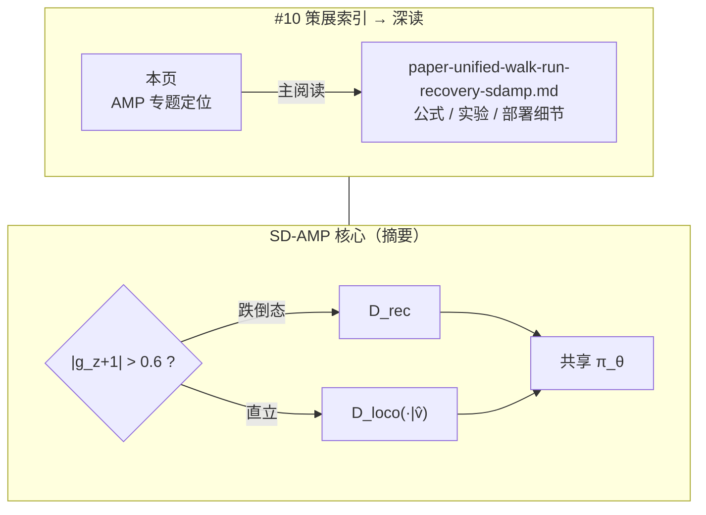

# SD-AMP：统一走跑起身（AMP 专题 #10）

**Unified Walking, Running, and Recovery for Humanoids via State-Dependent Adversarial Motion Priors**（arXiv:2605.18611）收录于 [AMP 运动先验专题](https://mp.weixin.qq.com/s/YZsm3855iP3TNTTt1aou7w) **第 10/19** 篇（**02 人形走跑**）。策展导读称此文 **「最贴近人形 AMP 未来」** 之一：在 **单策略** 内用 **状态相关门控** 分离 recovery 与 locomotion 的对抗先验，部署 **无运行时 FSM**。

> **技术深读主入口：** [SD-AMP 统一走跑起身实体页](./paper-unified-walk-run-recovery-sdamp.md)（双判别器公式、门控阈值、实验表与完整 Mermaid）。本页为 AMP 专题 **#10 策展索引**，避免与姊妹页重复堆砌公式。

## 一句话定义

**训练期按投影重力门控切换 recovery 与速度条件 locomotion 两个 AMP 判别器，共享 actor 在仅三条 LAFAN1 参考下统一走、跑与俯卧/仰卧起身，G1 真机 50 Hz ONNX 无显式模式切换。**

## 英文缩写速查

| 缩写 | 英文全称 | 简要说明 |
|------|----------|----------|
| SD-AMP | State-Dependent Adversarial Motion Prior | 按机体状态门控的对抗运动先验 |
| AMP | Adversarial Motion Prior | 基础对抗风格奖励框架 |
| G1 | Unitree G1 Humanoid | 宇树真机验证平台 |
| ONNX | Open Neural Network Exchange | 真机 50 Hz 部署格式 |
| PPO | Proximal Policy Optimization | Isaac Lab 训练算法 |
| FSM | Finite State Machine | 本文部署期刻意避免的模块化切换 |

## 为什么重要

- **少参考、多行为：** 仅 `walk1_subject1`、`run1_subject2`、`fallAndGetUp2_subject2` 三条 retarget 即覆盖 **走/跑/起身**——说明 **先验结构分离** 有时比堆参考更关键。
- **消灭部署 FSM：** 硬件 rollout **recovery → walk → run** 连续，同一冻结策略；相对「走控+跑控+起身控」模块化边界更稳。
- **与 MoRE 区分：** [MoRE #08](./paper-amp-survey-08-more.md) 按 **gait command** 路由多判别器 + 深度地形；SD-AMP 按 **倾角** 路由 recovery/loco，**无步态命令**。
- **工程对照：** [AMP_mjlab](./amp-mjlab.md) 统一判别器 + 分区参考；本文 **双判别器 + 固定重力阈值** 更理论化「何时用哪种 prior」。

## 流程总览

## 核心机制（索引级）

| 机制 | 要点 |
|------|------|
| **门控** | 投影重力 $g_z$；$|g_z+1|>0.6$（~37°）→ recovery，否则 locomotion |
| **Loco 判别器** | 速度条件 $\hat{v}_t$，walk/run 参考按 $(1-\hat{v}_t)$ / $\hat{v}_t$ 混合 |
| **奖励** | $R^{\mathrm{total}}=R_t+\lambda_{\mathrm{amp}} R_{\mathrm{AMP}}$，$\lambda_{\mathrm{amp}}=0.5$ |
| **观测** | 96 维 × 4 帧 = 384 维；29 维关节目标 + PD |
| **部署** | ONNX 50 Hz；**无** sim2real 额外微调叙述 |

完整推导、与 Selective AMP / Heracles 对照表见 **[深读页](./paper-unified-walk-run-recovery-sdamp.md)**。

## 常见误区

1. **训练期门控 = 部署 FSM：** 门控 **仅训练期** 选活跃判别器；部署 **不读** 门控变量，靠单策略内隐切换。
2. **与 MoRE 多判别器相同：** MoRE 按 **用户步态命令**；SD-AMP 按 **机体是否跌倒** + **速度命令条件 loco**。
3. **三条参考不够泛化：** 论文论点正是 **regime 分离** 优于盲目增大参考库；跨形态仍需 retarget 重训。
4. **本页即全部技术细节：** 公式级内容在 **[paper-unified-walk-run-recovery-sdamp.md](./paper-unified-walk-run-recovery-sdamp.md)**。

## 实验与评测

- **仿真：** 速度跟踪、recovery 成功率；门控与双判别器消融。
- **真机 G1：** 正常模式 $[-0.5,1.0]$ m/s；快速模式（安全约束）$[-1.5,3.0]$ m/s；俯卧/仰卧起身后续走跑。
- **详表：** 见 [深读页](./paper-unified-walk-run-recovery-sdamp.md) 与 [arXiv HTML](https://arxiv.org/html/2605.18611v1)。

## 与其他页面的关系

- **主阅读：** [paper-unified-walk-run-recovery-sdamp.md](./paper-unified-walk-run-recovery-sdamp.md)
- 方法基线：[amp-reward.md](../methods/amp-reward.md)、[amp-mjlab.md](./amp-mjlab.md)
- 多技能姊妹：[AHC #11](./paper-adaptive-humanoid-control.md)、[HAML #12](./paper-amp-survey-12-haml.md)
- 地形多判别器：[MoRE #08](./paper-amp-survey-08-more.md)
- AMP 专题：[humanoid-amp-motion-prior-survey.md](../overview/humanoid-amp-motion-prior-survey.md)（#10/19）

## 参考来源

- [SD-AMP（arXiv:2605.18611）](../../sources/papers/unified_walk_run_recovery_sdamp_arxiv_2605_18611.md)
- [humanoid_amp_survey_10_unified_walking_running_and_recovery_for_humanoi.md](../../sources/papers/humanoid_amp_survey_10_unified_walking_running_and_recovery_for_humanoi.md)
- [humanoid_amp_survey_19_catalog.md](../../sources/papers/humanoid_amp_survey_19_catalog.md)
- [wechat_embodied_ai_lab_humanoid_amp_motion_prior_survey.md](../../sources/blogs/wechat_embodied_ai_lab_humanoid_amp_motion_prior_survey.md)
- 原始抓取：[wechat_humanoid_amp_19_survey_2026-05-26.md](../../sources/raw/wechat_humanoid_amp_19_survey_2026-05-26.md)

## 推荐继续阅读

- **[SD-AMP 深读实体页](./paper-unified-walk-run-recovery-sdamp.md)** — 首选技术入口
- [arXiv:2605.18611](https://arxiv.org/abs/2605.18611)
- [AMP_mjlab](./amp-mjlab.md) — 工程实现对照
- [AMP 专题长文（微信公众号）](https://mp.weixin.qq.com/s/YZsm3855iP3TNTTt1aou7w)
