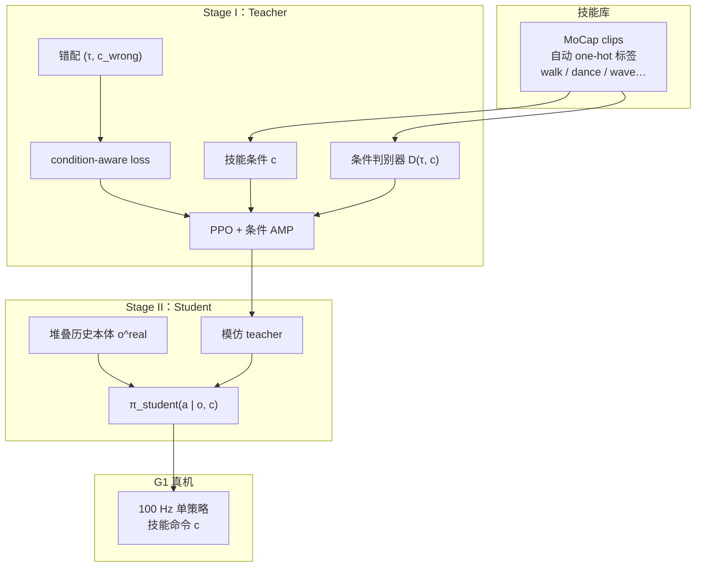

# HAML：单策略人形对抗多技能学习

**HAML**（*Humanoid Adversarial Multi-Skill Learning via a Single Policy*，MDPI *Actuators* 2026, 15(4):212）收录于 [AMP 运动先验专题](https://mp.weixin.qq.com/s/YZsm3855iP3TNTTt1aou7w) **第 12/19** 篇（**03 多技能与自适应**）。策展：**单策略多技能路线**——让 AMP 先验 **理解当前技能条件**，而非「像人但不听命令」。

## 一句话定义

**Stage I 用 clip 级 one-hot 技能标签训练条件对抗 teacher（错配 transition–label + condition-aware loss 防条件坍缩）；Stage II 将 teacher 蒸馏为仅依赖堆叠历史本体的 student，G1 机载 100 Hz 单策略覆盖走、舞、挥手等多技能切换。**

## 英文缩写速查

| 缩写 | 英文全称 | 简要说明 |
|------|----------|----------|
| HAML | Humanoid Adversarial Multi-Skill Learning | 条件 AMP + 蒸馏的可部署多技能框架 |
| AMP | Adversarial Motion Prior | 条件判别器约束各技能运动分布 |
| RL | Reinforcement Learning | Teacher 阶段 PPO + 对抗训练 |
| BC | Behavior Cloning | Student 蒸馏模仿 teacher |
| G1 | Unitree G1 Humanoid | 机载 100 Hz，延迟 15–25 ms |
| MoCap | Motion Capture | 大规模技能库来源 |

## 为什么重要

- **条件坍缩是 multi-skill AMP 要害：** 条件判别器 $D(s_{t-N+1:t}, c)$ 易 **忽略技能 ID**，导致「像人但技能不分」；HAML 用 **错配 (transition, 错误 label)** + **condition-aware** 辅助损失显式惩罚。
- **可部署 student：** Teacher 可用特权信息；**Stage II** 仅 **堆叠历史本体** $\pi(a|o^{\mathrm{real}}_t, c)$ 上真机，减全局速度估计依赖。
- **与 AHC / MoRE 对照：** [AHC #11](./paper-adaptive-humanoid-control.md) 专精→蒸馏→地形微调；[MoRE #08](./paper-amp-survey-08-more.md) gait command + 多判别器 **单阶段**；HAML **条件单判别器 + 两阶段蒸馏**。
- **工程指标透明：** G1 **100 Hz**；延迟 **15–25 ms**；报告技能覆盖率、转移覆盖率、真实感。

## 流程总览

## 核心机制（归纳）

### 1）技能接口

- 每条 clip **自动**赋粗粒度 **one-hot**（walk、dance、wave hello 等），库可扩展。
- 技能命令 $c$ 在仿真与真机 **显式输入** 策略与判别器。

### 2）Stage I — 条件对抗 Teacher

- **条件判别器** $D(s_{t-N+1:t}, c)$；短上下文 $N$ 步转移。
- **错配样本：** (transition, **错误** label) 迫使判别器用 $c$。
- **Condition-aware loss：** 惩罚错误关联，缓解 **conditional collapse**。

### 3）Stage II — 历史本体 Student

- 输入：$\pi(a|o^{\mathrm{real}}_t, c)$，$o^{\mathrm{real}}$ 为堆叠 onboard 本体（无全局特权速度）。
- 行为克隆 teacher；面向 **延迟与可观测性** 真机约束。

## 常见误区

1. **多判别器 = HAML：** [MoRE](./paper-amp-survey-08-more.md) / [SD-AMP](./paper-unified-walk-run-recovery-sdamp.md) 用 **多个判别器**；HAML 用 **单个条件判别器** + 技能 one-hot。
2. **Teacher 直接部署：** 真机走 **Student**；Teacher 阶段允许更强观测。
3. **条件标签必须精细语义：** 论文用 **粗粒度** clip 级标签即可；过细标注非前提。
4. **与 AHC 相同：** AHC 是 **起身+走** 专精蒸馏 + **地形** 微调；HAML 是 **多技能库** + **条件 AMP** + **技能切换**。

## 实验与评测

- **仿真：** 技能覆盖率、转移覆盖率、运动真实感 vs 非条件 AMP 基线。
- **真机 G1：** 100 Hz；延迟 15–25 ms；多技能切换视频（项目页）。
- **消融：** 去掉错配或 condition-aware loss，条件坍缩加剧（论文讨论）。

## 与其他页面的关系

- 多技能姊妹：[AHC #11](./paper-adaptive-humanoid-control.md)、[SD-AMP #10](./paper-unified-walk-run-recovery-sdamp.md)、[MoRE #08](./paper-amp-survey-08-more.md)
- 方法：[amp-reward.md](../methods/amp-reward.md)
- 平台：[unitree-g1.md](../entities/unitree-g1.md)
- AMP 专题：[humanoid-amp-motion-prior-survey.md](../overview/humanoid-amp-motion-prior-survey.md)（#12/19）

## 参考来源

- [HAML（MDPI Actuators 2026）](../../sources/papers/haml_humanoid_adversarial_multi_skill_learning_mdpi_2026.md)
- [humanoid_amp_survey_12_haml_humanoid_adversarial_multi_skill_learning_v.md](../../sources/papers/humanoid_amp_survey_12_haml_humanoid_adversarial_multi_skill_learning_v.md)
- [humanoid_amp_survey_19_catalog.md](../../sources/papers/humanoid_amp_survey_19_catalog.md)
- [wechat_embodied_ai_lab_humanoid_amp_motion_prior_survey.md](../../sources/blogs/wechat_embodied_ai_lab_humanoid_amp_motion_prior_survey.md)
- 原始抓取：[wechat_humanoid_amp_19_survey_2026-05-26.md](../../sources/raw/wechat_humanoid_amp_19_survey_2026-05-26.md)

## 推荐继续阅读

- [HAML 项目页](https://vsislab.github.io/haml/) — 视频与全文链接
- [MDPI 全文](https://www.mdpi.com/2076-0825/15/4/212) — DOI 10.3390/act15040212
- [AMP 专题长文（微信公众号）](https://mp.weixin.qq.com/s/YZsm3855iP3TNTTt1aou7w)
- [AHC #11](./paper-adaptive-humanoid-control.md) — 蒸馏 + 微调另一路线
