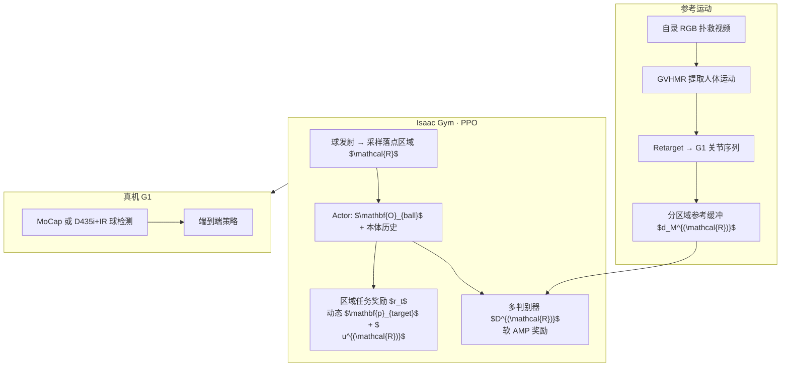

# Humanoid Goalkeeper：位置条件化任务–运动约束守门

**Humanoid Goalkeeper**（*Learning from Position Conditioned Task-Motion Constraints*，arXiv:2510.18002）收录于 [具身智能研究室 · AMP 运动先验专题](https://mp.weixin.qq.com/s/YZsm3855iP3TNTTt1aou7w) **第 13/19** 篇（**04 交互与长时程**）。核心命题：人形守门不是「跟踪一段扑救动画」，而是在 **极短反应窗** 内对 **高速飞球** 做 **区域语义一致** 的全身拦截——任务成功率与 **人形运动先验** 必须在 **同一端到端策略** 里按 **落点区域** 联合条件化。

## 一句话定义

**以球落点区域 $\mathcal{R}$ 路由任务奖励与多判别器 AMP，在局部球位观测上训练单策略 PPO，使人形机器人在宽守门区内完成自然、自主、可硬件部署的动态扑救（并可泛化至躲球与抓球）。**

## 英文缩写速查

| 缩写 | 英文全称 | 简要说明 |
|------|----------|----------|
| AMP | Adversarial Motion Prior | 用对抗判别约束状态转移接近专家运动分布的先验 |
| RL | Reinforcement Learning | 通过与环境交互最大化长期回报来学习策略的范式 |
| PPO | Proximal Policy Optimization | 人形动态交互中最常用的 on-policy 策略梯度算法 |
| G1 | Unitree G1 Humanoid | 本文真机平台（29 DoF 策略输出） |
| MoCap | Motion Capture | 光学动捕或机载深度球检测两种感知模态 |
| GVHMR | Gravity-View Human Motion Recovery | 从自录 RGB 视频提取人体运动并 retarget 至 G1 |

## 为什么重要

- **人形 vs 四足守门：** 覆盖宽度与 **全身高动态**（侧移、起跳、蹲扑）要求远高于四足；不能用固定 motion primitive 或分阶段「先感知后跟踪」硬切。
- **Position-conditioned 双约束：** 与 [MoRE #08](./paper-amp-survey-08-more.md) 的 **gait command 多判别器** 同族——此处路由信号是 **球目标区域 $\mathcal{R}$**；任务手选择（左/右手）与 AMP 风格必须 **区域一致**（Fig. 5 聚类中心应对齐区域）。
- **软 AMP 服务高精度任务：** 对执行转移高斯扰动后取 **最高判别分** 计奖，避免硬模仿牺牲拦截精度——交互段 AMP 与任务冲突的典型解法。
- **感知闭环 sim2real：** 训练内嵌球位/区域估计器 + 噪声与 dropout；真机 **MoCap 21/30** vs **机载相机** 均可部署，验证「先验 + 感知」可落地。

## 流程总览

## 核心机制（归纳）

### 1）区域条件化任务奖励

- 球门线划分为 **6 个落点区域**（左/中/右 × 低/中/高）；每 episode 采样 $\mathbf{p}_{\text{land}}\in\mathcal{R}$ 与对应球速。
- 动态末端目标：球远离时跟踪 **预测落点**，接近时切换 **当前球位**（式 (1) 距离门线阈值 $d_{th}$）。
- 区域调制 $\nu^{(\mathcal{R})}$：鼓励向右区 **右移**、向上区 **起跳** 等全身动作，而非仅手腕够球。
- **扑救后稳定：** episode 3 s（长于飞行时间 0.4–1.0 s）；球停后稳定奖励 + **从进行中环境采样关节姿态重置**（连续扑救）。

### 2）Position-conditioned AMP

- 每区域独立判别器 $D^{(\mathcal{R})}$，输入关节位置转移 $(q_t,q_{t+1})$。
- **软约束：** $r_{\text{amp}}=\max_j \max[0,1-0.25(D(\tilde q^{(j)}_t,\tilde q^{(j)}_{t+1})-1)^2]$，$\tilde q$ 为高斯扰动样本。
- 参考运动按区域入库；训练时 **仅激活当前 $\mathcal{R}$ 对应判别器分支**。

### 3）感知与 sim2real

| 项目 | 内容 |
|------|------|
| 仿真 | Isaac Gym；PPO；actor 见局部系 $\mathbf{O}_{\text{ball}}$ |
| 噪声 | 球位 ±5 cm；0.4 s 后随机 dropout；球停后观测清零 |
| 估计器 | 球位 MSE + 区域分类 CE，与策略联合训练 |
| 真机 MoCap | 头与球标记相对位姿 |
| 真机相机 | D435i + IR 滤光高反光球 |

## 常见误区

1. **不是相位跟踪守门动画：** 无固定 time phase；AMP 约束 **风格分布**，任务奖励决定 **何时伸手、哪只手**。
2. **≠ MoRE 步态命令：** MoRE 按 **用户 gait** 切换判别器；本文按 **球落点区域** 切换，且面向 **动态物体交互** 而非地形 locomotion。
3. **软 AMP ≠ 无 AMP：** 去运动约束成功率跌至 ~32%；去 **AMP 分区** 则 $E_{\text{match}(\mathcal{R})}$ 从 67.8% 降至 25.7%——区域–风格对齐不可省。
4. **机载相机不是演示专用：** 相机模态真机仍可完成多区域扑救，但上区成功率低于 MoCap（表 III）。

## 实验与评测

- **仿真（500 trials/区）：** 完整方法 $E_{\text{succ}}\approx 80.9\%$，$E_{\text{match}(\mathcal{R})}\approx 67.8\%$；Range-Easy（±1.0 m）**84.6%**。
- **消融：** 去任务约束最平滑但无效；去任务分区或 AMP 分区均显著掉点。
- **真机：** 5 人制门 3 m×2 m；MoCap **21/30**；右侧非分区基线易 **过拟合一侧**（Fig. 6 轨迹对比）。
- **扩展任务：** 躲球（跳/蹲）、抓球——同一框架泛化。

## 与其他页面的关系

- AMP 专题总览：[humanoid-amp-motion-prior-survey.md](../overview/humanoid-amp-motion-prior-survey.md)（#13/19）
- 方法：[amp-reward.md](../methods/amp-reward.md)
- 同段姊妹篇：[PhysHSI #15](./paper-amp-survey-15-physhsi.md)、[HUSKY #14](./paper-amp-survey-14-husky.md)、[TeamHOI #17](./paper-amp-survey-17-teamhoi.md)
- 多判别器对照：[MoRE #08](./paper-amp-survey-08-more.md)
- 平台：[unitree-g1.md](./unitree-g1.md)

## 参考来源

- [humanoid_goalkeeper_arxiv_2510_18002.md](../../sources/papers/humanoid_goalkeeper_arxiv_2510_18002.md)
- [humanoid_amp_survey_13_humanoid_goalkeeper_learning_from_position_condi.md](../../sources/papers/humanoid_amp_survey_13_humanoid_goalkeeper_learning_from_position_condi.md)
- [humanoid_amp_survey_19_catalog.md](../../sources/papers/humanoid_amp_survey_19_catalog.md)
- [wechat_embodied_ai_lab_humanoid_amp_motion_prior_survey.md](../../sources/blogs/wechat_embodied_ai_lab_humanoid_amp_motion_prior_survey.md)
- 原始抓取：[wechat_humanoid_amp_19_survey_2026-05-26.md](../../sources/raw/wechat_humanoid_amp_19_survey_2026-05-26.md)

## 推荐继续阅读

- [项目页](https://humanoid-goalkeeper.github.io/Goalkeeper/) — 视频与宽范围扑救演示
- [GitHub: InternRobotics/Humanoid-Goalkeeper](https://github.com/InternRobotics/Humanoid-Goalkeeper)
- [arXiv:2510.18002](https://arxiv.org/abs/2510.18002)
- [AMP 专题长文（微信公众号）](https://mp.weixin.qq.com/s/YZsm3855iP3TNTTt1aou7w)
