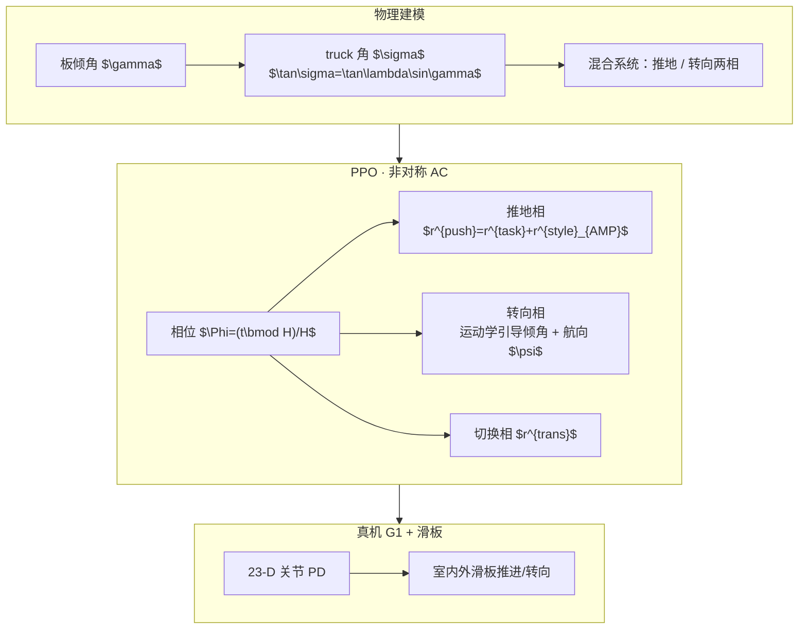

# HUSKY：物理感知人形滑板全身控制

**HUSKY**（*Humanoid Skateboarding System via Physics-Aware Whole-Body Control*，arXiv:2602.03205，**RSS 2026**）收录于 [AMP 运动先验专题](https://mp.weixin.qq.com/s/YZsm3855iP3TNTTt1aou7w) **第 14/19** 篇。核心命题：滑板把支持面变成 **与人形强耦合的欠驱动动力学系统**——AMP 在这里 **只塑造推地相的人形蹬地风格**，转向与相位切换则交给 **显式物理耦合与轨迹引导**。

## 一句话定义

**建模板倾 $\gamma$ 与 truck 转向 $\sigma$ 的等式约束，在推地相用 AMP 学人形蹬地、在滑行相用倾身物理引导转向，并以周期相位变量与轨迹规划平滑两相切换，使 G1 在真实滑板上稳定推进与转向。**

## 英文缩写速查

| 缩写 | 英文全称 | 简要说明 |
|------|----------|----------|
| AMP | Adversarial Motion Prior | 本文用于 **推地相** 人形蹬地风格先验 |
| RL | Reinforcement Learning | PPO 训练混合接触相位策略 |
| G1 | Unitree G1 Humanoid | 23 可控 DoF（不含腕）真机平台 |
| CoM | Center of Mass | 人形高质心放大滑板平衡难度 |
| RSS | Robotics: Science and Systems | 2026 会议发表 venue |
| DRL | Deep Reinforcement Learning | 大规模并行仿真学习滑板技能 |

## 为什么重要

- **新动力学层级：** 相对 [PhysHSI](./paper-amp-survey-15-physhsi.md) 的静态场景交互，滑板支持面 **随人移动** 且受 **非完整滚动约束**；四足滑板 [19] 的 CoM/支撑面对照表说明人形 Unique 难点。
- **AMP 分相位使用：** 不是全程单判别器美化——**推地** 需要「像人蹬地」，**转向** 需要「像车 lean-to-steer」；展示 AMP 与 **物理结构化奖励** 的可组合性。
- **真机稀缺技能：** RSS 2026 + 开源 [TeleHuman/humanoid_skateboarding](https://github.com/TeleHuman/humanoid_skateboarding)；室内外多板型与扰动视频验证 sim2real。
- **TeleAI 系延伸：** 与 [MoRE #08](./paper-amp-survey-08-more.md) 同属 Bai/Li 研究脉络，但任务从 **感知地形步态** 转向 **人–板耦合动力学**。

## 流程总览

## 核心机制（归纳）

### 1）人形–滑板耦合建模

- 简化 kingpin 几何：$\tan\sigma=\tan\lambda\sin\gamma$，把 **身体倾角** 映射为 **轮轴转向**。
- 推地相：一脚稳板、一脚间歇蹬地产生切向推力；转向相：双脚在板上 **被动滑行 + 身体倾角调制**。
- 观测含 **归一化相位 $\Phi$**，使策略知悉当前处于推地/转向/过渡。

### 2）推地相 AMP

- 判别器输入 5 步关节角窗 $\tau_t$；最小二乘损失 + 梯度惩罚（式 (5)）。
- 风格奖励有界映射（式 (6)）；与速度跟踪任务奖相加。
- 参考：**人形蹬地 MoCap**（非滑板专用轨迹硬跟踪）。

### 3）转向与相位切换

- 目标航向 $\psi$ → 运动学引导 **目标板倾** → 式 (1) 产生 $\sigma$ → 自行车模型偏航率。
- 轨迹引导机制减轻推地↔转向 **接触拓扑突变**；总奖励按 $\mathbb{I}^{\text{push/steer/trans}}$ 切换。

## 常见误区

1. **AMP 贯穿全程：** 仅 **推地相** 用 AMP；转向靠物理与任务奖，不是「全程像人滑滑板」单判别器。
2. **≠ 平地 locomotion AMP：** 命令是 **板速 $v_{cmd}$ + 航向 $\psi$ + 周期相位**，不是速度矢量行走。
3. **不是纯 RL 黑箱：** 显式 $\tan\sigma=\tan\lambda\sin\gamma$ 是训练能收敛的关键先验；去掉物理耦合转向极难探索。
4. **G1 23 DoF：** 腕部不控；与守门 29 DoF 设定不同，读对比实验时注意 embodiment。

## 实验与评测

- **仿真：** 非对称 actor-critic；critic 见滑板位姿、倾角、足力等特权量。
- **真机：** 完整推地–转向–切换；多户外场景与不同滑板；抗外力扰动（项目页 Fig. 1）。
- **对照维度：** Table I 量化人形 vs 四足滑板在 DoF、接触点数、CoM 高度、侧向转向、腿重定向等差异。

## 与其他页面的关系

- AMP 专题：[humanoid-amp-motion-prior-survey.md](../overview/humanoid-amp-motion-prior-survey.md)（#14/19）
- 方法：[amp-reward.md](../methods/amp-reward.md)
- 交互姊妹：[PhysHSI #15](./paper-amp-survey-15-physhsi.md)、[Goalkeeper #13](./paper-amp-survey-13-humanoid_goalkeeper.md)
- 同机构方法：[MoRE #08](./paper-amp-survey-08-more.md)
- 平台：[unitree-g1.md](./unitree-g1.md)

## 参考来源

- [husky_humanoid_skateboarding_arxiv_2602_03205.md](../../sources/papers/husky_humanoid_skateboarding_arxiv_2602_03205.md)
- [humanoid_amp_survey_14_husky_humanoid_skateboarding_system_via_physics.md](../../sources/papers/humanoid_amp_survey_14_husky_humanoid_skateboarding_system_via_physics.md)
- [humanoid_amp_survey_19_catalog.md](../../sources/papers/humanoid_amp_survey_19_catalog.md)
- [wechat_embodied_ai_lab_humanoid_amp_motion_prior_survey.md](../../sources/blogs/wechat_embodied_ai_lab_humanoid_amp_motion_prior_survey.md)

## 推荐继续阅读

- [HUSKY 项目页](https://husky-humanoid.github.io/)
- [GitHub: TeleHuman/humanoid_skateboarding](https://github.com/TeleHuman/humanoid_skateboarding)
- [arXiv:2602.03205](https://arxiv.org/abs/2602.03205)
- [机器人论文阅读笔记：HUSKY](https://imchong.github.io/Humanoid_Robot_Learning_Paper_Notebooks/papers/04_Loco-Manipulation_and_WBC/HUSKY__Humanoid_Skateboarding_System_via_Physics-Aware_Whole-Body_Control/HUSKY__Humanoid_Skateboarding_System_via_Physics-Aware_Whole-Body_Control.html)
